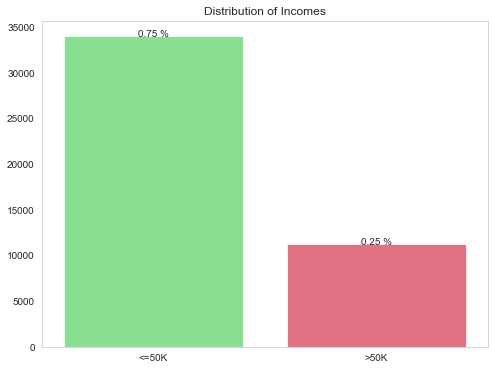
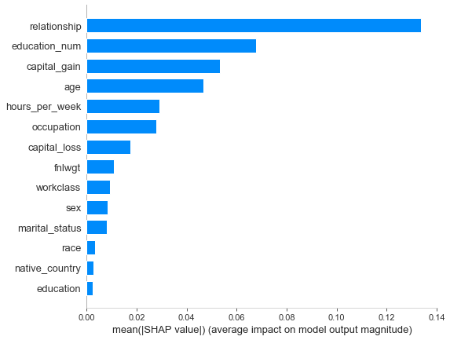

THE TASK

The task of this project was to produce a quick analysis on the famous census dataset. It was not allowed to spent 4 hours on this project. In the following you find my way of challenging this task.


# 1. First view on the data


```python
import numpy as np
from numpy import mean
from numpy import std
import pandas as pd
import matplotlib.pyplot as plt
import matplotlib.patches as mpatches
import matplotlib.gridspec as gridspec
import seaborn as sns
import warnings
import plotly.graph_objects as go
warnings.filterwarnings('ignore')
%matplotlib inline

#Models
import xgboost as xgb
from sklearn.ensemble import GradientBoostingClassifier
from sklearn.ensemble import RandomForestClassifier
from sklearn.linear_model import LogisticRegression
from sklearn.tree import DecisionTreeClassifier
from sklearn.neighbors import KNeighborsClassifier
from sklearn.svm import SVC
from sklearn import preprocessing

#Metrics
from sklearn.metrics import (accuracy_score, log_loss, classification_report)
from sklearn import metrics
from sklearn.metrics import confusion_matrix

#Model Selection
from sklearn.model_selection import cross_validate
from sklearn.model_selection import GridSearchCV, RandomizedSearchCV
from sklearn.model_selection import StratifiedShuffleSplit
from sklearn.model_selection import train_test_split
from sklearn.model_selection import cross_val_score
from sklearn.model_selection import RepeatedStratifiedKFold
from sklearn.model_selection import learning_curve


#Preprocessing
from sklearn.preprocessing import MinMaxScaler
from sklearn.preprocessing import StandardScaler
from sklearn.preprocessing import LabelEncoder
from sklearn.preprocessing import OneHotEncoder
from matplotlib import pyplot
from imblearn.pipeline import Pipeline
from sklearn.calibration import calibration_curve
from sklearn.compose import ColumnTransformer
```


```python
df_raw = pd.read_csv('census_data.csv', na_values=[' ?'])
df_raw.info()
```

    <class 'pandas.core.frame.DataFrame'>
    RangeIndex: 48842 entries, 0 to 48841
    Data columns (total 15 columns):
     #   Column          Non-Null Count  Dtype 
    ---  ------          --------------  ----- 
     0   age             48842 non-null  int64 
     1   workclass       46043 non-null  object
     2   fnlwgt          48842 non-null  int64 
     3   education       48842 non-null  object
     4   education_num   48842 non-null  int64 
     5   marital_status  48842 non-null  object
     6   occupation      46033 non-null  object
     7   relationship    48842 non-null  object
     8   race            48842 non-null  object
     9   sex             48842 non-null  object
     10  capital_gain    48842 non-null  int64 
     11  capital_loss    48842 non-null  int64 
     12  hours_per_week  48842 non-null  int64 
     13  native_country  47985 non-null  object
     14  income          48842 non-null  object
    dtypes: int64(6), object(9)
    memory usage: 5.6+ MB


```python
df_raw.head()
```


<div>
<style scoped>
    .dataframe tbody tr th:only-of-type {
        vertical-align: middle;
    }

    .dataframe tbody tr th {
        vertical-align: top;
    }

    .dataframe thead th {
        text-align: right;
    }
</style>
<table border="1" class="dataframe">
  <thead>
    <tr style="text-align: right;">
      <th></th>
      <th>age</th>
      <th>workclass</th>
      <th>fnlwgt</th>
      <th>education</th>
      <th>education_num</th>
      <th>marital_status</th>
      <th>occupation</th>
      <th>relationship</th>
      <th>race</th>
      <th>sex</th>
      <th>capital_gain</th>
      <th>capital_loss</th>
      <th>hours_per_week</th>
      <th>native_country</th>
      <th>income</th>
    </tr>
  </thead>
  <tbody>
    <tr>
      <th>0</th>
      <td>39</td>
      <td>State-gov</td>
      <td>77516</td>
      <td>Bachelors</td>
      <td>13</td>
      <td>Never-married</td>
      <td>Adm-clerical</td>
      <td>Not-in-family</td>
      <td>White</td>
      <td>Male</td>
      <td>2174</td>
      <td>0</td>
      <td>40</td>
      <td>United-States</td>
      <td>&lt;=50K</td>
    </tr>
    <tr>
      <th>1</th>
      <td>50</td>
      <td>Self-emp-not-inc</td>
      <td>83311</td>
      <td>Bachelors</td>
      <td>13</td>
      <td>Married-civ-spouse</td>
      <td>Exec-managerial</td>
      <td>Husband</td>
      <td>White</td>
      <td>Male</td>
      <td>0</td>
      <td>0</td>
      <td>13</td>
      <td>United-States</td>
      <td>&lt;=50K</td>
    </tr>
    <tr>
      <th>2</th>
      <td>38</td>
      <td>Private</td>
      <td>215646</td>
      <td>HS-grad</td>
      <td>9</td>
      <td>Divorced</td>
      <td>Handlers-cleaners</td>
      <td>Not-in-family</td>
      <td>White</td>
      <td>Male</td>
      <td>0</td>
      <td>0</td>
      <td>40</td>
      <td>United-States</td>
      <td>&lt;=50K</td>
    </tr>
    <tr>
      <th>3</th>
      <td>53</td>
      <td>Private</td>
      <td>234721</td>
      <td>11th</td>
      <td>7</td>
      <td>Married-civ-spouse</td>
      <td>Handlers-cleaners</td>
      <td>Husband</td>
      <td>Black</td>
      <td>Male</td>
      <td>0</td>
      <td>0</td>
      <td>40</td>
      <td>United-States</td>
      <td>&lt;=50K</td>
    </tr>
    <tr>
      <th>4</th>
      <td>28</td>
      <td>Private</td>
      <td>338409</td>
      <td>Bachelors</td>
      <td>13</td>
      <td>Married-civ-spouse</td>
      <td>Prof-specialty</td>
      <td>Wife</td>
      <td>Black</td>
      <td>Female</td>
      <td>0</td>
      <td>0</td>
      <td>40</td>
      <td>Cuba</td>
      <td>&lt;=50K</td>
    </tr>
  </tbody>
</table>
</div>


```python
for col in df_raw.columns:
    pct_missing = np.mean(df_raw[col].isnull())
    print('{} - {}%'.format(col, round(pct_missing*100)))
```

    age - 0%
    workclass - 6%
    fnlwgt - 0%
    education - 0%
    education_num - 0%
    marital_status - 0%
    occupation - 6%
    relationship - 0%
    race - 0%
    sex - 0%
    capital_gain - 0%
    capital_loss - 0%
    hours_per_week - 0%
    native_country - 2%
    income - 0%


```python
df_raw.describe()
```


<div>
<style scoped>
    .dataframe tbody tr th:only-of-type {
        vertical-align: middle;
    }

    .dataframe tbody tr th {
        vertical-align: top;
    }

    .dataframe thead th {
        text-align: right;
    }
</style>
<table border="1" class="dataframe">
  <thead>
    <tr style="text-align: right;">
      <th></th>
      <th>age</th>
      <th>fnlwgt</th>
      <th>education_num</th>
      <th>capital_gain</th>
      <th>capital_loss</th>
      <th>hours_per_week</th>
    </tr>
  </thead>
  <tbody>
    <tr>
      <th>count</th>
      <td>48842.000000</td>
      <td>4.884200e+04</td>
      <td>48842.000000</td>
      <td>48842.000000</td>
      <td>48842.000000</td>
      <td>48842.000000</td>
    </tr>
    <tr>
      <th>mean</th>
      <td>38.643585</td>
      <td>1.896641e+05</td>
      <td>10.078089</td>
      <td>1079.067626</td>
      <td>87.502314</td>
      <td>40.422382</td>
    </tr>
    <tr>
      <th>std</th>
      <td>13.710510</td>
      <td>1.056040e+05</td>
      <td>2.570973</td>
      <td>7452.019058</td>
      <td>403.004552</td>
      <td>12.391444</td>
    </tr>
    <tr>
      <th>min</th>
      <td>17.000000</td>
      <td>1.228500e+04</td>
      <td>1.000000</td>
      <td>0.000000</td>
      <td>0.000000</td>
      <td>1.000000</td>
    </tr>
    <tr>
      <th>25%</th>
      <td>28.000000</td>
      <td>1.175505e+05</td>
      <td>9.000000</td>
      <td>0.000000</td>
      <td>0.000000</td>
      <td>40.000000</td>
    </tr>
    <tr>
      <th>50%</th>
      <td>37.000000</td>
      <td>1.781445e+05</td>
      <td>10.000000</td>
      <td>0.000000</td>
      <td>0.000000</td>
      <td>40.000000</td>
    </tr>
    <tr>
      <th>75%</th>
      <td>48.000000</td>
      <td>2.376420e+05</td>
      <td>12.000000</td>
      <td>0.000000</td>
      <td>0.000000</td>
      <td>45.000000</td>
    </tr>
    <tr>
      <th>max</th>
      <td>90.000000</td>
      <td>1.490400e+06</td>
      <td>16.000000</td>
      <td>99999.000000</td>
      <td>4356.000000</td>
      <td>99.000000</td>
    </tr>
  </tbody>
</table>
</div>


# 2. Cleaning the data


```python
#Check for duplicates
df_raw.duplicated().sum()
df_raw.drop_duplicates(inplace=True)

#Get rid of whitespaces in categorical values
df_raw = df_raw.applymap(lambda x: x.strip() if type(x)==str else x)

#Income variable contains different values for the same value
#Cleaning up the variable 'income'
df_raw['income'] = df_raw['income'].str.replace('.','')

#Encoding the income variable
df_raw['income'] = df_raw['income'].map({'<=50K': 0, '>50K': 1})

#Some data is missing. Due to the fact that it's only 6% missing and I am only allowed to spend 4 hours on the dataset I'll create 2 datasets and see which will perform better
#More advanced techniques for imputation (KNN Imputation/MICE Imputation) are additional steps if I would have more time
df = df_raw
df_raw = df_raw.dropna()
for col in ['workclass', 'occupation', 'native_country']:
    df[col].fillna(df[col].mode()[0], inplace=True)

```

# 3. Exploratory Data Analysis

**Quick view on the data**
<br>
<br>
**1. How is the distribution of the target variable?**


```python
plt.figure(figsize=[8,6])

colors = ['#43e653','#ed1c3c']

g=sns.countplot(df_raw['income'], palette=colors, label='income', alpha=0.7)

total = float(len(df_raw))
for p in g.patches:
    height = p.get_height()
    g.text(p.get_x()+p.get_width()/2.,
            height + 3,
            '{:1.2f} %'.format(height/total),
            ha="center") 

g.set_title('Distribution of Incomes')
g.set_xlabel('')
g.set_ylabel('')
g.set_xticklabels(['<=50K','>50K'])


```


    [Text(0, 0, '<=50K'), Text(0, 0, '>50K')]


    

    


**Comment:**
<br>
The distribution of the target is imbalanced. This must be considered when modelling the data

**2. Does the age of a person has an impact on how much money someone earns?**


```python
gs = gridspec.GridSpec(3, 4)
gs.update(wspace=0.5)

sns.set_style("whitegrid", {'axes.grid' : False})
fig=plt.figure(figsize=(12,10))
fig.tight_layout(pad=3.0)

ax1 = plt.subplot(gs[0, :])
ax2 = plt.subplot(gs[1,:])
ax3 = plt.subplot(gs[2, :])
colors = ['#ed1c3c','#43e653']


f=sns.distplot(df_raw['age'],bins=100, ax=ax1)
f.legend().set_visible(True)
f.set_xlabel('')
f.set_ylabel('')
f.set_ylim(0,0.07)
f.legend(title='Total', frameon=False)


g=sns.distplot(df_raw[df_raw['income']==0]['age'], color='#43e653', bins=100, ax=ax2)
g.set_xlabel('')
g.set_ylabel('')
g.set_ylim(0,0.07)
g.legend(title='<=50K',frameon=False)


h=sns.distplot(df_raw[df_raw['income']==1]['age'], color='#ed1c3c',bins=100, ax=ax3)
h.set_ylabel('')
h.set_xlabel('')
h.legend(title='>50K',frameon=False)
h.set_ylim(0,0.07)


fig.legend([g,f,h], 'Atttio')
fig.text(0.47,0.05,'Age')
fig.suptitle('Distribution of Ages \n', size=16)

```

    No handles with labels found to put in legend.
    No handles with labels found to put in legend.
    No handles with labels found to put in legend.
    No handles with labels found to put in legend.


    Text(0.5, 0.98, 'Distribution of Ages \n')


    

    


**Comment:**
<br>
It seems like older people are more likely to earn more than 50K. This assumption is supported by the different means/medians of the variable age (<=50K : 36.7 vs >50K : 44.0)

**Are women less likely to have annual income of more than 50K?**


```python
sns.set_style("whitegrid", {'axes.grid' : False})
fig=plt.figure(figsize=(15,7))
fig.tight_layout(pad=3.0)


colors = ['#ed1c3c','#43e653']


f=sns.countplot(df_raw['sex'], palette=colors, label='income', alpha=0.7)

total = float(len(df_raw))
for p in f.patches:
    height = p.get_height()
    f.text(p.get_x()+p.get_width()/2.,
            height + 3,
            '{:1.2f} %'.format(height/total),
            ha="center") 

f.set_title('')
f.set_xlabel('')
f.set_ylabel('')
f.set_xticklabels(['Male','Female'])


fig.legend([g,f,h], 'Atttio')
fig.text(0.47,0.05,'')
fig.suptitle('Gender Distribution\n', size=16)
```


    Text(0.5, 0.98, 'Gender Distribution\n')


    

    


```python
gs = gridspec.GridSpec(1, 4)
gs.update(wspace=0.5)

sns.set_style("whitegrid", {'axes.grid' : False})
fig=plt.figure(figsize=(15,7))
fig.tight_layout(pad=3.0)

ax1 = plt.subplot(gs[0, :2])
ax2 = plt.subplot(gs[0,2:4])

colors = ['#ed1c3c','#43e653']


g=sns.countplot(df_raw[df_raw['income']==0]['sex'], color='#ed1c3c', alpha=0.7, ax=ax1)
total = float(len(df_raw))
for o in g.patches:
    height = o.get_height()
    g.text(o.get_x()+o.get_width()/2.,
            height + 3,
            '{:1.2f} %'.format(height/total),
            ha="center") 
g.set_title('With an Income equal or less 50K', size=12)
g.set_xlabel('')
g.set_ylabel('')
g.set_xticklabels(['Male','Female'])
g.set_ylim(0,25000)


h=sns.countplot(df_raw[df_raw['income']==1]['sex'], color='#43e653', label='income', alpha=0.7, ax=ax2)
total = float(len(df_raw))
for m in h.patches:
    height = m.get_height()
    h.text(m.get_x()+m.get_width()/2.,
            height + 3,
            '{:1.2f} %'.format(height/total),
            ha="center") 

h.set_title('With an Income more than 50K', size=12)
h.set_xlabel('')
h.set_ylabel('')
h.set_xticklabels(['Male','Female'])
h.set_ylim(0,25000)

fig.legend([g,f,h], 'Atttio')
fig.text(0.47,0.05,'')
fig.suptitle('Distribution based on Gender \n and Income \n', size=16)
```


    Text(0.5, 0.98, 'Distribution based on Gender \n and Income \n')


    

    


**Comment:**
<br>
The majority of samples are male. Only 4% of all samples are female and have an annual income of more than 50K. Only 12% of all women have an annual income of more than 50K while 31% of all men have an annual top income.


```python
colors = ['#ed1c3c','#43e653']
sns.set_style("whitegrid", {'axes.grid' : False})
fig=plt.figure(figsize=(12,10))
sns.countplot(y='occupation', hue='income', palette=colors, data=df_raw)
```


    <matplotlib.axes._subplots.AxesSubplot at 0x1a267a5a58>


    

    


```python
num_features = ['age', 'fnlwgt', 'education_num', 'capital_gain', 'capital_loss', 'hours_per_week']

#Plotting for the numerical features
fig, ax = plt.subplots(figsize=(10, 10))
p = sns.heatmap(df_raw[num_features].corr(), annot=True, cmap='coolwarm')
plt.title("Correlation of Numerical Features", fontsize=20)
plt.show()
```


    

    


# 4. Modeling the data

**1. Data with dropped rows**


```python
X = df_raw.drop(['income'], axis=1)
y = df_raw['income']


#Encoding categorical data
categorical = ['workclass', 'education', 'marital_status', 'occupation', 'relationship', 'race',
               'sex', 'native_country']
categorical_subset = X.select_dtypes('object')
categorical_subset = pd.get_dummies(categorical_subset)

        
#Scale numerical data
numerical = X.drop(categorical,1)
sc = MinMaxScaler()
X[numerical.columns] = sc.fit_transform(X[numerical.columns])

#Create the final feature dataframe
X = pd.concat([categorical_subset, X[numerical.columns]],axis=1)


# evaluate a model
def evaluate_model(X, y, model):
    # define evaluation procedure
    cv = RepeatedStratifiedKFold(n_splits=3, n_repeats=3, random_state=1)
    # evaluate model
    scores = cross_val_score(model, X, y, scoring='accuracy', cv=cv, n_jobs=-1)
    return scores
 
    
# define models to test
def get_models():
    models, names = list(), list()
    # CART
    models.append(DecisionTreeClassifier())
    names.append('DECT')
    # LR
    models.append(LogisticRegression())
    names.append('LR')
    #KNN
    models.append(KNeighborsClassifier())
    names.append('KNN')
    # SVM
    models.append(SVC(gamma='scale'))
    names.append('SVM')
    # RF
    models.append(RandomForestClassifier(n_estimators=100))
    names.append('RF')
    # GBM
    models.append(GradientBoostingClassifier(n_estimators=100))
    names.append('GBM')
    return models, names

# define models
models, names = get_models()
results = list()
# evaluate each model
for i in range(len(models)):
    # wrap the model i a pipeline
    pipeline = Pipeline(steps=[('m',models[i])])
    # evaluate the model and store results
    scores = evaluate_model(X, y, pipeline)
    results.append(scores)
    # summarize performance
    print('>%s %.3f (%.3f)' % (names[i], mean(scores), std(scores)))
# plot the results
plt.figure(figsize=[10,10])
pyplot.boxplot(results, labels=names, showmeans=True)
pyplot.show()
```

    >DECT 0.809 (0.003)
    >LR 0.847 (0.003)
    >KNN 0.821 (0.002)
    >SVM 0.835 (0.002)
    >RF 0.849 (0.002)
    >GBM 0.863 (0.001)


    

    


**Data with Mode Imputation**


```python
X = df.drop(['income'], axis=1)
y = df['income']


#Encoding categorical data
categorical = ['workclass', 'education', 'marital_status', 'occupation', 'relationship', 'race',
               'sex', 'native_country']
categorical_subset = X.select_dtypes('object')
categorical_subset = pd.get_dummies(categorical_subset)

        
#Scale numerical data
numerical = X.drop(categorical,1)
sc = MinMaxScaler()
X[numerical.columns] = sc.fit_transform(X[numerical.columns])

#Create the final feature dataframe
X = pd.concat([categorical_subset, X[numerical.columns]],axis=1)


# evaluate a model
def evaluate_model(X, y, model):
    # define evaluation procedure
    cv = RepeatedStratifiedKFold(n_splits=3, n_repeats=3, random_state=1)
    # evaluate model
    scores = cross_val_score(model, X, y, scoring='accuracy', cv=cv, n_jobs=-1)
    return scores
 
    
# define models to test
def get_models():
    models, names = list(), list()
    # CART
    models.append(DecisionTreeClassifier())
    names.append('DECT')
    # LR
    models.append(LogisticRegression())
    names.append('LR')
    #KNN
    models.append(KNeighborsClassifier())
    names.append('KNN')
    # SVM
    models.append(SVC(gamma='scale'))
    names.append('SVM')
    # RF
    models.append(RandomForestClassifier(n_estimators=100))
    names.append('RF')
    # GBM
    models.append(GradientBoostingClassifier(n_estimators=100))
    names.append('GBM')
    return models, names

# define models
models, names = get_models()
results = list()
# evaluate each model
for i in range(len(models)):
    # wrap the model i a pipeline
    pipeline = Pipeline(steps=[('m',models[i])])
    # evaluate the model and store results
    scores = evaluate_model(X, y, pipeline)
    results.append(scores)
    # summarize performance
    print('>%s %.3f (%.3f)' % (names[i], mean(scores), std(scores)))
# plot the results
plt.figure(figsize=[10,10])
pyplot.boxplot(results, labels=names, showmeans=True)
pyplot.show()
```

    >DECT 0.815 (0.003)
    >LR 0.850 (0.002)
    >KNN 0.825 (0.002)
    >SVM 0.839 (0.002)
    >RF 0.855 (0.002)
    >GBM 0.866 (0.002)


    

    


# 5: Final model: Gradient Boosting Classifier with Mode Imputation

## 5.1 Hyperparameter Tuning


```python
X = df.drop(['income'], axis=1)
y = df['income']

#Encoding categorical data
categorical = ['workclass', 'education', 'marital_status', 'occupation', 'relationship', 'race',
               'sex', 'native_country']
for feature in categorical:
        le = preprocessing.LabelEncoder()
        X[feature] = le.fit_transform(X[feature])
        
#Scale numerical data
numerical = X.drop(categorical,1)
sc = MinMaxScaler()
X[numerical.columns] = sc.fit_transform(X[numerical.columns])


# create Grid
param_grid = {
    'n_estimators': [50, 100, 150, 200, 400, 500],
    'learning_rate' : [0.05, 0.07, 0.1, 0.2],
    'max_depth': [2, 4, 6, 8, 12, 15],                 #High values -> Overfitting
    'min_samples_leaf': [1, 2, 5, 10, 20],           #Low Values for imbalanced
    'subsample': [0.8, 0.9, 1, 2],     
    'min_samples_split': [2, 10, 50, 10],             #Too high values -> underfitting
    'max_features':['auto', 'sqrt'] 
}


# split our data
X_train, X_test, y_train, y_test = train_test_split(X, y, test_size=0.3, random_state=101)

gb = GradientBoostingClassifier(random_state=101)


# instantiate the tuned Gradient Booster
booster_grid_search = RandomizedSearchCV(gb, param_grid,  cv=3, n_jobs=-1, scoring='accuracy',
                                        random_state=101)

# train the tuned Gradient Booster
booster_grid_search.fit(X_train, y_train)

# print best estimator parameters found during the grid search
print(booster_grid_search.best_params_)


```

    {'subsample': 1, 'n_estimators': 200, 'min_samples_split': 10, 'min_samples_leaf': 10, 'max_features': 'auto', 'max_depth': 6, 'learning_rate': 0.07}


```python
X = df.drop(['income'], axis=1)
y = df['income']

#Encoding categorical data
categorical = ['workclass', 'education', 'marital_status', 'occupation', 'relationship', 'race',
               'sex', 'native_country']
for feature in categorical:
        le = preprocessing.LabelEncoder()
        X[feature] = le.fit_transform(X[feature])
        


# split our data
X_train, X_test, y_train, y_test = train_test_split(X, y, test_size=0.3, random_state=101)


xgb_params ={'subsample': 1, 
            'n_estimators': 200,
            'min_samples_split': 10,
            'min_samples_leaf': 10,
            'max_features': 'auto',
            'max_depth': 6,
            'learning_rate': 0.07}


xg_train = xgb.DMatrix(X_train.values, label=y_train.values, feature_names=X.columns)
xg_test = xgb.DMatrix(X_test.values,label=y_test.values, feature_names=X.columns)

bst = xgb.train(dtrain=xg_train, params=xgb_params, num_boost_round=200)
preds = bst.predict(xg_test)

final_preds = []
final_pred = []

for x in preds:
    if x >= 0.5:
        final_preds.append(1)
    else:
        final_preds.append(0)
        
    
    
for x in preds:
    if x >= 0.2:
        final_pred.append(1)
    else:
        final_pred.append(0)
              
            
print('Accuracy:', accuracy_score(y_test, final_preds))
print('\n')
print(classification_report(y_test, final_preds))
print(confusion_matrix(y_test, final_preds))
print('\n')
print('\n')             
print('Accuracy:', accuracy_score(y_test, final_pred))
print('\n')
print(classification_report(y_test, final_pred))
print(confusion_matrix(y_test, final_pred))
```

    Accuracy: 0.8729855230811254
    
    
                  precision    recall  f1-score   support
    
               0       0.89      0.95      0.92     11083
               1       0.80      0.64      0.71      3561
    
        accuracy                           0.87     14644
       macro avg       0.85      0.79      0.81     14644
    weighted avg       0.87      0.87      0.87     14644
    
    [[10521   562]
     [ 1298  2263]]
    
    
    
    
    Accuracy: 0.80517618137121
    
    
                  precision    recall  f1-score   support
    
               0       0.96      0.77      0.86     11083
               1       0.56      0.90      0.69      3561
    
        accuracy                           0.81     14644
       macro avg       0.76      0.84      0.77     14644
    weighted avg       0.86      0.81      0.82     14644
    
    [[8586 2497]
     [ 356 3205]]


## 5.2 Model Performance


```python
xg_train = xgb.DMatrix(data=X_train, label=y_train)

xgb_params ={'subsample': 1, 
            'n_estimators': 200,
            'min_samples_split': 10,
            'min_samples_leaf': 10,
            'max_features': 'auto',
            'max_depth': 6,
            'learning_rate': 0.07}


cv_results = xgb.cv(dtrain=xg_train, params=xgb_params, nfold=3, early_stopping_rounds=10,
                    num_boost_round=200, metrics=['error', 'logloss','aucpr'], as_pandas=True)
```


```python
epochs = len(cv_results['train-logloss-mean'])
x_axis = range(0, epochs)


fig, ax = plt.subplots(figsize=(16,8))
ax.plot(x_axis, cv_results['train-logloss-mean'], label='Train')
ax.plot(x_axis, cv_results['test-logloss-mean'], label='Test')
ax.legend()
    
plt.ylabel('Log Loss')
plt.xlabel('Number of Epochs')
plt.title('XGBoost Log Loss')
plt.show()
```


    

    


```python
epochs = len(cv_results['train-error-mean'])
x_axis = range(0, epochs)


fig, ax = plt.subplots(figsize=(16,8))
ax.plot(x_axis, cv_results['train-error-mean'], label='Train')
ax.plot(x_axis, cv_results['test-error-mean'], label='Test')
ax.legend()
    
plt.ylabel('Error')
plt.xlabel('Number of Epochs')
plt.title('XGBoost Error')
plt.show()
```


    

    


```python

# log loss for naive probability predictions.
from numpy import mean
from sklearn.datasets import make_classification
from sklearn.model_selection import train_test_split
from sklearn.metrics import log_loss

X = df.drop(['income'], axis=1)
y = df['income']

#Encoding categorical data
categorical = ['workclass', 'education', 'marital_status', 'occupation', 'relationship', 'race',
               'sex', 'native_country']
for feature in categorical:
        le = preprocessing.LabelEncoder()
        X[feature] = le.fit_transform(X[feature])
        


# split our data
X_train, X_test, y_train, testy= train_test_split(X, y, test_size=0.3, random_state=101)


# no skill prediction 0
probabilities = [[1, 0] for _ in range(len(testy))]
avg_logloss = log_loss(testy, probabilities)
print('P(class0=1): Log Loss=%.3f' % (avg_logloss))
# no skill prediction 1
probabilities = [[0, 1] for _ in range(len(testy))]
avg_logloss = log_loss(testy, probabilities)
print('P(class1=1): Log Loss=%.3f' % (avg_logloss))
# baseline probabilities
probabilities = [[0.75, 0.25] for _ in range(len(testy))]
avg_logloss = log_loss(testy, probabilities)
print('Baseline: Log Loss=%.3f' % (avg_logloss))
# perfect probabilities
avg_logloss = log_loss(testy, testy)
print('Perfect: Log Loss=%.3f' % (avg_logloss))


```

    P(class0=1): Log Loss=8.399
    P(class1=1): Log Loss=26.140
    Baseline: Log Loss=0.555
    Perfect: Log Loss=0.000


## 5.3 Feature Importance


```python
import warnings
warnings.filterwarnings('ignore')
import shap
shap_values = shap.TreeExplainer(bst).shap_values(X_train)
shap.summary_plot(shap_values, X_train, feature_names= X.columns.values, plot_type="bar")

```


    

    


## 5.3.1 Distribution of most important features


```python
colors = ['#ed1c3c','#43e653']
sns.set_style("whitegrid", {'axes.grid' : False})
fig=plt.figure(figsize=(8,8))
sns.countplot(y='relationship', hue='income', palette=colors, data=df_raw)
```


    <matplotlib.axes._subplots.AxesSubplot at 0x1a22db7ac8>


    

    


```python
colors = ['#ed1c3c','#43e653']
sns.set_style("whitegrid", {'axes.grid' : False})
fig=plt.figure(figsize=(8,8))
sns.countplot(y='education_num', hue='income', palette=colors, data=df_raw)

```


    <matplotlib.axes._subplots.AxesSubplot at 0x1a21b65dd8>


    

    


```python
data_viz= df.groupby('income').agg(mean_capital_gain=('capital_gain', 'mean'))

sns.set_style("whitegrid", {'axes.grid' : False})
fig=plt.figure(figsize=(15,7))


colors = ['#ed1c3c','#43e653']


f=sns.barplot(x=data_viz.index,y='mean_capital_gain',
              data=data_viz, palette=colors,alpha=0.7)


f.set_title('')
f.set_xlabel('')
f.set_ylabel('')
f.set_ylim(0,5000)
f.set_xticklabels(['<=50K','>50K'])

fig.legend([g,f,h], 'Atttio')
fig.text(0.47,0.05,'')
fig.suptitle('Mean Capital Gain\n', size=16)
```


    Text(0.5, 0.98, 'Mean Capital Gain\n')


    

    


```python
df.groupby('income').agg(mean_capital_gain=('capital_gain', 'mean'))['mean_capital_gain']
```


    income
    0     147.117216
    1    4042.931365
    Name: mean_capital_gain, dtype: float64


## 6. Further Ideas

- Further EDA
<br>
- Impute missing data with more advanced techniques such as MICE Imputation
<br>
- Different Encoding Strategies for the variables "education_num" and "education" with Ordinal Encoder
<br>
- Outlier Detection 
<br>
- Dimensionality Reduction with PCA
<br>
- Feature Selection
<br>
- Further Feature Engineering
<br>
- Stacking of Classifiers for better predictions
<br>
- Further Hyperparameter Tuning with Bayesian Optimization
<br>
- Explore the potential of another model such as Logistic Regression
<br>


