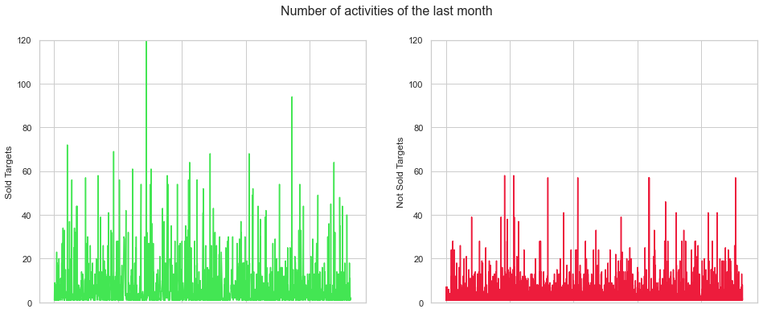
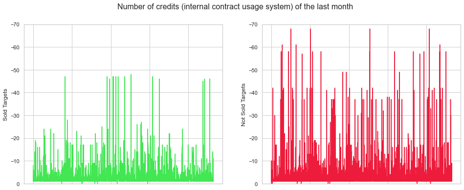
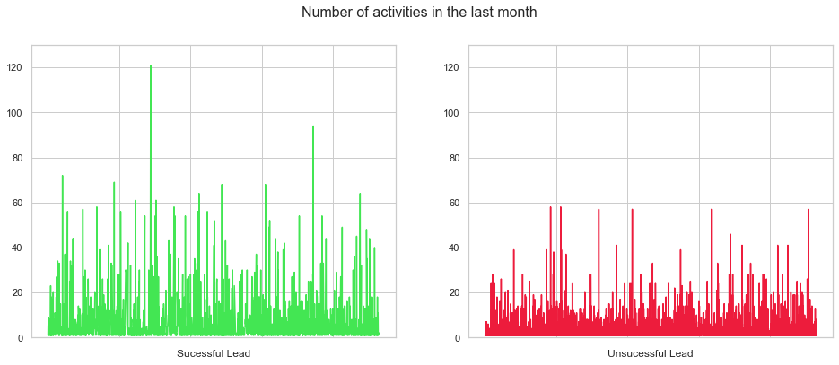

# Customer Contract Predictions

**BUSINESS MODEL**
<br>
<br>
Our agency is an online job exchange platform. The platform's sales team focuses on those companies which have an open position to fill (leads). Their challenge is to acquire companies and fix contracts to match their open job positions with the 'best-fit-applicant'.

**TASK**
<br>
<br>
Request from the Sales Director: “We have extracted a large dataset of leads (market signal that a
customer has an open position to fill) that have already been tackled by the sales team. Is it possible to
predict similarly successful leads in the future? We want to reduce the number of leads forwarded to
the sales team to 40% to increase their efficiency while keeping as much revenue as possible. In
addition, can you predict the contract value for further prioritization purposes?”
<br>

<br>

## Structure

**1. View on the data**
<br>
**2. Data Preprocessing**
<br>
&nbsp; 
2.1 Removal of missing data and transformation
<br>
&nbsp; 
2.2 First cleaning by hand
<br>
&nbsp; 
2.3 Imputation with IterativeImputer
<br>
&nbsp; 
2.4 Feature Selection
<br>
&nbsp; &nbsp; 
2.4.1 Feature Selection with ANOVA f-test statistic
<br>
&nbsp; 
&nbsp; 
2.4.2 Comparison of Logistic Regression models with different features
<br>
&nbsp; 
2.5 Outlier Detection - Isolation Forest vs. Elliptic Envelope vs. Local Outlier Factor
<br>
&nbsp; 
2.6 Pipeline for Data Transformation methods to evaluate best fit
<br>
&nbsp; 
2.7 Polynomial Feature Transformation
<br>
**3. Modelling the data for classification task**
<br>
&nbsp; 
3.1 Logistic Regression with Standardization and Polynomial Feature Transformation
<br>
&nbsp; 
3.2 KNN-Classifier with Yeo Johnson Transformation
<br>
&nbsp; 
3.3 Support Vector Classifier with Yeo-Johnson Transformation
<br>
&nbsp; 
3.4 Decision Tree Classifier with Normalization
<br>
&nbsp; 
3.5 Gradient Boosting Classifier
<br>
&nbsp; 
&nbsp; 
3.5.1 Gradient Boosting Classifier - Hyperparameter Tuning with Bayesian Search
<br>
&nbsp; 
&nbsp; 
3.5.2 Gradient Boosting Classifier - Hyperparameter Tuning with Random Search
<br>
&nbsp; 
&nbsp; 
3.5.3 Gradient Boosting Classifier - Hyperparameter Tuning by hand
<br>
&nbsp; 
&nbsp; 
3.5.4 Model Evaluation with Cross-Validation: Logloss
<br>
&nbsp; 
&nbsp; 
3.5.5 Feature Importances of the final classifier
<br>
&nbsp; 
3.6 Voting Ensembles & Stacking of classifiers
<br>
&nbsp; 
&nbsp; 
3.6.1 Voting Ensemble with Polynomial Logistic Regression, Knn-Classifier, SVC & XGB Classifier
<br>
&nbsp; 
&nbsp; 
3.6.2 Stacking of Polynomial Logistic Regression, Knn-Classifier, SVC & XGB Classifier
<br>
&nbsp; 
3.7 Result & Final classification model
<br>
**4. Challenging the regression model**
<br>
&nbsp; 
4.1 Look on the data
<br>
&nbsp; 
&nbsp; 
4.1.1 Heatmap
<br>
&nbsp; 
&nbsp; 
4.1.2 Distribution of the target variable
<br>
&nbsp; 
4.2 Linear Regression
<br>
&nbsp; 
&nbsp; 
4.2.1 Linear Regression as Baseline
<br>
&nbsp; 
&nbsp; 
4.2.2 Comparison of different scaling and transformation methods
<br>
&nbsp; 
&nbsp; 
4.2.3 Outlier Detection for regression task
<br>
&nbsp; 
4.3 KNeighborsRegressor
<br>
&nbsp; 
4.4 Decision Tree Regressor
<br>
&nbsp; 
4.5 Gradient Boosting Regression
<br>
&nbsp; 
4.6 Random Forest
<br>
&nbsp; 
4.7 Stacking of different Regressors such as KNeighborsRegressor, Decision Tree Regressor, Random Forest and Gradient Boosting Regressor
<br>
&nbsp; 
4.8 Engineering a new feature and prediction
<br>
&nbsp; 
4.9 The final regression model
<br>
&nbsp; 
&nbsp; 
4.9.1 Sales Prediction for the first 75 %
<br>
&nbsp; 
&nbsp; 
4.9.2 Sales Prediction for the last 25 %
<br>
**5. Interpretation**


# 1. View on the Data


```python
import numpy as np
from numpy import mean
from numpy import std
import pandas as pd
import matplotlib.pyplot as plt
import seaborn as sns
import warnings
import plotly.graph_objects as go
warnings.filterwarnings('ignore')
%matplotlib inline

#Models
import xgboost as xgb
from sklearn.ensemble import GradientBoostingClassifier
from sklearn.ensemble import StackingClassifier
from sklearn.ensemble import VotingClassifier
from sklearn.ensemble import StackingRegressor
from sklearn.ensemble import RandomForestRegressor
from sklearn.linear_model import LogisticRegression
from sklearn.tree import DecisionTreeClassifier
from sklearn.neighbors import KNeighborsClassifier
from sklearn.svm import SVC
from sklearn.linear_model import LinearRegression
from sklearn.neighbors import KNeighborsRegressor
from sklearn.tree import DecisionTreeRegressor
from sklearn.svm import SVR

#Metrics
from sklearn.metrics import (accuracy_score, log_loss, classification_report)
from sklearn.metrics import mean_squared_error, r2_score, mean_absolute_error
from numpy import mean
from numpy import std
from sklearn import metrics
from sklearn.metrics import confusion_matrix

#Model Selection
from sklearn.model_selection import cross_validate
from sklearn.model_selection import GridSearchCV, RandomizedSearchCV
from sklearn.model_selection import StratifiedShuffleSplit
from sklearn.model_selection import train_test_split
from sklearn.model_selection import cross_val_score
from sklearn.model_selection import RepeatedStratifiedKFold
from sklearn.model_selection import learning_curve

#Feature Selection
from sklearn.feature_selection import SelectKBest
from sklearn.feature_selection import chi2
from sklearn.feature_selection import RFE

#Preprocessing
from sklearn.preprocessing import PolynomialFeatures
from sklearn.preprocessing import StandardScaler
from sklearn.preprocessing import MinMaxScaler
from sklearn.preprocessing import KBinsDiscretizer
from sklearn.preprocessing import QuantileTransformer
from sklearn.decomposition import PCA
from sklearn.decomposition import TruncatedSVD
from sklearn.preprocessing import PowerTransformer
from sklearn.experimental import enable_iterative_imputer
from matplotlib import pyplot
from fancyimpute import IterativeImputer
from imblearn.over_sampling import SMOTE
from imblearn.pipeline import Pipeline
from sklearn.calibration import calibration_curve


#Outlier Detection
from sklearn.ensemble import IsolationForest
from sklearn.covariance import EllipticEnvelope
from sklearn.neighbors import LocalOutlierFactor

#Bayesian Optimization
from hyperopt import tpe
from hyperopt import STATUS_OK
from hyperopt import Trials
from hyperopt import hp
from hyperopt import fmin
from hyperopt.pyll import scope
from hyperopt import fmin, tpe, hp, STATUS_OK, Trials
```


```python
df_raw = pd.read_csv('Lead_testdata.csv', sep=';')

```


```python
pd.set_option('display.max_columns', None)
df_raw.head(20)
```


<div>
<style scoped>
    .dataframe tbody tr th:only-of-type {
        vertical-align: middle;
    }

    .dataframe tbody tr th {
        vertical-align: top;
    }

    .dataframe thead th {
        text-align: right;
    }
</style>
<table border="1" class="dataframe">
  <thead>
    <tr style="text-align: right;">
      <th></th>
      <th>ID</th>
      <th>Target_Sold</th>
      <th>Target_Sales</th>
      <th>Var_04</th>
      <th>No_Act_1M</th>
      <th>No_Act_3M</th>
      <th>No_Act_6M</th>
      <th>No_Act_Lo_1M</th>
      <th>No_Act_Lo_1vs2</th>
      <th>No_Act_Ph_1M</th>
      <th>No_Act_Ph_3M</th>
      <th>No_Act_WOF_1M</th>
      <th>No_Act_WOF_1vs2</th>
      <th>No_Act_WOS_12M</th>
      <th>No_list_FB_6M</th>
      <th>No_list_IND_24M</th>
      <th>No_List_Off_1M</th>
      <th>No_List_On_24M</th>
      <th>No_List_STST_3M</th>
      <th>No_List_STST_6M</th>
      <th>No_List_T7_1M</th>
      <th>Avg_OAF_6M</th>
      <th>AVG_Refresh_p_Posting</th>
      <th>AVG_Renew_p_Posting</th>
      <th>AVG_Share_Online</th>
      <th>AVG_STF_12M</th>
      <th>AVG_STF_1M</th>
      <th>AVG_STF_6M</th>
      <th>Avg_Views_12M</th>
      <th>Avg_Views_1M</th>
      <th>Avg_Views_6M</th>
      <th>Count_SIC_3</th>
      <th>Cre_Val_12M</th>
      <th>Cre_Val_1M</th>
      <th>Cre_Val_6M</th>
      <th>Inv_Days_12M</th>
      <th>Inv_Days_1M</th>
      <th>Inv_Days_6M</th>
      <th>Inv_Val_12M</th>
      <th>Inv_Val_1M</th>
      <th>Inv_Val_3M</th>
      <th>List_FB_HOM_1M</th>
      <th>List_FB_off_6M</th>
      <th>List_STS_FB_1M</th>
      <th>List_STS_Index_12M</th>
      <th>List_STS_Index_1M</th>
      <th>List_STS_Index_3M</th>
      <th>List_STS_off_24M</th>
      <th>List_STS_T4_12M</th>
      <th>MISC_Days_Since_Last_act_noffer</th>
      <th>MISC_Days_Since_Last_Offer</th>
      <th>Offer_days_1M</th>
      <th>Offer_days_24M</th>
    </tr>
  </thead>
  <tbody>
    <tr>
      <th>0</th>
      <td>1</td>
      <td>0</td>
      <td>NaN</td>
      <td>0</td>
      <td>1.0</td>
      <td>2.0</td>
      <td>3.0</td>
      <td>0.0</td>
      <td>NaN</td>
      <td>1.0</td>
      <td>1.0</td>
      <td>1.0</td>
      <td>NaN</td>
      <td>3.0</td>
      <td>4</td>
      <td>NaN</td>
      <td>NaN</td>
      <td>NaN</td>
      <td>NaN</td>
      <td>NaN</td>
      <td>NaN</td>
      <td>NaN</td>
      <td>NaN</td>
      <td>NaN</td>
      <td>NaN</td>
      <td>NaN</td>
      <td>NaN</td>
      <td>NaN</td>
      <td>NaN</td>
      <td>NaN</td>
      <td>NaN</td>
      <td>64618.0</td>
      <td>NaN</td>
      <td>NaN</td>
      <td>NaN</td>
      <td>NaN</td>
      <td>NaN</td>
      <td>NaN</td>
      <td>NaN</td>
      <td>NaN</td>
      <td>NaN</td>
      <td>NaN</td>
      <td>NaN</td>
      <td>NaN</td>
      <td>NaN</td>
      <td>NaN</td>
      <td>NaN</td>
      <td>NaN</td>
      <td>NaN</td>
      <td>18.0</td>
      <td>NaN</td>
      <td>NaN</td>
      <td>NaN</td>
    </tr>
    <tr>
      <th>1</th>
      <td>2</td>
      <td>0</td>
      <td>NaN</td>
      <td>0</td>
      <td>NaN</td>
      <td>NaN</td>
      <td>NaN</td>
      <td>NaN</td>
      <td>NaN</td>
      <td>NaN</td>
      <td>NaN</td>
      <td>NaN</td>
      <td>NaN</td>
      <td>NaN</td>
      <td>238</td>
      <td>NaN</td>
      <td>NaN</td>
      <td>NaN</td>
      <td>NaN</td>
      <td>NaN</td>
      <td>NaN</td>
      <td>NaN</td>
      <td>NaN</td>
      <td>NaN</td>
      <td>NaN</td>
      <td>NaN</td>
      <td>NaN</td>
      <td>NaN</td>
      <td>NaN</td>
      <td>NaN</td>
      <td>NaN</td>
      <td>11513.0</td>
      <td>NaN</td>
      <td>NaN</td>
      <td>NaN</td>
      <td>NaN</td>
      <td>NaN</td>
      <td>NaN</td>
      <td>NaN</td>
      <td>NaN</td>
      <td>NaN</td>
      <td>NaN</td>
      <td>NaN</td>
      <td>NaN</td>
      <td>NaN</td>
      <td>NaN</td>
      <td>NaN</td>
      <td>NaN</td>
      <td>NaN</td>
      <td>NaN</td>
      <td>NaN</td>
      <td>NaN</td>
      <td>NaN</td>
    </tr>
    <tr>
      <th>2</th>
      <td>3</td>
      <td>0</td>
      <td>NaN</td>
      <td>0</td>
      <td>NaN</td>
      <td>NaN</td>
      <td>NaN</td>
      <td>NaN</td>
      <td>NaN</td>
      <td>NaN</td>
      <td>NaN</td>
      <td>NaN</td>
      <td>NaN</td>
      <td>NaN</td>
      <td>12</td>
      <td>NaN</td>
      <td>NaN</td>
      <td>NaN</td>
      <td>NaN</td>
      <td>NaN</td>
      <td>NaN</td>
      <td>NaN</td>
      <td>NaN</td>
      <td>NaN</td>
      <td>NaN</td>
      <td>NaN</td>
      <td>NaN</td>
      <td>NaN</td>
      <td>NaN</td>
      <td>NaN</td>
      <td>NaN</td>
      <td>24696.0</td>
      <td>NaN</td>
      <td>NaN</td>
      <td>NaN</td>
      <td>NaN</td>
      <td>NaN</td>
      <td>NaN</td>
      <td>NaN</td>
      <td>NaN</td>
      <td>NaN</td>
      <td>NaN</td>
      <td>NaN</td>
      <td>NaN</td>
      <td>NaN</td>
      <td>NaN</td>
      <td>NaN</td>
      <td>NaN</td>
      <td>NaN</td>
      <td>NaN</td>
      <td>NaN</td>
      <td>NaN</td>
      <td>NaN</td>
    </tr>
    <tr>
      <th>3</th>
      <td>4</td>
      <td>0</td>
      <td>NaN</td>
      <td>0</td>
      <td>NaN</td>
      <td>1.0</td>
      <td>2.0</td>
      <td>NaN</td>
      <td>NaN</td>
      <td>NaN</td>
      <td>0.0</td>
      <td>NaN</td>
      <td>NaN</td>
      <td>4.0</td>
      <td>1</td>
      <td>167.0</td>
      <td>NaN</td>
      <td>NaN</td>
      <td>NaN</td>
      <td>NaN</td>
      <td>NaN</td>
      <td>0</td>
      <td>0</td>
      <td>1</td>
      <td>0</td>
      <td>0</td>
      <td>0</td>
      <td>0</td>
      <td>0,5</td>
      <td>0,5</td>
      <td>0,5</td>
      <td>NaN</td>
      <td>0.0</td>
      <td>0.0</td>
      <td>0.0</td>
      <td>NaN</td>
      <td>NaN</td>
      <td>NaN</td>
      <td>NaN</td>
      <td>NaN</td>
      <td>NaN</td>
      <td>NaN</td>
      <td>NaN</td>
      <td>NaN</td>
      <td>NaN</td>
      <td>NaN</td>
      <td>NaN</td>
      <td>NaN</td>
      <td>NaN</td>
      <td>36.0</td>
      <td>NaN</td>
      <td>NaN</td>
      <td>NaN</td>
    </tr>
    <tr>
      <th>4</th>
      <td>5</td>
      <td>0</td>
      <td>NaN</td>
      <td>24</td>
      <td>NaN</td>
      <td>4.0</td>
      <td>8.0</td>
      <td>NaN</td>
      <td>NaN</td>
      <td>NaN</td>
      <td>0.0</td>
      <td>NaN</td>
      <td>NaN</td>
      <td>13.0</td>
      <td>8</td>
      <td>11.0</td>
      <td>NaN</td>
      <td>4.0</td>
      <td>NaN</td>
      <td>NaN</td>
      <td>NaN</td>
      <td>NaN</td>
      <td>NaN</td>
      <td>NaN</td>
      <td>NaN</td>
      <td>NaN</td>
      <td>NaN</td>
      <td>NaN</td>
      <td>NaN</td>
      <td>NaN</td>
      <td>NaN</td>
      <td>3751.0</td>
      <td>NaN</td>
      <td>NaN</td>
      <td>NaN</td>
      <td>NaN</td>
      <td>NaN</td>
      <td>NaN</td>
      <td>NaN</td>
      <td>NaN</td>
      <td>NaN</td>
      <td>NaN</td>
      <td>NaN</td>
      <td>NaN</td>
      <td>NaN</td>
      <td>NaN</td>
      <td>NaN</td>
      <td>NaN</td>
      <td>NaN</td>
      <td>34.0</td>
      <td>1298.0</td>
      <td>NaN</td>
      <td>NaN</td>
    </tr>
    <tr>
      <th>5</th>
      <td>6</td>
      <td>1</td>
      <td>1195</td>
      <td>0</td>
      <td>NaN</td>
      <td>NaN</td>
      <td>1.0</td>
      <td>NaN</td>
      <td>NaN</td>
      <td>NaN</td>
      <td>NaN</td>
      <td>NaN</td>
      <td>NaN</td>
      <td>1.0</td>
      <td>15</td>
      <td>105.0</td>
      <td>NaN</td>
      <td>33.0</td>
      <td>18.0</td>
      <td>22.0</td>
      <td>1.0</td>
      <td>12,86363636</td>
      <td>0,446540881</td>
      <td>0,41509434</td>
      <td>0,754367575</td>
      <td>3,114285714</td>
      <td>1,071428571</td>
      <td>2,863636364</td>
      <td>392,0857143</td>
      <td>175</td>
      <td>336,2727273</td>
      <td>1207.0</td>
      <td>-22.0</td>
      <td>-8.0</td>
      <td>-22.0</td>
      <td>NaN</td>
      <td>NaN</td>
      <td>NaN</td>
      <td>NaN</td>
      <td>NaN</td>
      <td>NaN</td>
      <td>NaN</td>
      <td>NaN</td>
      <td>1,142857143</td>
      <td>0,679245283</td>
      <td>0,615384615</td>
      <td>0,620689655</td>
      <td>NaN</td>
      <td>3,6</td>
      <td>101.0</td>
      <td>NaN</td>
      <td>NaN</td>
      <td>NaN</td>
    </tr>
    <tr>
      <th>6</th>
      <td>7</td>
      <td>0</td>
      <td>NaN</td>
      <td>0</td>
      <td>NaN</td>
      <td>NaN</td>
      <td>NaN</td>
      <td>NaN</td>
      <td>NaN</td>
      <td>NaN</td>
      <td>NaN</td>
      <td>NaN</td>
      <td>NaN</td>
      <td>1.0</td>
      <td>8</td>
      <td>39.0</td>
      <td>NaN</td>
      <td>3.0</td>
      <td>NaN</td>
      <td>NaN</td>
      <td>NaN</td>
      <td>NaN</td>
      <td>1</td>
      <td>0</td>
      <td>0,766666667</td>
      <td>NaN</td>
      <td>NaN</td>
      <td>NaN</td>
      <td>NaN</td>
      <td>NaN</td>
      <td>NaN</td>
      <td>24583.0</td>
      <td>NaN</td>
      <td>NaN</td>
      <td>NaN</td>
      <td>NaN</td>
      <td>NaN</td>
      <td>NaN</td>
      <td>NaN</td>
      <td>NaN</td>
      <td>NaN</td>
      <td>NaN</td>
      <td>NaN</td>
      <td>NaN</td>
      <td>NaN</td>
      <td>NaN</td>
      <td>NaN</td>
      <td>NaN</td>
      <td>NaN</td>
      <td>190.0</td>
      <td>1644.0</td>
      <td>NaN</td>
      <td>NaN</td>
    </tr>
    <tr>
      <th>7</th>
      <td>8</td>
      <td>0</td>
      <td>NaN</td>
      <td>0</td>
      <td>1.0</td>
      <td>1.0</td>
      <td>1.0</td>
      <td>0.0</td>
      <td>NaN</td>
      <td>0.0</td>
      <td>0.0</td>
      <td>1.0</td>
      <td>NaN</td>
      <td>1.0</td>
      <td>1</td>
      <td>1.0</td>
      <td>NaN</td>
      <td>NaN</td>
      <td>NaN</td>
      <td>NaN</td>
      <td>NaN</td>
      <td>NaN</td>
      <td>NaN</td>
      <td>NaN</td>
      <td>NaN</td>
      <td>NaN</td>
      <td>NaN</td>
      <td>NaN</td>
      <td>NaN</td>
      <td>NaN</td>
      <td>NaN</td>
      <td>20085.0</td>
      <td>NaN</td>
      <td>NaN</td>
      <td>NaN</td>
      <td>NaN</td>
      <td>NaN</td>
      <td>NaN</td>
      <td>NaN</td>
      <td>NaN</td>
      <td>NaN</td>
      <td>NaN</td>
      <td>NaN</td>
      <td>NaN</td>
      <td>NaN</td>
      <td>NaN</td>
      <td>NaN</td>
      <td>NaN</td>
      <td>NaN</td>
      <td>0.0</td>
      <td>NaN</td>
      <td>NaN</td>
      <td>NaN</td>
    </tr>
    <tr>
      <th>8</th>
      <td>9</td>
      <td>0</td>
      <td>NaN</td>
      <td>0</td>
      <td>NaN</td>
      <td>1.0</td>
      <td>1.0</td>
      <td>NaN</td>
      <td>NaN</td>
      <td>NaN</td>
      <td>0.0</td>
      <td>NaN</td>
      <td>NaN</td>
      <td>3.0</td>
      <td>1</td>
      <td>6.0</td>
      <td>NaN</td>
      <td>6.0</td>
      <td>NaN</td>
      <td>NaN</td>
      <td>NaN</td>
      <td>NaN</td>
      <td>NaN</td>
      <td>NaN</td>
      <td>NaN</td>
      <td>NaN</td>
      <td>NaN</td>
      <td>NaN</td>
      <td>NaN</td>
      <td>NaN</td>
      <td>NaN</td>
      <td>198412.0</td>
      <td>NaN</td>
      <td>NaN</td>
      <td>NaN</td>
      <td>NaN</td>
      <td>NaN</td>
      <td>NaN</td>
      <td>NaN</td>
      <td>NaN</td>
      <td>NaN</td>
      <td>NaN</td>
      <td>NaN</td>
      <td>NaN</td>
      <td>NaN</td>
      <td>NaN</td>
      <td>NaN</td>
      <td>NaN</td>
      <td>NaN</td>
      <td>63.0</td>
      <td>930.0</td>
      <td>NaN</td>
      <td>1.0</td>
    </tr>
    <tr>
      <th>9</th>
      <td>10</td>
      <td>0</td>
      <td>NaN</td>
      <td>0</td>
      <td>NaN</td>
      <td>NaN</td>
      <td>NaN</td>
      <td>NaN</td>
      <td>NaN</td>
      <td>NaN</td>
      <td>NaN</td>
      <td>NaN</td>
      <td>NaN</td>
      <td>NaN</td>
      <td>15</td>
      <td>91.0</td>
      <td>NaN</td>
      <td>6.0</td>
      <td>NaN</td>
      <td>NaN</td>
      <td>NaN</td>
      <td>NaN</td>
      <td>0</td>
      <td>1</td>
      <td>0</td>
      <td>NaN</td>
      <td>NaN</td>
      <td>NaN</td>
      <td>NaN</td>
      <td>NaN</td>
      <td>NaN</td>
      <td>29114.0</td>
      <td>NaN</td>
      <td>NaN</td>
      <td>NaN</td>
      <td>NaN</td>
      <td>NaN</td>
      <td>NaN</td>
      <td>NaN</td>
      <td>NaN</td>
      <td>NaN</td>
      <td>NaN</td>
      <td>5</td>
      <td>NaN</td>
      <td>NaN</td>
      <td>NaN</td>
      <td>NaN</td>
      <td>NaN</td>
      <td>NaN</td>
      <td>946.0</td>
      <td>NaN</td>
      <td>NaN</td>
      <td>NaN</td>
    </tr>
    <tr>
      <th>10</th>
      <td>11</td>
      <td>0</td>
      <td>NaN</td>
      <td>0</td>
      <td>1.0</td>
      <td>2.0</td>
      <td>5.0</td>
      <td>0.0</td>
      <td>NaN</td>
      <td>1.0</td>
      <td>1.0</td>
      <td>1.0</td>
      <td>NaN</td>
      <td>13.0</td>
      <td>26</td>
      <td>84.0</td>
      <td>NaN</td>
      <td>16.0</td>
      <td>NaN</td>
      <td>NaN</td>
      <td>NaN</td>
      <td>NaN</td>
      <td>NaN</td>
      <td>NaN</td>
      <td>NaN</td>
      <td>NaN</td>
      <td>NaN</td>
      <td>NaN</td>
      <td>NaN</td>
      <td>NaN</td>
      <td>NaN</td>
      <td>1418.0</td>
      <td>NaN</td>
      <td>NaN</td>
      <td>NaN</td>
      <td>NaN</td>
      <td>NaN</td>
      <td>NaN</td>
      <td>NaN</td>
      <td>NaN</td>
      <td>NaN</td>
      <td>NaN</td>
      <td>8,666666667</td>
      <td>NaN</td>
      <td>NaN</td>
      <td>NaN</td>
      <td>NaN</td>
      <td>NaN</td>
      <td>NaN</td>
      <td>22.0</td>
      <td>NaN</td>
      <td>NaN</td>
      <td>NaN</td>
    </tr>
    <tr>
      <th>11</th>
      <td>12</td>
      <td>0</td>
      <td>NaN</td>
      <td>0</td>
      <td>1.0</td>
      <td>2.0</td>
      <td>2.0</td>
      <td>0.0</td>
      <td>0.0</td>
      <td>0.0</td>
      <td>0.0</td>
      <td>1.0</td>
      <td>0.0</td>
      <td>2.0</td>
      <td>160</td>
      <td>4606.0</td>
      <td>NaN</td>
      <td>1460.0</td>
      <td>NaN</td>
      <td>NaN</td>
      <td>81.0</td>
      <td>NaN</td>
      <td>NaN</td>
      <td>NaN</td>
      <td>NaN</td>
      <td>NaN</td>
      <td>NaN</td>
      <td>NaN</td>
      <td>NaN</td>
      <td>NaN</td>
      <td>NaN</td>
      <td>11513.0</td>
      <td>NaN</td>
      <td>NaN</td>
      <td>NaN</td>
      <td>NaN</td>
      <td>NaN</td>
      <td>NaN</td>
      <td>NaN</td>
      <td>NaN</td>
      <td>NaN</td>
      <td>NaN</td>
      <td>NaN</td>
      <td>NaN</td>
      <td>NaN</td>
      <td>NaN</td>
      <td>NaN</td>
      <td>NaN</td>
      <td>NaN</td>
      <td>19.0</td>
      <td>NaN</td>
      <td>NaN</td>
      <td>NaN</td>
    </tr>
    <tr>
      <th>12</th>
      <td>13</td>
      <td>1</td>
      <td>95</td>
      <td>1</td>
      <td>1.0</td>
      <td>2.0</td>
      <td>3.0</td>
      <td>0.0</td>
      <td>NaN</td>
      <td>0.0</td>
      <td>1.0</td>
      <td>0.0</td>
      <td>NaN</td>
      <td>3.0</td>
      <td>30</td>
      <td>230.0</td>
      <td>NaN</td>
      <td>12.0</td>
      <td>1.0</td>
      <td>1.0</td>
      <td>NaN</td>
      <td>0</td>
      <td>0,133333333</td>
      <td>0,488888889</td>
      <td>0,732962963</td>
      <td>0</td>
      <td>NaN</td>
      <td>0</td>
      <td>84</td>
      <td>NaN</td>
      <td>84</td>
      <td>11026.0</td>
      <td>NaN</td>
      <td>NaN</td>
      <td>NaN</td>
      <td>1.0</td>
      <td>NaN</td>
      <td>1.0</td>
      <td>95</td>
      <td>NaN</td>
      <td>95</td>
      <td>NaN</td>
      <td>NaN</td>
      <td>NaN</td>
      <td>0,005813953</td>
      <td>NaN</td>
      <td>0,055555556</td>
      <td>NaN</td>
      <td>NaN</td>
      <td>63.0</td>
      <td>0.0</td>
      <td>1.0</td>
      <td>4.0</td>
    </tr>
    <tr>
      <th>13</th>
      <td>14</td>
      <td>1</td>
      <td>1195</td>
      <td>1</td>
      <td>NaN</td>
      <td>1.0</td>
      <td>3.0</td>
      <td>NaN</td>
      <td>NaN</td>
      <td>NaN</td>
      <td>0.0</td>
      <td>NaN</td>
      <td>NaN</td>
      <td>6.0</td>
      <td>3</td>
      <td>58.0</td>
      <td>NaN</td>
      <td>41.0</td>
      <td>3.0</td>
      <td>3.0</td>
      <td>3.0</td>
      <td>0</td>
      <td>1</td>
      <td>0</td>
      <td>1</td>
      <td>0</td>
      <td>0</td>
      <td>0</td>
      <td>17</td>
      <td>17</td>
      <td>17</td>
      <td>64618.0</td>
      <td>-3.0</td>
      <td>-3.0</td>
      <td>-3.0</td>
      <td>1.0</td>
      <td>1.0</td>
      <td>1.0</td>
      <td>3355,68</td>
      <td>3355,68</td>
      <td>3355,68</td>
      <td>NaN</td>
      <td>NaN</td>
      <td>1</td>
      <td>0,078947368</td>
      <td>0,2</td>
      <td>0,090909091</td>
      <td>NaN</td>
      <td>0,230769231</td>
      <td>84.0</td>
      <td>2.0</td>
      <td>1.0</td>
      <td>1.0</td>
    </tr>
    <tr>
      <th>14</th>
      <td>15</td>
      <td>0</td>
      <td>NaN</td>
      <td>24</td>
      <td>1.0</td>
      <td>5.0</td>
      <td>5.0</td>
      <td>0.0</td>
      <td>NaN</td>
      <td>0.0</td>
      <td>0.0</td>
      <td>1.0</td>
      <td>NaN</td>
      <td>5.0</td>
      <td>9</td>
      <td>NaN</td>
      <td>NaN</td>
      <td>NaN</td>
      <td>NaN</td>
      <td>NaN</td>
      <td>NaN</td>
      <td>0</td>
      <td>1,805555556</td>
      <td>0,083333333</td>
      <td>0,788425926</td>
      <td>0</td>
      <td>NaN</td>
      <td>0</td>
      <td>1</td>
      <td>NaN</td>
      <td>1</td>
      <td>4080.0</td>
      <td>NaN</td>
      <td>NaN</td>
      <td>NaN</td>
      <td>NaN</td>
      <td>NaN</td>
      <td>NaN</td>
      <td>NaN</td>
      <td>NaN</td>
      <td>NaN</td>
      <td>NaN</td>
      <td>NaN</td>
      <td>NaN</td>
      <td>NaN</td>
      <td>NaN</td>
      <td>NaN</td>
      <td>NaN</td>
      <td>NaN</td>
      <td>15.0</td>
      <td>958.0</td>
      <td>NaN</td>
      <td>NaN</td>
    </tr>
    <tr>
      <th>15</th>
      <td>16</td>
      <td>0</td>
      <td>NaN</td>
      <td>0</td>
      <td>NaN</td>
      <td>NaN</td>
      <td>1.0</td>
      <td>NaN</td>
      <td>NaN</td>
      <td>NaN</td>
      <td>NaN</td>
      <td>NaN</td>
      <td>NaN</td>
      <td>2.0</td>
      <td>2</td>
      <td>7.0</td>
      <td>NaN</td>
      <td>2.0</td>
      <td>NaN</td>
      <td>NaN</td>
      <td>NaN</td>
      <td>NaN</td>
      <td>NaN</td>
      <td>NaN</td>
      <td>NaN</td>
      <td>NaN</td>
      <td>NaN</td>
      <td>NaN</td>
      <td>NaN</td>
      <td>NaN</td>
      <td>NaN</td>
      <td>20537.0</td>
      <td>NaN</td>
      <td>NaN</td>
      <td>NaN</td>
      <td>NaN</td>
      <td>NaN</td>
      <td>NaN</td>
      <td>NaN</td>
      <td>NaN</td>
      <td>NaN</td>
      <td>NaN</td>
      <td>NaN</td>
      <td>NaN</td>
      <td>NaN</td>
      <td>NaN</td>
      <td>NaN</td>
      <td>NaN</td>
      <td>NaN</td>
      <td>140.0</td>
      <td>NaN</td>
      <td>NaN</td>
      <td>NaN</td>
    </tr>
    <tr>
      <th>16</th>
      <td>17</td>
      <td>0</td>
      <td>NaN</td>
      <td>1</td>
      <td>2.0</td>
      <td>6.0</td>
      <td>19.0</td>
      <td>0.0</td>
      <td>0.0</td>
      <td>0.0</td>
      <td>0.0</td>
      <td>2.0</td>
      <td>1.0</td>
      <td>52.0</td>
      <td>54</td>
      <td>1383.0</td>
      <td>NaN</td>
      <td>327.0</td>
      <td>9.0</td>
      <td>23.0</td>
      <td>9.0</td>
      <td>11,07407407</td>
      <td>1,068</td>
      <td>0,052</td>
      <td>0,921955556</td>
      <td>2,913793103</td>
      <td>2</td>
      <td>2,592592593</td>
      <td>326,5689655</td>
      <td>204</td>
      <td>294,8148148</td>
      <td>53365.0</td>
      <td>-57.0</td>
      <td>-1.0</td>
      <td>-23.0</td>
      <td>1.0</td>
      <td>NaN</td>
      <td>NaN</td>
      <td>20000</td>
      <td>NaN</td>
      <td>NaN</td>
      <td>7,333333333</td>
      <td>NaN</td>
      <td>0,045454545</td>
      <td>0,080394922</td>
      <td>0,021276596</td>
      <td>0,043269231</td>
      <td>NaN</td>
      <td>2,28</td>
      <td>23.0</td>
      <td>315.0</td>
      <td>NaN</td>
      <td>6.0</td>
    </tr>
    <tr>
      <th>17</th>
      <td>18</td>
      <td>0</td>
      <td>NaN</td>
      <td>1</td>
      <td>7.0</td>
      <td>7.0</td>
      <td>26.0</td>
      <td>3.0</td>
      <td>NaN</td>
      <td>0.0</td>
      <td>0.0</td>
      <td>1.0</td>
      <td>NaN</td>
      <td>11.0</td>
      <td>6</td>
      <td>84.0</td>
      <td>5.0</td>
      <td>24.0</td>
      <td>5.0</td>
      <td>9.0</td>
      <td>NaN</td>
      <td>9,3</td>
      <td>0,6</td>
      <td>0,066666667</td>
      <td>0,597222222</td>
      <td>2,75</td>
      <td>2</td>
      <td>2,3</td>
      <td>387,9166667</td>
      <td>164</td>
      <td>334,5</td>
      <td>6491.0</td>
      <td>-15.0</td>
      <td>-4.0</td>
      <td>-13.0</td>
      <td>4.0</td>
      <td>NaN</td>
      <td>3.0</td>
      <td>14505</td>
      <td>NaN</td>
      <td>7500</td>
      <td>NaN</td>
      <td>1,2</td>
      <td>0,75</td>
      <td>0,276595745</td>
      <td>0,25</td>
      <td>0,333333333</td>
      <td>0,928571429</td>
      <td>NaN</td>
      <td>3.0</td>
      <td>4.0</td>
      <td>1.0</td>
      <td>8.0</td>
    </tr>
    <tr>
      <th>18</th>
      <td>19</td>
      <td>0</td>
      <td>NaN</td>
      <td>0</td>
      <td>NaN</td>
      <td>4.0</td>
      <td>7.0</td>
      <td>NaN</td>
      <td>NaN</td>
      <td>NaN</td>
      <td>0.0</td>
      <td>NaN</td>
      <td>NaN</td>
      <td>7.0</td>
      <td>1409</td>
      <td>7.0</td>
      <td>NaN</td>
      <td>1.0</td>
      <td>NaN</td>
      <td>NaN</td>
      <td>NaN</td>
      <td>NaN</td>
      <td>NaN</td>
      <td>NaN</td>
      <td>NaN</td>
      <td>NaN</td>
      <td>NaN</td>
      <td>NaN</td>
      <td>NaN</td>
      <td>NaN</td>
      <td>NaN</td>
      <td>53365.0</td>
      <td>NaN</td>
      <td>NaN</td>
      <td>NaN</td>
      <td>NaN</td>
      <td>NaN</td>
      <td>NaN</td>
      <td>NaN</td>
      <td>NaN</td>
      <td>NaN</td>
      <td>NaN</td>
      <td>NaN</td>
      <td>NaN</td>
      <td>NaN</td>
      <td>NaN</td>
      <td>NaN</td>
      <td>NaN</td>
      <td>NaN</td>
      <td>35.0</td>
      <td>NaN</td>
      <td>NaN</td>
      <td>1.0</td>
    </tr>
    <tr>
      <th>19</th>
      <td>20</td>
      <td>0</td>
      <td>NaN</td>
      <td>0</td>
      <td>1.0</td>
      <td>3.0</td>
      <td>4.0</td>
      <td>0.0</td>
      <td>0.0</td>
      <td>0.0</td>
      <td>0.0</td>
      <td>1.0</td>
      <td>-2.0</td>
      <td>8.0</td>
      <td>12</td>
      <td>166.0</td>
      <td>NaN</td>
      <td>15.0</td>
      <td>NaN</td>
      <td>NaN</td>
      <td>NaN</td>
      <td>NaN</td>
      <td>NaN</td>
      <td>NaN</td>
      <td>NaN</td>
      <td>NaN</td>
      <td>NaN</td>
      <td>NaN</td>
      <td>NaN</td>
      <td>NaN</td>
      <td>NaN</td>
      <td>11026.0</td>
      <td>NaN</td>
      <td>NaN</td>
      <td>NaN</td>
      <td>NaN</td>
      <td>NaN</td>
      <td>NaN</td>
      <td>NaN</td>
      <td>NaN</td>
      <td>NaN</td>
      <td>NaN</td>
      <td>NaN</td>
      <td>NaN</td>
      <td>NaN</td>
      <td>NaN</td>
      <td>NaN</td>
      <td>NaN</td>
      <td>NaN</td>
      <td>30.0</td>
      <td>1096.0</td>
      <td>NaN</td>
      <td>NaN</td>
    </tr>
  </tbody>
</table>
</div>


```python
df_raw.info()
```

    <class 'pandas.core.frame.DataFrame'>
    RangeIndex: 23245 entries, 0 to 23244
    Data columns (total 53 columns):
     #   Column                           Non-Null Count  Dtype  
    ---  ------                           --------------  -----  
     0   ID                               23245 non-null  int64  
     1   Target_Sold                      23245 non-null  int64  
     2   Target_Sales                     3128 non-null   object 
     3   Var_04                           23245 non-null  int64  
     4   No_Act_1M                        9442 non-null   float64
     5   No_Act_3M                        16285 non-null  float64
     6   No_Act_6M                        18915 non-null  float64
     7   No_Act_Lo_1M                     9442 non-null   float64
     8   No_Act_Lo_1vs2                   4717 non-null   float64
     9   No_Act_Ph_1M                     9442 non-null   float64
     10  No_Act_Ph_3M                     16285 non-null  float64
     11  No_Act_WOF_1M                    9442 non-null   float64
     12  No_Act_WOF_1vs2                  4717 non-null   float64
     13  No_Act_WOS_12M                   20302 non-null  float64
     14  No_list_FB_6M                    23245 non-null  int64  
     15  No_list_IND_24M                  19588 non-null  float64
     16  No_List_Off_1M                   1308 non-null   float64
     17  No_List_On_24M                   17428 non-null  float64
     18  No_List_STST_3M                  7889 non-null   float64
     19  No_List_STST_6M                  8993 non-null   float64
     20  No_List_T7_1M                    6154 non-null   float64
     21  Avg_OAF_6M                       9660 non-null   object 
     22  AVG_Refresh_p_Posting            14325 non-null  object 
     23  AVG_Renew_p_Posting              14325 non-null  object 
     24  AVG_Share_Online                 14325 non-null  object 
     25  AVG_STF_12M                      10970 non-null  object 
     26  AVG_STF_1M                       7658 non-null   object 
     27  AVG_STF_6M                       9660 non-null   object 
     28  Avg_Views_12M                    10970 non-null  object 
     29  Avg_Views_1M                     7658 non-null   object 
     30  Avg_Views_6M                     9660 non-null   object 
     31  Count_SIC_3                      21258 non-null  float64
     32  Cre_Val_12M                      8797 non-null   float64
     33  Cre_Val_1M                       5180 non-null   float64
     34  Cre_Val_6M                       7527 non-null   float64
     35  Inv_Days_12M                     7913 non-null   float64
     36  Inv_Days_1M                      2677 non-null   float64
     37  Inv_Days_6M                      6092 non-null   float64
     38  Inv_Val_12M                      7913 non-null   object 
     39  Inv_Val_1M                       2677 non-null   object 
     40  Inv_Val_3M                       4334 non-null   object 
     41  List_FB_HOM_1M                   7605 non-null   object 
     42  List_FB_off_6M                   3659 non-null   object 
     43  List_STS_FB_1M                   6757 non-null   object 
     44  List_STS_Index_12M               10327 non-null  object 
     45  List_STS_Index_1M                6748 non-null   object 
     46  List_STS_Index_3M                7881 non-null   object 
     47  List_STS_off_24M                 4564 non-null   object 
     48  List_STS_T4_12M                  6206 non-null   object 
     49  MISC_Days_Since_Last_act_noffer  21403 non-null  float64
     50  MISC_Days_Since_Last_Offer       13950 non-null  float64
     51  Offer_days_1M                    3968 non-null   float64
     52  Offer_days_24M                   13284 non-null  float64
    dtypes: float64(27), int64(4), object(22)
    memory usage: 9.4+ MB


**Let's get a quick feeling for the data with a few visualizations:**


```python
plt.figure(figsize=[8,6])

colors = ['#43e653','#ed1c3c']

g=sns.countplot(df_raw['Target_Sold'], palette=colors)

total = float(len(df_raw))
for p in g.patches:
    height = p.get_height()
    g.text(p.get_x()+p.get_width()/2.,
            height + 3,
            '{:1.2f} %'.format(height/total),
            ha="center") 

g.set_title('Distribution of Sales')

```


    Text(0.5, 1.0, 'Distribution of Sales')


**COMMENT:**
<br>
The target value is imbalanced. This has to be when it comes to the classification task.


```python
sol= df_raw[df_raw['Target_Sold']==1]
nosol = df_raw[df_raw['Target_Sold']==0]

sns.set(style="whitegrid")

fig, axes = plt.subplots(1, 2, figsize=(16,6))

g = sns.lineplot(x=sol.ID, y=sol.No_Act_6M, color='#43e653', ax=axes[0])

#g.set_ylabel('Median Income')
g.set_xlabel('')
g.set_xticklabels('')
g.set_ylim(0,400)
g.set_ylabel('Sold Targets')

for p in g.patches:
    g.annotate(format(p.get_height(), '.2f'), (p.get_x() + p.get_width() / 2.,p.get_height()), ha = 'center', va = 'center', xytext = (0, 10), textcoords = 'offset points')


f = sns.lineplot(x=nosol.ID, y=nosol.No_Act_6M, color='#ed1c3c', ax=axes[1])

#f.set_ylabel('Mean Income')
f.set_xlabel('')
f.set_xticklabels('')
f.set_ylim(0,400)
f.set_ylabel('Not Sold Targets')
#for p in f.patches:
    #f.annotate(format(p.get_height(), '.2f'), (p.get_x() + p.get_width() / 2.,p.get_height()), 
               #ha = 'center', va = 'center', xytext = (0, 10), textcoords = 'offset points')


    
fig.suptitle('Number of activities of the last 6 months', size=16)

```


    Text(0.5, 0.98, 'Number of activities of the last 6 months')


```python

sol= df_raw[df_raw['Target_Sold']==1]
nosol = df_raw[df_raw['Target_Sold']==0]

sns.set(style="whitegrid")

fig, axes = plt.subplots(1, 2, figsize=(16,6))

g = sns.lineplot(x=sol.ID, y=sol.No_Act_1M, color='#43e653', ax=axes[0])


g.set_xlabel('')
g.set_xticklabels('')
g.set_ylim(0,120)
g.set_ylabel('Sold Targets')

for p in g.patches:
    g.annotate(format(p.get_height(), '.2f'), (p.get_x() + p.get_width() / 2.,p.get_height()), ha = 'center', va = 'center', xytext = (0, 10), textcoords = 'offset points')


f = sns.lineplot(x=nosol.ID, y=nosol.No_Act_1M, color='#ed1c3c', ax=axes[1])


f.set_xlabel('')
f.set_xticklabels('')
f.set_ylabel('Not Sold Targets')
f.set_ylim(0,120)
#for p in f.patches:
    #f.annotate(format(p.get_height(), '.2f'), (p.get_x() + p.get_width() / 2.,p.get_height()), 
               #ha = 'center', va = 'center', xytext = (0, 10), textcoords = 'offset points')


    
fig.suptitle('Number of activities of the last month', size=16)
```


    Text(0.5, 0.98, 'Number of activities of the last month')





**COMMENT:**
<br>
It can be found that there is a difference in the number of activities(call, email, inbound/outbound, sent offers) between companies that have signed a contract and those that have not signed a contract.
Obviously there are more contacts with companies in the last month which closed a deal.


```python

sol= df_raw[df_raw['Target_Sold']==1]
nosol = df_raw[df_raw['Target_Sold']==0]

sns.set(style="whitegrid")

fig, axes = plt.subplots(1, 2, figsize=(16,6))

g = sns.lineplot(x=sol.ID, y=sol.No_List_On_24M, color='#43e653', ax=axes[0])


g.set_xlabel('')
g.set_xticklabels('')
g.set_ylim(0,5000)
g.set_ylabel('Sold Targets')

for p in g.patches:
    g.annotate(format(p.get_height(), '.2f'), (p.get_x() + p.get_width() / 2.,p.get_height()), ha = 'center', va = 'center', xytext = (0, 10), textcoords = 'offset points')


f = sns.lineplot(x=nosol.ID, y=nosol.No_List_On_24M, color='#ed1c3c', ax=axes[1])


f.set_xlabel('')
f.set_xticklabels('')
f.set_ylabel('Not Sold Targets')
f.set_ylim(0,5000)
#for p in f.patches:
    #f.annotate(format(p.get_height(), '.2f'), (p.get_x() + p.get_width() / 2.,p.get_height()), 
               #ha = 'center', va = 'center', xytext = (0, 10), textcoords = 'offset points')


    
fig.suptitle('Number of online job-listings crawled via external service provider from newspapers in the last month', size=16)
```


    Text(0.5, 0.98, 'Number of online job-listings crawled via external service provider from newspapers in the last month')


```python

sol= df_raw[df_raw['Target_Sold']==1]
nosol = df_raw[df_raw['Target_Sold']==0]

sns.set(style="whitegrid")

fig, axes = plt.subplots(1, 2, figsize=(16,6))

g = sns.lineplot(x=sol.ID, y=sol.No_list_FB_6M, color='#43e653', ax=axes[0])


g.set_xlabel('')
g.set_xticklabels('')
g.set_ylim(0,1500)
g.set_ylabel('Sold Targets')

for p in g.patches:
    g.annotate(format(p.get_height(), '.2f'), (p.get_x() + p.get_width() / 2.,p.get_height()), ha = 'center', va = 'center', xytext = (0, 10), textcoords = 'offset points')


f = sns.lineplot(x=nosol.ID, y=nosol.No_list_FB_6M, color='#ed1c3c', ax=axes[1])


f.set_xlabel('')
f.set_xticklabels('')
f.set_ylim(0,1500)
f.set_ylabel('Not Sold Targets')
#for p in f.patches:
    #f.annotate(format(p.get_height(), '.2f'), (p.get_x() + p.get_width() / 2.,p.get_height()), 
               #ha = 'center', va = 'center', xytext = (0, 10), textcoords = 'offset points')


    
fig.suptitle('Number of job-listings crawled via external service provider from companys own website in the last 6 months', size=16)
```


    Text(0.5, 0.98, 'Number of job-listings crawled via external service provider from companys own website in the last 6 months')


**COMMENT:**
<br>
Furthermore, companies that have signed a contract are less likely to search for applicants through newspapers or their own website. They prefer announcing their job-listings on digital platforms


```python

sol= df_raw[df_raw['Target_Sold']==1]
nosol = df_raw[df_raw['Target_Sold']==0]

sns.set(style="whitegrid")

fig, axes = plt.subplots(1, 2, figsize=(16,6))

g = sns.lineplot(x=sol.ID, y=sol.Cre_Val_12M, color='#43e653', ax=axes[0])


g.set_xlabel('')
g.set_xticklabels('')
g.set_ylim(0,-480)
g.set_ylabel('Sold Targets')

for p in g.patches:
    g.annotate(format(p.get_height(), '.2f'), (p.get_x() + p.get_width() / 2.,p.get_height()), ha = 'center', va = 'center', xytext = (0, 10), textcoords = 'offset points')


f = sns.lineplot(x=nosol.ID, y=nosol.Cre_Val_12M, color='#ed1c3c', ax=axes[1])


f.set_xlabel('')
f.set_xticklabels('')
f.set_ylabel('Not Sold Targets')
f.set_ylim(0,-480)
#for p in f.patches:
    #f.annotate(format(p.get_height(), '.2f'), (p.get_x() + p.get_width() / 2.,p.get_height()), 
               #ha = 'center', va = 'center', xytext = (0, 10), textcoords = 'offset points')


    
fig.suptitle('Number of credits (internal contract usage system) of the last 12 months', size=16)
```


    Text(0.5, 0.98, 'Number of credits (internal contract usage system) of the last 12 months')


```python

sol= df_raw[df_raw['Target_Sold']==1]
nosol = df_raw[df_raw['Target_Sold']==0]

sns.set(style="whitegrid")

fig, axes = plt.subplots(1, 2, figsize=(16,6))

g = sns.lineplot(x=sol.ID, y=sol.Cre_Val_6M, color='#43e653', ax=axes[0])


g.set_xlabel('')
g.set_xticklabels('')
g.set_ylim(0,-300)
g.set_ylabel('Sold Targets')

for p in g.patches:
    g.annotate(format(p.get_height(), '.2f'), (p.get_x() + p.get_width() / 2.,p.get_height()), ha = 'center', va = 'center', xytext = (0, 10), textcoords = 'offset points')


f = sns.lineplot(x=nosol.ID, y=nosol.Cre_Val_6M, color='#ed1c3c', ax=axes[1])


f.set_xlabel('')
f.set_xticklabels('')
f.set_ylabel('Not Sold Targets')
f.set_ylim(0,-300)
#for p in f.patches:
    #f.annotate(format(p.get_height(), '.2f'), (p.get_x() + p.get_width() / 2.,p.get_height()), 
               #ha = 'center', va = 'center', xytext = (0, 10), textcoords = 'offset points')


    
fig.suptitle('Number of credits (internal contract usage system) of the last 6 months', size=16)
```


    Text(0.5, 0.98, 'Number of credits (internal contract usage system) of the last 6 months')


```python

sol= df_raw[df_raw['Target_Sold']==1]
nosol = df_raw[df_raw['Target_Sold']==0]

sns.set(style="whitegrid")

fig, axes = plt.subplots(1, 2, figsize=(16,6))

g = sns.lineplot(x=sol.ID, y=sol.Cre_Val_1M, color='#43e653', ax=axes[0])


g.set_xlabel('')
g.set_xticklabels('')
g.set_ylim(0,-70)
g.set_ylabel('Sold Targets')

for p in g.patches:
    g.annotate(format(p.get_height(), '.2f'), (p.get_x() + p.get_width() / 2.,p.get_height()), ha = 'center', va = 'center', xytext = (0, 10), textcoords = 'offset points')


f = sns.lineplot(x=nosol.ID, y=nosol.Cre_Val_1M, color='#ed1c3c', ax=axes[1])


f.set_xlabel('')
f.set_xticklabels('')
f.set_ylabel('Not Sold Targets')
f.set_ylim(0,-70)
#for p in f.patches:
    #f.annotate(format(p.get_height(), '.2f'), (p.get_x() + p.get_width() / 2.,p.get_height()), 
               #ha = 'center', va = 'center', xytext = (0, 10), textcoords = 'offset points')


    
fig.suptitle('Number of credits (internal contract usage system) of the last month', size=16)
```


    Text(0.5, 0.98, 'Number of credits (internal contract usage system) of the last month')





**COMMENT:**
<br>
Credits are an optional way for companies to upgrade their listings on our platform. The different charts show the amount of credits a company has used in prior cooperations with our platform. There might be a slight tendency, but the number of used credits holds no information on wether a company will close future deals with our platform. One possibility to spent credits is to refresh postings on out platform. The ue of this feature is questionable:


```python
plt.figure(figsize=[50,50])
ax = plt.axes()
sns.heatmap(df_raw.corr('pearson'), annot=True, )

ax.set_title('Dataset Heatmap',fontsize =40)
plt.show()
```


# 2. Data Preprocessing

## 2.1 Removal of missing Data and Transformation


```python
#Check for duplicates
df_raw.duplicated().sum()
df_raw.drop_duplicates(inplace=True)

#Transformation to numerical data

obj_to_num = ['Target_Sales','AVG_Refresh_p_Posting', 'AVG_Renew_p_Posting', 'AVG_Share_Online', 'AVG_STF_12M', 
             'AVG_STF_1M', 'AVG_STF_6M', 'Inv_Val_12M', 'Inv_Val_1M', 'Inv_Val_3M', 'List_FB_HOM_1M', 'List_FB_off_6M',
             'List_STS_FB_1M', 'List_STS_Index_12M', 'Avg_OAF_6M', 'Avg_Views_12M', 'Avg_Views_1M', 'Avg_Views_6M',
             'List_STS_Index_1M', 'List_STS_Index_3M', 'List_STS_off_24M', 'List_STS_T4_12M']

for a in obj_to_num:
    df_raw[a] = df_raw[a].str.replace(',','.').astype(float)

```

Having a look on the distribution of the sales rate:


```python
#Plot
plt.figure(figsize=[15,10])
sns.distplot(df_raw[df_raw['Target_Sales']>0]['Target_Sales'], color='#43e653')

plt.ylabel('')
plt.xlabel('Sales in $')
plt.title('Distribution of Sales')
plt.show()
```


```python
plt.figure(figsize=[10,10])

sns.distplot(df_raw[df_raw['Target_Sales']<=10000]['Target_Sales'], color='#43e653')
plt.ylabel('')
plt.xlabel('Sales in $')
plt.title('Distribution of first 84.5% of Sales')
plt.show()
```


**COMMENT:**
<br>
The distribution of the sales prices is skewed and ranges from 95 Dollar to 197848 Dollar. For fewer analysis skip to the regression task.

## 2.2 First Cleaning by hand


The dataset is pretty messy with a lot of missing entries:


```python
df_raw['Target_Sales'].fillna(0, inplace=True)

for col in df_raw.columns:
    pct_missing = np.mean(df_raw[col].isnull())
    print('{} - {}%'.format(col, round(pct_missing*100)))
```

    ID - 0.0%
    Target_Sold - 0.0%
    Target_Sales - 0.0%
    Var_04 - 0.0%
    No_Act_1M - 59.0%
    No_Act_3M - 30.0%
    No_Act_6M - 19.0%
    No_Act_Lo_1M - 59.0%
    No_Act_Lo_1vs2 - 80.0%
    No_Act_Ph_1M - 59.0%
    No_Act_Ph_3M - 30.0%
    No_Act_WOF_1M - 59.0%
    No_Act_WOF_1vs2 - 80.0%
    No_Act_WOS_12M - 13.0%
    No_list_FB_6M - 0.0%
    No_list_IND_24M - 16.0%
    No_List_Off_1M - 94.0%
    No_List_On_24M - 25.0%
    No_List_STST_3M - 66.0%
    No_List_STST_6M - 61.0%
    No_List_T7_1M - 74.0%
    Avg_OAF_6M - 58.0%
    AVG_Refresh_p_Posting - 38.0%
    AVG_Renew_p_Posting - 38.0%
    AVG_Share_Online - 38.0%
    AVG_STF_12M - 53.0%
    AVG_STF_1M - 67.0%
    AVG_STF_6M - 58.0%
    Avg_Views_12M - 53.0%
    Avg_Views_1M - 67.0%
    Avg_Views_6M - 58.0%
    Count_SIC_3 - 9.0%
    Cre_Val_12M - 62.0%
    Cre_Val_1M - 78.0%
    Cre_Val_6M - 68.0%
    Inv_Days_12M - 66.0%
    Inv_Days_1M - 88.0%
    Inv_Days_6M - 74.0%
    Inv_Val_12M - 66.0%
    Inv_Val_1M - 88.0%
    Inv_Val_3M - 81.0%
    List_FB_HOM_1M - 67.0%
    List_FB_off_6M - 84.0%
    List_STS_FB_1M - 71.0%
    List_STS_Index_12M - 56.0%
    List_STS_Index_1M - 71.0%
    List_STS_Index_3M - 66.0%
    List_STS_off_24M - 80.0%
    List_STS_T4_12M - 73.0%
    MISC_Days_Since_Last_act_noffer - 8.0%
    MISC_Days_Since_Last_Offer - 40.0%
    Offer_days_1M - 83.0%
    Offer_days_24M - 43.0%


```python
plt.figure(figsize=[30,30])
cols = df_raw.columns[1:53] 
ax = plt.axes()
sns.heatmap(df_raw[cols].isnull(), cbar=False)

ax.set_title('Missing Data',fontsize =20)
plt.show()
```


**COMMENT:**
<br>
A lot of data is missing in the dataset. So we have to impute the data. First of all, I will focus on those missing values which can be imputed with the information of other columns (e.g number of contacts in the last month & number of contacts in the 3 last months). After that I will impute missing values in those columns with less than 12% of missing data with its median. The reason that I impute with median instead of mean is that the distribution of those features are skewed. Finally, I will exclude features with more than 80% of missing values as they are not containing valid information.


```python
#Imputation with neighbors
df_act = df_raw[['No_Act_6M','No_Act_3M']]
mask = df_act['No_Act_3M'].isna()
df_act = df_act.ffill(axis = 1)
df_act['No_Act_3M'][mask] //= 2
df_act = pd.concat([df_act, df_raw['No_Act_1M']], axis=1)
mask = df_act['No_Act_1M'].isna()
df_act = df_act.ffill(axis = 1)
df_act['No_Act_1M'][mask] //= 3


df_ph = df_raw[['No_Act_Ph_3M','No_Act_Ph_1M']]
mask = df_ph['No_Act_Ph_1M'].isna()
df_ph = df_ph.ffill(axis = 1)
df_ph['No_Act_Ph_1M'][mask] //= 3

df_stst = df_raw[['No_List_STST_6M','No_List_STST_3M']]
mask = df_stst['No_List_STST_3M'].isna()
df_stst = df_stst.ffill(axis = 1)
df_stst['No_List_STST_3M'][mask] //= 2


df_inval = df_raw[['Inv_Val_12M','Inv_Val_3M']]
mask = df_inval['Inv_Val_3M'].isna()
df_inval = df_inval.ffill(axis = 1)
df_inval['Inv_Val_3M'][mask] //= 4
df_inval = pd.concat([df_inval, df_raw['Inv_Val_1M']], axis=1)
mask = df_inval['Inv_Val_1M'].isna()
df_inval = df_inval.ffill(axis = 1)
df_inval['Inv_Val_1M'][mask] //= 3


df_cre = df_raw[['Cre_Val_12M','Cre_Val_6M']]
mask = df_cre['Cre_Val_6M'].isna()
df_cre = df_cre.ffill(axis = 1)
df_cre['Cre_Val_6M'][mask] //= 2
df_cre = pd.concat([df_cre, df_raw['Cre_Val_1M']], axis=1)
mask = df_cre['Cre_Val_1M'].isna()
df_cre = df_cre.ffill(axis = 1)
df_cre['Cre_Val_1M'][mask] //= 6

#Imputation with neighbors without division
df_avgst = df_raw[['AVG_STF_12M','AVG_STF_6M','AVG_STF_1M']]
df_avgst = df_avgst.ffill(axis = 1)

df_avgvi = df_raw[['Avg_Views_12M','Avg_Views_6M','Avg_Views_1M']]
df_avgvi = df_avgvi.ffill(axis = 1)

df_invd = df_raw[['Inv_Days_12M','Inv_Days_6M','Inv_Days_1M']]
df_invd = df_invd.ffill(axis = 1)

df_lists = df_raw[['List_STS_Index_12M','List_STS_Index_3M','List_STS_Index_1M']]
df_lists = df_lists.ffill(axis = 1)


df_raw[df_raw['Offer_days_24M'].notnull()]['Offer_days_1M'].fillna(1, inplace=True)


df_no = df_raw[['ID','Target_Sold','Target_Sales','Var_04','No_Act_Lo_1M','No_Act_Lo_1vs2','No_Act_WOF_1M','No_Act_WOF_1vs2',
               'No_Act_WOS_12M','No_list_FB_6M','No_list_IND_24M','No_List_Off_1M','No_List_On_24M','No_List_T7_1M','Avg_OAF_6M',
               'AVG_Refresh_p_Posting','AVG_Renew_p_Posting','AVG_Share_Online','Count_SIC_3','List_FB_HOM_1M','List_FB_off_6M',
               'List_STS_FB_1M','List_STS_off_24M','List_STS_T4_12M','MISC_Days_Since_Last_act_noffer','MISC_Days_Since_Last_Offer',
               'Offer_days_24M','Offer_days_1M']]


df = pd.concat([df_no,df_inval,df_lists,df_invd,df_avgvi,df_avgst,df_stst,df_ph,df_act,df_cre], axis=1).set_index('ID')


#Filling missing values with mode. Threshold: 12% missing
df['No_Act_WOS_12M'].fillna((df['No_Act_WOS_12M'].median()), inplace=True)
df['No_list_IND_24M'].fillna((df['No_list_IND_24M'].median()), inplace=True)
df['Count_SIC_3'].fillna((df['Count_SIC_3'].median()), inplace=True)
df['MISC_Days_Since_Last_act_noffer'].fillna((df['MISC_Days_Since_Last_act_noffer'].median()), inplace=True)


#Excluding columns with more than 80% NaN
df_add = df[['No_List_Off_1M','List_STS_off_24M','List_FB_off_6M','No_Act_WOF_1vs2','No_Act_Lo_1vs2']]
df = df.drop(['No_List_Off_1M','List_STS_off_24M','List_FB_off_6M','No_Act_WOF_1vs2','No_Act_Lo_1vs2'],axis=1)

#Excluding entries with more than 10 missing values while keeping all positive datapoints
df = df.dropna(axis=0, thresh=11)


```

## 2.3 Imputation with IterativeImputer

There are still missing values in the dataset. They will be imputed with iterative imputation.

#Checking the best params for IterativeImputer

from numpy import mean
from numpy import std
from pandas import read_csv
from sklearn.ensemble import RandomForestClassifier
from sklearn.experimental import enable_iterative_imputer
from sklearn.impute import IterativeImputer
from sklearn.model_selection import cross_val_score
from sklearn.model_selection import RepeatedStratifiedKFold
from sklearn.pipeline import Pipeline


X = df.drop(['Target_Sold','Target_Sales' ], 1)

y = df['Target_Sold']


results = list()
strategies = [str(i) for i in range(1, 21)]
for s in strategies:
    # create the modeling pipeline
    pipeline = Pipeline(steps=[('i', IterativeImputer(max_iter=int(s))), ('m', RandomForestClassifier())])
    # evaluate the model
    cv = RepeatedStratifiedKFold(n_splits=10, n_repeats=3, random_state=1)
    scores = cross_val_score(pipeline, X, y, scoring='accuracy', cv=cv, n_jobs=-1)
    # store results
    results.append(scores)
    print('>%s %.3f (%.3f)' % (s, mean(scores), std(scores)))


```python
#Excluding Cre_Val Columns
df_filled= df.drop(['Cre_Val_12M','Cre_Val_6M','Cre_Val_1M'], axis=1)
#Imputation
imputer = IterativeImputer(imputation_order='ascending', min_value=0, max_iter=6)
df_numeric = df_filled.select_dtypes(include=[np.float, np.int])
traindatafill = imputer.fit_transform(df_numeric)
df_filled = pd.DataFrame(data=traindatafill, columns=df_filled.columns, index=df_filled.index) 

#Transform non-float values which are stored as floats to integers
df_filled1 = df_filled[['Avg_OAF_6M','AVG_Refresh_p_Posting','AVG_Renew_p_Posting','AVG_Share_Online',
                        'AVG_STF_12M','AVG_STF_1M','AVG_STF_6M','Avg_Views_12M','Avg_Views_1M','Avg_Views_6M',
                        'List_FB_HOM_1M','List_STS_FB_1M','Inv_Val_12M','Inv_Val_3M','Inv_Val_1M',
                        'List_STS_Index_12M','List_STS_Index_3M','List_STS_Index_1M',
                        'List_STS_T4_12M']]

df_filled2 = df_filled.drop(['Avg_OAF_6M','AVG_Refresh_p_Posting','AVG_Renew_p_Posting','AVG_Share_Online',
                        'AVG_STF_12M','AVG_STF_1M','AVG_STF_6M','Avg_Views_12M','Avg_Views_1M','Avg_Views_6M',
                        'List_FB_HOM_1M','List_STS_FB_1M','Inv_Val_12M','Inv_Val_3M','Inv_Val_1M',
                        'List_STS_Index_12M','List_STS_Index_3M','List_STS_Index_1M',
                        'List_STS_T4_12M'], axis=1)
df_filled2 = df_filled2.astype('int')
df_filled = pd.concat([df_filled2, df_filled1], axis=1)

#Same Imputation Process for Cre_Val
df_filled = pd.concat([df_filled, df[['Cre_Val_12M','Cre_Val_6M','Cre_Val_1M']]], axis=1)

imputer2 = IterativeImputer(imputation_order='ascending', max_iter=6)
df_numeric = df_filled.select_dtypes(include=[np.float, np.int])
traindatafill = imputer.fit_transform(df_numeric)
df_filled = pd.DataFrame(data=traindatafill, columns=df_filled.columns, index=df_filled.index) 
df_filled[['Cre_Val_12M','Cre_Val_6M','Cre_Val_1M']] = df_filled[['Cre_Val_12M','Cre_Val_6M','Cre_Val_1M']].round()

#Turning integers stored as floats to integers
lst = list(df_filled.columns)
lst2 = list(df_filled[['Avg_OAF_6M','AVG_Refresh_p_Posting','AVG_Renew_p_Posting','AVG_Share_Online',
                        'AVG_STF_12M','AVG_STF_1M','AVG_STF_6M','Avg_Views_12M','Avg_Views_1M','Avg_Views_6M',
                        'List_FB_HOM_1M','List_STS_FB_1M','Inv_Val_12M','Inv_Val_3M','Inv_Val_1M',
                        'List_STS_Index_12M','List_STS_Index_3M','List_STS_Index_1M',
                        'List_STS_T4_12M']])
p = list(set(lst)-set(lst2))
df_filled[p] = df_filled[p].astype('int', )
```

# 2.4 Feature Selection

## 2.4.1 Feature Selection with ANOVA f-test statistic

The most common approch for selecting features when having numerical features and a binary categorical target variable is the ANOVA f-test statistic:


```python
from sklearn.feature_selection import SelectKBest
from sklearn.feature_selection import f_classif

final = df_filled.drop(['Target_Sold','Target_Sales'], 1)
dropped = df_filled[['Target_Sold','Target_Sales' ]]

# split our data
X_train, X_test, y_train, y_test = train_test_split(final, dropped['Target_Sold'], test_size=0.3, random_state=101)


# feature selection
def select_features(X_train, y_train, X_test):
    # configure to select all features
    fs = SelectKBest(score_func=f_classif, k='all')
    # learn relationship from training data
    fs.fit(X_train, y_train)
    # transform train input data
    X_train_fs = fs.transform(X_train)
    # transform test input data
    X_test_fs = fs.transform(X_test)
    return X_train_fs, X_test_fs, fs

# feature selection
X_train_fs, X_test_fs, fs = select_features(X_train, y_train, X_test)
# what are scores for the features
for i in range(len(fs.scores_)):
    print('Feature %d: %f' % (i, fs.scores_[i]))
# plot the scores
pyplot.bar([i for i in range(len(fs.scores_))], fs.scores_)
pyplot.show()
```

    Feature 0: 341.607622
    Feature 1: 603.863729
    Feature 2: 141.529127
    Feature 3: 378.630318
    Feature 4: 169.015768
    Feature 5: 60.236382
    Feature 6: 28.513127
    Feature 7: 113.441296
    Feature 8: 42.392380
    Feature 9: 38.562679
    Feature 10: 2896.330374
    Feature 11: 1601.953922
    Feature 12: 2843.332554
    Feature 13: 2698.003869
    Feature 14: 2138.999346
    Feature 15: 22.641975
    Feature 16: 40.773945
    Feature 17: 36.682931
    Feature 18: 139.578333
    Feature 19: 207.129369
    Feature 20: 513.263526
    Feature 21: 655.504359
    Feature 22: 1092.488921
    Feature 23: 221.197916
    Feature 24: 216.051021
    Feature 25: 785.667149
    Feature 26: 133.060979
    Feature 27: 6.618670
    Feature 28: 116.956616
    Feature 29: 19.700338
    Feature 30: 54.339448
    Feature 31: 241.237328
    Feature 32: 80.377594
    Feature 33: 48.822067
    Feature 34: 280.950435
    Feature 35: 570.548102
    Feature 36: 86.135770
    Feature 37: 220.712348
    Feature 38: 1182.742448
    Feature 39: 1391.482569
    Feature 40: 1774.808585
    Feature 41: 280.632311
    Feature 42: 385.023280
    Feature 43: 369.314029
    Feature 44: 271.336050


```python
X = df_filled.drop(['Target_Sold','Target_Sales'], 1)
y = df_filled['Target_Sold']


# evaluate a give model using cross-validation
def evaluate_model(model, X, y):
    cv = RepeatedStratifiedKFold(n_splits=10, n_repeats=3, random_state=1)
    scores = cross_val_score(model, X, y, scoring='accuracy', cv=cv, n_jobs=-1, error_score='raise')
    return scores
 

# define number of features to evaluate
num_features = [i+1 for i in range(X.shape[1])]
# enumerate each number of features
results = list()
for k in num_features:
    # create pipeline
    model = LogisticRegression()
    fs = SelectKBest(score_func=f_classif, k=k)
    pipeline = Pipeline(steps=[('anova',fs), ('lr', model)])
    # evaluate the model
    scores = evaluate_model(pipeline, X, y)
    results.append(scores)
    # summarize the results
    print('>%d %.3f (%.3f)' % (k, mean(scores), std(scores)))
# plot model performance for comparison
plt.figure(figsize=[15,7])
pyplot.boxplot(results, labels=num_features, showmeans=True)
pyplot.show()

```

    >1 0.853 (0.000)
    >2 0.863 (0.003)
    >3 0.865 (0.003)
    >4 0.865 (0.003)
    >5 0.875 (0.004)
    >6 0.875 (0.004)
    >7 0.876 (0.004)
    >8 0.876 (0.004)
    >9 0.878 (0.004)
    >10 0.879 (0.004)
    >11 0.880 (0.004)
    >12 0.886 (0.007)
    >13 0.890 (0.005)
    >14 0.893 (0.007)
    >15 0.894 (0.006)
    >16 0.890 (0.006)
    >17 0.891 (0.007)
    >18 0.887 (0.007)
    >19 0.884 (0.006)
    >20 0.887 (0.005)
    >21 0.886 (0.006)
    >22 0.889 (0.006)
    >23 0.887 (0.006)
    >24 0.885 (0.005)
    >25 0.883 (0.004)
    >26 0.882 (0.004)
    >27 0.883 (0.004)
    >28 0.883 (0.004)
    >29 0.883 (0.003)
    >30 0.884 (0.003)
    >31 0.882 (0.004)
    >32 0.880 (0.005)
    >33 0.879 (0.006)
    >34 0.874 (0.006)
    >35 0.870 (0.006)
    >36 0.869 (0.004)
    >37 0.872 (0.007)
    >38 0.880 (0.006)
    >39 0.886 (0.005)
    >40 0.886 (0.004)
    >41 0.886 (0.005)
    >42 0.886 (0.004)
    >43 0.886 (0.005)
    >44 0.886 (0.004)
    >45 0.886 (0.004)


**RESULT:**
<br>
The logistic regression model accuracy scores are highest with 15 selected feature. Therefore, we will compare the results when using all features vs keeping only 15 features.

## 2.4.2 Comparison of Logistic Regression models with different features


**Baseline with all features:**


```python
final = df_filled.drop(['Target_Sold','Target_Sales'], 1)
dropped = df_filled[['Target_Sold','Target_Sales' ]]

# split our data
X_train, X_test, y_train, y_test = train_test_split(final, dropped['Target_Sold'], test_size=0.3, random_state=101)

#Scaling the data
sc = StandardScaler()
X_train = sc.fit_transform(X_train)
X_test  = sc.transform(X_test)

#Upsampling with SMOTE
sampler=SMOTE(random_state=0)
smote_train, smote_target = sampler.fit_sample(X_train,y_train)

#Model
logmodel = LogisticRegression()
logmodel.fit(smote_train, smote_target)
predictions = logmodel.predict(X_test)

print('Accuracy:', accuracy_score(y_test, predictions))
print(classification_report(y_test, predictions))
```

    Accuracy: 0.8921337729627885
                  precision    recall  f1-score   support
    
               0       0.98      0.89      0.93      5462
               1       0.58      0.88      0.70       907
    
        accuracy                           0.89      6369
       macro avg       0.78      0.89      0.82      6369
    weighted avg       0.92      0.89      0.90      6369
    


**Logistic Regression with 15 features:**


```python
final = df_filled.drop(['Target_Sold','Target_Sales'], 1)
dropped = df_filled[['Target_Sold','Target_Sales' ]]

# feature selection
def select_features(X_train, y_train, X_test):
    # configure to select a subset of features
    fs = SelectKBest(score_func=f_classif, k=15)
    # learn relationship from training data
    fs.fit(X_train, y_train)
    # transform train input data
    X_train_fs = fs.transform(X_train)
    # transform test input data
    X_test_fs = fs.transform(X_test)
    return X_train_fs, X_test_fs, fs

# split our data
X_train, X_test, y_train, y_test = train_test_split(final, dropped['Target_Sold'], test_size=0.3, random_state=101)


# split into train and test sets
X_train, X_test, y_train, y_test = train_test_split(X, y, test_size=0.33, random_state=101)
# feature selection
X_train_fs, X_test_fs, fs = select_features(X_train, y_train, X_test)


#Scaling the data
sc = StandardScaler()
X_train_fs = sc.fit_transform(X_train_fs)
X_test_fs  = sc.transform(X_test_fs)

#Upsampling with SMOTE
sampler = SMOTE(random_state=0)
X_train_fs, y_train = sampler.fit_sample(X_train_fs,y_train)

# fit the model
model = LogisticRegression()
model.fit(X_train_fs, y_train)
# evaluate the model
predictions = model.predict(X_test_fs)
# evaluate predictions
print('Accuracy:', accuracy_score(y_test, predictions))
print(classification_report(y_test, predictions))
```

    /anaconda3/lib/python3.7/site-packages/ipykernel/ipkernel.py:287: DeprecationWarning:
    
    `should_run_async` will not call `transform_cell` automatically in the future. Please pass the result to `transformed_cell` argument and any exception that happen during thetransform in `preprocessing_exc_tuple` in IPython 7.17 and above.
    


    Accuracy: 0.8839400428265525
                  precision    recall  f1-score   support
    
               0       0.97      0.89      0.93      5996
               1       0.56      0.86      0.68      1009
    
        accuracy                           0.88      7005
       macro avg       0.77      0.88      0.81      7005
    weighted avg       0.92      0.88      0.89      7005
    


**RESULT:**
<br>
Excluding features doesn't really improve the model's performance. All features are kept when using logistic regression.
<br>
<br>
Additional information: None of the used models benefit from reducing the number of features as far as model performance is concerned. Also, features which are highly correlated or hold similar information (e.g number of activities in the last month and number of activities in the last three month) were excluded. Doing this lead to less accurate predictions regardless which model was chosen.

## 2.5 Outlier Detection - Isolation Forest vs. Elliptic Envelope vs. Local Outlier Factor

As none of our features are Gaussian-like distributed, outliers cannot be detected with a Z-score method. All automatic outlier detection techniques were trained on all models:


```python
###########################################Baseline Logistic Regression#############################################
final = df_filled.drop(['Target_Sold','Target_Sales'], 1)
dropped = df_filled[['Target_Sold','Target_Sales' ]]

# split our data
X_train, X_test, y_train, y_test = train_test_split(final, dropped['Target_Sold'], test_size=0.3, random_state=101)
print(X_train.shape, y_train.shape)
counter = int(X_train.shape[0])
#Scaling the data
sc = StandardScaler()
X_train = sc.fit_transform(X_train)
X_test  = sc.transform(X_test)

#Upsampling with SMOTE
sampler=SMOTE(random_state=0)
smote_train, smote_target = sampler.fit_sample(X_train,y_train)

logmodel = LogisticRegression(solver='saga', max_iter=1000, C=2, penalty='elasticnet', l1_ratio=1)
logmodel.fit(smote_train, smote_target)
predictions = logmodel.predict(X_test)

print('SCORES WITH BASELINE LOGISTIC REGRESSION')
print('\n')
print('Accuracy:', accuracy_score(y_test, predictions))
print(classification_report(y_test, predictions))

######################################ISOLATION FOREST############################################################
X_train, X_test, y_train, y_test = train_test_split(final, dropped['Target_Sold'], test_size=0.3, random_state=101)
iso = IsolationForest(contamination=0.05)
yhat = iso.fit_predict(X_train)
# select all rows that are not outliers
mask = yhat != -1
X_train, y_train = X_train.iloc[mask, :], y_train.iloc[mask]
# summarize the shape of the updated training dataset
print('\n')
print(counter-X_train.shape[0],' Excluded Samples')
#Scaling
sc = StandardScaler()
X_train = sc.fit_transform(X_train)
X_test  = sc.transform(X_test)
#Upsampling
sampler=SMOTE(random_state=0)
X_train, y_train = sampler.fit_sample(X_train,y_train)
# fit the model

model = LogisticRegression(solver='saga', max_iter=1000, C=2, penalty='elasticnet', l1_ratio=1)
model.fit(X_train, y_train)
# evaluate the model
yhat = model.predict(X_test)
# evaluate predictions
print('SCORES WITH ISOLTATION FOREST')
print('\n')
print('Accuracy:', accuracy_score(y_test, yhat))
print(classification_report(y_test, yhat))

########################################ELLIPTIC ENVELOPE###########################################################
X_train, X_test, y_train, y_test = train_test_split(final, dropped['Target_Sold'], test_size=0.3, random_state=101)
ee = EllipticEnvelope(contamination=0.01)
yhat = ee.fit_predict(X_train)
# select all rows that are not outliers
mask = yhat != -1
X_train, y_train = X_train.iloc[mask, :], y_train.iloc[mask]
# summarize the shape of the updated training dataset
print('\n')
print(counter-X_train.shape[0],' Excluded Samples')
#Scaling
sc = StandardScaler()
X_train = sc.fit_transform(X_train)
X_test  = sc.transform(X_test)
#Upsampling
sampler=SMOTE(random_state=0)
X_train, y_train = sampler.fit_sample(X_train,y_train)
# fit the model
model = LogisticRegression(solver='saga', max_iter=1000, C=2, penalty='elasticnet', l1_ratio=1)
model.fit(X_train, y_train)
# evaluate the model
yhat = model.predict(X_test)
print('SCORES WITH ELLIPTIC ENVELOPE')
print('\n')
print('Accuracy:', accuracy_score(y_test, yhat))
print(classification_report(y_test, yhat))

#########################################LOCAL OUTLIER FACTOR########################################################
X_train, X_test, y_train, y_test = train_test_split(final, dropped['Target_Sold'], test_size=0.3, random_state=101)
lof = LocalOutlierFactor(contamination=0.05)
yhat = lof.fit_predict(X_train)
# select all rows that are not outliers
mask = yhat != -1
X_train, y_train = X_train.iloc[mask, :], y_train.iloc[mask]
# summarize the shape of the updated training dataset
print('\n')
print(counter-X_train.shape[0],' Excluded Samples')
#Scaling
sc = StandardScaler()
X_train = sc.fit_transform(X_train)
X_test  = sc.transform(X_test)
#Upsampling
sampler=SMOTE(random_state=0)
X_train, y_train = sampler.fit_sample(X_train,y_train)
# fit the model
model = LogisticRegression(solver='saga', max_iter=1000, C=2, penalty='elasticnet', l1_ratio=1)
model.fit(X_train, y_train)
# evaluate the model
yhat = model.predict(X_test)
# evaluate predictions
print('SCORES WITH LOCAL OUTLIER FACTOR')
print('\n')
print('Accuracy:', accuracy_score(y_test, yhat))
print(classification_report(y_test, yhat))
```

    (14858, 45) (14858,)


    /anaconda3/lib/python3.7/site-packages/ipykernel/ipkernel.py:287: DeprecationWarning:
    
    `should_run_async` will not call `transform_cell` automatically in the future. Please pass the result to `transformed_cell` argument and any exception that happen during thetransform in `preprocessing_exc_tuple` in IPython 7.17 and above.
    


    SCORES WITH BASELINE LOGISTIC REGRESSION
    
    
    Accuracy: 0.8930758360810175
                  precision    recall  f1-score   support
    
               0       0.98      0.90      0.93      5462
               1       0.58      0.88      0.70       907
    
        accuracy                           0.89      6369
       macro avg       0.78      0.89      0.82      6369
    weighted avg       0.92      0.89      0.90      6369
    
    
    
    733  Excluded Samples
    SCORES WITH ISOLTATION FOREST
    
    
    Accuracy: 0.8963730569948186
                  precision    recall  f1-score   support
    
               0       0.98      0.90      0.94      5462
               1       0.59      0.88      0.71       907
    
        accuracy                           0.90      6369
       macro avg       0.78      0.89      0.82      6369
    weighted avg       0.92      0.90      0.90      6369
    
    
    
    149  Excluded Samples
    SCORES WITH ELLIPTIC ENVELOPE
    
    
    Accuracy: 0.8938608886795415
                  precision    recall  f1-score   support
    
               0       0.98      0.90      0.94      5462
               1       0.58      0.88      0.70       907
    
        accuracy                           0.89      6369
       macro avg       0.78      0.89      0.82      6369
    weighted avg       0.92      0.89      0.90      6369
    
    
    
    743  Excluded Samples
    SCORES WITH LOCAL OUTLIER FACTOR
    
    
    Accuracy: 0.8932328466007222
                  precision    recall  f1-score   support
    
               0       0.98      0.89      0.93      5462
               1       0.58      0.88      0.70       907
    
        accuracy                           0.89      6369
       macro avg       0.78      0.89      0.82      6369
    weighted avg       0.92      0.89      0.90      6369
    


##  2.6 Pipeline for Data Transformation methods to evaluate best fit 


```python
#COMPARISON OF DIFFERENT MODELS: MinMaxScaler Vs. StandardScaler Vs. QuantileTransformer Vs. KBinsDiscretizer Vs. PCA Vs. SVD
# evaluate a model
def evaluate_model(X, y, model):
    # define the cross-validation procedure
    cv = RepeatedStratifiedKFold(n_splits=10, n_repeats=3, random_state=1)
    # evaluate model
    scores = cross_val_score(model, X, y, scoring='accuracy', cv=cv, n_jobs=-1)
    return scores


# get modeling pipelines to evaluate
def get_pipelines(model):
    pipelines = list()
    # normalize
    p = Pipeline([('s',MinMaxScaler()), ('u', SMOTE(random_state=0, k_neighbors=8)), ('m',model)])
    pipelines.append(('norm', p))
    # standardize
    p = Pipeline([('s',StandardScaler()), ('u', SMOTE(random_state=0, k_neighbors=8)), ('m',model)])
    pipelines.append(('std', p))
    # quantile
    p = Pipeline([('s',QuantileTransformer(n_quantiles=10, output_distribution='normal')), ('u', SMOTE(random_state=0, k_neighbors=8)),('m',model)])
    pipelines.append(('quan', p))
    # discretize
    p = Pipeline([('s',KBinsDiscretizer(n_bins=10, encode='ordinal', strategy='uniform')), ('u', SMOTE(random_state=0, k_neighbors=8)),('m',model)])
    pipelines.append(('kbins', p))
    # pca
    p = Pipeline([('s',PCA(n_components=12)), ('u', SMOTE(random_state=0, k_neighbors=8)),('m',model)])
    pipelines.append(('pca', p))
    # svd
    p = Pipeline([('s',TruncatedSVD(n_components=12)), ('u', SMOTE(random_state=0, k_neighbors=8)),('m',model)])
    pipelines.append(('svd', p))
    #PowerTransform
    p = Pipeline([('s',PowerTransformer(method='yeo-johnson')), ('u', SMOTE(random_state=0, k_neighbors=8)),('m',model)])
    pipelines.append(('pt', p))
    return pipelines

 
X = df_filled.drop(['Target_Sold','Target_Sales'], 1)
y = df_filled['Target_Sold']

    
# define the model
model = LogisticRegression(solver='liblinear')
# get the modeling pipelines
pipelines = get_pipelines(model)
# evaluate each pipeline
results, names = list(), list()
for name, pipeline in pipelines:
    # evaluate
    scores = evaluate_model(X, y, pipeline)
    # summarize
    print('>%s: %.3f (%.3f)' % (name, mean(scores), std(scores)))
    # store
    results.append(scores)
    names.append(name)
# plot the result
pyplot.boxplot(results, labels=names, showmeans=True)
pyplot.show()
```

    /anaconda3/lib/python3.7/site-packages/ipykernel/ipkernel.py:287: DeprecationWarning:
    
    `should_run_async` will not call `transform_cell` automatically in the future. Please pass the result to `transformed_cell` argument and any exception that happen during thetransform in `preprocessing_exc_tuple` in IPython 7.17 and above.
    


    >norm: 0.866 (0.006)
    >std: 0.893 (0.007)
    >quan: 0.885 (0.006)
    >kbins: 0.842 (0.008)
    >pca: 0.766 (0.019)
    >svd: 0.800 (0.009)
    >pt: 0.894 (0.006)


```python
final = df_filled.drop(['Target_Sold','Target_Sales'], 1)
dropped = df_filled[['Target_Sold','Target_Sales' ]]

# split our data
X_train, X_test, y_train, y_test = train_test_split(final, dropped['Target_Sold'], test_size=0.3, random_state=0)

#Scaling the data
sc = StandardScaler()
X_train = sc.fit_transform(X_train)
X_test  = sc.transform(X_test)

#Powertransform
#pt = PowerTransformer(method='yeo-johnson', standardize=True)
#X_train = pt.fit_transform(X_train)
#X_test = pt.transform(X_test)

#Quantile Transforms
#quantile = QuantileTransformer(n_quantiles=10, output_distribution='uniform')
#X_train = quantile.fit_transform(X_train)
#X_test = quantile.transform(X_test)

#Normalizing
#scaler = MinMaxScaler()
#X_train = scaler.fit_transform(X_train)
#X_test = scaler.transform(X_test)

#Upsampling with SMOTE
sampler=SMOTE(random_state=0, k_neighbors=8)
X_train, y_train = sampler.fit_sample(X_train,y_train)

#Model
logmodel = LogisticRegression(solver='saga', max_iter=1000, C=2, penalty='elasticnet', l1_ratio=1)
logmodel.fit(X_train, y_train)
predictions = logmodel.predict(X_test)

print('Accuracy:', accuracy_score(y_test, predictions))
print(classification_report(y_test, predictions))
```

    /anaconda3/lib/python3.7/site-packages/ipykernel/ipkernel.py:287: DeprecationWarning:
    
    `should_run_async` will not call `transform_cell` automatically in the future. Please pass the result to `transformed_cell` argument and any exception that happen during thetransform in `preprocessing_exc_tuple` in IPython 7.17 and above.
    


    Accuracy: 0.8930758360810175
                  precision    recall  f1-score   support
    
               0       0.98      0.89      0.93      5466
               1       0.58      0.90      0.70       903
    
        accuracy                           0.89      6369
       macro avg       0.78      0.90      0.82      6369
    weighted avg       0.92      0.89      0.90      6369
    


**RESULT:** 
<br>
The best transformation methods regarding the structure of the data is to transform the data with Standardscaler and to upsample the minority class with knn=8. No further transformations or other scaling methods are required if we choose logistic regression.

## 2.7 Polynomial Feature Transform


```python
# from sklearn.preprocessing import PolynomialFeatures

final = df_filled.drop(['Target_Sold','Target_Sales'], 1)
dropped = df_filled[['Target_Sold','Target_Sales' ]]

# define the pipeline
trans = PolynomialFeatures(degree=3)
model = LogisticRegression()
pipeline = Pipeline(steps=[('s',PowerTransformer(method='yeo-johnson')), ('t', trans), ('m', model)])
# evaluate the pipeline
cv = RepeatedStratifiedKFold(n_splits=10, n_repeats=3, random_state=1)
n_scores = cross_val_score(pipeline, final, dropped['Target_Sold'], scoring='accuracy', cv=cv, n_jobs=-1, error_score='raise')
# report pipeline performance
print('Accuracy: %.3f (%.3f)' % (mean(n_scores), std(n_scores)))
```

**RESULT:**
<br>
The Polynomial Feature Transformation with a degree of 3 actually has a massive impact on the performance of the logistic regression model. The accuracy score increases from 92.2% to 96.4%. As a result, this transformation makes it harder to interpret the model due to its rise in complexity. This will be accepted. 


**COMMENT:**
<br>
All the previous preprocessing methods are used to get the best out of the upcoming models.

# 3. Modelling the data for Classification task

## 3.1 Logistic Regression with StandardScaling and Polynomial Feature Transformation


```python
from sklearn.preprocessing import PolynomialFeatures
X = df_filled.drop(['Target_Sold','Target_Sales'], 1)
y = df_filled['Target_Sold']

#Feature Transform
trans = PolynomialFeatures(degree=3)
X = trans.fit_transform(X)


# split our data
X_train, X_test, y_train, y_test = train_test_split(X, y, test_size=0.3, random_state=101)

#Scaling the data
sc = StandardScaler()
X_train = sc.fit_transform(X_train)
X_test  = sc.transform(X_test)


#Upsampling with SMOTE
sampler=SMOTE(random_state=0, k_neighbors=8)
smote_train, smote_target = sampler.fit_sample(X_train,y_train)
#solver='saga', max_iter=1000, C=2, penalty='elasticnet', l1_ratio=1

#Model
logmodel = LogisticRegression()
logmodel.fit(smote_train, smote_target)
predictions = logmodel.predict_proba(X_test)

final_preds = []

for x in predictions[:,1]:
    if x >= 0.5:
        final_preds.append(1)
    else:
        final_preds.append(0)

print('Accuracy:', accuracy_score(y_test, final_preds))
print(classification_report(y_test, final_preds))
print('\n')
print(confusion_matrix(y_test, final_preds))
```

    /anaconda3/lib/python3.7/site-packages/ipykernel/ipkernel.py:287: DeprecationWarning:
    
    `should_run_async` will not call `transform_cell` automatically in the future. Please pass the result to `transformed_cell` argument and any exception that happen during thetransform in `preprocessing_exc_tuple` in IPython 7.17 and above.
    


    Accuracy: 0.9535248861673732
                  precision    recall  f1-score   support
    
               0       0.98      0.97      0.97      5462
               1       0.83      0.85      0.84       907
    
        accuracy                           0.95      6369
       macro avg       0.90      0.91      0.91      6369
    weighted avg       0.95      0.95      0.95      6369
    
    
    
    [[5300  162]
     [ 134  773]]


**RESULT:**
<br>
Polynomial feature Transformation with a degree of 3 optimizes the accuracy score from 89.5 to 95.5 without further hyperparameter tuning. So final logistic model is with standard scaling and 3rd degree feature transformation.

## 3.2 KNN-Classifier with Yeo Johnson Transformation


```python
final = df_filled.drop(['Target_Sold','Target_Sales'], 1)
dropped = df_filled[['Target_Sold','Target_Sales' ]]

# split our data
X_train, X_test, y_train, y_test = train_test_split(final, dropped['Target_Sold'], test_size=0.3, random_state=0)


#Powertransform
pt = PowerTransformer(method='yeo-johnson', standardize=True)
X_train = pt.fit_transform(X_train)
X_test = pt.transform(X_test)


#Upsampling with SMOTE
sampler=SMOTE(random_state=0)
X_train, y_train = sampler.fit_sample(X_train,y_train)

#Model
model = KNeighborsClassifier(n_neighbors=2)
model.fit(X_train, y_train)
predictions = model.predict(X_test)

print('Accuracy:', accuracy_score(y_test, predictions))
print(classification_report(y_test, predictions))
print(confusion_matrix(y_test, predictions))
```

    /anaconda3/lib/python3.7/site-packages/ipykernel/ipkernel.py:287: DeprecationWarning:
    
    `should_run_async` will not call `transform_cell` automatically in the future. Please pass the result to `transformed_cell` argument and any exception that happen during thetransform in `preprocessing_exc_tuple` in IPython 7.17 and above.
    


    Accuracy: 0.9436332234259696
                  precision    recall  f1-score   support
    
               0       0.97      0.96      0.97      5466
               1       0.78      0.84      0.81       903
    
        accuracy                           0.94      6369
       macro avg       0.88      0.90      0.89      6369
    weighted avg       0.95      0.94      0.94      6369
    
    [[5248  218]
     [ 141  762]]


Degree of 1: 93.7
Degree of 2: 93.5

**RESULT:**
<br>No polynomial transformation needed for KNN Classifier. Final model is a KNN Classifier with PowerTransformation

## 3.3 Support Vector Classifier with Yeo-Johnson Transformation


```python
X = df_filled.drop(['Target_Sold','Target_Sales'], 1)
y = df_filled['Target_Sold']


# split our data
X_train, X_test, y_train, y_test = train_test_split(X, y, test_size=0.3, random_state=101)


#Powertransform
pt = PowerTransformer(method='yeo-johnson', standardize=True)
X_train = pt.fit_transform(X_train)
X_test = pt.transform(X_test)

#Upsampling with SMOTE
sampler=SMOTE(random_state=0)
smote_train, smote_target = sampler.fit_sample(X_train,y_train)


#Model
model = SVC(kernel='poly', gamma=0.1, degree=4, C=1, probability=True)
model.fit(smote_train, smote_target)
predictions = model.predict_proba(X_test)

final_preds = []

for x in predictions[:,1]:
    if x >= 0.5:
        final_preds.append(1)
    else:
        final_preds.append(0)

print('Accuracy:', accuracy_score(y_test, final_preds))
print(classification_report(y_test, final_preds))
print('\n')
print(confusion_matrix(y_test, final_preds))
```

    /anaconda3/lib/python3.7/site-packages/ipykernel/ipkernel.py:287: DeprecationWarning:
    
    `should_run_async` will not call `transform_cell` automatically in the future. Please pass the result to `transformed_cell` argument and any exception that happen during thetransform in `preprocessing_exc_tuple` in IPython 7.17 and above.
    


    Accuracy: 0.953681896687078
                  precision    recall  f1-score   support
    
               0       0.97      0.98      0.97      5462
               1       0.86      0.80      0.83       907
    
        accuracy                           0.95      6369
       macro avg       0.91      0.89      0.90      6369
    weighted avg       0.95      0.95      0.95      6369
    
    
    
    [[5345  117]
     [ 178  729]]


**RESULT:**
<br>Support Vector Classifier with PowerTransformation works best for the data with an accuracy score of 95.38%

## 3.4 Decision Tree Classifier with normalized Data


```python
X = df_filled.drop(['Target_Sold','Target_Sales'], 1)
y = df_filled['Target_Sold']


# split our data
X_train, X_test, y_train, y_test = train_test_split(X, y, test_size=0.3, random_state=101)


#Normalizing
norm = MinMaxScaler()
X_train = norm.fit_transform(X_train)
X_test = norm.transform(X_test)


#Model
model = DecisionTreeClassifier()
model.fit(X_train, y_train)
predictions = model.predict_proba(X_test)

final_preds = []

for x in predictions[:,1]:
    if x >= 0.5:
        final_preds.append(1)
    else:
        final_preds.append(0)

print('Accuracy:', accuracy_score(y_test, final_preds))
print(classification_report(y_test, final_preds))
print('\n')
print(confusion_matrix(y_test, final_preds))
```

    /anaconda3/lib/python3.7/site-packages/ipykernel/ipkernel.py:287: DeprecationWarning:
    
    `should_run_async` will not call `transform_cell` automatically in the future. Please pass the result to `transformed_cell` argument and any exception that happen during thetransform in `preprocessing_exc_tuple` in IPython 7.17 and above.
    


    Accuracy: 0.9549379808447166
                  precision    recall  f1-score   support
    
               0       0.98      0.97      0.97      5462
               1       0.84      0.85      0.84       907
    
        accuracy                           0.95      6369
       macro avg       0.91      0.91      0.91      6369
    weighted avg       0.96      0.95      0.96      6369
    
    
    
    [[5311  151]
     [ 136  771]]


**RESULT:**
<br>
Decision Tree Classifier works best with normalized data and has an accuracy of 95.5%

## 3.5 Gradient Boosting Classifier

The Preprocessing Pipeline showed that there's no need to scale or transform the data if the chosen model is the Gradient Boosting Classifier.


```python
final = df_filled.drop(['Target_Sold','Target_Sales'], 1)
dropped = df_filled[['Target_Sold','Target_Sales' ]]

# split our data
X_train, X_test, y_train, y_test = train_test_split(final, dropped['Target_Sold'], test_size=0.3, random_state=0)

gb = GradientBoostingClassifier(random_state=101)
gb.fit(X_train, y_train)
predictions = gb.predict_proba(X_test)

final_preds = []

for x in predictions[:,1]:
    if x >= 0.5:
        final_preds.append(1)
    else:
        final_preds.append(0)

print('Accuracy:', accuracy_score(y_test, final_preds))
print(classification_report(y_test, final_preds))
print('\n')
print(confusion_matrix(y_test, final_preds))
```

    /anaconda3/lib/python3.7/site-packages/ipykernel/ipkernel.py:287: DeprecationWarning:
    
    `should_run_async` will not call `transform_cell` automatically in the future. Please pass the result to `transformed_cell` argument and any exception that happen during thetransform in `preprocessing_exc_tuple` in IPython 7.17 and above.
    


    Accuracy: 0.9557230334432407
                  precision    recall  f1-score   support
    
               0       0.97      0.98      0.97      5466
               1       0.88      0.79      0.84       903
    
        accuracy                           0.96      6369
       macro avg       0.92      0.89      0.90      6369
    weighted avg       0.95      0.96      0.95      6369
    
    
    
    [[5371   95]
     [ 187  716]]


**RESULT:**
<br>
For the Gradient Boosting Classifier the data doesn't has to be scaled or transformed. The Gradient Boosting Classifier seems to have the most potential. Therefore, the hyperparameters will be tuned in the next section.

## 3.5.1 Gradient Boosting Classifier - Hyperparameter Tuning with Bayesian Search


```python
# Setting the range for the hyperparameters
param_hyperopt= {
    'learning_rate': hp.loguniform('learning_rate', np.log(0.01), np.log(1)),
    'max_depth': scope.int(hp.quniform('max_depth', 2, 15, 1)),
    'min_samples_leaf': scope.int(hp.quniform('min_samples_leaf', 2, 15, 1)),
    'max_features': hp.choice('max_features', ['auto', 'sqrt', 'log2']),
    'n_estimators': scope.int(hp.quniform('n_estimators', 100, 1500, 10)),
    'min_samples_split': hp.loguniform('min_samples_split', np.log(0.01), np.log(1))
}


N_FOLDS = 1


def objective(params, n_folds = N_FOLDS, X_train = X_train, y_train = y_train):

    clf = GradientBoostingClassifier(**params,random_state=0,verbose =0)
    scores = cross_val_score(clf, X_train, y_train, cv=5, scoring='f1')

    # Extract the best score
    best_score = max(scores)

    # Loss must be minimized
    loss = 1 - best_score

    # Dictionary with information for evaluation
    return {'loss': loss, 'params': params, 'status': STATUS_OK}
```


```python
# Algorithm
tpe_algorithm = tpe.suggest

# Trials object to track progress
bayes_trials = Trials()

# Optimize
best = fmin(fn = objective, space = param_hyperopt, algo = tpe.suggest, max_evals = 50, trials = bayes_trials)
best
```

**Comment:** According to the results of Bayesian Optimization the best parametes are:
<br>
<br>
Learning Rate: 0.1847732644238685
<br>
Max Depth: 11.0,
<br>
Max Features: 2,
<br>
Minimum Samples Leaf: 7.0,
<br>
Minimum Samples Split: 0.034557155324536896,
<br>
Number of Estimators: 1110.0
 
 


```python
gb_params ={
'learning_rate': 0.185,
 'max_depth': 11,
 'max_features': 2,
 'min_samples_leaf': 7,
 'min_samples_split': 0.035,
 'n_estimators': 1110
 
}


final = df_filled.drop(['Target_Sold','Target_Sales'], 1)
dropped = df_filled[['Target_Sold','Target_Sales' ]]

# split our data
X_train, X_test, y_train, y_test = train_test_split(final, dropped['Target_Sold'], test_size=0.3, random_state=0)

gb = GradientBoostingClassifier(**gb_params, random_state=101)
gb.fit(X_train, y_train)
gb_predictions = gb.predict(X_test)

print('Accuracy:', accuracy_score(y_test, gb_predictions))
print(classification_report(y_test, gb_predictions))
print('\n')
print(confusion_matrix(y_test, gb_predictions))
```

    /anaconda3/lib/python3.7/site-packages/ipykernel/ipkernel.py:287: DeprecationWarning:
    
    `should_run_async` will not call `transform_cell` automatically in the future. Please pass the result to `transformed_cell` argument and any exception that happen during thetransform in `preprocessing_exc_tuple` in IPython 7.17 and above.
    


    Accuracy: 0.976448422044277
                  precision    recall  f1-score   support
    
               0       0.98      0.99      0.99      5466
               1       0.93      0.90      0.92       903
    
        accuracy                           0.98      6369
       macro avg       0.96      0.94      0.95      6369
    weighted avg       0.98      0.98      0.98      6369
    
    
    
    [[5409   57]
     [  93  810]]


## 3.5.2 Gradient Boosting Classifier - Hyperparameter Tuning with Random Search


```python
# create Grid
param_grid = {
    'n_estimators': [50, 100, 150, 200, 400, 500],
    'learning_rate' : [0.05, 0.07, 0.1, 0.2],
    'max_depth': [2, 4, 6, 8, 12, 15],                 #High values -> Overfitting
    'min_samples_leaf': [1, 2, 5, 10, 20],           #Low Values for imbalanced
    'subsample': [0.8, 0.9, 1, 2],     
    'min_samples_split': [2, 10, 50, 10],             #Too high values -> underfitting
    'max_features':['auto', 'sqrt'] 

}


# instantiate the tuned random forest
booster_grid_search = RandomizedSearchCV(gb, param_grid,  cv=3, n_jobs=-1, scoring='roc_auc',
                                        random_state=101)

# train the tuned random forest
booster_grid_search.fit(X_train, y_train)

# print best estimator parameters found during the grid search
print(booster_grid_search.best_params_)


```


```python
gb = GradientBoostingClassifier(subsample=0.9, n_estimators=200, min_samples_split=50, min_samples_leaf=20, max_depth=15,
                                learning_rate=0.2)
gb.fit(X_train, y_train)
gb_predictions = gb.predict(X_test)


print('Accuracy:', accuracy_score(y_test, gb_predictions))
print(classification_report(y_test, gb_predictions))

```

    /anaconda3/lib/python3.7/site-packages/ipykernel/ipkernel.py:287: DeprecationWarning:
    
    `should_run_async` will not call `transform_cell` automatically in the future. Please pass the result to `transformed_cell` argument and any exception that happen during thetransform in `preprocessing_exc_tuple` in IPython 7.17 and above.
    


    Accuracy: 0.9766054325639818
                  precision    recall  f1-score   support
    
               0       0.98      0.99      0.99      5466
               1       0.94      0.90      0.92       903
    
        accuracy                           0.98      6369
       macro avg       0.96      0.94      0.95      6369
    weighted avg       0.98      0.98      0.98      6369
    


## 3.5.3 Gradient Boosting Classifier - Hyperparameter Tuning by hand


```python
gb_params ={
    'n_estimators': 1500,
    'max_features': 0.9,
    'learning_rate' : 0.25,
    'max_depth': 4,
    'min_samples_leaf': 2,
    'subsample': 1,
 
}


final = df_filled.drop(['Target_Sold','Target_Sales'], 1)
dropped = df_filled[['Target_Sold','Target_Sales' ]]

# split our data
X_train, X_test, y_train, y_test = train_test_split(final, dropped['Target_Sold'], test_size=0.3, random_state=0)

gb = GradientBoostingClassifier(**gb_params, random_state=101)
gb.fit(X_train, y_train)
gb_predictions = gb.predict(X_test)

print('Accuracy:', accuracy_score(y_test, gb_predictions))
print('\n')
print(classification_report(y_test, gb_predictions))
print('\n')
print(confusion_matrix(y_test, gb_predictions))
```

    /anaconda3/lib/python3.7/site-packages/ipykernel/ipkernel.py:287: DeprecationWarning:
    
    `should_run_async` will not call `transform_cell` automatically in the future. Please pass the result to `transformed_cell` argument and any exception that happen during thetransform in `preprocessing_exc_tuple` in IPython 7.17 and above.
    


    Accuracy: 0.9788035798398492
    
    
                  precision    recall  f1-score   support
    
               0       0.99      0.99      0.99      5466
               1       0.93      0.92      0.92       903
    
        accuracy                           0.98      6369
       macro avg       0.96      0.95      0.96      6369
    weighted avg       0.98      0.98      0.98      6369
    
    
    
    [[5407   59]
     [  76  827]]


**RESULT**
<br>
First of all, the Gradient Boosting Classifier performs with an **accuracy of 97.88%**. More precisely, predicted sales are **actual sales with a probability of 93.34%** and predicted non-sales **aren't actual sales with a probability of 98.61%**. 
<br>
The **recall** score states that **91.5%** of all positive samples are identified correctly. However, moving forward the model should focus on finding **all** positive samples. Therefore, the threshold of the classifier is going to be updated in the following step.


```python
gb_params ={
    'n_estimators': 1500,
    'max_features': 0.9,
    'learning_rate' : 0.25,
    'max_depth': 4,
    'min_samples_leaf': 2,
    'subsample': 1,
 
}


final = df_filled.drop(['Target_Sold','Target_Sales'], 1)
dropped = df_filled[['Target_Sold','Target_Sales' ]]

# split our data
X_train, X_test, y_train, y_test = train_test_split(final, dropped['Target_Sold'], test_size=0.3, random_state=0)

gb = GradientBoostingClassifier(**gb_params, random_state=101)
gb.fit(X_train, y_train)
gb_predictions = gb.predict_proba(X_test)


final_preds = []
final_pred = []

for x in gb_predictions[:,1]:
    if x >= 0.5:
        final_preds.append(1)
    else:
        final_preds.append(0)
        

for x in gb_predictions[:,1]:
    if x >= 0.1:
        final_pred.append(1)
    else:
        final_pred.append(0)
              
            
print('Accuracy:', accuracy_score(y_test, final_preds))
print('\n')
print(classification_report(y_test, final_preds))
print(confusion_matrix(y_test, final_preds))
print('\n')
print('\n')             
print('Accuracy:', accuracy_score(y_test, final_pred))
print('\n')
print(classification_report(y_test, final_pred))
print(confusion_matrix(y_test, final_pred))
```

    /anaconda3/lib/python3.7/site-packages/ipykernel/ipkernel.py:287: DeprecationWarning:
    
    `should_run_async` will not call `transform_cell` automatically in the future. Please pass the result to `transformed_cell` argument and any exception that happen during thetransform in `preprocessing_exc_tuple` in IPython 7.17 and above.
    


    Accuracy: 0.9788035798398492
    
    
                  precision    recall  f1-score   support
    
               0       0.99      0.99      0.99      5466
               1       0.93      0.92      0.92       903
    
        accuracy                           0.98      6369
       macro avg       0.96      0.95      0.96      6369
    weighted avg       0.98      0.98      0.98      6369
    
    [[5407   59]
     [  76  827]]
    
    
    
    
    Accuracy: 0.9769194536033914
    
    
                  precision    recall  f1-score   support
    
               0       0.99      0.98      0.99      5466
               1       0.90      0.95      0.92       903
    
        accuracy                           0.98      6369
       macro avg       0.94      0.96      0.95      6369
    weighted avg       0.98      0.98      0.98      6369
    
    [[5367   99]
     [  48  855]]


**Compared to XGB Classifier:**


```python
final = df_filled.drop(['Target_Sold','Target_Sales'], 1)
dropped = df_filled[['Target_Sold','Target_Sales' ]]

# split our data
X_train, X_test, y_train, y_test = train_test_split(final, dropped['Target_Sold'], test_size=0.3, random_state=0)


gb_params ={'n_estimators': 200,'learning_rate' : 0.2,'max_depth': 15,'min_samples_leaf': 20,
            'subsample': 0.9,'max_features' : 'sqrt','min_samples_split': 50,'verbose': 0,'gamma': 1}

xgb_params = {'n_estimators': 1500,'max_features': 0.9,'learning_rate' : 0.25,'max_depth': 4,
              'min_samples_leaf': 2,'subsample': 1, 'objective':'reg:squarederror', 'seed':1234}


xg_train = xgb.DMatrix(X_train.values, label=y_train.values)
xg_test = xgb.DMatrix(X_test.values,label=y_test.values)

bst = xgb.train(dtrain=xg_train, params=xgb_params, num_boost_round=800)
preds = bst.predict(xg_test)

final_preds = []
final_pred = []

for x in preds:
    if x >= 0.5:
        final_preds.append(1)
    else:
        final_preds.append(0)
        

for x in preds:
    if x >= 0.1:
        final_pred.append(1)
    else:
        final_pred.append(0)
              
            
print('Accuracy:', accuracy_score(y_test, final_preds))
print('\n')
print(classification_report(y_test, final_preds))
print(confusion_matrix(y_test, final_preds))
print('\n')
print('\n')             
print('Accuracy:', accuracy_score(y_test, final_pred))
print('\n')
print(classification_report(y_test, final_pred))
print(confusion_matrix(y_test, final_pred))
```

    /anaconda3/lib/python3.7/site-packages/ipykernel/ipkernel.py:287: DeprecationWarning:
    
    `should_run_async` will not call `transform_cell` automatically in the future. Please pass the result to `transformed_cell` argument and any exception that happen during thetransform in `preprocessing_exc_tuple` in IPython 7.17 and above.
    


    Accuracy: 0.9755063589260481
    
    
                  precision    recall  f1-score   support
    
               0       0.98      0.99      0.99      5466
               1       0.94      0.89      0.91       903
    
        accuracy                           0.98      6369
       macro avg       0.96      0.94      0.95      6369
    weighted avg       0.98      0.98      0.98      6369
    
    [[5413   53]
     [ 103  800]]
    
    
    
    
    Accuracy: 0.9290312450934213
    
    
                  precision    recall  f1-score   support
    
               0       1.00      0.92      0.96      5466
               1       0.67      0.99      0.80       903
    
        accuracy                           0.93      6369
       macro avg       0.83      0.95      0.88      6369
    weighted avg       0.95      0.93      0.93      6369
    
    [[5022  444]
     [   8  895]]


**RESULT:**
<br>
The focus here is not to get the best accuracy score but to find as many possible samples as possible (recall) while forwarding a minimum number of negative samples (precision). Therefore, the XGB Classifier is the model. 
<br>
The XGB Classifier detects **99% of all positive samples** and predicts a positive sample correctly with a probability of 67%.

## 3.5.3.4 Calibration of Probabilities


```python
plt.figure(figsize=(9,7))
# reliability diagram
fop, mpv = calibration_curve(y_test, preds, n_bins=10, normalize=True)
# plot perfectly calibrated
pyplot.plot([0, 1], [0, 1], linestyle='--')
# plot model reliability
pyplot.plot(mpv, fop, marker='.')
pyplot.show()
```

    /anaconda3/lib/python3.7/site-packages/ipykernel/ipkernel.py:287: DeprecationWarning:
    
    `should_run_async` will not call `transform_cell` automatically in the future. Please pass the result to `transformed_cell` argument and any exception that happen during thetransform in `preprocessing_exc_tuple` in IPython 7.17 and above.
    


## 3.5.4 Model Evaluation with Cross-Validation: Logloss


```python
xg_train = xgb.DMatrix(data=X_train, label=y_train)

gb_params = {
    'n_estimators': 1500,
    'max_features': 0.9,
    'learning_rate' : 0.25,
    'max_depth': 4,
    'min_samples_leaf': 2,
    'subsample': 1, 
    'objective':'reg:squarederror'}


cv_results = xgb.cv(dtrain=xg_train, params=gb_params, nfold=3, early_stopping_rounds=80,
                    num_boost_round=800, metrics=['error', 'logloss'], as_pandas=True)
```

    /anaconda3/lib/python3.7/site-packages/ipykernel/ipkernel.py:287: DeprecationWarning:
    
    `should_run_async` will not call `transform_cell` automatically in the future. Please pass the result to `transformed_cell` argument and any exception that happen during thetransform in `preprocessing_exc_tuple` in IPython 7.17 and above.
    


```python
epochs = len(cv_results['train-logloss-mean'])
x_axis = range(0, epochs)


fig, ax = plt.subplots(figsize=(16,8))
ax.plot(x_axis, cv_results['train-logloss-mean'], label='Train')
ax.plot(x_axis, cv_results['test-logloss-mean'], label='Test')
ax.legend()
    
plt.ylabel('Log Loss')
plt.xlabel('Number of Epochs')
plt.title('XGBoost Log Loss')
plt.show()
```

    /anaconda3/lib/python3.7/site-packages/ipykernel/ipkernel.py:287: DeprecationWarning:
    
    `should_run_async` will not call `transform_cell` automatically in the future. Please pass the result to `transformed_cell` argument and any exception that happen during thetransform in `preprocessing_exc_tuple` in IPython 7.17 and above.
    


```python
epochs = len(cv_results['train-error-mean'])
x_axis = range(0, epochs)


fig, ax = plt.subplots(figsize=(16,8))
ax.plot(x_axis, cv_results['train-error-mean'], label='Train')
ax.plot(x_axis, cv_results['test-error-mean'], label='Test')
ax.legend()
    
plt.ylabel('Error')
plt.xlabel('Number of Epochs')
plt.title('XGBoost Error')
plt.show()
```

    /anaconda3/lib/python3.7/site-packages/ipykernel/ipkernel.py:287: DeprecationWarning:
    
    `should_run_async` will not call `transform_cell` automatically in the future. Please pass the result to `transformed_cell` argument and any exception that happen during thetransform in `preprocessing_exc_tuple` in IPython 7.17 and above.
    


**Comment**: The model doesn't seem to overfit!

## 3.5.5 Feature Importances of the final Classifier


```python
import warnings
warnings.filterwarnings('ignore')
import shap
shap_values = shap.TreeExplainer(bst).shap_values(X_train)
shap.summary_plot(shap_values, X_train, feature_names= final.columns.values, plot_type="bar")


```

    `should_run_async` will not call `transform_cell` automatically in the future. Please pass the result to `transformed_cell` argument and any exception that happen during thetransform in `preprocessing_exc_tuple` in IPython 7.17 and above.


## 3.6 Voting Ensembles & Stacking of Classifiers

## 3.6.1 Voting Ensemble with Polynomial Logistic Regression, Knn-Classifier, SVC & XGB Classifier


```python
from sklearn.pipeline import make_pipeline


gb_params ={
    'n_estimators': 1500,
    'max_features': 0.9,
    'learning_rate' : 0.25,
    'max_depth': 4,
    'min_samples_leaf': 2,
    'subsample': 1,}


# get a voting ensemble of models
def get_voting():
   # define the base models
    models = list()
    #models.append(('lr', make_pipeline(PolynomialFeatures(degree=3), StandardScaler(),LogisticRegression())))
    models.append(('dec', make_pipeline(MinMaxScaler(), DecisionTreeClassifier())))
    models.append(('svc', make_pipeline(PowerTransformer(method='yeo-johnson', standardize=True),SVC(kernel='poly', gamma=0.1, degree=4, C=1, probability=True))))
    models.append(('gb', GradientBoostingClassifier(**gb_params, random_state=101)))
    # define the voting ensemble
    ensemble = VotingClassifier(estimators=models, voting='soft')
    return ensemble

def get_models():
    models = dict()
    #models['lr'] = make_pipeline(PolynomialFeatures(degree=3), StandardScaler(),LogisticRegression())
    models['dec'] = make_pipeline(MinMaxScaler(),DecisionTreeClassifier())
    models['svc'] = make_pipeline(PowerTransformer(method='yeo-johnson', standardize=True),SVC(kernel='poly', gamma=0.1, degree=4, C=1))
    models['gb'] = GradientBoostingClassifier(**gb_params, random_state=101)
    models['voting'] = get_voting()
    return models


def evaluate_model(model, X, y):
    cv = RepeatedStratifiedKFold(n_splits=3, n_repeats=2, random_state=1)
    scores = cross_val_score(model, X, y, scoring='accuracy', cv=cv, n_jobs=-1, error_score='raise')
    return scores
 

X = df_filled.drop(['Target_Sold','Target_Sales'], 1)
y = df_filled['Target_Sold']

# get the models to evaluate
models = get_models()
# evaluate the models and store results
results, names = list(), list()
for name, model in models.items():
    scores = evaluate_model(model, X, y)
    results.append(scores)
    names.append(name)
    print('>%s %.3f (%.3f)' % (name, mean(scores), std(scores)))
# plot model performance for comparison
pyplot.boxplot(results, labels=names, showmeans=True)
pyplot.show()
```

    `should_run_async` will not call `transform_cell` automatically in the future. Please pass the result to `transformed_cell` argument and any exception that happen during thetransform in `preprocessing_exc_tuple` in IPython 7.17 and above.


    >dec 0.956 (0.002)
    >svc 0.955 (0.002)
    >gb 0.976 (0.001)
    >voting 0.972 (0.001)


## 3.6.2 Stacking of Polynomial Logistic Regression, Knn-Classifier, SVC & XGB Classifier


```python
from sklearn.pipeline import make_pipeline
from sklearn.tree import DecisionTreeClassifier


gb_params ={
    'n_estimators': 1500,
    'max_features': 0.9,
    'learning_rate' : 0.25,
    'max_depth': 4,
    'min_samples_leaf': 2,
    'subsample': 1,}


# get a stacking ensemble of models
def get_stacking():
    # define the base models
    level0 = list()
    level0.append(('lr', make_pipeline(PolynomialFeatures(degree=3), StandardScaler(),LogisticRegression())))
    level0.append(('knn', make_pipeline(PowerTransformer(method='yeo-johnson', standardize=True),KNeighborsClassifier(n_neighbors=2))))
    level0.append(('svc', make_pipeline(PowerTransformer(method='yeo-johnson', standardize=True),SVC(kernel='poly', gamma=0.1, degree=4, C=1))))
    level0.append(('gb', GradientBoostingClassifier(**gb_params, random_state=101)))
    # define meta learner model
    level1 = LogisticRegression()
    # define the stacking ensemble
    model = StackingClassifier(estimators=level0, final_estimator=level1, cv=5)
    return model
 
# get a list of models to evaluate
def get_models():
    models = dict()
    models['lr'] = make_pipeline(PolynomialFeatures(degree=3), StandardScaler(),LogisticRegression())
    models['knn'] = make_pipeline(PowerTransformer(method='yeo-johnson', standardize=True),KNeighborsClassifier(n_neighbors=2))
    models['svc'] = make_pipeline(PowerTransformer(method='yeo-johnson', standardize=True),SVC(kernel='poly', gamma=0.1, degree=4, C=1))
    models['gb'] = GradientBoostingClassifier(**gb_params, random_state=101)
    models['stacking'] = get_stacking()
    return models


def evaluate_model(model, X, y):
    cv = RepeatedStratifiedKFold(n_splits=3, n_repeats=2, random_state=1)
    scores = cross_val_score(model, X, y, scoring='accuracy', cv=cv, n_jobs=-1, error_score='raise')
    return scores
 

X = df_filled.drop(['Target_Sold','Target_Sales'], 1)
y = df_filled['Target_Sold']

# get the models to evaluate
models = get_models()
# evaluate the models and store results
results, names = list(), list()
for name, model in models.items():
    scores = evaluate_model(model, X, y)
    results.append(scores)
    names.append(name)
    print('>%s %.3f (%.3f)' % (name, mean(scores), std(scores)))
# plot model performance for comparison
pyplot.boxplot(results, labels=names, showmeans=True)
pyplot.show()
```

    `should_run_async` will not call `transform_cell` automatically in the future. Please pass the result to `transformed_cell` argument and any exception that happen during thetransform in `preprocessing_exc_tuple` in IPython 7.17 and above.


    >lr 0.957 (0.002)
    >knn 0.935 (0.001)
    >svc 0.955 (0.002)
    >gb 0.976 (0.001)
    >stacking 0.976 (0.001)


**RESULT:**
<br>
- Logistic Regression: 0.957 (0.002)
- KNN: 0.936 (0.001)
- SVC: 0.955 (0.002)
- Gradient Boosting: 0.976 (0.001)
- Voting: 0.973 (0.002)
- Stacking: 0.976 (0.001)

## 3.7 Result & Final Classification Model


The stacking of different classifiers has no impact on the model's performance. So due to its better interpretability  XGB Classifier is the way to go for the classification task. If we go with the XGB Classifier there is no scaling or transforming of the data needed. Furthermore, we don't have to care of class imbalance in the classification task. The classifier has an accuracy of 97,55% and finds 99% of all sucessfull leads. 
The number of activities without offers of the last month, the number of days since last offer, the share of job-listings on StepStone compared to  job-listings crawled via external service provider from other competitors in the last month & the share of  job-listings on StepStone compared to job-listings of Top4 competitors in the last 12 months are the four most important features when it comes to predict wether a lead will be sucessful or not:


```python

sol= df_raw[df_raw['Target_Sold']==1]
nosol = df_raw[df_raw['Target_Sold']==0]

sns.set(style="whitegrid")

fig, axes = plt.subplots(1, 2, figsize=(16,6))

g = sns.lineplot(x=sol.ID, y=sol.MISC_Days_Since_Last_Offer, color='#43e653', ax=axes[0])

g.set_ylabel('')
g.set_xlabel('Sucessful Lead')
g.set_xticklabels('')
g.set_ylim(0,3000)

for p in g.patches:
    g.annotate(format(p.get_height(), '.2f'), (p.get_x() + p.get_width() / 2.,p.get_height()), ha = 'center', va = 'center', xytext = (0, 10), textcoords = 'offset points')


f = sns.lineplot(x=nosol.ID, y=nosol.MISC_Days_Since_Last_Offer, color='#ed1c3c', ax=axes[1])

f.set_ylabel('')
f.set_xlabel('Unsucessful Lead')
f.set_xticklabels('')
f.set_ylim(0,3000)
#for p in f.patches:
    #f.annotate(format(p.get_height(), '.2f'), (p.get_x() + p.get_width() / 2.,p.get_height()), 
               #ha = 'center', va = 'center', xytext = (0, 10), textcoords = 'offset points')


    
fig.suptitle('Number of days without an offer', size=16)
```

    `should_run_async` will not call `transform_cell` automatically in the future. Please pass the result to `transformed_cell` argument and any exception that happen during thetransform in `preprocessing_exc_tuple` in IPython 7.17 and above.


    Text(0.5, 0.98, 'Number of days without an offer')


```python

sol= df_raw[df_raw['Target_Sold']==1]
nosol = df_raw[df_raw['Target_Sold']==0]

sns.set(style="whitegrid")

fig, axes = plt.subplots(1, 2, figsize=(16,6))

g = sns.lineplot(x=sol.ID, y=sol.No_Act_1M, color='#43e653', ax=axes[0])

g.set_ylabel('')
g.set_xlabel('Sucessful Lead')
g.set_xticklabels('')
g.set_ylim(0,130)

for p in g.patches:
    g.annotate(format(p.get_height(), '.2f'), (p.get_x() + p.get_width() / 2.,p.get_height()), ha = 'center', va = 'center', xytext = (0, 10), textcoords = 'offset points')


f = sns.lineplot(x=nosol.ID, y=nosol.No_Act_1M, color='#ed1c3c', ax=axes[1])

f.set_ylabel('')
f.set_xlabel('Unsucessful Lead')
f.set_xticklabels('')
f.set_ylim(0,130)
#for p in f.patches:
    #f.annotate(format(p.get_height(), '.2f'), (p.get_x() + p.get_width() / 2.,p.get_height()), 
               #ha = 'center', va = 'center', xytext = (0, 10), textcoords = 'offset points')


    
fig.suptitle('Number of activities in the last month', size=16)
```

    `should_run_async` will not call `transform_cell` automatically in the future. Please pass the result to `transformed_cell` argument and any exception that happen during thetransform in `preprocessing_exc_tuple` in IPython 7.17 and above.


    Text(0.5, 0.98, 'Number of activities in the last month')





```python

sol= df_raw[df_raw['Target_Sold']==1]
nosol = df_raw[df_raw['Target_Sold']==0]

sns.set(style="whitegrid")

fig, axes = plt.subplots(1, 2, figsize=(16,6))

g = sns.lineplot(x=sol.ID, y=sol.No_Act_WOF_1M, color='#43e653', ax=axes[0])

g.set_ylabel('')
g.set_xlabel('Sucessful Lead')
g.set_xticklabels('')
g.set_ylim(0,30)

for p in g.patches:
    g.annotate(format(p.get_height(), '.2f'), (p.get_x() + p.get_width() / 2.,p.get_height()), ha = 'center', va = 'center', xytext = (0, 10), textcoords = 'offset points')


f = sns.lineplot(x=nosol.ID, y=nosol.No_Act_WOF_1M, color='#ed1c3c', ax=axes[1])

f.set_ylabel('')
f.set_xlabel('Unsucessful Lead')
f.set_xticklabels('')
f.set_ylim(0,30)
#for p in f.patches:
    #f.annotate(format(p.get_height(), '.2f'), (p.get_x() + p.get_width() / 2.,p.get_height()), 
               #ha = 'center', va = 'center', xytext = (0, 10), textcoords = 'offset points')


    
fig.suptitle('Number of activities without offers of the last month', size=16)
```

    `should_run_async` will not call `transform_cell` automatically in the future. Please pass the result to `transformed_cell` argument and any exception that happen during thetransform in `preprocessing_exc_tuple` in IPython 7.17 and above.


    Text(0.5, 0.98, 'Number of activities without offers of the last month')


```python

sol= df_raw[df_raw['Target_Sold']==1]
nosol = df_raw[df_raw['Target_Sold']==0]

sns.set(style="whitegrid")

fig, axes = plt.subplots(1, 2, figsize=(16,6))

g = sns.lineplot(x=sol.ID, y=sol.No_List_T7_1M, color='#43e653', ax=axes[0])

g.set_ylabel('Median Income')
g.set_xlabel('')
g.set_xticklabels('')
g.set_ylim(0,200)

for p in g.patches:
    g.annotate(format(p.get_height(), '.2f'), (p.get_x() + p.get_width() / 2.,p.get_height()), ha = 'center', va = 'center', xytext = (0, 10), textcoords = 'offset points')


f = sns.lineplot(x=nosol.ID, y=nosol.No_List_T7_1M, color='#ed1c3c', ax=axes[1])

f.set_ylabel('Mean Income')
f.set_xlabel('')
f.set_xticklabels('')
f.set_ylim(0,200)
#for p in f.patches:
    #f.annotate(format(p.get_height(), '.2f'), (p.get_x() + p.get_width() / 2.,p.get_height()), 
               #ha = 'center', va = 'center', xytext = (0, 10), textcoords = 'offset points')


    
fig.suptitle('Number of job-listings of Top7 competitors in the last month', size=16)
```

    `should_run_async` will not call `transform_cell` automatically in the future. Please pass the result to `transformed_cell` argument and any exception that happen during thetransform in `preprocessing_exc_tuple` in IPython 7.17 and above.


    Text(0.5, 0.98, 'Number of job-listings of Top7 competitors in the last month')


# 4. Challenging the Regression-Model

## 4.1 Look on the data


```python
df_reg = df_filled[df_filled['Target_Sold']==1]
df_reg = df_reg.drop(['Target_Sold'], 1)
X = df_reg.drop(['Target_Sales'], 1)
y = df_reg['Target_Sales']
```

    `should_run_async` will not call `transform_cell` automatically in the future. Please pass the result to `transformed_cell` argument and any exception that happen during thetransform in `preprocessing_exc_tuple` in IPython 7.17 and above.


## 4.1.1 Heatmap


```python
plt.figure(figsize=[50,50])
sns.heatmap(df_reg.corr('pearson'), annot=True, )
```

    `should_run_async` will not call `transform_cell` automatically in the future. Please pass the result to `transformed_cell` argument and any exception that happen during thetransform in `preprocessing_exc_tuple` in IPython 7.17 and above.


    <AxesSubplot:>


## 4.1.2 Distribution of the target variable


```python
plt.figure(figsize=[10,10])

sns.distplot(df_reg[df_reg['Target_Sales']>0]['Target_Sales'], color='#43e653')

plt.ylabel('')
plt.xlabel('Sales in $')
plt.title('Distribution of Sales')
plt.show()
```

    `should_run_async` will not call `transform_cell` automatically in the future. Please pass the result to `transformed_cell` argument and any exception that happen during thetransform in `preprocessing_exc_tuple` in IPython 7.17 and above.


```python
plt.figure(figsize=[10,10])

sns.distplot(df_reg[df_reg['Target_Sales']<=10000]['Target_Sales'], color='#43e653')
plt.ylabel('')
plt.xlabel('Sales in $')
plt.title('Distribution of first 84.5% of Sales')
plt.show()
```

    `should_run_async` will not call `transform_cell` automatically in the future. Please pass the result to `transformed_cell` argument and any exception that happen during thetransform in `preprocessing_exc_tuple` in IPython 7.17 and above.


```python
plt.figure(figsize=[10,10])

sns.distplot(df_reg[df_reg['Target_Sales']<=5000]['Target_Sales'], color='#43e653')
plt.ylabel('')
plt.xlabel('Sales in $')
plt.title('Distribution of first 75% of Sales')
plt.show()
```

    `should_run_async` will not call `transform_cell` automatically in the future. Please pass the result to `transformed_cell` argument and any exception that happen during thetransform in `preprocessing_exc_tuple` in IPython 7.17 and above.


**Comment:** 75.5% of the sales lie between 0 Dollar and 5.000 Dollar, 84,5% lie between 0 Dollar and 10.000 Dollar and the remaining sales range from 10.001 Dollar until 197.848 Dollar. Furthermore, business insights reveal that there are no outliers in the sense of false entries. Therefore, all samples are kept during the analysis.

## 4.2 Linear Regression

## 4.2.1 Linear Regression as Baseline


```python
#Dataset to work with
df_reg = df_filled[df_filled['Target_Sold']==1]
reg_feat = df_reg.drop(['Target_Sold','Target_Sales' ], 1)
reg_tar = df_reg['Target_Sales']
```

    `should_run_async` will not call `transform_cell` automatically in the future. Please pass the result to `transformed_cell` argument and any exception that happen during thetransform in `preprocessing_exc_tuple` in IPython 7.17 and above.


## 4.2.2 Comparison of different scaling and transformation methods


```python
#COMPARISON OF DIFFERENT MODELS: MinMaxScaler Vs. StandardScaler Vs. QuantileTransformer Vs. KBinsDiscretizer Vs. PCA Vs. SVD
# evaluate a model
def evaluate_model(X, y, model):
    # define the cross-validation procedure
    cv = RepeatedStratifiedKFold(n_splits=10, n_repeats=3, random_state=1)
    # evaluate model
    scores = cross_val_score(model, X, y, scoring='neg_mean_absolute_error', cv=cv, n_jobs=-1)
    return scores


# get modeling pipelines to evaluate
def get_pipelines(model):
    pipelines = list()
    # no scaling or transforming
    p = Pipeline([('m',model)])
    pipelines.append(('nothing', p))    
    # normalize
    p = Pipeline([('s',MinMaxScaler()), ('m',model)])
    pipelines.append(('norm', p))
    # standardize
    p = Pipeline([('s',StandardScaler()), ('m',model)])
    pipelines.append(('std', p))
    # quantile
    p = Pipeline([('s',QuantileTransformer(n_quantiles=10, output_distribution='normal')), ('m',model)])
    pipelines.append(('quan', p))
    # discretize
    p = Pipeline([('s',KBinsDiscretizer(n_bins=10, encode='ordinal', strategy='uniform')),('m',model)])
    pipelines.append(('kbins', p))
    # pca
    p = Pipeline([('s',PCA(n_components=12)),('m',model)])
    pipelines.append(('pca', p))
    # svd
    p = Pipeline([('s',TruncatedSVD(n_components=12)),('m',model)])
    pipelines.append(('svd', p))
    #PowerTransform
    p = Pipeline([('s',PowerTransformer(method='yeo-johnson')),('m',model)])
    pipelines.append(('pt', p))
    # pca & standardize
    p = Pipeline([('u',StandardScaler()),('s',PCA(n_components=12)),(('m',model))])
    pipelines.append(('pca & std', p))
    return pipelines

 
df_reg = df_filled[df_filled['Target_Sold']==1]
X = df_reg.drop(['Target_Sold','Target_Sales' ], 1)
y = df_reg['Target_Sales']

    
# define the model
model = LinearRegression()
# get the modeling pipelines
pipelines = get_pipelines(model)
# evaluate each pipeline
results, names = list(), list()
for name, pipeline in pipelines:
    # evaluate
    scores = evaluate_model(X, y, pipeline)
    # summarize
    print('>%s: %.3f (%.3f)' % (name, mean(scores), std(scores)))
    # store
    results.append(scores)
    names.append(name)
# plot the result
pyplot.boxplot(results, labels=names, showmeans=True)
pyplot.show()
```

    `should_run_async` will not call `transform_cell` automatically in the future. Please pass the result to `transformed_cell` argument and any exception that happen during thetransform in `preprocessing_exc_tuple` in IPython 7.17 and above.


    >nothing: -5168.871 (355.141)
    >norm: -5168.871 (355.141)
    >std: -5168.871 (355.141)
    >quan: -6098.242 (347.096)
    >kbins: -5593.694 (401.772)
    >pca: -5181.419 (351.506)
    >svd: -5181.178 (351.645)
    >pt: -5874.475 (351.607)
    >pca & std: -5382.951 (378.607)


**Comment:** There is no need for scaling or transforming of the data for linear regression.


```python
from sklearn import metrics
#Dataset
df_reg = df_filled[df_filled['Target_Sold']==1]
X = df_reg.drop(['Target_Sold','Target_Sales' ], 1)
y = df_reg['Target_Sales']

#Feature Transform
#trans = PolynomialFeatures(degree=1)
#X = trans.fit_transform(X)

# split our data
X_train, X_test, y_train, y_test = train_test_split(X, y, test_size=0.3, random_state=101)

#Model
linmodel = LinearRegression()
linmodel.fit(X_train, y_train)
predictions = linmodel.predict(X_test)

print('MAE:', metrics.mean_absolute_error(y_test, predictions))
print('MSE:', metrics.mean_squared_error(y_test, predictions))
print('RMSE:', np.sqrt(metrics.mean_squared_error(y_test, predictions)))
```

    MAE: 5436.118429652326
    MSE: 142074990.14574262
    RMSE: 11919.521389122243


    `should_run_async` will not call `transform_cell` automatically in the future. Please pass the result to `transformed_cell` argument and any exception that happen during thetransform in `preprocessing_exc_tuple` in IPython 7.17 and above.


**Comment:** No need for Polynomial Feature Transformations

## 4.3 KNeighborsRegressor


```python
#Dataset
df_reg = df_filled[df_filled['Target_Sold']==1]
X = df_reg.drop(['Target_Sold','Target_Sales' ], 1)
y = df_reg['Target_Sales']

#Feature Transform
trans = PolynomialFeatures(degree=1)
X = trans.fit_transform(X)

# split our data
X_train, X_test, y_train, y_test = train_test_split(X, y, test_size=0.3, random_state=0)

#Standardize
scaler = StandardScaler()
X_train = scaler.fit_transform(X_train)
X_test = scaler.transform(X_test)

#PCA
pca = PCA(n_components=12)
X_train = pca.fit_transform(X_train)
X_test = pca.transform(X_test)


#Model
linmodel = KNeighborsRegressor()
linmodel.fit(X_train, y_train)
predictions = linmodel.predict(X_test)

print('MAE:', metrics.mean_absolute_error(y_test, predictions))
print('MSE:', metrics.mean_squared_error(y_test, predictions))
print('RMSE:', np.sqrt(metrics.mean_squared_error(y_test, predictions)))
```

    MAE: 2795.0349680170575
    MSE: 47597709.99292111
    RMSE: 6899.109362296057


    `should_run_async` will not call `transform_cell` automatically in the future. Please pass the result to `transformed_cell` argument and any exception that happen during thetransform in `preprocessing_exc_tuple` in IPython 7.17 and above.


**RESULT:**
<br>
KNN Regressor with Standardization and PCA with n_components=12 outperforms Linear Regression already. No need for Polynomial Feature Transformation or Excluding Outliers

## 4.4 Decision Tree Regressor


```python
#Dataset
df_reg = df_filled[df_filled['Target_Sold']==1]
X = df_reg.drop(['Target_Sold','Target_Sales' ], 1)
y = df_reg['Target_Sales']

#Feature Transform
trans = PolynomialFeatures(degree=3)
X = trans.fit_transform(X)

# split our data
X_train, X_test, y_train, y_test = train_test_split(X, y, test_size=0.3, random_state=0)

#Normalize
scaler = MinMaxScaler()
X_train = scaler.fit_transform(X_train)
X_test = scaler.transform(X_test)


#Model
linmodel = DecisionTreeRegressor()
linmodel.fit(X_train, y_train)
predictions = linmodel.predict(X_test)

print('MAE:', metrics.mean_absolute_error(y_test, predictions))
print('MSE:', metrics.mean_squared_error(y_test, predictions))
print('RMSE:', np.sqrt(metrics.mean_squared_error(y_test, predictions)))
```

    `should_run_async` will not call `transform_cell` automatically in the future. Please pass the result to `transformed_cell` argument and any exception that happen during thetransform in `preprocessing_exc_tuple` in IPython 7.17 and above.


    MAE: 1924.9317697228146
    MSE: 37794674.132196166
    RMSE: 6147.737318086725


**RESULT:** 
<br>
Decision Tree Regressor with Polynomial Feature Transformation with a degree of 3 and Normalization of the data outperforms the previous regressors with an MAE of 1771 Dollar. No need for excluding outliers

## 4.5 Gradient Boosting Regression

There is no need for previous scaling or transformation of data! The hyperparmeter were defined by Bayesian Optimization.


```python
#Dataset
df_reg = df_filled[df_filled['Target_Sold']==1]
X = df_reg.drop(['Target_Sold','Target_Sales' ], 1)
y = df_reg['Target_Sales']

# split our data
X_train, X_test, y_train, y_test = train_test_split(X, y, test_size=0.3, random_state=0)


gr_params= {'supsample': 0.9, 'objective': 'reg:squarederror', 'n_estimators': 500, 'min_child_weight': 10,
                'max_depth': 6, 'learning_rate': 0.1, 'lambda': 3, 'gamma': 1, 'colsample_bytree': 0.8, 'alpha': 5}

# instantiate xgboost with best parameters
booster = xgb.XGBRegressor(params=gr_params)

# train
booster.fit(X_train, y_train)

# predict
y_pred_test = booster.predict(X_test)

print('MAE:', metrics.mean_absolute_error(y_test, y_pred_test))
print('MSE:', metrics.mean_squared_error(y_test, y_pred_test))
print('RMSE:', np.sqrt(metrics.mean_squared_error(y_test, y_pred_test)))
```

    [10:42:07] WARNING: src/objective/regression_obj.cu:152: reg:linear is now deprecated in favor of reg:squarederror.


    `should_run_async` will not call `transform_cell` automatically in the future. Please pass the result to `transformed_cell` argument and any exception that happen during thetransform in `preprocessing_exc_tuple` in IPython 7.17 and above.


    MAE: 2456.2156181416785
    MSE: 27525366.78172054
    RMSE: 5246.462311093118


# 4.6 Random Forest


```python
#Dataset
df_reg = df_filled[df_filled['Target_Sold']==1]

X = df_reg.drop(['Target_Sold','Target_Sales' ], 1)
y = df_reg['Target_Sales']

# split our data
X_train, X_test, y_train, y_test = train_test_split(X, y, test_size=0.3, random_state=0)

#Normalize
scaler = StandardScaler()
X_train = scaler.fit_transform(X_train)
X_test = scaler.transform(X_test)


#Model
linmodel = RandomForestRegressor()
linmodel.fit(X_train, y_train)
predictions = linmodel.predict(X_test)

print('MAE:', metrics.mean_absolute_error(y_test, predictions))
print('MSE:', metrics.mean_squared_error(y_test, predictions))
print('RMSE:', np.sqrt(metrics.mean_squared_error(y_test, predictions)))
```

    `should_run_async` will not call `transform_cell` automatically in the future. Please pass the result to `transformed_cell` argument and any exception that happen during thetransform in `preprocessing_exc_tuple` in IPython 7.17 and above.


    MAE: 1790.5454690831555
    MSE: 23254075.62787047
    RMSE: 4822.24798489983


## 4.7 Stacking of different Regressors such as KNeighborsRegressor, Decision Tree Regressor, Random Forest and Gradient Boosting Regressor


```python
from sklearn.pipeline import make_pipeline
from sklearn.model_selection import RepeatedKFold
from xgboost import XGBRegressor 
#Dataset
df_reg = df_filled[df_filled['Target_Sold']==1]
X = df_reg.drop(['Target_Sold','Target_Sales' ], 1)
y = df_reg['Target_Sales']


    
# get a stacking ensemble of models
def get_stacking():
# define the base models
    level0 = list()
    level0.append(('knn', make_pipeline(StandardScaler(), PCA(n_components=12),KNeighborsRegressor())))
    level0.append(('rand', make_pipeline(StandardScaler(), RandomForestRegressor())))
    level0.append(('dec', make_pipeline(PolynomialFeatures(degree=3), StandardScaler(), DecisionTreeRegressor())))
    level0.append(('gbr', XGBRegressor()))
    # define meta learner model
    level1 = LinearRegression()
    # define the stacking ensemble
    model = StackingRegressor(estimators=level0, final_estimator=level1, cv=5)
    return model
 
# get a list of models to evaluate
def get_models():
    models = dict()
    models['knn'] = make_pipeline(StandardScaler(), PCA(n_components=12),KNeighborsRegressor())
    models['rand'] = make_pipeline(StandardScaler(), RandomForestRegressor())
    models['dec'] = make_pipeline(PolynomialFeatures(degree=3), StandardScaler(), DecisionTreeRegressor())
    models['gbr'] = XGBRegressor()
    models['stacking'] = get_stacking()
    return models
 
# evaluate a given model using cross-validation
def evaluate_model(model, X, y):
    cv = RepeatedKFold(n_splits=10, n_repeats=3, random_state=101)
    scores = cross_val_score(model, X, y, scoring='neg_mean_absolute_error', cv=cv, n_jobs=-1, error_score='raise')
    return scores
 

# get the models to evaluate
models = get_models()
# evaluate the models and store results
results, names = list(), list()
for name, model in models.items():
    scores = evaluate_model(model, X, y)
    results.append(scores)
    names.append(name)
    print('>%s %.3f (%.3f)' % (name, mean(scores), std(scores)))
# plot model performance for comparison
pyplot.boxplot(results, labels=names, showmeans=True)
pyplot.show()
```

**RESULT:**
<br>
<br>
The different regressor's performance is as follows:
<br>
<br>
- KNeighborsRegressor: -2582.925 (354.505)
<br>
- Decision Tree: -1838.811 (389.520)
<br>
- Random Forest: -1741.335 (281.052)
<br>
- Gradient Boosting: -2529.190 (355.905)
<br>
- Stacking of those three regressors (KNN/Random Forest/Gradient Boosting) with Linear Regression as level 1 learner: -1784.275 (307.494)
<br>
<br>
Random Forest performs best on the dataset and will be used for the regression task. If the interpretability of the model is in focus we can use Decision Tree instead, but for now Random Forest is the model for the prediction.


```python
#Dataset
df_reg = df_filled[df_filled['Target_Sold']==1]
X = df_reg.drop(['Target_Sold','Target_Sales' ], 1)
y = df_reg['Target_Sales']

#Trainsizes
train_sizes = [2250,2000,1750,1500,1250]

#Model
model = RandomForestRegressor()
pipeline = Pipeline(steps=[('s',StandardScaler()), ('m', model)])

def learning_curves(estimator, features, target, train_sizes, cv):
    train_sizes, train_scores, validation_scores = learning_curve(
    estimator, features, target, train_sizes =
    train_sizes,
    cv = cv, scoring = 'neg_mean_absolute_error')
    train_scores_mean = -train_scores.mean(axis = 1)
    validation_scores_mean = -validation_scores.mean(axis = 1)

    fig, ax = plt.subplots(figsize=(16,8))
    ax.plot(train_sizes, train_scores_mean, label='Training error')
    ax.plot(train_sizes, validation_scores_mean, label='Validation error')
    ax.legend()

    plt.ylabel('MAE', fontsize = 14)
    plt.xlabel('Training set size', fontsize = 14)
    title = 'Learning curves for Random Forest'
    plt.title(title, fontsize = 17, y = 1.03)
    plt.legend()

    
learning_curves(pipeline, X, y, train_sizes, None)
```

    `should_run_async` will not call `transform_cell` automatically in the future. Please pass the result to `transformed_cell` argument and any exception that happen during thetransform in `preprocessing_exc_tuple` in IPython 7.17 and above.
    The 'cachedir' attribute has been deprecated in version 0.12 and will be removed in version 0.14.
    Use os.path.join(memory.location, 'joblib') attribute instead.
    The 'cachedir' attribute has been deprecated in version 0.12 and will be removed in version 0.14.
    Use os.path.join(memory.location, 'joblib') attribute instead.
    The 'cachedir' attribute has been deprecated in version 0.12 and will be removed in version 0.14.
    Use os.path.join(memory.location, 'joblib') attribute instead.
    The 'cachedir' attribute has been deprecated in version 0.12 and will be removed in version 0.14.
    Use os.path.join(memory.location, 'joblib') attribute instead.
    The 'cachedir' attribute has been deprecated in version 0.12 and will be removed in version 0.14.
    Use os.path.join(memory.location, 'joblib') attribute instead.
    The 'cachedir' attribute has been deprecated in version 0.12 and will be removed in version 0.14.
    Use os.path.join(memory.location, 'joblib') attribute instead.
    The 'cachedir' attribute has been deprecated in version 0.12 and will be removed in version 0.14.
    Use os.path.join(memory.location, 'joblib') attribute instead.
    The 'cachedir' attribute has been deprecated in version 0.12 and will be removed in version 0.14.
    Use os.path.join(memory.location, 'joblib') attribute instead.
    The 'cachedir' attribute has been deprecated in version 0.12 and will be removed in version 0.14.
    Use os.path.join(memory.location, 'joblib') attribute instead.
    The 'cachedir' attribute has been deprecated in version 0.12 and will be removed in version 0.14.
    Use os.path.join(memory.location, 'joblib') attribute instead.
    The 'cachedir' attribute has been deprecated in version 0.12 and will be removed in version 0.14.
    Use os.path.join(memory.location, 'joblib') attribute instead.
    The 'cachedir' attribute has been deprecated in version 0.12 and will be removed in version 0.14.
    Use os.path.join(memory.location, 'joblib') attribute instead.
    The 'cachedir' attribute has been deprecated in version 0.12 and will be removed in version 0.14.
    Use os.path.join(memory.location, 'joblib') attribute instead.
    The 'cachedir' attribute has been deprecated in version 0.12 and will be removed in version 0.14.
    Use os.path.join(memory.location, 'joblib') attribute instead.
    The 'cachedir' attribute has been deprecated in version 0.12 and will be removed in version 0.14.
    Use os.path.join(memory.location, 'joblib') attribute instead.
    The 'cachedir' attribute has been deprecated in version 0.12 and will be removed in version 0.14.
    Use os.path.join(memory.location, 'joblib') attribute instead.
    The 'cachedir' attribute has been deprecated in version 0.12 and will be removed in version 0.14.
    Use os.path.join(memory.location, 'joblib') attribute instead.
    The 'cachedir' attribute has been deprecated in version 0.12 and will be removed in version 0.14.
    Use os.path.join(memory.location, 'joblib') attribute instead.
    The 'cachedir' attribute has been deprecated in version 0.12 and will be removed in version 0.14.
    Use os.path.join(memory.location, 'joblib') attribute instead.
    The 'cachedir' attribute has been deprecated in version 0.12 and will be removed in version 0.14.
    Use os.path.join(memory.location, 'joblib') attribute instead.
    The 'cachedir' attribute has been deprecated in version 0.12 and will be removed in version 0.14.
    Use os.path.join(memory.location, 'joblib') attribute instead.
    The 'cachedir' attribute has been deprecated in version 0.12 and will be removed in version 0.14.
    Use os.path.join(memory.location, 'joblib') attribute instead.
    The 'cachedir' attribute has been deprecated in version 0.12 and will be removed in version 0.14.
    Use os.path.join(memory.location, 'joblib') attribute instead.
    The 'cachedir' attribute has been deprecated in version 0.12 and will be removed in version 0.14.
    Use os.path.join(memory.location, 'joblib') attribute instead.
    The 'cachedir' attribute has been deprecated in version 0.12 and will be removed in version 0.14.
    Use os.path.join(memory.location, 'joblib') attribute instead.


**RESULT**
<br>
The learning curve indicates that our model is underfitting. To be more precise the flat lines and the relative high errors are factors that the model is unable to learn the training dataset at all. It can be concluded that more data is needed to make precise predictions.

## 4.8 Engineering a new feature and prediction


A look at the distribution of the target vaiable shows that the sales range from 95 Dollar to 197848 Dollar. The distribution of this feature is skewed without any real outliers. So we cluster the 75 % of sales, which range from 95 Dollar to 5000 Dollar, and the last 15 % of sales, which range from 5001 Dollar to 197848 Dollar


```python
plt.figure(figsize=[10,10])

sns.distplot(df_reg[df_reg['Target_Sales']>0]['Target_Sales'],color='#43e653')

plt.ylabel('')
plt.xlabel('Sales in $')
plt.title('Distribution of Sales')
plt.show()
```


```python
#Dataset
df_reg = df_filled[df_filled['Target_Sold']==1]
reg_feat = df_reg.drop(['Target_Sold','Target_Sales' ], 1)
reg_tar = df_reg['Target_Sales']

#Creating the rating columns
rating = []
for row in df_reg['Target_Sales']:
    if row <= 5000:
        rating.append(0)
    else:
        rating.append(1)

df_reg['Sales_rating'] = rating

from sklearn.pipeline import make_pipeline


gb_params ={'subsample': 0.9, 'n_estimators': 200, 'min_samples_split': 50, 'min_samples_leaf': 20,
            'max_features': 'auto', 'max_depth': 15, 'learning_rate': 0.2}


# get a stacking ensemble of models
def get_stacking():
    # define the base models
    level0 = list()
    level0.append(('lr', make_pipeline(PolynomialFeatures(degree=3), StandardScaler(), LogisticRegression())))
    level0.append(('knn', make_pipeline(PolynomialFeatures(degree=2),StandardScaler(),KNeighborsClassifier())))
    level0.append(('svc', make_pipeline(PolynomialFeatures(degree=2),PowerTransformer(method='yeo-johnson', standardize=True),SVC())))
    level0.append(('gb', GradientBoostingClassifier(**gb_params, random_state=101)))
    # define meta learner model
    level1 = LogisticRegression()
    # define the stacking ensemble
    model = StackingClassifier(estimators=level0, final_estimator=level1, cv=5)
    return model
 
# get a list of models to evaluate
def get_models():
    models = dict()
    models['lr'] = make_pipeline(PolynomialFeatures(degree=3), StandardScaler(), LogisticRegression())
    models['knn'] = make_pipeline(PolynomialFeatures(degree=2), StandardScaler(),KNeighborsClassifier())
    models['svc'] = make_pipeline(PolynomialFeatures(degree=2), PowerTransformer(method='yeo-johnson', standardize=True),SVC())
    models['gb'] = GradientBoostingClassifier(**gb_params, random_state=101)
    models['stacking'] = get_stacking()
    return models


def evaluate_model(model, X, y):
    cv = RepeatedStratifiedKFold(n_splits=3, n_repeats=2, random_state=1)
    scores = cross_val_score(model, X, y, scoring='accuracy', cv=cv, n_jobs=-1, error_score='raise')
    return scores
 

X = df_reg.drop(['Target_Sold','Target_Sales','Sales_rating' ], 1)
y = df_reg['Sales_rating']

# get the models to evaluate
models = get_models()
# evaluate the models and store results
results, names = list(), list()
for name, model in models.items():
    scores = evaluate_model(model, X, y)
    results.append(scores)
    names.append(name)
    print('>%s %.3f (%.3f)' % (name, mean(scores), std(scores)))
# plot model performance for comparison
pyplot.boxplot(results, labels=names, showmeans=True)
pyplot.show()
```

    `should_run_async` will not call `transform_cell` automatically in the future. Please pass the result to `transformed_cell` argument and any exception that happen during thetransform in `preprocessing_exc_tuple` in IPython 7.17 and above.


    >lr 0.926 (0.006)
    >knn 0.893 (0.010)
    >svc 0.917 (0.006)
    >gb 0.942 (0.003)
    >stacking 0.944 (0.004)


```python
X = df_reg.drop(['Target_Sold','Target_Sales','Sales_rating' ], 1)
y = df_reg['Sales_rating']


# split our data
X_train, X_test, y_train, y_test = train_test_split(X, y, test_size=0.3, random_state=0)


gb_params ={'subsample': 0.9, 'n_estimators': 200, 'min_samples_split': 50, 'min_samples_leaf': 20,
            'max_features': 'auto', 'max_depth': 15, 'learning_rate': 0.2}

xgb_params = {'n_estimators': 1500,'max_features': 0.9,'learning_rate' : 0.25,'max_depth': 4,
              'min_samples_leaf': 2,'subsample': 1}


xg_train = xgb.DMatrix(X_train, label=y_train)
xg_test = xgb.DMatrix(X_test,label=y_test)

bst = xgb.train(dtrain=xg_train, params=gb_params, num_boost_round=800)
preds = bst.predict(xg_test)


final_preds = []

for x in preds:
    if x >= 0.5:
        final_preds.append(1)
    else:
        final_preds.append(0)

print('Accuracy:', accuracy_score(y_test, final_preds))
print(classification_report(y_test, final_preds))
print(confusion_matrix(y_test, final_preds))
```

    `should_run_async` will not call `transform_cell` automatically in the future. Please pass the result to `transformed_cell` argument and any exception that happen during thetransform in `preprocessing_exc_tuple` in IPython 7.17 and above.


    Accuracy: 0.9360341151385928
                  precision    recall  f1-score   support
    
               0       0.95      0.96      0.96       707
               1       0.89      0.85      0.87       231
    
        accuracy                           0.94       938
       macro avg       0.92      0.91      0.91       938
    weighted avg       0.94      0.94      0.94       938
    
    [[682  25]
     [ 35 196]]


**RESULT:**
<br>
The stacked classifier predicts with an overall accuracy of 94.4 % if a sale will range between 0 and 5000 Dollar or is a "hot preformer" with a sale range between 5001 Dollar and more. If a classification model based on a new feature adds more value on the accuracy on a sale's price has to be tested and is beyond of this project. Nevertheless, another regression models are built to see how they would perform.

## 4.9 The final regression model

## 4.9.1 Sales Prediction for the first 75 %


```python
#Dataset
df_reg = df_filled[df_filled['Target_Sold']==1]
df_reg = df_reg[df_reg['Target_Sales']<=5000]

X = df_reg.drop(['Target_Sold','Target_Sales' ], 1)
y = df_reg['Target_Sales']

# split our data
X_train, X_test, y_train, y_test = train_test_split(X, y, test_size=0.3, random_state=10)

#Normalize
scaler = StandardScaler()
X_train = scaler.fit_transform(X_train)
X_test = scaler.transform(X_test)

#Model
linmodel = RandomForestRegressor()
linmodel.fit(X_train, y_train)
predictions = linmodel.predict(X_test)

print('MAE:', metrics.mean_absolute_error(y_test, predictions))
print('MSE:', metrics.mean_squared_error(y_test, predictions))
print('RMSE:', np.sqrt(metrics.mean_squared_error(y_test, predictions)))
```

    `should_run_async` will not call `transform_cell` automatically in the future. Please pass the result to `transformed_cell` argument and any exception that happen during thetransform in `preprocessing_exc_tuple` in IPython 7.17 and above.


    MAE: 499.5594774011299
    MSE: 532648.9288461864
    RMSE: 729.8280131963875


```python
#Dataset
df_reg = df_filled[df_filled['Target_Sold']==1]
df_reg = df_reg[df_reg['Target_Sales']<=5000]
X = df_reg.drop(['Target_Sold','Target_Sales' ], 1)
y = df_reg['Target_Sales']

#Trainsizes
train_sizes = [1415,1258,1101,943,780]

#Model
model = RandomForestRegressor()
pipeline = Pipeline(steps=[('s',StandardScaler()), ('m', model)])

def learning_curves(estimator, features, target, train_sizes, cv):
    train_sizes, train_scores, validation_scores = learning_curve(
    estimator, features, target, train_sizes =
    train_sizes,
    cv = cv, scoring = 'neg_mean_absolute_error')
    train_scores_mean = -train_scores.mean(axis = 1)
    validation_scores_mean = -validation_scores.mean(axis = 1)

    fig, ax = plt.subplots(figsize=(16,8))
    ax.plot(train_sizes, train_scores_mean, label='Training error')
    ax.plot(train_sizes, validation_scores_mean, label='Validation error')
    ax.legend()

    plt.ylabel('MAE', fontsize = 14)
    plt.xlabel('Training set size', fontsize = 14)
    title = 'Learning curves for Random Forest (first 75%)'
    plt.title(title, fontsize = 17, y = 1.03)
    plt.legend()

    
learning_curves(pipeline, X, y, train_sizes, 3)
```

    `should_run_async` will not call `transform_cell` automatically in the future. Please pass the result to `transformed_cell` argument and any exception that happen during thetransform in `preprocessing_exc_tuple` in IPython 7.17 and above.
    The 'cachedir' attribute has been deprecated in version 0.12 and will be removed in version 0.14.
    Use os.path.join(memory.location, 'joblib') attribute instead.
    The 'cachedir' attribute has been deprecated in version 0.12 and will be removed in version 0.14.
    Use os.path.join(memory.location, 'joblib') attribute instead.
    The 'cachedir' attribute has been deprecated in version 0.12 and will be removed in version 0.14.
    Use os.path.join(memory.location, 'joblib') attribute instead.
    The 'cachedir' attribute has been deprecated in version 0.12 and will be removed in version 0.14.
    Use os.path.join(memory.location, 'joblib') attribute instead.
    The 'cachedir' attribute has been deprecated in version 0.12 and will be removed in version 0.14.
    Use os.path.join(memory.location, 'joblib') attribute instead.
    The 'cachedir' attribute has been deprecated in version 0.12 and will be removed in version 0.14.
    Use os.path.join(memory.location, 'joblib') attribute instead.
    The 'cachedir' attribute has been deprecated in version 0.12 and will be removed in version 0.14.
    Use os.path.join(memory.location, 'joblib') attribute instead.
    The 'cachedir' attribute has been deprecated in version 0.12 and will be removed in version 0.14.
    Use os.path.join(memory.location, 'joblib') attribute instead.
    The 'cachedir' attribute has been deprecated in version 0.12 and will be removed in version 0.14.
    Use os.path.join(memory.location, 'joblib') attribute instead.
    The 'cachedir' attribute has been deprecated in version 0.12 and will be removed in version 0.14.
    Use os.path.join(memory.location, 'joblib') attribute instead.
    The 'cachedir' attribute has been deprecated in version 0.12 and will be removed in version 0.14.
    Use os.path.join(memory.location, 'joblib') attribute instead.
    The 'cachedir' attribute has been deprecated in version 0.12 and will be removed in version 0.14.
    Use os.path.join(memory.location, 'joblib') attribute instead.
    The 'cachedir' attribute has been deprecated in version 0.12 and will be removed in version 0.14.
    Use os.path.join(memory.location, 'joblib') attribute instead.
    The 'cachedir' attribute has been deprecated in version 0.12 and will be removed in version 0.14.
    Use os.path.join(memory.location, 'joblib') attribute instead.
    The 'cachedir' attribute has been deprecated in version 0.12 and will be removed in version 0.14.
    Use os.path.join(memory.location, 'joblib') attribute instead.


**RESULT**
<br>
The learning curve indicates that our model is underfitting. To be more precise the flat lines and the relative high errors are factors that the model is unable to learn the training dataset at all. It can be concluded that more data is needed to make precise predictions.


## 4.9.2 Sales Prediction for the last 25 %

The last 25% of sales are predicted with Gradient Boosting Regressor without further scaling or transforming of the features. This predictor performs best on the data (e.g in comparison Decision Tree Regressor with an MAE of 2858) for the last 25%.


```python
#Dataset for the last 25%
df_reg = df_filled[df_filled['Target_Sold']==1]
df_reg_ex = df_reg[df_reg['Target_Sales']>5000]

X = df_reg_ex.drop(['Target_Sold','Target_Sales' ], 1)
y = df_reg_ex['Target_Sales']


params = {'supsample': 0.8, 'objective': 'reg:squarederror', 'n_estimators': 200, 'min_child_weight': 15, 'max_depth': 12,
          'learning_rate': 0.05, 'lambda': 3, 'gamma': 0.1, 'colsample_bytree': 1, 'alpha': 5}

gb_params = {'supsample': 0.7, 'objective': 'reg:squarederror', 'n_estimators': 500, 'min_child_weight': 12, 'max_depth': 8, 'learning_rate': 0.15,
             'lambda': 3, 'gamma': 0.1, 'colsample_bytree': 0.9, 'alpha': 0}

# split our data
X_train, X_test, y_train, y_test = train_test_split(X, y, test_size=0.3, random_state=10)

xg_train = xgb.DMatrix(data=X_train, label=y_train)


cv_results = xgb.cv(dtrain=xg_train, params=gb_params, nfold=5,
                    num_boost_round=800, early_stopping_rounds=80, 
                    metrics="mae", as_pandas=True)

epochs = len(cv_results['train-mae-mean'])
x_axis = range(0, epochs)


fig, ax = plt.subplots(figsize=[16,10])
ax.plot(x_axis, cv_results['train-mae-mean'], label='Train')
ax.plot(x_axis, cv_results['test-mae-mean'], label='Test')
ax.legend()
plt.ylabel('MEAN ABSOLUTE ERROR') 
title = 'XGBoost MAE for the upper 25%'
plt.title(title, fontsize = 17, y = 1.03)
plt.show()

```

    `should_run_async` will not call `transform_cell` automatically in the future. Please pass the result to `transformed_cell` argument and any exception that happen during thetransform in `preprocessing_exc_tuple` in IPython 7.17 and above.


# 5. Interpretation


```python
import plotly.io as pio

pio.renderers
```


    Renderers configuration
    -----------------------
        Default renderer: 'plotly_mimetype+notebook'
        Available renderers:
            ['plotly_mimetype', 'jupyterlab', 'nteract', 'vscode',
             'notebook', 'notebook_connected', 'kaggle', 'azure', 'colab',
             'cocalc', 'databricks', 'json', 'png', 'jpeg', 'jpg', 'svg',
             'pdf', 'browser', 'firefox', 'chrome', 'chromium', 'iframe',
             'iframe_connected', 'sphinx_gallery']


```python
import warnings
warnings.filterwarnings('ignore')

final = df_filled.drop(['Target_Sold','Target_Sales'], 1)
dropped = df_filled[['Target_Sold','Target_Sales' ]]

# split our data
X_train, X_test, y_train, y_test = train_test_split(final, dropped, test_size=0.3, random_state=0)

#parameters
xgb_params = {'n_estimators': 1500,'max_features': 0.9,'learning_rate' : 0.25,'max_depth': 4,
              'min_samples_leaf': 2,'subsample': 1, 'objective':'reg:squarederror', 'seed':1234}


#Classification model
xg_train = xgb.DMatrix(X_train.values, label=y_train['Target_Sold'].values)
xg_test = xgb.DMatrix(X_test.values,label=y_test['Target_Sold'].values)
bst = xgb.train(dtrain=xg_train, params=xgb_params, num_boost_round=800)
preds = bst.predict(xg_test)

#Array with all predicted positive samples        
interpret = np.column_stack((preds, y_test))
interpret = np.array(sorted(interpret, key=lambda x: x.tolist(), reverse=True))[:1339,2]

#List of preditctions with entries for visualization
visual_pred = [0]
for x in interpret:
    if x > 0:
        visual_pred.append(x + visual_pred[-1])
    else:
        visual_pred.append(visual_pred[-1])
        
        

#List of test data with entries for visualization & turn list to array
visual_test = [0]
for x in y_test['Target_Sales']:
    if x > 0:
        visual_test.append(x + visual_test[-1])
    else:
        visual_test.append(visual_test[-1])
visual_test = np.asarray(visual_test) 
visual_test = np.column_stack((np.array(range(0,len(visual_test))), visual_test))

#Expand first list& turn to array
for x in range(0,len(visual_test)-len(visual_pred)):
    visual_pred.append(visual_pred[-1])
visual_pred = np.asarray(visual_pred)
visual_pred = np.column_stack((np.array(range(0,len(visual_pred))), visual_pred))


#Visualization of the kept potential while using the model

fig = go.Figure()

fig.add_trace(go.Scatter(x=visual_pred[:,0], y=visual_pred[:,1],
                    mode='lines', line_color="#38BEC9",
                    name='Sales with Predictor'))

fig.add_trace(go.Scatter(x=visual_test[:,0], y=visual_test[:,1],
                    mode='lines',line_color="#D64545",
                    name='Regular Sales'))

#Updating the Layout
layout = go.Layout(
    title="Sales Potential using the Model",title_x=0.5,
    plot_bgcolor="#FFF",  # Sets background color to white
    xaxis=dict(
        title="Number of Leads (Open Positions)",
        linecolor="#BCCCDC",  # Sets color of X-axis line
        showgrid=False,  # Removes X-axis grid lines
        showspikes=True, # Show spike line for X-axis
        # Format spike
        spikethickness=2,
        spikedash="dot",
        spikecolor="#999999",
        spikemode="across",
    ),
    yaxis=dict(
        title="Amount of Sales in Million Dollar",  
        linecolor="#BCCCDC",  # Sets color of Y-axis line
        showgrid=False,  # Removes Y-axis grid lines    
    ),
    hovermode="x",
    hoverdistance=100, # Distance to show hover label of data point
    spikedistance=1000,
    autosize=False,
    width=2000,
    height=2000
    )


fig.update_layout(layout)
fig.show('png')
```


The challenge of this task was to reduce the number of leads forwarded to
the sales team to **40%** to increase their efficiency while keeping as much revenue as possible. Therefore, I have built a model which identifies **99%** of all successful future customers, so that the workload of the sales team can be reduced down to **22%**.
<br>
Furthermore, different variables have been identified that help to indicate if a lead is going to be successful or not. These observations conduce for further discussions with our agency's sales team. The analysis has shown that mostly customers with a close relationship to digital job advertisement as well as a close relationship to our agency are going to be successful future customers.
<br> 
Lastly, I have tried to build another model which predicts the contract value when collaborating with a customer. This model performs with a Mean Absolute Error of **1750 Dollar**. This gives more a rough idea than an exact prediction of a contract value. For more accurate predictions more data is needed to build a more reliable model.
