# HR Analytics


The following dataset includes 1470 entries. The challenge is to uncover the factors that lead to employee attrition and to create a model that predicts the churn of employees.


Further explanation of different columns:


Education
1 'Below College'
2 'College'
3 'Bachelor'
4 'Master'
5 'Doctor'

EnvironmentSatisfaction
1 'Low'
2 'Medium'
3 'High'
4 'Very High'

JobInvolvement
1 'Low'
2 'Medium'
3 'High'
4 'Very High'

JobSatisfaction
1 'Low'
2 'Medium'
3 'High'
4 'Very High'

PerformanceRating
1 'Low'
2 'Good'
3 'Excellent'
4 'Outstanding'

RelationshipSatisfaction
1 'Low'
2 'Medium'
3 'High'
4 'Very High'

WorkLifeBalance
1 'Bad'
2 'Good'
3 'Better'
4 'Best'

# 1. First View on the Data


```python
#Standard Imports

import numpy as np 
import pandas as pd 
import seaborn as sns
import matplotlib
import matplotlib.pyplot as plt
import matplotlib.patches as mpatches
import matplotlib.gridspec as gridspec
%matplotlib inline

# Plotly Imports 
import plotly.offline as py
#py.init_notebook_mode(connected=True)
import plotly.graph_objs as go
import plotly.tools as tls

#Import Models for Prediction
from sklearn.ensemble import RandomForestClassifier, GradientBoostingClassifier
from sklearn.linear_model import LogisticRegression
from sklearn.metrics import (accuracy_score, log_loss, classification_report)


from imblearn.over_sampling import SMOTE


import xgboost

# Import and suppress warnings
import warnings
warnings.filterwarnings('ignore')
```

    /anaconda3/lib/python3.7/site-packages/ipykernel/ipkernel.py:287: DeprecationWarning:
    
    `should_run_async` will not call `transform_cell` automatically in the future. Please pass the result to `transformed_cell` argument and any exception that happen during thetransform in `preprocessing_exc_tuple` in IPython 7.17 and above.
    


```python
#Loading the data
df = pd.read_csv('WA_Fn-UseC_-HR-Employee-Attrition.csv')
```


```python
#Checking the data
df.head()
```


<div>
<style scoped>
    .dataframe tbody tr th:only-of-type {
        vertical-align: middle;
    }

    .dataframe tbody tr th {
        vertical-align: top;
    }

    .dataframe thead th {
        text-align: right;
    }
</style>
<table border="1" class="dataframe">
  <thead>
    <tr style="text-align: right;">
      <th></th>
      <th>Age</th>
      <th>Attrition</th>
      <th>BusinessTravel</th>
      <th>DailyRate</th>
      <th>Department</th>
      <th>DistanceFromHome</th>
      <th>Education</th>
      <th>EducationField</th>
      <th>EmployeeCount</th>
      <th>EmployeeNumber</th>
      <th>...</th>
      <th>RelationshipSatisfaction</th>
      <th>StandardHours</th>
      <th>StockOptionLevel</th>
      <th>TotalWorkingYears</th>
      <th>TrainingTimesLastYear</th>
      <th>WorkLifeBalance</th>
      <th>YearsAtCompany</th>
      <th>YearsInCurrentRole</th>
      <th>YearsSinceLastPromotion</th>
      <th>YearsWithCurrManager</th>
    </tr>
  </thead>
  <tbody>
    <tr>
      <th>0</th>
      <td>41</td>
      <td>Yes</td>
      <td>Travel_Rarely</td>
      <td>1102</td>
      <td>Sales</td>
      <td>1</td>
      <td>2</td>
      <td>Life Sciences</td>
      <td>1</td>
      <td>1</td>
      <td>...</td>
      <td>1</td>
      <td>80</td>
      <td>0</td>
      <td>8</td>
      <td>0</td>
      <td>1</td>
      <td>6</td>
      <td>4</td>
      <td>0</td>
      <td>5</td>
    </tr>
    <tr>
      <th>1</th>
      <td>49</td>
      <td>No</td>
      <td>Travel_Frequently</td>
      <td>279</td>
      <td>Research &amp; Development</td>
      <td>8</td>
      <td>1</td>
      <td>Life Sciences</td>
      <td>1</td>
      <td>2</td>
      <td>...</td>
      <td>4</td>
      <td>80</td>
      <td>1</td>
      <td>10</td>
      <td>3</td>
      <td>3</td>
      <td>10</td>
      <td>7</td>
      <td>1</td>
      <td>7</td>
    </tr>
    <tr>
      <th>2</th>
      <td>37</td>
      <td>Yes</td>
      <td>Travel_Rarely</td>
      <td>1373</td>
      <td>Research &amp; Development</td>
      <td>2</td>
      <td>2</td>
      <td>Other</td>
      <td>1</td>
      <td>4</td>
      <td>...</td>
      <td>2</td>
      <td>80</td>
      <td>0</td>
      <td>7</td>
      <td>3</td>
      <td>3</td>
      <td>0</td>
      <td>0</td>
      <td>0</td>
      <td>0</td>
    </tr>
    <tr>
      <th>3</th>
      <td>33</td>
      <td>No</td>
      <td>Travel_Frequently</td>
      <td>1392</td>
      <td>Research &amp; Development</td>
      <td>3</td>
      <td>4</td>
      <td>Life Sciences</td>
      <td>1</td>
      <td>5</td>
      <td>...</td>
      <td>3</td>
      <td>80</td>
      <td>0</td>
      <td>8</td>
      <td>3</td>
      <td>3</td>
      <td>8</td>
      <td>7</td>
      <td>3</td>
      <td>0</td>
    </tr>
    <tr>
      <th>4</th>
      <td>27</td>
      <td>No</td>
      <td>Travel_Rarely</td>
      <td>591</td>
      <td>Research &amp; Development</td>
      <td>2</td>
      <td>1</td>
      <td>Medical</td>
      <td>1</td>
      <td>7</td>
      <td>...</td>
      <td>4</td>
      <td>80</td>
      <td>1</td>
      <td>6</td>
      <td>3</td>
      <td>3</td>
      <td>2</td>
      <td>2</td>
      <td>2</td>
      <td>2</td>
    </tr>
  </tbody>
</table>
<p>5 rows × 35 columns</p>
</div>


```python
#Checking if any data is missing
df.info()
```

    <class 'pandas.core.frame.DataFrame'>
    RangeIndex: 1470 entries, 0 to 1469
    Data columns (total 35 columns):
     #   Column                    Non-Null Count  Dtype 
    ---  ------                    --------------  ----- 
     0   Age                       1470 non-null   int64 
     1   Attrition                 1470 non-null   object
     2   BusinessTravel            1470 non-null   object
     3   DailyRate                 1470 non-null   int64 
     4   Department                1470 non-null   object
     5   DistanceFromHome          1470 non-null   int64 
     6   Education                 1470 non-null   int64 
     7   EducationField            1470 non-null   object
     8   EmployeeCount             1470 non-null   int64 
     9   EmployeeNumber            1470 non-null   int64 
     10  EnvironmentSatisfaction   1470 non-null   int64 
     11  Gender                    1470 non-null   object
     12  HourlyRate                1470 non-null   int64 
     13  JobInvolvement            1470 non-null   int64 
     14  JobLevel                  1470 non-null   int64 
     15  JobRole                   1470 non-null   object
     16  JobSatisfaction           1470 non-null   int64 
     17  MaritalStatus             1470 non-null   object
     18  MonthlyIncome             1470 non-null   int64 
     19  MonthlyRate               1470 non-null   int64 
     20  NumCompaniesWorked        1470 non-null   int64 
     21  Over18                    1470 non-null   object
     22  OverTime                  1470 non-null   object
     23  PercentSalaryHike         1470 non-null   int64 
     24  PerformanceRating         1470 non-null   int64 
     25  RelationshipSatisfaction  1470 non-null   int64 
     26  StandardHours             1470 non-null   int64 
     27  StockOptionLevel          1470 non-null   int64 
     28  TotalWorkingYears         1470 non-null   int64 
     29  TrainingTimesLastYear     1470 non-null   int64 
     30  WorkLifeBalance           1470 non-null   int64 
     31  YearsAtCompany            1470 non-null   int64 
     32  YearsInCurrentRole        1470 non-null   int64 
     33  YearsSinceLastPromotion   1470 non-null   int64 
     34  YearsWithCurrManager      1470 non-null   int64 
    dtypes: int64(26), object(9)
    memory usage: 402.1+ KB


```python
df['Attrition'].value_counts(normalize=True)
```


    No     0.838776
    Yes    0.161224
    Name: Attrition, dtype: float64


The dataset includes 140 observations and 35 features. This data consists of two different datatypes: Categorical (mostly ordinal variables) and numerical.
Our target variable is the "Attrition" column. 1237 (84% of cases) employees did not leave the organization while 237 (16% of cases) did leave the organization making our dataset to be considered imbalanced since more people stay in the organization than they actually leave. 

Luckily there is no missing data. So we can dig deeper into the data by EDA


# 2. Exploratory Data Analysis

## 2.1 General View on our Target 

First of all, let's have a look on our imbalanced target variable. 84% of employees did not quit the organization while 16% did leave the organization. Knowing that we are dealing with an imbalanced dataset will help us to determine the best model for our predictions:


```python
plt.figure(figsize=[8,6])

colors = ['#43e653','#ed1c3c']

g=sns.countplot(df['Attrition'], palette=colors)

total = float(len(df))
for p in g.patches:
    height = p.get_height()
    g.text(p.get_x()+p.get_width()/2.,
            height + 3,
            '{:1.2f}'.format(height/total),
            ha="center") 

g.set_title('Attrition Rate (Total)')

```


    Text(0.5, 1.0, 'Attrition Rate (Total)')


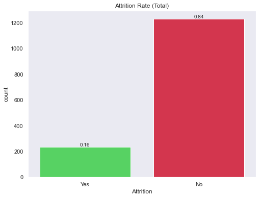


## 2.2 The Impact of Income towards Attrition

I wonder how much importance does each employee give to the income they earn in the organization. Here we will find out if it is true that money is really everything!

## Questions

- What is the average monthly income by department? Are there any significant differences between individuals who quit and didn't quit?
- Are there significant changes in the level of income by Job Satisfaction? Are individuals with a lower satisfaction getting much less income than the ones who are more satisfied?
- Do employees who quit the organization have a much lower income than people who didn't quit the organization?
- Do employees with a higher performance rating earn more than with a lower performance rating? Is the difference significant by Attrition status?

## Summary

- Income by Departments: Wow! We can see huge differences in each department by attrition status.

- Income by Job Satisfaction: Hmm. It seems the lower the job satisfaction the wider the gap by attrition status in the levels of income.

- Attrition sample population: I would say that most of this sample population has had a salary increase of less than 15% and a monthly income of less than 7,000

- Exhaustion at Work: Over 54% of workers who left the organization worked overtime! Will this be a reason why employees are leaving?

- Differences in the DailyRate: HealthCare Representatives , Sales Representatives , and Research Scientists have the biggest daily rates differences in terms of employees who quit or didn't quit the organization. This might indicate that at least for the these roles, the sample population that left the organization was mainly because of income.

## Average Income by Department


```python
inc_n = df[df['Attrition']=='No']

inc_y = df[df['Attrition']=='Yes']


avg_inc_n = inc_n.groupby(['Department','Attrition'])['MonthlyIncome'].mean().to_frame()
avg_inc_n.reset_index(inplace=True)

avg_inc_y = inc_y.groupby(['Department','Attrition'])['MonthlyIncome'].mean().to_frame()
avg_inc_y.reset_index(inplace=True)


sns.set(style="whitegrid")

fig, axes = plt.subplots(1, 2, figsize=(16,6))

g = sns.barplot(x='Department', y='MonthlyIncome', hue='Attrition', data=avg_inc_y, color='#ed1c3c', ax=axes[0])
g.set_ylim(0,8000)
g.legend(loc='upper center')
for p in g.patches:
    g.annotate(format(p.get_height(), '.2f'), (p.get_x() + p.get_width() / 2.,p.get_height()), ha = 'center', va = 'center', xytext = (0, 10), textcoords = 'offset points')


f = sns.barplot(x='Department', y='MonthlyIncome', hue='Attrition', data=avg_inc_n, color='#43e653', ax=axes[1])
f.set_ylim(0,8000)
f.legend(['No'],loc='upper center')
for p in f.patches:
    f.annotate(format(p.get_height(), '.2f'), (p.get_x() + p.get_width() / 2.,p.get_height()), ha = 'center', va = 'center', xytext = (0, 10), textcoords = 'offset points')

fig.suptitle('Average Income by Department & Attrition', size=16)


```


    Text(0.5, 0.98, 'Average Income by Department & Attrition')


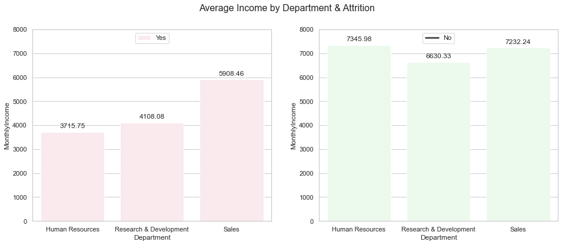


## Satisfaction by Income


```python
inc_n = df[df['Attrition']=='No']
inc_y = df[df['Attrition']=='Yes']


avg_inc_n = inc_n.groupby(['JobSatisfaction','Attrition'])['MonthlyIncome'].median().to_frame()
avg_inc_n.reset_index(inplace=True)


avg_inc_y = inc_y.groupby(['JobSatisfaction','Attrition'])['MonthlyIncome'].median().to_frame()
avg_inc_y.reset_index(inplace=True)

sns.set(style="whitegrid")
fig, axes = plt.subplots(1, 2, figsize=(16,6))


g = sns.barplot(x='MonthlyIncome', y='JobSatisfaction',data=avg_inc_y, color='#ed1c3c', orient='h', ax=axes[0])
g.set_xlim(0,6000)
g.set_xlabel('Median Income')
g.set_ylabel('Level of Job Satisfaction')
for p in g.patches:
    val= '{:,.0f}$'.format(p.get_width())
    width, height =p.get_width(),p.get_height()
    x=p.get_x()+width+0.02
    y=p.get_y()+height/2
    g.annotate(val,(x,y))


f = sns.barplot(x='MonthlyIncome', y='JobSatisfaction',color='#43e653', orient='h',data=avg_inc_n, ax=axes[1])
f.set_xlim(0,6000)
f.set_xlabel('Median Income')
f.set_ylabel('Level of Job Satisfaction')
for p in f.patches:
    val= '{:,.0f}$'.format(p.get_width())
    width, height =p.get_width(),p.get_height()
    x=p.get_x()+width+0.02
    y=p.get_y()+height/2
    f.annotate(val,(x,y))

red_patch = mpatches.Patch(color='r', label='Yes')
green_patch = mpatches.Patch(color='green', label='No')


fig.suptitle('Is Income a Reason to Leave? \n by Attrition', size=16)
fig.legend(handles=[red_patch, green_patch], title='Attrition')
```


    <matplotlib.legend.Legend at 0x1a37bc87b8>


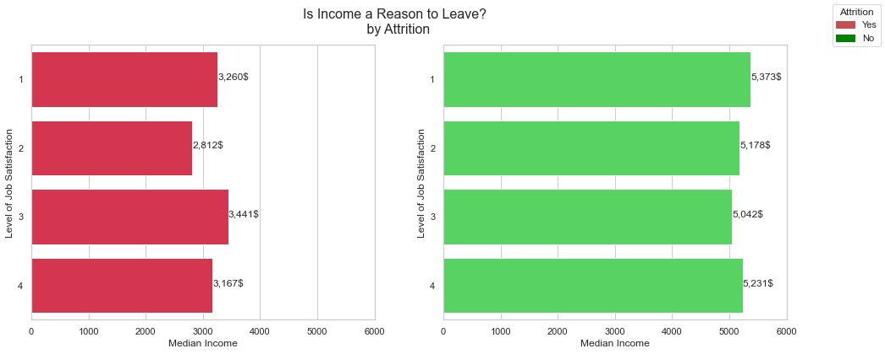


## Income and its Impact on Attrition


```python
gs = gridspec.GridSpec(2, 4)
gs.update(wspace=0.5)

sns.set(style="darkgrid")
fig=plt.figure(figsize=(12,10))
fig.tight_layout(pad=3.0)

ax1 = plt.subplot(gs[0, :])
ax2 = plt.subplot(gs[1, 0:2])
ax3 = plt.subplot(gs[1, 2:4])

colors = ['#ed1c3c','#43e653']

f=sns.stripplot(x=df['PercentSalaryHike'], y=df['MonthlyIncome'], hue=df['Attrition'], 
              ax=ax1, palette=colors, alpha=0.7, jitter=1.5)
f.legend().set_visible(False)

g=sns.violinplot(x=inc_n['MonthlyIncome'], y=inc_n['PerformanceRating'], orient='h',
                 ax=ax2, color='#43e653', inner=None, alpha=0.5)
g.set_xlabel('')


h=sns.violinplot(x=inc_y['MonthlyIncome'], y=inc_y['PerformanceRating'], orient='h',
                 ax=ax3, inner=None, color='#ed1c3c', sharex=ax2, alpha=0.5)
h.set_ylabel('')
h.set_xlabel('')


fig.legend(df['Attrition'].unique(),    
           labels=df['Attrition'].unique(),   
           loc=6,  
           borderaxespad=0.1,  
           title="Attrition" 
           )

fig.legend([g,f,h], 'Atttio')
fig.text(0.47,0.05,'Monthly Income')
fig.suptitle('Income and its Impact \n on Attrition \n', size=16)
```


    Text(0.5, 0.98, 'Income and its Impact \n on Attrition \n')


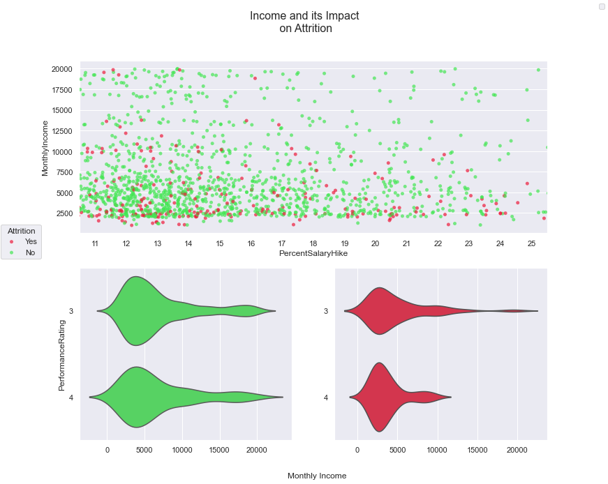


## Level of Attrition by Overtime Status


```python
fig, axes = plt.subplots(ncols=2, figsize=(18,9))


def make_autopct(values):
    def my_autopct(pct):
        total = sum(values)
        val = int(round(pct*total/100.0))
        return '{p:.2f}%  ({v:d})'.format(p=pct,v=val)
    return my_autopct


colors = ['#43e653','#ed1c3c']


f=axes[0].pie(inc_y.groupby('OverTime').count()['Age'], labels=['No','Yes'],
              autopct=make_autopct(inc_y.groupby('OverTime').count()['Age']),
              colors=colors, shadow=True)

axes[0].title.set_text('In Percent')


                   
g=axes[1].bar(x=['No','Yes'],height=inc_y.groupby('OverTime').count()['Age'], color=colors,linewidth=3, 
              bottom=1, ecolor='white')
axes[1].set_facecolor('white')
axes[1].title.set_text('In Total')


fig.patch.set_facecolor('white')
fig.suptitle('Level of Attrition by Overtime Status', size=16)
```


    Text(0.5, 0.98, 'Level of Attrition by Overtime Status')


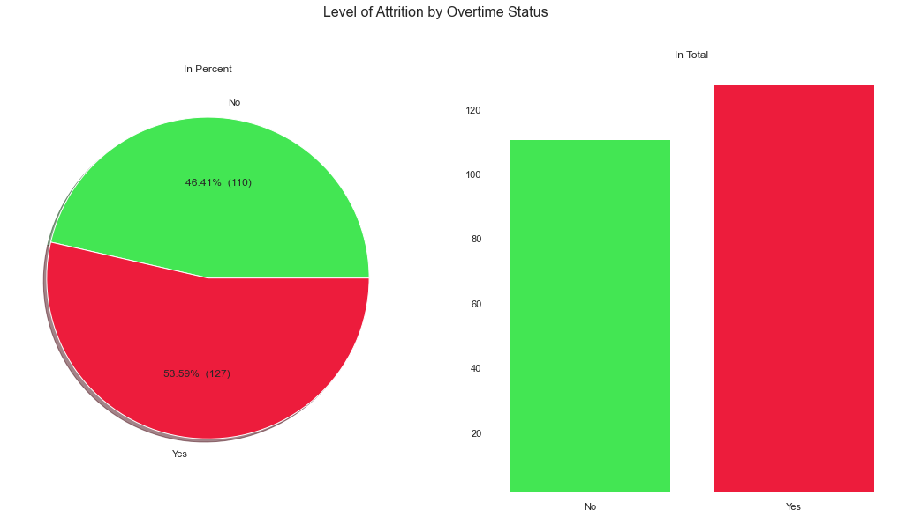


## 2.3 Working Environment

In this section, we will explore everything that is related to the working environment and the structure of the organization.

## Questions

- Job Roles: How many employees in each Job Role?
- Salary by Job Role: What's the average salary by job role?
- Attrition by Job Role: What's the attrition percentage by job role? Which job role has the highest attrition rate? Which has the lowest?
- Years with Current Manager What's the average satisfaction rate by the status of the manager? Are recently hired managers providinga higher job satisfaction to employees?


## Summary

- Number of Employees by Job Role: Sales and Research Scientist are the job positions with the highest number of employees.
- Salary by Job Role: Managers and Research Directors have the highest salary on average.
- Attrition by Job Role: Sales Representatives, HR and Laboratory Technician have the highest attrition rates. This could give us a hint that in these departments we are experiencing certain issues with employees.
- Managers: Employees that are dealing with recently hired managers have a lower satisfaction score than managers that have been there for a longer time.


## Major Job Roles Part I


```python
from wordcloud import WordCloud, ImageColorGenerator
text = " ".join(str(each) for each in df.JobRole)
# Create and generate a word cloud image:
wordcloud = WordCloud(max_words=200, background_color="white").generate(text)
plt.figure(figsize=(10,6))
plt.figure(figsize=(15,10))
# Display the generated image:
plt.imshow(wordcloud, interpolation='bilinear')
plt.axis("off")
plt.title('Major Job Roles in Company \n Part I\n \n', size=25)
plt.show()
```


    <Figure size 720x432 with 0 Axes>


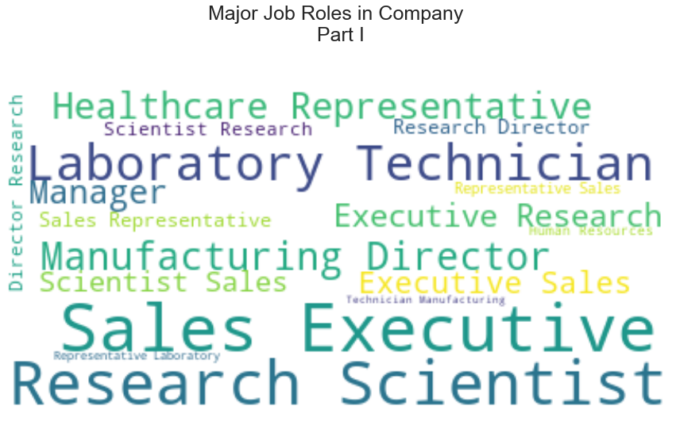


## Major Job Roles Part II 


```python
import squarify
fig=plt.figure(figsize=[10,10])

my_values = df.groupby('JobRole').count()['Age']

cmap = plt.cm.Blues
mini=min(my_values)
maxi=max(my_values)
colors = [cmap(value) for value in my_values]


squarify.plot(sizes=df.groupby('JobRole').count()['Age'], label=df.groupby('JobRole').count().index,alpha=0.8, color=colors)
plt.axis('off')
plt.gca().invert_yaxis()

plt.title("Major Job Roles in Company \n Part II", fontsize=25)


```


    Text(0.5, 1.0, 'Major Job Roles in Company \n Part II')


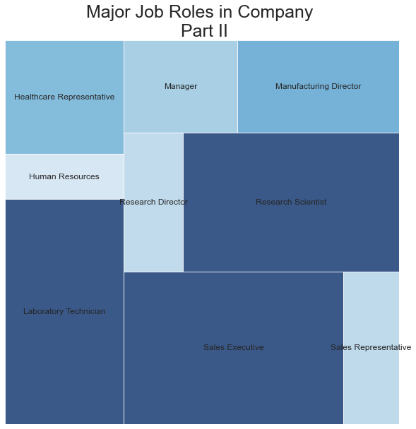


## Median Vs. Mean Income by Job Role


```python
inc_med = df.groupby('JobRole')['MonthlyIncome'].median().sort_values(ascending=False)
inc_mea = df.groupby('JobRole')['MonthlyIncome'].mean().sort_values(ascending=False)


sns.set(style="whitegrid")

fig, axes = plt.subplots(1, 2, figsize=(16,6))

g = sns.barplot(x=inc_med.index, y=inc_med, data=df, color='#0071CB', ax=axes[0])
g.set_ylim(0,20000)
g.set_ylabel('Median Income')
g.set_xlabel('')
g.set_xticklabels(inc_med.index,rotation=90)

for p in g.patches:
    g.annotate(format(p.get_height(), '.2f'), (p.get_x() + p.get_width() / 2.,p.get_height()), ha = 'center', va = 'center', xytext = (0, 10), textcoords = 'offset points')


f = sns.barplot(x=inc_mea.index, y=inc_mea, data=df, color='#9BD3FF', ax=axes[1])
f.set_ylim(0,20000)
f.set_ylabel('Mean Income')
f.set_xlabel('')
f.set_xticklabels(inc_mea.index,rotation=90)

for p in f.patches:
    f.annotate(format(p.get_height(), '.2f'), (p.get_x() + p.get_width() / 2.,p.get_height()), 
               ha = 'center', va = 'center', xytext = (0, 10), textcoords = 'offset points')


    
fig.suptitle('Median vs. Mean Income by different Job Roles', size=16)


```


    Text(0.5, 0.98, 'Median vs. Mean Income by different Job Roles')


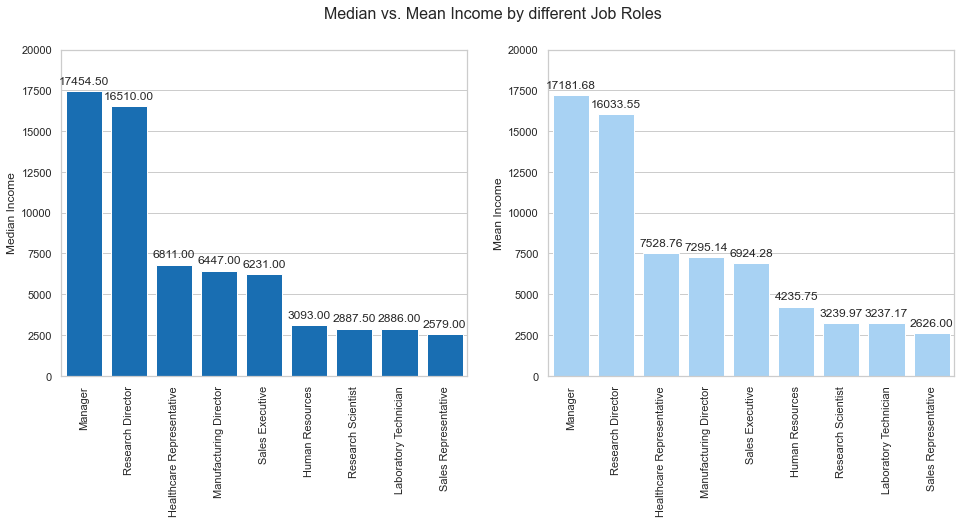


## Attrition by Job Role


```python
# Data
ct_t = df[['JobRole', 'Attrition', 'Age']].groupby(['JobRole','Attrition'])['Age'].count()
ct_t = pd.DataFrame(ct_t)
ct_t.reset_index(inplace=True)
ct = ct_t.JobRole.unique()
nu = [[0],[1]]

k=[]

for x in ct:
    k.append((ct_t[ct_t['JobRole']==x]['Age'].iloc[0]/(ct_t[ct_t['JobRole']==x]['Age'].iloc[0] + ct_t[ct_t['JobRole']==x]['Age'].iloc[1])).round(2))

k=[0.93, 0.07,0.77,0.23,0.76,0.24,0.95,0.05,0.93,0.07,0.98,0.02,0.84,0.16,0.83,0.17,0.6,0.4]


ct_t['Percentage'] =k
ct_t.drop('Age', 1, inplace=True)


job_r = list(ct_t.JobRole.unique())

att_y = ct_t[ct_t['Attrition']=='Yes']['Percentage'].values

att_n = ct_t[ct_t['Attrition']=='No']['Percentage'].values


# Sort by number of sales staff
idx = att_n.argsort()
job_r, att_y, att_n = [np.take(x, idx) for x in [job_r, att_y, att_n]]
y = np.arange(att_y.size)

fig, axes = plt.subplots(ncols=2, sharey=True, figsize=[10,8])
axes[0].barh(y, att_n, align='center', color='#43e653', zorder=10)
axes[0].set(title='NO')

axes[1].barh(y, att_y, align='center', color='#ed1c3c', zorder=10)
axes[1].set(title='YES')
axes[1].set_xlim(xmax=1)

axes[0].invert_xaxis()
axes[0].set(yticks=y, yticklabels=job_r)
axes[0].yaxis.tick_right()

for ax in axes.flat:
    ax.margins(0.03)
    ax.grid(True)

fig.tight_layout()
fig.subplots_adjust(wspace=0.7)


plt.setp(axes[0].yaxis.get_majorticklabels(), ha='center')


dx = 80 / 72.
dy = 0 / 72.
offset = matplotlib.transforms.ScaledTranslation(dx, dy, fig.dpi_scale_trans)

for label in axes[0].yaxis.get_majorticklabels():
    label.set_transform(label.get_transform() + offset)


fig.suptitle('Attrition by JobRole', size=18)

plt.show()
```


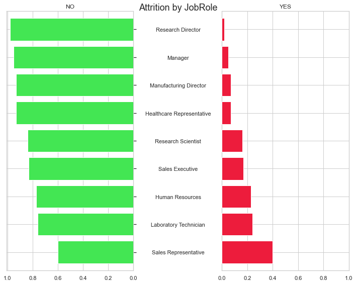


## Current Managers & Average Satisfaction Score


```python
inc_n = df[df['Attrition']=='No']
inc_y = df[df['Attrition']=='Yes']

def year_cat_man(year):
    if year <=1:
        return 'Recently Hired'
    elif 1<year<=4:
        return '2-4 Years Hired'
    else:
        return 'Established Manager'
    

inc_n['Man_Year'] = inc_n['YearsWithCurrManager'].apply(year_cat_man)
inc_y['Man_Year'] = inc_y['YearsWithCurrManager'].apply(year_cat_man) 


inc_n.groupby('Man_Year')['JobSatisfaction'].mean().reset_index()
inc_y.groupby('Man_Year')['JobSatisfaction'].mean().reset_index()


gs = gridspec.GridSpec(2, 4)
gs.update(wspace=0.5)

sns.set(style="white")
fig=plt.figure(figsize=(12,10))
fig.tight_layout(pad=3.0)

ax1 = plt.subplot(gs[0, :2])
ax2 = plt.subplot(gs[0, 2:4])
ax3 = plt.subplot(gs[1, 0:2])
ax4 = plt.subplot(gs[1, 2:4])


f = sns.barplot(x='JobSatisfaction', y='Man_Year',color='#43e653', orient='h',
                data=inc_n.groupby('Man_Year')['JobSatisfaction'].mean().reset_index(), ax=ax1)
f.set_xlabel('')
f.set_ylabel('Years with current Manager')
for p in f.patches:
    val= '{:,f}'.format(p.get_width())
    width, height =p.get_width(),p.get_height()
    x=p.get_x()+width+0.02
    y=p.get_y()+height/2
    f.annotate(val,(x-0.55,y))

    
    
g = sns.barplot(x='JobSatisfaction', y='Man_Year',color='#ed1c3c', orient='h',
                data=inc_y.groupby('Man_Year')['JobSatisfaction'].mean().reset_index(), ax=ax2)
g.set_xlim(0,3)
g.set_xlabel('')
g.set_ylabel('')
g.set_yticklabels('')
for p in g.patches:
    val= '{:,f}'.format(p.get_width())
    width, height =p.get_width(),p.get_height()
    x=p.get_x()+width+0.02
    y=p.get_y()+height/2
    g.annotate(val,(x-0.55,y))
    

h = sns.kdeplot(data=inc_n['RelationshipSatisfaction'], color='#43e653', ax=ax3, shade=True, label='Attrition = No')
h.set_xlabel('')
h.set_ylabel('Density') 
h.set_ylim(0,0.5)
h.set_xlim(1,4)

i = sns.kdeplot(data=inc_y['RelationshipSatisfaction'], color='#ed1c3c', ax=ax4, shade=True, label='Attrition = Yes')
i.set_xlabel('')
i.set_ylabel('') 
i.set_ylim(0,0.5)
i.set_xlim(1,4)


fig.text(0.455,0.48,'Average Satisfaction')
fig.text(0.455,0.05,'Relationship Satisfaction')
fig.suptitle('Dealing With Current Managers \n', size=16)

```


    Text(0.5, 0.98, 'Dealing With Current Managers \n')


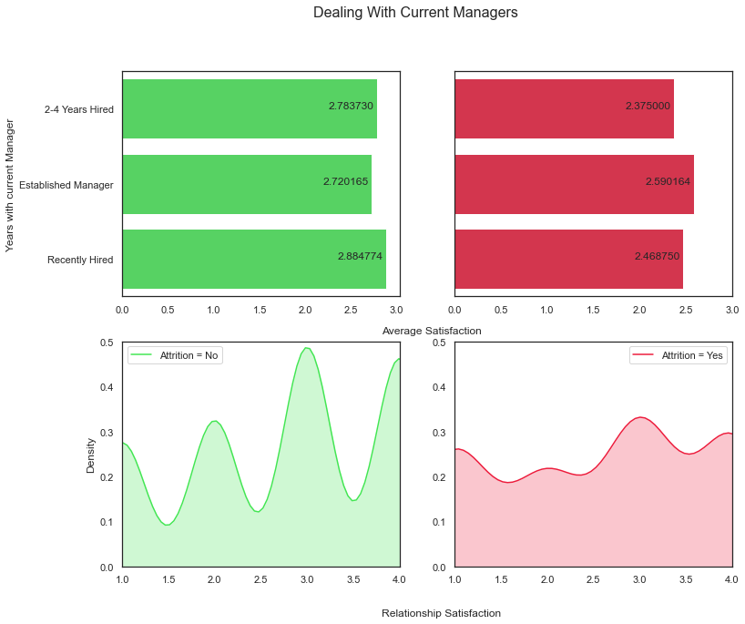


## 2.4 In-Depth Look Into Attrition

Digging into Attrition:

In this section, we will go as deep as we can into employees that quit to have a better understanding what were some of the reasons that employees decided to leave the organization.

Questions to Ask Ourselves:
- Attrition by Department: How many employees quit by Department? Did they have a proper work-life balance?


```python
gs = gridspec.GridSpec(2, 6)
gs.update(wspace=0.5)

sns.set(style="white")
fig=plt.figure(figsize=(18,12))
fig.tight_layout(pad=2.0)


ax1 = plt.subplot(gs[1, :2])
ax2 = plt.subplot(gs[1, 2:4])
ax3 = plt.subplot(gs[1, 4:6])


f = sns.barplot(x=inc_y[inc_y['Department']=='Human Resources'].groupby('WorkLifeBalance')['Age'].count().index,
                y=inc_y[inc_y['Department']=='Human Resources'].groupby('WorkLifeBalance')['Age'].count(), 
                color='#47A2E9',ax=ax1)
f.set_ylim(0,70)
f.set_ylabel('Number of Employees', fontsize=16)
f.set_xlabel('')
f.set_title('Human Ressources',fontweight="bold", size=14)
for p in f.patches:
    f.annotate(format(p.get_height(), ''), (p.get_x() + p.get_width() / 2.,p.get_height()), 
               ha = 'center', va = 'center', xytext = (0, 10), textcoords = 'offset points')
    
    
    
g = sns.barplot(x=inc_y[inc_y['Department']=='Sales'].groupby('WorkLifeBalance')['Age'].count().index,
                y=inc_y[inc_y['Department']=='Sales'].groupby('WorkLifeBalance')['Age'].count(),
                color='#BF0F9F', ax=ax2)
g.set_ylim(0,70)
g.set_ylabel('')
g.set_xlabel('Work & Life Balance', fontsize=16)
g.set_title('Sales',fontweight="bold", size=14)
for p in g.patches:
    g.annotate(format(p.get_height(), ''), (p.get_x() + p.get_width() / 2.,p.get_height()), 
               ha = 'center', va = 'center', xytext = (0, 10), textcoords = 'offset points')
  


    
h = sns.barplot(x=inc_y[inc_y['Department']=='Research & Development'].groupby('WorkLifeBalance')['Age'].count().index,
                y=inc_y[inc_y['Department']=='Research & Development'].groupby('WorkLifeBalance')['Age'].count(), 
                color='#10AD93',ax=ax3)
h.set_ylim(0,70)
h.set_ylabel('')
h.set_xlabel('')
h.set_title('Research & Development',fontweight="bold", size=14)

for p in h.patches:
    h.annotate(format(p.get_height(), ''), (p.get_x() + p.get_width() / 2.,p.get_height()), 
               ha = 'center', va = 'center', xytext = (0, 10), textcoords = 'offset points')
    


```


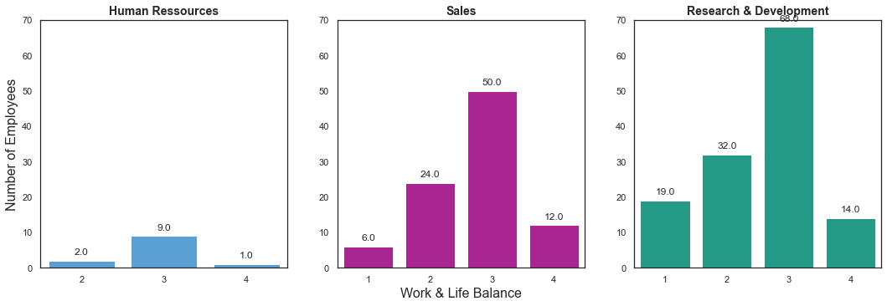


## 2.5 Correlations and Bi-variate Analysis:

Correlation Matrix:

In this section we will understand what features have a positive correlation with each other. This tells us whether there is an association between two variables. What I like about the correlation section is that it gives us a better understanding of some of the features we are dealing with

Summary:
- The higher the total working years the higher the monthly income of an employee.
- The higher the percent salary hike the higher the performance rating.
- The higher the years with current manager the higher the years since last promotion.
- The higher the age the higher the monthly income.

## 2.5.1 Correlations


```python
#Numerical encoding of the target variable

target_map = {'Yes':1, 'No':0}
df['Attrition_numerical']=df['Attrition'].apply(lambda x: target_map[x])
```


```python
#Getting all columns with numerical data for further exploration

df.drop(['EmployeeCount', 'StandardHours' ], 1, inplace=True)

numerical=[]

for a in df.columns:
    if df[a].dtypes=='int64':
        numerical.append(a)
        
```


```python
x = df[numerical]
y = df[numerical]

z = x.corr()
```


```python
#Checking the numerical data for Correlation. Using Plotly to get an interactive plot

data=go.Heatmap(z=z, x=df[numerical].columns.values, y=df[numerical].columns.values, type='heatmap', colorscale = 'Viridis', reversescale = False)

layout = go.Layout(
    title='Pearson Correlation of numerical features',
    xaxis = dict(ticks='', nticks=36),
    yaxis = dict(ticks='' ),
    width = 900, height = 900)
    
    
fig = go.Figure(data=data, layout=layout)


py.iplot(fig, filename='labelled-heatmap')
```


<div>


            <div id="a90cfbce-b986-4d13-a7e6-1048966eb112" class="plotly-graph-div" style="height:900px; width:900px;"></div>
            <script type="text/javascript">
                require(["plotly"], function(Plotly) {
                    window.PLOTLYENV=window.PLOTLYENV || {};

                if (document.getElementById("a90cfbce-b986-4d13-a7e6-1048966eb112")) {
                    Plotly.newPlot(
                        'a90cfbce-b986-4d13-a7e6-1048966eb112',
                        [{"colorscale": [[0.0, "#440154"], [0.1111111111111111, "#482878"], [0.2222222222222222, "#3e4989"], [0.3333333333333333, "#31688e"], [0.4444444444444444, "#26828e"], [0.5555555555555556, "#1f9e89"], [0.6666666666666666, "#35b779"], [0.7777777777777778, "#6ece58"], [0.8888888888888888, "#b5de2b"], [1.0, "#fde725"]], "reversescale": false, "type": "heatmap", "x": ["Age", "DailyRate", "DistanceFromHome", "Education", "EmployeeNumber", "EnvironmentSatisfaction", "HourlyRate", "JobInvolvement", "JobLevel", "JobSatisfaction", "MonthlyIncome", "MonthlyRate", "NumCompaniesWorked", "PercentSalaryHike", "PerformanceRating", "RelationshipSatisfaction", "StockOptionLevel", "TotalWorkingYears", "TrainingTimesLastYear", "WorkLifeBalance", "YearsAtCompany", "YearsInCurrentRole", "YearsSinceLastPromotion", "YearsWithCurrManager", "Attrition_numerical"], "y": ["Age", "DailyRate", "DistanceFromHome", "Education", "EmployeeNumber", "EnvironmentSatisfaction", "HourlyRate", "JobInvolvement", "JobLevel", "JobSatisfaction", "MonthlyIncome", "MonthlyRate", "NumCompaniesWorked", "PercentSalaryHike", "PerformanceRating", "RelationshipSatisfaction", "StockOptionLevel", "TotalWorkingYears", "TrainingTimesLastYear", "WorkLifeBalance", "YearsAtCompany", "YearsInCurrentRole", "YearsSinceLastPromotion", "YearsWithCurrManager", "Attrition_numerical"], "z": [[1.0, 0.010660942645538149, -0.0016861201480870135, 0.20803373101424003, -0.010145467076855675, 0.010146427861437251, 0.02428654255096734, 0.02981995862959055, 0.5096042284323877, -0.004891877148687357, 0.49785456692658075, 0.028051167133922784, 0.29963475798369266, 0.0036335849148617645, 0.0019038955127583738, 0.053534719671228664, 0.0375097124247778, 0.6803805357911991, -0.019620818942698393, -0.021490027957098534, 0.3113087697450993, 0.21290105556556693, 0.21651336785165384, 0.20208860237515222, -0.15920500686577846], [0.010660942645538149, 1.0, -0.004985337352552674, -0.01680643320915765, -0.050990433654478126, 0.018354854300385467, 0.023381421528320238, 0.04613487399781132, 0.0029663348551117142, 0.03057100783714411, 0.007707058872006039, -0.032181601522581774, 0.03815343427940969, 0.022703677496334916, 0.0004732963271882408, 0.007846030957248321, 0.042142796377206686, 0.014514738706320859, 0.002452542712083261, -0.037848051005781515, -0.034054767568547466, 0.009932014960094184, -0.03322898478777197, -0.026363178228837648, -0.05665199186762916], [-0.0016861201480870135, -0.004985337352552674, 1.0, 0.021041825624123364, 0.032916407199243866, -0.016075326996493465, 0.031130585611766015, 0.008783279886444232, 0.00530273055449623, -0.0036688391677204214, -0.01701444474527587, 0.027472863548884053, -0.029250804197292986, 0.04023537745919304, 0.02710961848197604, 0.006557474646578711, 0.044871998853181376, 0.004628425863783853, -0.036942234339916, -0.02655600410656897, 0.009507719899011271, 0.018844999108945663, 0.010028835943115365, 0.014406048430629939, 0.07792358295570358], [0.20803373101424003, -0.01680643320915765, 0.021041825624123364, 1.0, 0.042070093029328424, -0.027128313256511653, 0.016774828880960865, 0.042437634318608114, 0.10158888624850132, -0.011296116736574009, 0.09496067704188856, -0.026084197160047597, 0.12631656017668416, -0.011110940860654199, -0.024538791164833422, -0.009118376696381497, 0.01842222020401694, 0.14827969653887266, -0.025100241137933486, 0.009819189309781843, 0.06911369603133874, 0.060235554120695735, 0.05425433359132035, 0.06906537825528397, -0.03137281964004896], [-0.010145467076855675, -0.050990433654478126, 0.032916407199243866, 0.042070093029328424, 1.0, 0.017620802485588, 0.035179212418711185, -0.006887922987035419, -0.018519193974228312, -0.046246734939416716, -0.014828515873784741, 0.012648229168459414, -0.001251032039801599, -0.012943995546151018, -0.0203588251469522, -0.06986141146763623, 0.06222669251362312, -0.014365198461300408, 0.02360316959192501, 0.010308641437966677, -0.011240463708114035, -0.008416311998425857, -0.009019064206633747, -0.009196645292770457, -0.010577242759243103], [0.010146427861437251, 0.018354854300385467, -0.016075326996493465, -0.027128313256511653, 0.017620802485588, 1.0, -0.04985695620300049, -0.008277598171759227, 0.001211699448913975, -0.006784352599075191, -0.006259087754780221, 0.03759962286571541, 0.012594323218943297, -0.03170119524179215, -0.029547952297681358, 0.0076653835410744765, 0.0034321577550576604, -0.0026930703885341364, -0.019359308347132335, 0.027627295460115407, 0.0014575491911166178, 0.018007460142878566, 0.016193605568453423, -0.0049987226281075076, -0.10336897833793525], [0.02428654255096734, 0.023381421528320238, 0.031130585611766015, 0.016774828880960865, 0.035179212418711185, -0.04985695620300049, 1.0, 0.04286064097152996, -0.027853486405547332, -0.07133462437378851, -0.015794304380892906, -0.015296749550649706, 0.022156883390196815, -0.009061986253740113, -0.0021716974278102176, 0.0013304527859505607, 0.05026339906511977, -0.002333681823322244, -0.008547685209270621, -0.004607233750264436, -0.019581616209121213, -0.02410622020878486, -0.02671558606433533, -0.020123200184066038, -0.006845549572139824], [0.02981995862959055, 0.04613487399781132, 0.008783279886444232, 0.042437634318608114, -0.006887922987035419, -0.008277598171759227, 0.04286064097152996, 1.0, -0.012629882671190917, -0.02147591033530702, -0.015271490778732858, -0.016322079053317184, 0.01501241324311095, -0.017204572244480576, -0.029071333439070115, 0.03429682061119727, 0.021522640378023945, -0.005533182057407529, -0.015337825759428998, -0.014616593162761336, -0.02135542697962983, 0.008716963497611708, -0.024184292365178967, 0.025975807949088905, -0.13001595678605382], [0.5096042284323877, 0.0029663348551117142, 0.00530273055449623, 0.10158888624850132, -0.018519193974228312, 0.001211699448913975, -0.027853486405547332, -0.012629882671190917, 1.0, -0.0019437080267456803, 0.950299913479854, 0.039562951045684296, 0.14250112381048835, -0.03473049227941859, -0.021222082108856632, 0.021641510532591626, 0.013983910528615518, 0.7822078045362802, -0.01819055019354957, 0.03781774559666627, 0.5347386873756353, 0.3894467328766716, 0.35388534696410395, 0.3752806077657263, -0.16910475093102886], [-0.004891877148687357, 0.03057100783714411, -0.0036688391677204214, -0.011296116736574009, -0.046246734939416716, -0.006784352599075191, -0.07133462437378851, -0.02147591033530702, -0.0019437080267456803, 1.0, -0.007156742355912731, 0.0006439169427039258, -0.05569942601274601, 0.020002039364081937, 0.0022971970637801426, -0.012453593161926874, 0.01069022612075585, -0.02018507268501687, -0.005779334958609058, -0.019458710212974534, -0.003802627948288062, -0.0023047852298301056, -0.018213567810190918, -0.02765621388428996, -0.10348112606902209], [0.49785456692658075, 0.007707058872006039, -0.01701444474527587, 0.09496067704188856, -0.014828515873784741, -0.006259087754780221, -0.015794304380892906, -0.015271490778732858, 0.950299913479854, -0.007156742355912731, 1.0, 0.034813626134121846, 0.14951521598969764, -0.027268586440314498, -0.017120138237390704, 0.025873436137557375, 0.005407676696812226, 0.7728932462543548, -0.021736276823893293, 0.030683081556940366, 0.5142848257331964, 0.36381766692870654, 0.34497763816542787, 0.3440788832587207, -0.15983958238498777], [0.028051167133922784, -0.032181601522581774, 0.027472863548884053, -0.026084197160047597, 0.012648229168459414, 0.03759962286571541, -0.015296749550649706, -0.016322079053317184, 0.039562951045684296, 0.0006439169427039258, 0.034813626134121846, 1.0, 0.017521353415571556, -0.006429345946711349, -0.00981142848936072, -0.004085329337519465, -0.034322830206661034, 0.026442471176015413, 0.0014668806322857696, 0.007963157516976974, -0.02365510670617723, -0.012814874370471655, 0.0015667995146762359, -0.036745905336769295, 0.015170212530471421], [0.29963475798369266, 0.03815343427940969, -0.029250804197292986, 0.12631656017668416, -0.001251032039801599, 0.012594323218943297, 0.022156883390196815, 0.01501241324311095, 0.14250112381048835, -0.05569942601274601, 0.14951521598969764, 0.017521353415571556, 1.0, -0.010238309359925531, -0.014094872753535341, 0.052733048564885456, 0.03007547509689753, 0.23763858978479374, -0.06605407172783631, -0.008365684790058657, -0.11842134024259048, -0.09075393370080816, -0.03681389238350813, -0.11031915543773214, 0.04349373905781376], [0.0036335849148617645, 0.022703677496334916, 0.04023537745919304, -0.011110940860654199, -0.012943995546151018, -0.03170119524179215, -0.009061986253740113, -0.017204572244480576, -0.03473049227941859, 0.020002039364081937, -0.027268586440314498, -0.006429345946711349, -0.010238309359925531, 1.0, 0.7735499964012668, -0.0404900810570771, 0.00752774782052024, -0.02060848761769149, -0.005221012351720988, -0.0032796360093679373, -0.03599126243195386, -0.0015200265442777384, -0.022154312598866084, -0.011985248472361218, -0.013478202057439092], [0.0019038955127583738, 0.0004732963271882408, 0.02710961848197604, -0.024538791164833422, -0.0203588251469522, -0.029547952297681358, -0.0021716974278102176, -0.029071333439070115, -0.021222082108856632, 0.0022971970637801426, -0.017120138237390704, -0.00981142848936072, -0.014094872753535341, 0.7735499964012668, 1.0, -0.03135145544245493, 0.003506471614809925, 0.006743667905952884, -0.015578881739137221, 0.002572361317682325, 0.003435126115923952, 0.03498626040719472, 0.017896066144799612, 0.022827168908479786, 0.002888751711080946], [0.053534719671228664, 0.007846030957248321, 0.006557474646578711, -0.009118376696381497, -0.06986141146763623, 0.0076653835410744765, 0.0013304527859505607, 0.03429682061119727, 0.021641510532591626, -0.012453593161926874, 0.025873436137557375, -0.004085329337519465, 0.052733048564885456, -0.0404900810570771, -0.03135145544245493, 1.0, -0.04595249071656096, 0.02405429182134115, 0.0024965263921170973, 0.01960440570396862, 0.019366786877455352, -0.015122914881937524, 0.033492502069353614, -0.0008674968446255921, -0.04587227888112611], [0.0375097124247778, 0.042142796377206686, 0.044871998853181376, 0.01842222020401694, 0.06222669251362312, 0.0034321577550576604, 0.05026339906511977, 0.021522640378023945, 0.013983910528615518, 0.01069022612075585, 0.005407676696812226, -0.034322830206661034, 0.03007547509689753, 0.00752774782052024, 0.003506471614809925, -0.04595249071656096, 1.0, 0.01013596931890164, 0.011274069611249013, 0.004128730002871822, 0.015058008028094429, 0.05081787275393108, 0.014352184864355582, 0.02469822656302997, -0.13714491893332414], [0.6803805357911991, 0.014514738706320859, 0.004628425863783853, 0.14827969653887266, -0.014365198461300408, -0.0026930703885341364, -0.002333681823322244, -0.005533182057407529, 0.7822078045362802, -0.02018507268501687, 0.7728932462543548, 0.026442471176015413, 0.23763858978479374, -0.02060848761769149, 0.006743667905952884, 0.02405429182134115, 0.01013596931890164, 1.0, -0.03566157127961898, 0.0010076456218964744, 0.6281331552682479, 0.4603646380118082, 0.40485775850255995, 0.4591883970831438, -0.17106324613622528], [-0.019620818942698393, 0.002452542712083261, -0.036942234339916, -0.025100241137933486, 0.02360316959192501, -0.019359308347132335, -0.008547685209270621, -0.015337825759428998, -0.01819055019354957, -0.005779334958609058, -0.021736276823893293, 0.0014668806322857696, -0.06605407172783631, -0.005221012351720988, -0.015578881739137221, 0.0024965263921170973, 0.011274069611249013, -0.03566157127961898, 1.0, 0.028072206603628903, 0.003568665678427497, -0.005737504337956901, -0.00206653603800598, -0.0040955260212261965, -0.059477798556420665], [-0.021490027957098534, -0.037848051005781515, -0.02655600410656897, 0.009819189309781843, 0.010308641437966677, 0.027627295460115407, -0.004607233750264436, -0.014616593162761336, 0.03781774559666627, -0.019458710212974534, 0.030683081556940366, 0.007963157516976974, -0.008365684790058657, -0.0032796360093679373, 0.002572361317682325, 0.01960440570396862, 0.004128730002871822, 0.0010076456218964744, 0.028072206603628903, 1.0, 0.012089185354581271, 0.04985649792220411, 0.008941249141234248, 0.002759440242340434, -0.06393904721740912], [0.3113087697450993, -0.034054767568547466, 0.009507719899011271, 0.06911369603133874, -0.011240463708114035, 0.0014575491911166178, -0.019581616209121213, -0.02135542697962983, 0.5347386873756353, -0.003802627948288062, 0.5142848257331964, -0.02365510670617723, -0.11842134024259048, -0.03599126243195386, 0.003435126115923952, 0.019366786877455352, 0.015058008028094429, 0.6281331552682479, 0.003568665678427497, 0.012089185354581271, 1.0, 0.7587537366134616, 0.618408865217602, 0.7692124251006991, -0.13439221398997617], [0.21290105556556693, 0.009932014960094184, 0.018844999108945663, 0.060235554120695735, -0.008416311998425857, 0.018007460142878566, -0.02410622020878486, 0.008716963497611708, 0.3894467328766716, -0.0023047852298301056, 0.36381766692870654, -0.012814874370471655, -0.09075393370080816, -0.0015200265442777384, 0.03498626040719472, -0.015122914881937524, 0.05081787275393108, 0.4603646380118082, -0.005737504337956901, 0.04985649792220411, 0.7587537366134616, 1.0, 0.5480562476995158, 0.7143647616385903, -0.16054500426769938], [0.21651336785165384, -0.03322898478777197, 0.010028835943115365, 0.05425433359132035, -0.009019064206633747, 0.016193605568453423, -0.02671558606433533, -0.024184292365178967, 0.35388534696410395, -0.018213567810190918, 0.34497763816542787, 0.0015667995146762359, -0.03681389238350813, -0.022154312598866084, 0.017896066144799612, 0.033492502069353614, 0.014352184864355582, 0.40485775850255995, -0.00206653603800598, 0.008941249141234248, 0.618408865217602, 0.5480562476995158, 1.0, 0.5102236357788096, -0.03301877514258368], [0.20208860237515222, -0.026363178228837648, 0.014406048430629939, 0.06906537825528397, -0.009196645292770457, -0.0049987226281075076, -0.020123200184066038, 0.025975807949088905, 0.3752806077657263, -0.02765621388428996, 0.3440788832587207, -0.036745905336769295, -0.11031915543773214, -0.011985248472361218, 0.022827168908479786, -0.0008674968446255921, 0.02469822656302997, 0.4591883970831438, -0.0040955260212261965, 0.002759440242340434, 0.7692124251006991, 0.7143647616385903, 0.5102236357788096, 1.0, -0.1561993159016284], [-0.15920500686577846, -0.05665199186762916, 0.07792358295570358, -0.03137281964004896, -0.010577242759243103, -0.10336897833793525, -0.006845549572139824, -0.13001595678605382, -0.16910475093102886, -0.10348112606902209, -0.15983958238498777, 0.015170212530471421, 0.04349373905781376, -0.013478202057439092, 0.002888751711080946, -0.04587227888112611, -0.13714491893332414, -0.17106324613622528, -0.059477798556420665, -0.06393904721740912, -0.13439221398997617, -0.16054500426769938, -0.03301877514258368, -0.1561993159016284, 1.0]]}],
                        {"height": 900, "template": {"data": {"bar": [{"error_x": {"color": "#2a3f5f"}, "error_y": {"color": "#2a3f5f"}, "marker": {"line": {"color": "#E5ECF6", "width": 0.5}}, "type": "bar"}], "barpolar": [{"marker": {"line": {"color": "#E5ECF6", "width": 0.5}}, "type": "barpolar"}], "carpet": [{"aaxis": {"endlinecolor": "#2a3f5f", "gridcolor": "white", "linecolor": "white", "minorgridcolor": "white", "startlinecolor": "#2a3f5f"}, "baxis": {"endlinecolor": "#2a3f5f", "gridcolor": "white", "linecolor": "white", "minorgridcolor": "white", "startlinecolor": "#2a3f5f"}, "type": "carpet"}], "choropleth": [{"colorbar": {"outlinewidth": 0, "ticks": ""}, "type": "choropleth"}], "contour": [{"colorbar": {"outlinewidth": 0, "ticks": ""}, "colorscale": [[0.0, "#0d0887"], [0.1111111111111111, "#46039f"], [0.2222222222222222, "#7201a8"], [0.3333333333333333, "#9c179e"], [0.4444444444444444, "#bd3786"], [0.5555555555555556, "#d8576b"], [0.6666666666666666, "#ed7953"], [0.7777777777777778, "#fb9f3a"], [0.8888888888888888, "#fdca26"], [1.0, "#f0f921"]], "type": "contour"}], "contourcarpet": [{"colorbar": {"outlinewidth": 0, "ticks": ""}, "type": "contourcarpet"}], "heatmap": [{"colorbar": {"outlinewidth": 0, "ticks": ""}, "colorscale": [[0.0, "#0d0887"], [0.1111111111111111, "#46039f"], [0.2222222222222222, "#7201a8"], [0.3333333333333333, "#9c179e"], [0.4444444444444444, "#bd3786"], [0.5555555555555556, "#d8576b"], [0.6666666666666666, "#ed7953"], [0.7777777777777778, "#fb9f3a"], [0.8888888888888888, "#fdca26"], [1.0, "#f0f921"]], "type": "heatmap"}], "heatmapgl": [{"colorbar": {"outlinewidth": 0, "ticks": ""}, "colorscale": [[0.0, "#0d0887"], [0.1111111111111111, "#46039f"], [0.2222222222222222, "#7201a8"], [0.3333333333333333, "#9c179e"], [0.4444444444444444, "#bd3786"], [0.5555555555555556, "#d8576b"], [0.6666666666666666, "#ed7953"], [0.7777777777777778, "#fb9f3a"], [0.8888888888888888, "#fdca26"], [1.0, "#f0f921"]], "type": "heatmapgl"}], "histogram": [{"marker": {"colorbar": {"outlinewidth": 0, "ticks": ""}}, "type": "histogram"}], "histogram2d": [{"colorbar": {"outlinewidth": 0, "ticks": ""}, "colorscale": [[0.0, "#0d0887"], [0.1111111111111111, "#46039f"], [0.2222222222222222, "#7201a8"], [0.3333333333333333, "#9c179e"], [0.4444444444444444, "#bd3786"], [0.5555555555555556, "#d8576b"], [0.6666666666666666, "#ed7953"], [0.7777777777777778, "#fb9f3a"], [0.8888888888888888, "#fdca26"], [1.0, "#f0f921"]], "type": "histogram2d"}], "histogram2dcontour": [{"colorbar": {"outlinewidth": 0, "ticks": ""}, "colorscale": [[0.0, "#0d0887"], [0.1111111111111111, "#46039f"], [0.2222222222222222, "#7201a8"], [0.3333333333333333, "#9c179e"], [0.4444444444444444, "#bd3786"], [0.5555555555555556, "#d8576b"], [0.6666666666666666, "#ed7953"], [0.7777777777777778, "#fb9f3a"], [0.8888888888888888, "#fdca26"], [1.0, "#f0f921"]], "type": "histogram2dcontour"}], "mesh3d": [{"colorbar": {"outlinewidth": 0, "ticks": ""}, "type": "mesh3d"}], "parcoords": [{"line": {"colorbar": {"outlinewidth": 0, "ticks": ""}}, "type": "parcoords"}], "pie": [{"automargin": true, "type": "pie"}], "scatter": [{"marker": {"colorbar": {"outlinewidth": 0, "ticks": ""}}, "type": "scatter"}], "scatter3d": [{"line": {"colorbar": {"outlinewidth": 0, "ticks": ""}}, "marker": {"colorbar": {"outlinewidth": 0, "ticks": ""}}, "type": "scatter3d"}], "scattercarpet": [{"marker": {"colorbar": {"outlinewidth": 0, "ticks": ""}}, "type": "scattercarpet"}], "scattergeo": [{"marker": {"colorbar": {"outlinewidth": 0, "ticks": ""}}, "type": "scattergeo"}], "scattergl": [{"marker": {"colorbar": {"outlinewidth": 0, "ticks": ""}}, "type": "scattergl"}], "scattermapbox": [{"marker": {"colorbar": {"outlinewidth": 0, "ticks": ""}}, "type": "scattermapbox"}], "scatterpolar": [{"marker": {"colorbar": {"outlinewidth": 0, "ticks": ""}}, "type": "scatterpolar"}], "scatterpolargl": [{"marker": {"colorbar": {"outlinewidth": 0, "ticks": ""}}, "type": "scatterpolargl"}], "scatterternary": [{"marker": {"colorbar": {"outlinewidth": 0, "ticks": ""}}, "type": "scatterternary"}], "surface": [{"colorbar": {"outlinewidth": 0, "ticks": ""}, "colorscale": [[0.0, "#0d0887"], [0.1111111111111111, "#46039f"], [0.2222222222222222, "#7201a8"], [0.3333333333333333, "#9c179e"], [0.4444444444444444, "#bd3786"], [0.5555555555555556, "#d8576b"], [0.6666666666666666, "#ed7953"], [0.7777777777777778, "#fb9f3a"], [0.8888888888888888, "#fdca26"], [1.0, "#f0f921"]], "type": "surface"}], "table": [{"cells": {"fill": {"color": "#EBF0F8"}, "line": {"color": "white"}}, "header": {"fill": {"color": "#C8D4E3"}, "line": {"color": "white"}}, "type": "table"}]}, "layout": {"annotationdefaults": {"arrowcolor": "#2a3f5f", "arrowhead": 0, "arrowwidth": 1}, "coloraxis": {"colorbar": {"outlinewidth": 0, "ticks": ""}}, "colorscale": {"diverging": [[0, "#8e0152"], [0.1, "#c51b7d"], [0.2, "#de77ae"], [0.3, "#f1b6da"], [0.4, "#fde0ef"], [0.5, "#f7f7f7"], [0.6, "#e6f5d0"], [0.7, "#b8e186"], [0.8, "#7fbc41"], [0.9, "#4d9221"], [1, "#276419"]], "sequential": [[0.0, "#0d0887"], [0.1111111111111111, "#46039f"], [0.2222222222222222, "#7201a8"], [0.3333333333333333, "#9c179e"], [0.4444444444444444, "#bd3786"], [0.5555555555555556, "#d8576b"], [0.6666666666666666, "#ed7953"], [0.7777777777777778, "#fb9f3a"], [0.8888888888888888, "#fdca26"], [1.0, "#f0f921"]], "sequentialminus": [[0.0, "#0d0887"], [0.1111111111111111, "#46039f"], [0.2222222222222222, "#7201a8"], [0.3333333333333333, "#9c179e"], [0.4444444444444444, "#bd3786"], [0.5555555555555556, "#d8576b"], [0.6666666666666666, "#ed7953"], [0.7777777777777778, "#fb9f3a"], [0.8888888888888888, "#fdca26"], [1.0, "#f0f921"]]}, "colorway": ["#636efa", "#EF553B", "#00cc96", "#ab63fa", "#FFA15A", "#19d3f3", "#FF6692", "#B6E880", "#FF97FF", "#FECB52"], "font": {"color": "#2a3f5f"}, "geo": {"bgcolor": "white", "lakecolor": "white", "landcolor": "#E5ECF6", "showlakes": true, "showland": true, "subunitcolor": "white"}, "hoverlabel": {"align": "left"}, "hovermode": "closest", "mapbox": {"style": "light"}, "paper_bgcolor": "white", "plot_bgcolor": "#E5ECF6", "polar": {"angularaxis": {"gridcolor": "white", "linecolor": "white", "ticks": ""}, "bgcolor": "#E5ECF6", "radialaxis": {"gridcolor": "white", "linecolor": "white", "ticks": ""}}, "scene": {"xaxis": {"backgroundcolor": "#E5ECF6", "gridcolor": "white", "gridwidth": 2, "linecolor": "white", "showbackground": true, "ticks": "", "zerolinecolor": "white"}, "yaxis": {"backgroundcolor": "#E5ECF6", "gridcolor": "white", "gridwidth": 2, "linecolor": "white", "showbackground": true, "ticks": "", "zerolinecolor": "white"}, "zaxis": {"backgroundcolor": "#E5ECF6", "gridcolor": "white", "gridwidth": 2, "linecolor": "white", "showbackground": true, "ticks": "", "zerolinecolor": "white"}}, "shapedefaults": {"line": {"color": "#2a3f5f"}}, "ternary": {"aaxis": {"gridcolor": "white", "linecolor": "white", "ticks": ""}, "baxis": {"gridcolor": "white", "linecolor": "white", "ticks": ""}, "bgcolor": "#E5ECF6", "caxis": {"gridcolor": "white", "linecolor": "white", "ticks": ""}}, "title": {"x": 0.05}, "xaxis": {"automargin": true, "gridcolor": "white", "linecolor": "white", "ticks": "", "title": {"standoff": 15}, "zerolinecolor": "white", "zerolinewidth": 2}, "yaxis": {"automargin": true, "gridcolor": "white", "linecolor": "white", "ticks": "", "title": {"standoff": 15}, "zerolinecolor": "white", "zerolinewidth": 2}}}, "title": {"text": "Pearson Correlation of numerical features"}, "width": 900, "xaxis": {"nticks": 36, "ticks": ""}, "yaxis": {"ticks": ""}},
                        {"responsive": true}
                    ).then(function(){

var gd = document.getElementById('a90cfbce-b986-4d13-a7e6-1048966eb112');
var x = new MutationObserver(function (mutations, observer) {{
        var display = window.getComputedStyle(gd).display;
        if (!display || display === 'none') {{
            console.log([gd, 'removed!']);
            Plotly.purge(gd);
            observer.disconnect();
        }}
}});

// Listen for the removal of the full notebook cells
var notebookContainer = gd.closest('#notebook-container');
if (notebookContainer) {{
    x.observe(notebookContainer, {childList: true});
}}

// Listen for the clearing of the current output cell
var outputEl = gd.closest('.output');
if (outputEl) {{
    x.observe(outputEl, {childList: true});
}}

                        })
                };
                });
            </script>
        </div>


Further Takeaway: A lot of the columns seem to be poorly correlated with one another which is good for our model. So there is no need for further feature space reduction with e.g PCA


```python
#Further exploration

numerical = [u'Age', u'DailyRate',  u'JobSatisfaction',
       u'MonthlyIncome', u'PerformanceRating',
        u'WorkLifeBalance', u'YearsAtCompany', u'Attrition_numerical']

g = sns.pairplot(df[numerical], hue='Attrition_numerical', palette='seismic', diag_kind = 'kde',diag_kws=dict(shade=True))
g.set(xticklabels=[])
```


    <seaborn.axisgrid.PairGrid at 0x1a32cdc3c8>


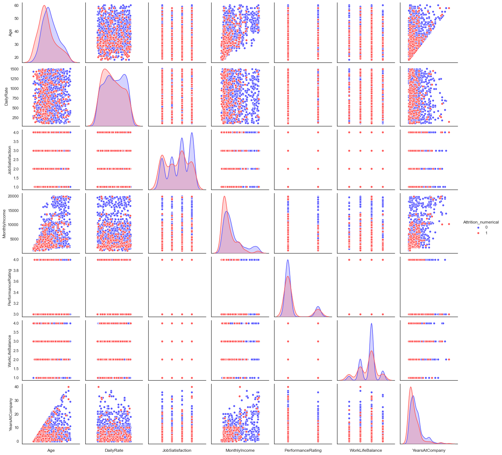


## 2.5.2 Bi-Variate Analysis


```python

f, axes = plt.subplots(3, 3, figsize=(10, 8), 
                       sharex=False, sharey=False)
s = np.linspace(0, 3, 10)


cmap = sns.cubehelix_palette(start=0.0, light=1, as_cmap=True)
x=df['Age']
y=df['TotalWorkingYears']

ax1=sns.kdeplot(x,y, shade=True, cmap=cmap, ax=axes[0,0], cut=5)
ax1.set_title('Age vs. Working Years')
ax1.set_xlabel('')
ax1.set_ylabel('')


cmap = sns.cubehelix_palette(start=0.33, light=1, as_cmap=True)
x=df['Age']
y=df['DailyRate']
ax2=sns.kdeplot(x,y, shade=True, cmap=cmap, ax=axes[0,1])
ax2.set_title('Age vs. Daily Rate')
ax2.set_xlabel('')
ax2.set_ylabel('')


cmap = sns.cubehelix_palette(start=0.66, light=1, as_cmap=True)
x=df['YearsInCurrentRole']
y=df['Age']
ax3=sns.kdeplot(x,y, shade=True, cmap=cmap, ax=axes[0,2])
ax3.set_title('YearsInRole vs. Age')
ax3.set_xlabel('')
ax3.set_ylabel('')


cmap = sns.cubehelix_palette(start=0.99, light=1, as_cmap=True)
x=df['DailyRate']
y=df['DistanceFromHome']
ax4=sns.kdeplot(x,y, shade=True, cmap=cmap, ax=axes[1,0])
ax4.set_title('DailyRate vs. Distance from Home')
ax4.set_xlabel('')
ax4.set_ylabel('')


cmap = sns.cubehelix_palette(start=1.33, light=1, as_cmap=True)
x=df['DailyRate']
y=df['JobSatisfaction']
ax5=sns.kdeplot(x,y, shade=True, cmap=cmap, ax=axes[1,1])
ax5.set_title('Daily Rate vs. Job Satisfaction')
ax5.set_xlabel('')
ax5.set_ylabel('')


cmap = sns.cubehelix_palette(start=1.66, light=1, as_cmap=True)
x=df['YearsAtCompany']
y=df['JobSatisfaction']
ax6=sns.kdeplot(x,y, shade=True, cmap=cmap, ax=axes[1,2])
ax6.set_title('Years at Company Vs. Job Satisfaction')
ax6.set_xlabel('')
ax6.set_ylabel('')


cmap = sns.cubehelix_palette(start=1.9999, light=1, as_cmap=True)
x=df['YearsAtCompany']
y=df['DailyRate']
ax7=sns.kdeplot(x,y, shade=True, cmap=cmap, ax=axes[2,0])
ax7.set_title('Company Years vs. Daily Rate')
ax7.set_xlabel('')
ax7.set_ylabel('')


cmap = sns.cubehelix_palette(start=2.33, light=1, as_cmap=True)
x=df['RelationshipSatisfaction']
y=df['YearsWithCurrManager']
ax8=sns.kdeplot(x,y, shade=True, cmap=cmap, ax=axes[2,1])
ax8.set_title('Satisfaction vs. Manager Years')
ax8.set_xlabel('')
ax8.set_ylabel('')


cmap = sns.cubehelix_palette(start=2.666, light=1, as_cmap=True)
x=df['WorkLifeBalance']
y=df['RelationshipSatisfaction']
ax9=sns.kdeplot(x,y, shade=True, cmap=cmap, ax=axes[2,2])
ax9.set_title('WorkLife Balance Vs. Satisfaction')
ax9.set_xlabel('')
ax9.set_ylabel('')

f.tight_layout()
```


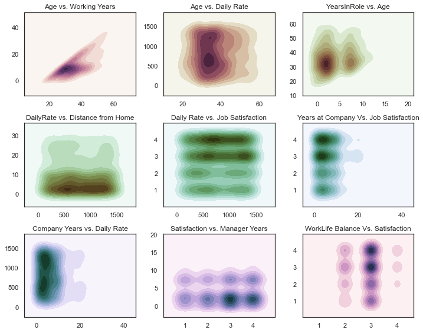


```python
gs = gridspec.GridSpec(2, 4)
gs.update(wspace=0.5)

sns.set(style="dark")
fig=plt.figure(figsize=(12,10))
fig.tight_layout(pad=1.0)

ax1 = plt.subplot(gs[0, :2])
ax2 = plt.subplot(gs[0, 2:4])
ax3 = plt.subplot(gs[1, 0:2])
ax4 = plt.subplot(gs[1, 2:4])


f = sns.scatterplot(x=df['TotalWorkingYears'], y=df['MonthlyIncome'], ax=ax1, s=25, color='#BF0F9F', alpha=0.5)
f.set_xlabel('Working Years')
f.set_ylabel('Monthly Income')
f.set_title('Positive Correlation',fontweight="bold", size=14)


g = sns.stripplot(x=df['PerformanceRating'], y=df['PercentSalaryHike'], ax=ax2, s=10, jitter=1, alpha=0.5, color='#BF0F9F')
g.set_xlabel('Performance Rating')
g.set_ylabel('Percent Salary Hike')
g.title.set_text('Positive Correlation')
g.set_title('Positive Correlation',fontweight="bold", size=14)

h = sns.scatterplot(x=df['Age'], y=df['MonthlyIncome'], ax=ax4, s=25, color='#BF0F9F', alpha=0.5)
h.set_xlabel('Working Years')
h.set_ylabel('Monthly Income')


i = sns.boxplot(x=df['YearsWithCurrManager'], y= df['YearsSinceLastPromotion'], ax=ax3)
i = sns.scatterplot(x=df['YearsWithCurrManager'], y= df['YearsSinceLastPromotion'], alpha=0.5, ax=ax3)
i.set_xlabel('Years With Current Manager')
i.set_ylabel('Years Since Last Promotion')
```


    Text(0, 0.5, 'Years Since Last Promotion')


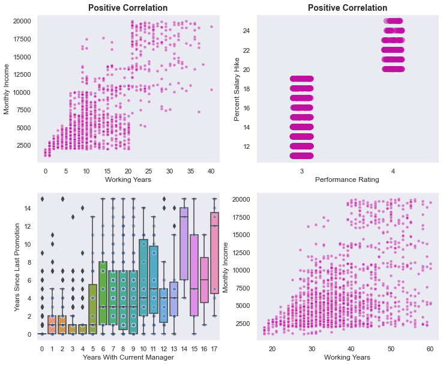


# 3. Feature Engineering 

## 3.1 Encoding the categorical values


```python
#Get all categorical features and saving them in a list
categorical=[]

for a in df.columns:
    if df[a].dtypes=='object':
        categorical.append(a)
```


```python
df.drop('Attrition_numerical', axis=1, inplace=True)
```


```python
numerical = df.columns.difference(categorical)
```


```python
df[categorical].head()
```


<div>
<style scoped>
    .dataframe tbody tr th:only-of-type {
        vertical-align: middle;
    }

    .dataframe tbody tr th {
        vertical-align: top;
    }

    .dataframe thead th {
        text-align: right;
    }
</style>
<table border="1" class="dataframe">
  <thead>
    <tr style="text-align: right;">
      <th></th>
      <th>Attrition</th>
      <th>BusinessTravel</th>
      <th>Department</th>
      <th>EducationField</th>
      <th>Gender</th>
      <th>JobRole</th>
      <th>MaritalStatus</th>
      <th>Over18</th>
      <th>OverTime</th>
    </tr>
  </thead>
  <tbody>
    <tr>
      <th>0</th>
      <td>Yes</td>
      <td>Travel_Rarely</td>
      <td>Sales</td>
      <td>Life Sciences</td>
      <td>Female</td>
      <td>Sales Executive</td>
      <td>Single</td>
      <td>Y</td>
      <td>Yes</td>
    </tr>
    <tr>
      <th>1</th>
      <td>No</td>
      <td>Travel_Frequently</td>
      <td>Research &amp; Development</td>
      <td>Life Sciences</td>
      <td>Male</td>
      <td>Research Scientist</td>
      <td>Married</td>
      <td>Y</td>
      <td>No</td>
    </tr>
    <tr>
      <th>2</th>
      <td>Yes</td>
      <td>Travel_Rarely</td>
      <td>Research &amp; Development</td>
      <td>Other</td>
      <td>Male</td>
      <td>Laboratory Technician</td>
      <td>Single</td>
      <td>Y</td>
      <td>Yes</td>
    </tr>
    <tr>
      <th>3</th>
      <td>No</td>
      <td>Travel_Frequently</td>
      <td>Research &amp; Development</td>
      <td>Life Sciences</td>
      <td>Female</td>
      <td>Research Scientist</td>
      <td>Married</td>
      <td>Y</td>
      <td>Yes</td>
    </tr>
    <tr>
      <th>4</th>
      <td>No</td>
      <td>Travel_Rarely</td>
      <td>Research &amp; Development</td>
      <td>Medical</td>
      <td>Male</td>
      <td>Laboratory Technician</td>
      <td>Married</td>
      <td>Y</td>
      <td>No</td>
    </tr>
  </tbody>
</table>
</div>


```python
df_cat = df[categorical]
df_cat.drop('Attrition', axis=1, inplace=True)
```


```python
df_cat.head()
```


<div>
<style scoped>
    .dataframe tbody tr th:only-of-type {
        vertical-align: middle;
    }

    .dataframe tbody tr th {
        vertical-align: top;
    }

    .dataframe thead th {
        text-align: right;
    }
</style>
<table border="1" class="dataframe">
  <thead>
    <tr style="text-align: right;">
      <th></th>
      <th>BusinessTravel</th>
      <th>Department</th>
      <th>EducationField</th>
      <th>Gender</th>
      <th>JobRole</th>
      <th>MaritalStatus</th>
      <th>Over18</th>
      <th>OverTime</th>
    </tr>
  </thead>
  <tbody>
    <tr>
      <th>0</th>
      <td>Travel_Rarely</td>
      <td>Sales</td>
      <td>Life Sciences</td>
      <td>Female</td>
      <td>Sales Executive</td>
      <td>Single</td>
      <td>Y</td>
      <td>Yes</td>
    </tr>
    <tr>
      <th>1</th>
      <td>Travel_Frequently</td>
      <td>Research &amp; Development</td>
      <td>Life Sciences</td>
      <td>Male</td>
      <td>Research Scientist</td>
      <td>Married</td>
      <td>Y</td>
      <td>No</td>
    </tr>
    <tr>
      <th>2</th>
      <td>Travel_Rarely</td>
      <td>Research &amp; Development</td>
      <td>Other</td>
      <td>Male</td>
      <td>Laboratory Technician</td>
      <td>Single</td>
      <td>Y</td>
      <td>Yes</td>
    </tr>
    <tr>
      <th>3</th>
      <td>Travel_Frequently</td>
      <td>Research &amp; Development</td>
      <td>Life Sciences</td>
      <td>Female</td>
      <td>Research Scientist</td>
      <td>Married</td>
      <td>Y</td>
      <td>Yes</td>
    </tr>
    <tr>
      <th>4</th>
      <td>Travel_Rarely</td>
      <td>Research &amp; Development</td>
      <td>Medical</td>
      <td>Male</td>
      <td>Laboratory Technician</td>
      <td>Married</td>
      <td>Y</td>
      <td>No</td>
    </tr>
  </tbody>
</table>
</div>


```python
#Numerical encoding of the data via pd.get_dummies
df_cat = pd.get_dummies(df_cat)
```


```python
df_num = df[numerical]
```


```python
#Creating the final dataset with numerical data only
df_final = pd.concat([df_num, df_cat], axis=1)
```


```python
df_final.head(3)
```


<div>
<style scoped>
    .dataframe tbody tr th:only-of-type {
        vertical-align: middle;
    }

    .dataframe tbody tr th {
        vertical-align: top;
    }

    .dataframe thead th {
        text-align: right;
    }
</style>
<table border="1" class="dataframe">
  <thead>
    <tr style="text-align: right;">
      <th></th>
      <th>Age</th>
      <th>DailyRate</th>
      <th>DistanceFromHome</th>
      <th>Education</th>
      <th>EmployeeNumber</th>
      <th>EnvironmentSatisfaction</th>
      <th>HourlyRate</th>
      <th>JobInvolvement</th>
      <th>JobLevel</th>
      <th>JobSatisfaction</th>
      <th>...</th>
      <th>JobRole_Research Director</th>
      <th>JobRole_Research Scientist</th>
      <th>JobRole_Sales Executive</th>
      <th>JobRole_Sales Representative</th>
      <th>MaritalStatus_Divorced</th>
      <th>MaritalStatus_Married</th>
      <th>MaritalStatus_Single</th>
      <th>Over18_Y</th>
      <th>OverTime_No</th>
      <th>OverTime_Yes</th>
    </tr>
  </thead>
  <tbody>
    <tr>
      <th>0</th>
      <td>41</td>
      <td>1102</td>
      <td>1</td>
      <td>2</td>
      <td>1</td>
      <td>2</td>
      <td>94</td>
      <td>3</td>
      <td>2</td>
      <td>4</td>
      <td>...</td>
      <td>0</td>
      <td>0</td>
      <td>1</td>
      <td>0</td>
      <td>0</td>
      <td>0</td>
      <td>1</td>
      <td>1</td>
      <td>0</td>
      <td>1</td>
    </tr>
    <tr>
      <th>1</th>
      <td>49</td>
      <td>279</td>
      <td>8</td>
      <td>1</td>
      <td>2</td>
      <td>3</td>
      <td>61</td>
      <td>2</td>
      <td>2</td>
      <td>2</td>
      <td>...</td>
      <td>0</td>
      <td>1</td>
      <td>0</td>
      <td>0</td>
      <td>0</td>
      <td>1</td>
      <td>0</td>
      <td>1</td>
      <td>1</td>
      <td>0</td>
    </tr>
    <tr>
      <th>2</th>
      <td>37</td>
      <td>1373</td>
      <td>2</td>
      <td>2</td>
      <td>4</td>
      <td>4</td>
      <td>92</td>
      <td>2</td>
      <td>1</td>
      <td>3</td>
      <td>...</td>
      <td>0</td>
      <td>0</td>
      <td>0</td>
      <td>0</td>
      <td>0</td>
      <td>0</td>
      <td>1</td>
      <td>1</td>
      <td>0</td>
      <td>1</td>
    </tr>
  </tbody>
</table>
<p>3 rows × 53 columns</p>
</div>


```python
target_map = {'Yes':1, 'No':0}
target = df["Attrition"].apply(lambda x: target_map[x])
target.head(3)
```


    0    1
    1    0
    2    1
    Name: Attrition, dtype: int64


```python
#Checking if the data of the target variable is distributed equally. Imbalances in the target variable could have a negative effect when it comes to building the model.
data=[go.Bar(x=df['Attrition'].value_counts().index, y=df['Attrition'].value_counts().values)]
py.iplot(data)


```


<div>


            <div id="151508be-4c5d-42b6-9447-968bf80ab433" class="plotly-graph-div" style="height:525px; width:100%;"></div>
            <script type="text/javascript">
                require(["plotly"], function(Plotly) {
                    window.PLOTLYENV=window.PLOTLYENV || {};

                if (document.getElementById("151508be-4c5d-42b6-9447-968bf80ab433")) {
                    Plotly.newPlot(
                        '151508be-4c5d-42b6-9447-968bf80ab433',
                        [{"type": "bar", "x": ["No", "Yes"], "y": [1233, 237]}],
                        {"template": {"data": {"bar": [{"error_x": {"color": "#2a3f5f"}, "error_y": {"color": "#2a3f5f"}, "marker": {"line": {"color": "#E5ECF6", "width": 0.5}}, "type": "bar"}], "barpolar": [{"marker": {"line": {"color": "#E5ECF6", "width": 0.5}}, "type": "barpolar"}], "carpet": [{"aaxis": {"endlinecolor": "#2a3f5f", "gridcolor": "white", "linecolor": "white", "minorgridcolor": "white", "startlinecolor": "#2a3f5f"}, "baxis": {"endlinecolor": "#2a3f5f", "gridcolor": "white", "linecolor": "white", "minorgridcolor": "white", "startlinecolor": "#2a3f5f"}, "type": "carpet"}], "choropleth": [{"colorbar": {"outlinewidth": 0, "ticks": ""}, "type": "choropleth"}], "contour": [{"colorbar": {"outlinewidth": 0, "ticks": ""}, "colorscale": [[0.0, "#0d0887"], [0.1111111111111111, "#46039f"], [0.2222222222222222, "#7201a8"], [0.3333333333333333, "#9c179e"], [0.4444444444444444, "#bd3786"], [0.5555555555555556, "#d8576b"], [0.6666666666666666, "#ed7953"], [0.7777777777777778, "#fb9f3a"], [0.8888888888888888, "#fdca26"], [1.0, "#f0f921"]], "type": "contour"}], "contourcarpet": [{"colorbar": {"outlinewidth": 0, "ticks": ""}, "type": "contourcarpet"}], "heatmap": [{"colorbar": {"outlinewidth": 0, "ticks": ""}, "colorscale": [[0.0, "#0d0887"], [0.1111111111111111, "#46039f"], [0.2222222222222222, "#7201a8"], [0.3333333333333333, "#9c179e"], [0.4444444444444444, "#bd3786"], [0.5555555555555556, "#d8576b"], [0.6666666666666666, "#ed7953"], [0.7777777777777778, "#fb9f3a"], [0.8888888888888888, "#fdca26"], [1.0, "#f0f921"]], "type": "heatmap"}], "heatmapgl": [{"colorbar": {"outlinewidth": 0, "ticks": ""}, "colorscale": [[0.0, "#0d0887"], [0.1111111111111111, "#46039f"], [0.2222222222222222, "#7201a8"], [0.3333333333333333, "#9c179e"], [0.4444444444444444, "#bd3786"], [0.5555555555555556, "#d8576b"], [0.6666666666666666, "#ed7953"], [0.7777777777777778, "#fb9f3a"], [0.8888888888888888, "#fdca26"], [1.0, "#f0f921"]], "type": "heatmapgl"}], "histogram": [{"marker": {"colorbar": {"outlinewidth": 0, "ticks": ""}}, "type": "histogram"}], "histogram2d": [{"colorbar": {"outlinewidth": 0, "ticks": ""}, "colorscale": [[0.0, "#0d0887"], [0.1111111111111111, "#46039f"], [0.2222222222222222, "#7201a8"], [0.3333333333333333, "#9c179e"], [0.4444444444444444, "#bd3786"], [0.5555555555555556, "#d8576b"], [0.6666666666666666, "#ed7953"], [0.7777777777777778, "#fb9f3a"], [0.8888888888888888, "#fdca26"], [1.0, "#f0f921"]], "type": "histogram2d"}], "histogram2dcontour": [{"colorbar": {"outlinewidth": 0, "ticks": ""}, "colorscale": [[0.0, "#0d0887"], [0.1111111111111111, "#46039f"], [0.2222222222222222, "#7201a8"], [0.3333333333333333, "#9c179e"], [0.4444444444444444, "#bd3786"], [0.5555555555555556, "#d8576b"], [0.6666666666666666, "#ed7953"], [0.7777777777777778, "#fb9f3a"], [0.8888888888888888, "#fdca26"], [1.0, "#f0f921"]], "type": "histogram2dcontour"}], "mesh3d": [{"colorbar": {"outlinewidth": 0, "ticks": ""}, "type": "mesh3d"}], "parcoords": [{"line": {"colorbar": {"outlinewidth": 0, "ticks": ""}}, "type": "parcoords"}], "pie": [{"automargin": true, "type": "pie"}], "scatter": [{"marker": {"colorbar": {"outlinewidth": 0, "ticks": ""}}, "type": "scatter"}], "scatter3d": [{"line": {"colorbar": {"outlinewidth": 0, "ticks": ""}}, "marker": {"colorbar": {"outlinewidth": 0, "ticks": ""}}, "type": "scatter3d"}], "scattercarpet": [{"marker": {"colorbar": {"outlinewidth": 0, "ticks": ""}}, "type": "scattercarpet"}], "scattergeo": [{"marker": {"colorbar": {"outlinewidth": 0, "ticks": ""}}, "type": "scattergeo"}], "scattergl": [{"marker": {"colorbar": {"outlinewidth": 0, "ticks": ""}}, "type": "scattergl"}], "scattermapbox": [{"marker": {"colorbar": {"outlinewidth": 0, "ticks": ""}}, "type": "scattermapbox"}], "scatterpolar": [{"marker": {"colorbar": {"outlinewidth": 0, "ticks": ""}}, "type": "scatterpolar"}], "scatterpolargl": [{"marker": {"colorbar": {"outlinewidth": 0, "ticks": ""}}, "type": "scatterpolargl"}], "scatterternary": [{"marker": {"colorbar": {"outlinewidth": 0, "ticks": ""}}, "type": "scatterternary"}], "surface": [{"colorbar": {"outlinewidth": 0, "ticks": ""}, "colorscale": [[0.0, "#0d0887"], [0.1111111111111111, "#46039f"], [0.2222222222222222, "#7201a8"], [0.3333333333333333, "#9c179e"], [0.4444444444444444, "#bd3786"], [0.5555555555555556, "#d8576b"], [0.6666666666666666, "#ed7953"], [0.7777777777777778, "#fb9f3a"], [0.8888888888888888, "#fdca26"], [1.0, "#f0f921"]], "type": "surface"}], "table": [{"cells": {"fill": {"color": "#EBF0F8"}, "line": {"color": "white"}}, "header": {"fill": {"color": "#C8D4E3"}, "line": {"color": "white"}}, "type": "table"}]}, "layout": {"annotationdefaults": {"arrowcolor": "#2a3f5f", "arrowhead": 0, "arrowwidth": 1}, "coloraxis": {"colorbar": {"outlinewidth": 0, "ticks": ""}}, "colorscale": {"diverging": [[0, "#8e0152"], [0.1, "#c51b7d"], [0.2, "#de77ae"], [0.3, "#f1b6da"], [0.4, "#fde0ef"], [0.5, "#f7f7f7"], [0.6, "#e6f5d0"], [0.7, "#b8e186"], [0.8, "#7fbc41"], [0.9, "#4d9221"], [1, "#276419"]], "sequential": [[0.0, "#0d0887"], [0.1111111111111111, "#46039f"], [0.2222222222222222, "#7201a8"], [0.3333333333333333, "#9c179e"], [0.4444444444444444, "#bd3786"], [0.5555555555555556, "#d8576b"], [0.6666666666666666, "#ed7953"], [0.7777777777777778, "#fb9f3a"], [0.8888888888888888, "#fdca26"], [1.0, "#f0f921"]], "sequentialminus": [[0.0, "#0d0887"], [0.1111111111111111, "#46039f"], [0.2222222222222222, "#7201a8"], [0.3333333333333333, "#9c179e"], [0.4444444444444444, "#bd3786"], [0.5555555555555556, "#d8576b"], [0.6666666666666666, "#ed7953"], [0.7777777777777778, "#fb9f3a"], [0.8888888888888888, "#fdca26"], [1.0, "#f0f921"]]}, "colorway": ["#636efa", "#EF553B", "#00cc96", "#ab63fa", "#FFA15A", "#19d3f3", "#FF6692", "#B6E880", "#FF97FF", "#FECB52"], "font": {"color": "#2a3f5f"}, "geo": {"bgcolor": "white", "lakecolor": "white", "landcolor": "#E5ECF6", "showlakes": true, "showland": true, "subunitcolor": "white"}, "hoverlabel": {"align": "left"}, "hovermode": "closest", "mapbox": {"style": "light"}, "paper_bgcolor": "white", "plot_bgcolor": "#E5ECF6", "polar": {"angularaxis": {"gridcolor": "white", "linecolor": "white", "ticks": ""}, "bgcolor": "#E5ECF6", "radialaxis": {"gridcolor": "white", "linecolor": "white", "ticks": ""}}, "scene": {"xaxis": {"backgroundcolor": "#E5ECF6", "gridcolor": "white", "gridwidth": 2, "linecolor": "white", "showbackground": true, "ticks": "", "zerolinecolor": "white"}, "yaxis": {"backgroundcolor": "#E5ECF6", "gridcolor": "white", "gridwidth": 2, "linecolor": "white", "showbackground": true, "ticks": "", "zerolinecolor": "white"}, "zaxis": {"backgroundcolor": "#E5ECF6", "gridcolor": "white", "gridwidth": 2, "linecolor": "white", "showbackground": true, "ticks": "", "zerolinecolor": "white"}}, "shapedefaults": {"line": {"color": "#2a3f5f"}}, "ternary": {"aaxis": {"gridcolor": "white", "linecolor": "white", "ticks": ""}, "baxis": {"gridcolor": "white", "linecolor": "white", "ticks": ""}, "bgcolor": "#E5ECF6", "caxis": {"gridcolor": "white", "linecolor": "white", "ticks": ""}}, "title": {"x": 0.05}, "xaxis": {"automargin": true, "gridcolor": "white", "linecolor": "white", "ticks": "", "title": {"standoff": 15}, "zerolinecolor": "white", "zerolinewidth": 2}, "yaxis": {"automargin": true, "gridcolor": "white", "linecolor": "white", "ticks": "", "title": {"standoff": 15}, "zerolinecolor": "white", "zerolinewidth": 2}}}},
                        {"responsive": true}
                    ).then(function(){

var gd = document.getElementById('151508be-4c5d-42b6-9447-968bf80ab433');
var x = new MutationObserver(function (mutations, observer) {{
        var display = window.getComputedStyle(gd).display;
        if (!display || display === 'none') {{
            console.log([gd, 'removed!']);
            Plotly.purge(gd);
            observer.disconnect();
        }}
}});

// Listen for the removal of the full notebook cells
var notebookContainer = gd.closest('#notebook-container');
if (notebookContainer) {{
    x.observe(notebookContainer, {childList: true});
}}

// Listen for the clearing of the current output cell
var outputEl = gd.closest('.output');
if (outputEl) {{
    x.observe(outputEl, {childList: true});
}}

                        })
                };
                });
            </script>
        </div>


```python
df["Attrition"].value_counts().index
```


    Index(['No', 'Yes'], dtype='object')


## 3.2 Work with Skewness

Our target variable is skewed and not distributed equally in its categories. Therefore, we'll use the Smote Function as an upsampling method to avoid a loss of information.


```python
from sklearn.model_selection import train_test_split
from sklearn.model_selection import StratifiedShuffleSplit

train, test, target_train, target_val = train_test_split(df_final, 
                                                         target, 
                                                         train_size= 0.80,
                                                         random_state=0);
```


```python
#SMOTE to oversample due to the skewness in target. I used a upsampling method to avoid a loss of information.

sampler=SMOTE(random_state=0)
smote_train, smote_target = sampler.fit_sample(train,target_train)
```

# 4. Analysis & Implementation of Machine Learning Models

In the following part we'll implement to different Machine Learning Models. First we'll use a Random Forest Classifier. After that we'll try the Gradient Boosting Classifier. Both models will be compared with eachother and include further visualizations.

## 4.1 Random Forest Classifier


```python
from sklearn.ensemble import RandomForestClassifier

rf = RandomForestClassifier()

rf_params = {
    'n_jobs': -1,
    'n_estimators': 1000,
    'max_features': 0.3,
    'max_depth': 4,
    'min_samples_leaf': 2,
    'max_features' : 'sqrt',
    'random_state' : 0,
    'verbose': 0
}
```

    /anaconda3/lib/python3.7/site-packages/ipykernel/ipkernel.py:287: DeprecationWarning:
    
    `should_run_async` will not call `transform_cell` automatically in the future. Please pass the result to `transformed_cell` argument and any exception that happen during thetransform in `preprocessing_exc_tuple` in IPython 7.17 and above.
    


```python
fit = rf.fit(smote_train, smote_target)
```

    /anaconda3/lib/python3.7/site-packages/ipykernel/ipkernel.py:287: DeprecationWarning:
    
    `should_run_async` will not call `transform_cell` automatically in the future. Please pass the result to `transformed_cell` argument and any exception that happen during thetransform in `preprocessing_exc_tuple` in IPython 7.17 and above.
    


```python
rf_predictions = rf.predict(test)
```

    /anaconda3/lib/python3.7/site-packages/ipykernel/ipkernel.py:287: DeprecationWarning:
    
    `should_run_async` will not call `transform_cell` automatically in the future. Please pass the result to `transformed_cell` argument and any exception that happen during thetransform in `preprocessing_exc_tuple` in IPython 7.17 and above.
    


```python
#Checking the Accuracy of the model

print("Accuracy score: {}".format(accuracy_score(target_val, rf_predictions)))
print("="*80)
print(classification_report(target_val, rf_predictions))
```

    Accuracy score: 0.8673469387755102
    ================================================================================
                  precision    recall  f1-score   support
    
               0       0.87      0.98      0.93       245
               1       0.78      0.29      0.42        49
    
        accuracy                           0.87       294
       macro avg       0.83      0.63      0.67       294
    weighted avg       0.86      0.87      0.84       294
    


    /anaconda3/lib/python3.7/site-packages/ipykernel/ipkernel.py:287: DeprecationWarning:
    
    `should_run_async` will not call `transform_cell` automatically in the future. Please pass the result to `transformed_cell` argument and any exception that happen during thetransform in `preprocessing_exc_tuple` in IPython 7.17 and above.
    


```python
#Using Randomized Search for Hyperparameter Tuning. Using Randomized Search instead of GridSearch to keep the runtime low

from sklearn.model_selection import RandomizedSearchCV
```

    /anaconda3/lib/python3.7/site-packages/ipykernel/ipkernel.py:287: DeprecationWarning:
    
    `should_run_async` will not call `transform_cell` automatically in the future. Please pass the result to `transformed_cell` argument and any exception that happen during thetransform in `preprocessing_exc_tuple` in IPython 7.17 and above.
    


```python
n_estimators = [int(x) for x in np.linspace(start = 100, stop = 2000, num = 10)]
max_features = ['auto', 'sqrt']
max_depth = [1,2,3,4,5,6,7,8,9,10]
min_samples_split = [2, 5, 10]
min_samples_leaf = [1, 2, 4]
bootstrap = [True, False]
```

    /anaconda3/lib/python3.7/site-packages/ipykernel/ipkernel.py:287: DeprecationWarning:
    
    `should_run_async` will not call `transform_cell` automatically in the future. Please pass the result to `transformed_cell` argument and any exception that happen during thetransform in `preprocessing_exc_tuple` in IPython 7.17 and above.
    


```python
random_grid = {'n_estimators': n_estimators,
               'max_features': max_features,
               'max_depth': max_depth,
               'min_samples_split': min_samples_split,
               'min_samples_leaf': min_samples_leaf,
               'bootstrap': bootstrap}
```

    /anaconda3/lib/python3.7/site-packages/ipykernel/ipkernel.py:287: DeprecationWarning:
    
    `should_run_async` will not call `transform_cell` automatically in the future. Please pass the result to `transformed_cell` argument and any exception that happen during thetransform in `preprocessing_exc_tuple` in IPython 7.17 and above.
    


```python
rf = RandomForestClassifier()
```

    /anaconda3/lib/python3.7/site-packages/ipykernel/ipkernel.py:287: DeprecationWarning:
    
    `should_run_async` will not call `transform_cell` automatically in the future. Please pass the result to `transformed_cell` argument and any exception that happen during thetransform in `preprocessing_exc_tuple` in IPython 7.17 and above.
    


```python
rf_random = RandomizedSearchCV(estimator = rf, param_distributions = random_grid, n_iter = 100, cv = 3, verbose=2, random_state=42, n_jobs = -1)
```

    /anaconda3/lib/python3.7/site-packages/ipykernel/ipkernel.py:287: DeprecationWarning:
    
    `should_run_async` will not call `transform_cell` automatically in the future. Please pass the result to `transformed_cell` argument and any exception that happen during thetransform in `preprocessing_exc_tuple` in IPython 7.17 and above.
    


```python
rf_random.fit(smote_train, smote_target)
```

    Fitting 3 folds for each of 100 candidates, totalling 300 fits


    /anaconda3/lib/python3.7/site-packages/ipykernel/ipkernel.py:287: DeprecationWarning:
    
    `should_run_async` will not call `transform_cell` automatically in the future. Please pass the result to `transformed_cell` argument and any exception that happen during thetransform in `preprocessing_exc_tuple` in IPython 7.17 and above.
    
    [Parallel(n_jobs=-1)]: Using backend LokyBackend with 4 concurrent workers.
    [Parallel(n_jobs=-1)]: Done  33 tasks      | elapsed:   31.1s
    [Parallel(n_jobs=-1)]: Done 154 tasks      | elapsed:  2.6min
    [Parallel(n_jobs=-1)]: Done 300 out of 300 | elapsed:  4.6min finished


    RandomizedSearchCV(cv=3, error_score=nan,
                       estimator=RandomForestClassifier(bootstrap=True,
                                                        ccp_alpha=0.0,
                                                        class_weight=None,
                                                        criterion='gini',
                                                        max_depth=None,
                                                        max_features='auto',
                                                        max_leaf_nodes=None,
                                                        max_samples=None,
                                                        min_impurity_decrease=0.0,
                                                        min_impurity_split=None,
                                                        min_samples_leaf=1,
                                                        min_samples_split=2,
                                                        min_weight_fraction_leaf=0.0,
                                                        n_estimators=100,
                                                        n_jobs...
                       iid='deprecated', n_iter=100, n_jobs=-1,
                       param_distributions={'bootstrap': [True, False],
                                            'max_depth': [1, 2, 3, 4, 5, 6, 7, 8, 9,
                                                          10],
                                            'max_features': ['auto', 'sqrt'],
                                            'min_samples_leaf': [1, 2, 4],
                                            'min_samples_split': [2, 5, 10],
                                            'n_estimators': [100, 311, 522, 733,
                                                             944, 1155, 1366, 1577,
                                                             1788, 2000]},
                       pre_dispatch='2*n_jobs', random_state=42, refit=True,
                       return_train_score=False, scoring=None, verbose=2)


```python
rf_random.best_params_
```

    /anaconda3/lib/python3.7/site-packages/ipykernel/ipkernel.py:287: DeprecationWarning:
    
    `should_run_async` will not call `transform_cell` automatically in the future. Please pass the result to `transformed_cell` argument and any exception that happen during thetransform in `preprocessing_exc_tuple` in IPython 7.17 and above.
    


    {'n_estimators': 944,
     'min_samples_split': 2,
     'min_samples_leaf': 2,
     'max_features': 'auto',
     'max_depth': 9,
     'bootstrap': True}


```python
pred = rf_random.predict(test)
```

    /anaconda3/lib/python3.7/site-packages/ipykernel/ipkernel.py:287: DeprecationWarning:
    
    `should_run_async` will not call `transform_cell` automatically in the future. Please pass the result to `transformed_cell` argument and any exception that happen during thetransform in `preprocessing_exc_tuple` in IPython 7.17 and above.
    


```python
#Checking the Accuracy of the model

print("Accuracy score: {}".format(accuracy_score(target_val, pred)))
print("="*80)
print(classification_report(target_val, pred))
```

    Accuracy score: 0.8673469387755102
    ================================================================================
                  precision    recall  f1-score   support
    
               0       0.88      0.98      0.92       245
               1       0.75      0.31      0.43        49
    
        accuracy                           0.87       294
       macro avg       0.81      0.64      0.68       294
    weighted avg       0.85      0.87      0.84       294
    


    /anaconda3/lib/python3.7/site-packages/ipykernel/ipkernel.py:287: DeprecationWarning:
    
    `should_run_async` will not call `transform_cell` automatically in the future. Please pass the result to `transformed_cell` argument and any exception that happen during thetransform in `preprocessing_exc_tuple` in IPython 7.17 and above.
    


**Takeaway**

The Random Forest Classifier returns an accuracy of 87% for its predictions. We have to keep in mind that the distribution of the target variable used to be skewed with 84% of yes and 16% of no's. So the model is slightly better than random guessing

It would be more informative to balance out the precision and recall scores as show in the classification report outputs. Where it falls down to the business considerations over whether one should prioritise for a metric over the other - i.e. Precision vs Recall.


```python
#Having a look on the importances of the features + visualization

fit.feature_importances_
```

    /anaconda3/lib/python3.7/site-packages/ipykernel/ipkernel.py:287: DeprecationWarning:
    
    `should_run_async` will not call `transform_cell` automatically in the future. Please pass the result to `transformed_cell` argument and any exception that happen during thetransform in `preprocessing_exc_tuple` in IPython 7.17 and above.
    


    array([0.02562484, 0.02019561, 0.01837664, 0.01468746, 0.02002321,
           0.02124464, 0.01660208, 0.02271015, 0.03666931, 0.03488971,
           0.04129273, 0.02134406, 0.01830875, 0.01395637, 0.00369676,
           0.01961724, 0.03824699, 0.02820591, 0.01290451, 0.02055458,
           0.02111298, 0.0231462 , 0.01369371, 0.01948159, 0.00411839,
           0.03173535, 0.01441998, 0.00213538, 0.02254233, 0.01977532,
           0.00171585, 0.02384083, 0.00758023, 0.01950509, 0.00294133,
           0.00490486, 0.00860813, 0.00902644, 0.0065438 , 0.00316998,
           0.01364392, 0.00126013, 0.0052275 , 0.00051584, 0.00714795,
           0.00899658, 0.00526634, 0.01330875, 0.01698652, 0.05135094,
           0.        , 0.08060217, 0.08654405])


```python
trace = go.Scatter(y=fit.feature_importances_, x=df_final.columns.values, 
                   mode='markers',
                   marker=dict(sizemode = 'diameter',
                               sizeref = 1,
                               size = 13,
                               color = fit.feature_importances_,
                               colorscale='Portland',
                               showscale=True),
                   text = df_final.columns.values), 

data=trace

layout = go.Layout(autosize=True, title="Feature Importance", hovermode='closest',
                   yaxis_title="Feature Importance", height=800, width=1100, showlegend=False,
                   paper_bgcolor='rgba(0,0,0,0)',
                   plot_bgcolor='rgba(0,0,0,0)',
                   xaxis= dict(ticklen= 5,
                               showgrid=False,
                               zeroline=False,),
                   yaxis = dict(ticklen= 5,
                               showgrid=False,
                               zeroline=False,))


fig = go.Figure(data=data, layout=layout)
fig.show()

```

    /anaconda3/lib/python3.7/site-packages/ipykernel/ipkernel.py:287: DeprecationWarning:
    
    `should_run_async` will not call `transform_cell` automatically in the future. Please pass the result to `transformed_cell` argument and any exception that happen during thetransform in `preprocessing_exc_tuple` in IPython 7.17 and above.
    


<div>


            <div id="5e0a6283-1e6b-47a5-ada3-44a742c436bd" class="plotly-graph-div" style="height:800px; width:1100px;"></div>
            <script type="text/javascript">
                require(["plotly"], function(Plotly) {
                    window.PLOTLYENV=window.PLOTLYENV || {};

                if (document.getElementById("5e0a6283-1e6b-47a5-ada3-44a742c436bd")) {
                    Plotly.newPlot(
                        '5e0a6283-1e6b-47a5-ada3-44a742c436bd',
                        [{"marker": {"color": [0.025624843498120654, 0.02019560655772895, 0.018376637252104953, 0.014687464906895004, 0.02002320604333212, 0.021244637509228784, 0.016602076708557026, 0.02271014730217419, 0.03666931080978297, 0.034889714604184344, 0.04129272841183934, 0.02134405884489383, 0.018308745207042215, 0.013956374299937787, 0.0036967551106655053, 0.0196172375735069, 0.038246991139880664, 0.02820590970722935, 0.012904505973817482, 0.020554582945319616, 0.021112984010680586, 0.023146197664973913, 0.013693710793281468, 0.019481593773076396, 0.004118388682212109, 0.03173534791952719, 0.014419983476401077, 0.0021353761680973815, 0.022542334737617176, 0.01977531694165885, 0.001715853164879523, 0.023840826917068205, 0.0075802279435942185, 0.019505094782308826, 0.002941334851204003, 0.004904860021627627, 0.008608133938906715, 0.00902643815045768, 0.006543803873258562, 0.003169981791282888, 0.013643919523051133, 0.0012601333664452076, 0.005227500569877956, 0.0005158437315551038, 0.007147945891157689, 0.008996577049668112, 0.005266337603778244, 0.013308752643022139, 0.016986515902574304, 0.05135093855947696, 0.0, 0.08060216537756766, 0.08654404577346951], "colorscale": [[0.0, "rgb(12,51,131)"], [0.25, "rgb(10,136,186)"], [0.5, "rgb(242,211,56)"], [0.75, "rgb(242,143,56)"], [1.0, "rgb(217,30,30)"]], "showscale": true, "size": 13, "sizemode": "diameter", "sizeref": 1}, "mode": "markers", "text": ["Age", "DailyRate", "DistanceFromHome", "Education", "EmployeeNumber", "EnvironmentSatisfaction", "HourlyRate", "JobInvolvement", "JobLevel", "JobSatisfaction", "MonthlyIncome", "MonthlyRate", "NumCompaniesWorked", "PercentSalaryHike", "PerformanceRating", "RelationshipSatisfaction", "StockOptionLevel", "TotalWorkingYears", "TrainingTimesLastYear", "WorkLifeBalance", "YearsAtCompany", "YearsInCurrentRole", "YearsSinceLastPromotion", "YearsWithCurrManager", "BusinessTravel_Non-Travel", "BusinessTravel_Travel_Frequently", "BusinessTravel_Travel_Rarely", "Department_Human Resources", "Department_Research & Development", "Department_Sales", "EducationField_Human Resources", "EducationField_Life Sciences", "EducationField_Marketing", "EducationField_Medical", "EducationField_Other", "EducationField_Technical Degree", "Gender_Female", "Gender_Male", "JobRole_Healthcare Representative", "JobRole_Human Resources", "JobRole_Laboratory Technician", "JobRole_Manager", "JobRole_Manufacturing Director", "JobRole_Research Director", "JobRole_Research Scientist", "JobRole_Sales Executive", "JobRole_Sales Representative", "MaritalStatus_Divorced", "MaritalStatus_Married", "MaritalStatus_Single", "Over18_Y", "OverTime_No", "OverTime_Yes"], "type": "scatter", "x": ["Age", "DailyRate", "DistanceFromHome", "Education", "EmployeeNumber", "EnvironmentSatisfaction", "HourlyRate", "JobInvolvement", "JobLevel", "JobSatisfaction", "MonthlyIncome", "MonthlyRate", "NumCompaniesWorked", "PercentSalaryHike", "PerformanceRating", "RelationshipSatisfaction", "StockOptionLevel", "TotalWorkingYears", "TrainingTimesLastYear", "WorkLifeBalance", "YearsAtCompany", "YearsInCurrentRole", "YearsSinceLastPromotion", "YearsWithCurrManager", "BusinessTravel_Non-Travel", "BusinessTravel_Travel_Frequently", "BusinessTravel_Travel_Rarely", "Department_Human Resources", "Department_Research & Development", "Department_Sales", "EducationField_Human Resources", "EducationField_Life Sciences", "EducationField_Marketing", "EducationField_Medical", "EducationField_Other", "EducationField_Technical Degree", "Gender_Female", "Gender_Male", "JobRole_Healthcare Representative", "JobRole_Human Resources", "JobRole_Laboratory Technician", "JobRole_Manager", "JobRole_Manufacturing Director", "JobRole_Research Director", "JobRole_Research Scientist", "JobRole_Sales Executive", "JobRole_Sales Representative", "MaritalStatus_Divorced", "MaritalStatus_Married", "MaritalStatus_Single", "Over18_Y", "OverTime_No", "OverTime_Yes"], "y": [0.025624843498120654, 0.02019560655772895, 0.018376637252104953, 0.014687464906895004, 0.02002320604333212, 0.021244637509228784, 0.016602076708557026, 0.02271014730217419, 0.03666931080978297, 0.034889714604184344, 0.04129272841183934, 0.02134405884489383, 0.018308745207042215, 0.013956374299937787, 0.0036967551106655053, 0.0196172375735069, 0.038246991139880664, 0.02820590970722935, 0.012904505973817482, 0.020554582945319616, 0.021112984010680586, 0.023146197664973913, 0.013693710793281468, 0.019481593773076396, 0.004118388682212109, 0.03173534791952719, 0.014419983476401077, 0.0021353761680973815, 0.022542334737617176, 0.01977531694165885, 0.001715853164879523, 0.023840826917068205, 0.0075802279435942185, 0.019505094782308826, 0.002941334851204003, 0.004904860021627627, 0.008608133938906715, 0.00902643815045768, 0.006543803873258562, 0.003169981791282888, 0.013643919523051133, 0.0012601333664452076, 0.005227500569877956, 0.0005158437315551038, 0.007147945891157689, 0.008996577049668112, 0.005266337603778244, 0.013308752643022139, 0.016986515902574304, 0.05135093855947696, 0.0, 0.08060216537756766, 0.08654404577346951]}],
                        {"autosize": true, "height": 800, "hovermode": "closest", "paper_bgcolor": "rgba(0,0,0,0)", "plot_bgcolor": "rgba(0,0,0,0)", "showlegend": false, "template": {"data": {"bar": [{"error_x": {"color": "#2a3f5f"}, "error_y": {"color": "#2a3f5f"}, "marker": {"line": {"color": "#E5ECF6", "width": 0.5}}, "type": "bar"}], "barpolar": [{"marker": {"line": {"color": "#E5ECF6", "width": 0.5}}, "type": "barpolar"}], "carpet": [{"aaxis": {"endlinecolor": "#2a3f5f", "gridcolor": "white", "linecolor": "white", "minorgridcolor": "white", "startlinecolor": "#2a3f5f"}, "baxis": {"endlinecolor": "#2a3f5f", "gridcolor": "white", "linecolor": "white", "minorgridcolor": "white", "startlinecolor": "#2a3f5f"}, "type": "carpet"}], "choropleth": [{"colorbar": {"outlinewidth": 0, "ticks": ""}, "type": "choropleth"}], "contour": [{"colorbar": {"outlinewidth": 0, "ticks": ""}, "colorscale": [[0.0, "#0d0887"], [0.1111111111111111, "#46039f"], [0.2222222222222222, "#7201a8"], [0.3333333333333333, "#9c179e"], [0.4444444444444444, "#bd3786"], [0.5555555555555556, "#d8576b"], [0.6666666666666666, "#ed7953"], [0.7777777777777778, "#fb9f3a"], [0.8888888888888888, "#fdca26"], [1.0, "#f0f921"]], "type": "contour"}], "contourcarpet": [{"colorbar": {"outlinewidth": 0, "ticks": ""}, "type": "contourcarpet"}], "heatmap": [{"colorbar": {"outlinewidth": 0, "ticks": ""}, "colorscale": [[0.0, "#0d0887"], [0.1111111111111111, "#46039f"], [0.2222222222222222, "#7201a8"], [0.3333333333333333, "#9c179e"], [0.4444444444444444, "#bd3786"], [0.5555555555555556, "#d8576b"], [0.6666666666666666, "#ed7953"], [0.7777777777777778, "#fb9f3a"], [0.8888888888888888, "#fdca26"], [1.0, "#f0f921"]], "type": "heatmap"}], "heatmapgl": [{"colorbar": {"outlinewidth": 0, "ticks": ""}, "colorscale": [[0.0, "#0d0887"], [0.1111111111111111, "#46039f"], [0.2222222222222222, "#7201a8"], [0.3333333333333333, "#9c179e"], [0.4444444444444444, "#bd3786"], [0.5555555555555556, "#d8576b"], [0.6666666666666666, "#ed7953"], [0.7777777777777778, "#fb9f3a"], [0.8888888888888888, "#fdca26"], [1.0, "#f0f921"]], "type": "heatmapgl"}], "histogram": [{"marker": {"colorbar": {"outlinewidth": 0, "ticks": ""}}, "type": "histogram"}], "histogram2d": [{"colorbar": {"outlinewidth": 0, "ticks": ""}, "colorscale": [[0.0, "#0d0887"], [0.1111111111111111, "#46039f"], [0.2222222222222222, "#7201a8"], [0.3333333333333333, "#9c179e"], [0.4444444444444444, "#bd3786"], [0.5555555555555556, "#d8576b"], [0.6666666666666666, "#ed7953"], [0.7777777777777778, "#fb9f3a"], [0.8888888888888888, "#fdca26"], [1.0, "#f0f921"]], "type": "histogram2d"}], "histogram2dcontour": [{"colorbar": {"outlinewidth": 0, "ticks": ""}, "colorscale": [[0.0, "#0d0887"], [0.1111111111111111, "#46039f"], [0.2222222222222222, "#7201a8"], [0.3333333333333333, "#9c179e"], [0.4444444444444444, "#bd3786"], [0.5555555555555556, "#d8576b"], [0.6666666666666666, "#ed7953"], [0.7777777777777778, "#fb9f3a"], [0.8888888888888888, "#fdca26"], [1.0, "#f0f921"]], "type": "histogram2dcontour"}], "mesh3d": [{"colorbar": {"outlinewidth": 0, "ticks": ""}, "type": "mesh3d"}], "parcoords": [{"line": {"colorbar": {"outlinewidth": 0, "ticks": ""}}, "type": "parcoords"}], "pie": [{"automargin": true, "type": "pie"}], "scatter": [{"marker": {"colorbar": {"outlinewidth": 0, "ticks": ""}}, "type": "scatter"}], "scatter3d": [{"line": {"colorbar": {"outlinewidth": 0, "ticks": ""}}, "marker": {"colorbar": {"outlinewidth": 0, "ticks": ""}}, "type": "scatter3d"}], "scattercarpet": [{"marker": {"colorbar": {"outlinewidth": 0, "ticks": ""}}, "type": "scattercarpet"}], "scattergeo": [{"marker": {"colorbar": {"outlinewidth": 0, "ticks": ""}}, "type": "scattergeo"}], "scattergl": [{"marker": {"colorbar": {"outlinewidth": 0, "ticks": ""}}, "type": "scattergl"}], "scattermapbox": [{"marker": {"colorbar": {"outlinewidth": 0, "ticks": ""}}, "type": "scattermapbox"}], "scatterpolar": [{"marker": {"colorbar": {"outlinewidth": 0, "ticks": ""}}, "type": "scatterpolar"}], "scatterpolargl": [{"marker": {"colorbar": {"outlinewidth": 0, "ticks": ""}}, "type": "scatterpolargl"}], "scatterternary": [{"marker": {"colorbar": {"outlinewidth": 0, "ticks": ""}}, "type": "scatterternary"}], "surface": [{"colorbar": {"outlinewidth": 0, "ticks": ""}, "colorscale": [[0.0, "#0d0887"], [0.1111111111111111, "#46039f"], [0.2222222222222222, "#7201a8"], [0.3333333333333333, "#9c179e"], [0.4444444444444444, "#bd3786"], [0.5555555555555556, "#d8576b"], [0.6666666666666666, "#ed7953"], [0.7777777777777778, "#fb9f3a"], [0.8888888888888888, "#fdca26"], [1.0, "#f0f921"]], "type": "surface"}], "table": [{"cells": {"fill": {"color": "#EBF0F8"}, "line": {"color": "white"}}, "header": {"fill": {"color": "#C8D4E3"}, "line": {"color": "white"}}, "type": "table"}]}, "layout": {"annotationdefaults": {"arrowcolor": "#2a3f5f", "arrowhead": 0, "arrowwidth": 1}, "coloraxis": {"colorbar": {"outlinewidth": 0, "ticks": ""}}, "colorscale": {"diverging": [[0, "#8e0152"], [0.1, "#c51b7d"], [0.2, "#de77ae"], [0.3, "#f1b6da"], [0.4, "#fde0ef"], [0.5, "#f7f7f7"], [0.6, "#e6f5d0"], [0.7, "#b8e186"], [0.8, "#7fbc41"], [0.9, "#4d9221"], [1, "#276419"]], "sequential": [[0.0, "#0d0887"], [0.1111111111111111, "#46039f"], [0.2222222222222222, "#7201a8"], [0.3333333333333333, "#9c179e"], [0.4444444444444444, "#bd3786"], [0.5555555555555556, "#d8576b"], [0.6666666666666666, "#ed7953"], [0.7777777777777778, "#fb9f3a"], [0.8888888888888888, "#fdca26"], [1.0, "#f0f921"]], "sequentialminus": [[0.0, "#0d0887"], [0.1111111111111111, "#46039f"], [0.2222222222222222, "#7201a8"], [0.3333333333333333, "#9c179e"], [0.4444444444444444, "#bd3786"], [0.5555555555555556, "#d8576b"], [0.6666666666666666, "#ed7953"], [0.7777777777777778, "#fb9f3a"], [0.8888888888888888, "#fdca26"], [1.0, "#f0f921"]]}, "colorway": ["#636efa", "#EF553B", "#00cc96", "#ab63fa", "#FFA15A", "#19d3f3", "#FF6692", "#B6E880", "#FF97FF", "#FECB52"], "font": {"color": "#2a3f5f"}, "geo": {"bgcolor": "white", "lakecolor": "white", "landcolor": "#E5ECF6", "showlakes": true, "showland": true, "subunitcolor": "white"}, "hoverlabel": {"align": "left"}, "hovermode": "closest", "mapbox": {"style": "light"}, "paper_bgcolor": "white", "plot_bgcolor": "#E5ECF6", "polar": {"angularaxis": {"gridcolor": "white", "linecolor": "white", "ticks": ""}, "bgcolor": "#E5ECF6", "radialaxis": {"gridcolor": "white", "linecolor": "white", "ticks": ""}}, "scene": {"xaxis": {"backgroundcolor": "#E5ECF6", "gridcolor": "white", "gridwidth": 2, "linecolor": "white", "showbackground": true, "ticks": "", "zerolinecolor": "white"}, "yaxis": {"backgroundcolor": "#E5ECF6", "gridcolor": "white", "gridwidth": 2, "linecolor": "white", "showbackground": true, "ticks": "", "zerolinecolor": "white"}, "zaxis": {"backgroundcolor": "#E5ECF6", "gridcolor": "white", "gridwidth": 2, "linecolor": "white", "showbackground": true, "ticks": "", "zerolinecolor": "white"}}, "shapedefaults": {"line": {"color": "#2a3f5f"}}, "ternary": {"aaxis": {"gridcolor": "white", "linecolor": "white", "ticks": ""}, "baxis": {"gridcolor": "white", "linecolor": "white", "ticks": ""}, "bgcolor": "#E5ECF6", "caxis": {"gridcolor": "white", "linecolor": "white", "ticks": ""}}, "title": {"x": 0.05}, "xaxis": {"automargin": true, "gridcolor": "white", "linecolor": "white", "ticks": "", "title": {"standoff": 15}, "zerolinecolor": "white", "zerolinewidth": 2}, "yaxis": {"automargin": true, "gridcolor": "white", "linecolor": "white", "ticks": "", "title": {"standoff": 15}, "zerolinecolor": "white", "zerolinewidth": 2}}}, "title": {"text": "Feature Importance"}, "width": 1100, "xaxis": {"showgrid": false, "ticklen": 5, "zeroline": false}, "yaxis": {"showgrid": false, "ticklen": 5, "title": {"text": "Feature Importance"}, "zeroline": false}},
                        {"responsive": true}
                    ).then(function(){

var gd = document.getElementById('5e0a6283-1e6b-47a5-ada3-44a742c436bd');
var x = new MutationObserver(function (mutations, observer) {{
        var display = window.getComputedStyle(gd).display;
        if (!display || display === 'none') {{
            console.log([gd, 'removed!']);
            Plotly.purge(gd);
            observer.disconnect();
        }}
}});

// Listen for the removal of the full notebook cells
var notebookContainer = gd.closest('#notebook-container');
if (notebookContainer) {{
    x.observe(notebookContainer, {childList: true});
}}

// Listen for the clearing of the current output cell
var outputEl = gd.closest('.output');
if (outputEl) {{
    x.observe(outputEl, {childList: true});
}}

                        })
                };
                });
            </script>
        </div>


```python
#Visualization of Decision Tree Classifier

from sklearn.tree import DecisionTreeClassifier
from IPython.display import Image  
from sklearn.externals.six import StringIO  
from sklearn.tree import export_graphviz
import pydot 


dtree = DecisionTreeClassifier(max_depth=4)
dtree.fit(train, target_train)
y_pred = dtree.predict(test)
```

    /anaconda3/lib/python3.7/site-packages/ipykernel/ipkernel.py:287: DeprecationWarning:
    
    `should_run_async` will not call `transform_cell` automatically in the future. Please pass the result to `transformed_cell` argument and any exception that happen during thetransform in `preprocessing_exc_tuple` in IPython 7.17 and above.
    


```python
features = list(df_final.columns.values)

dot_data = StringIO()  
export_graphviz(dtree, out_file=dot_data,feature_names=features,filled=True,rounded=True)

graph = pydot.graph_from_dot_data(dot_data.getvalue())  
Image(graph[0].create_png())

```

    /anaconda3/lib/python3.7/site-packages/ipykernel/ipkernel.py:287: DeprecationWarning:
    
    `should_run_async` will not call `transform_cell` automatically in the future. Please pass the result to `transformed_cell` argument and any exception that happen during thetransform in `preprocessing_exc_tuple` in IPython 7.17 and above.
    


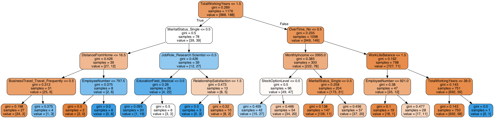


## 4.2 Gradient Boosting Classifier

As an alternative to the Random Forest I tried the Gradient Boosted Classifier as another ensemble technique


```python
gb_params ={
    'n_estimators': 1500,
    'max_features': 0.9,
    'learning_rate' : 0.25,
    'max_depth': 4,
    'min_samples_leaf': 2,
    'subsample': 1,
    'max_features' : 'sqrt',
    'verbose': 0
}
```

    /anaconda3/lib/python3.7/site-packages/ipykernel/ipkernel.py:287: DeprecationWarning:
    
    `should_run_async` will not call `transform_cell` automatically in the future. Please pass the result to `transformed_cell` argument and any exception that happen during thetransform in `preprocessing_exc_tuple` in IPython 7.17 and above.
    


```python
gb = GradientBoostingClassifier(**gb_params)
gb.fit(smote_train, smote_target)
gb_predictions = gb.predict(test)
```

    /anaconda3/lib/python3.7/site-packages/ipykernel/ipkernel.py:287: DeprecationWarning:
    
    `should_run_async` will not call `transform_cell` automatically in the future. Please pass the result to `transformed_cell` argument and any exception that happen during thetransform in `preprocessing_exc_tuple` in IPython 7.17 and above.
    


```python
print(accuracy_score(target_val, gb_predictions))
print(classification_report(target_val, gb_predictions))
```

    0.8537414965986394
                  precision    recall  f1-score   support
    
               0       0.87      0.97      0.92       245
               1       0.65      0.27      0.38        49
    
        accuracy                           0.85       294
       macro avg       0.76      0.62      0.65       294
    weighted avg       0.83      0.85      0.83       294
    


    /anaconda3/lib/python3.7/site-packages/ipykernel/ipkernel.py:287: DeprecationWarning:
    
    `should_run_async` will not call `transform_cell` automatically in the future. Please pass the result to `transformed_cell` argument and any exception that happen during thetransform in `preprocessing_exc_tuple` in IPython 7.17 and above.
    


```python
#Hyperparameter Tuning with Randomized Search

params ={
    'n_estimators': [500, 700, 1000, 1100, 1200,1300,1400,1500],
    'max_features': [1,2,3,4,5,6,7,8,9],
    'learning_rate' : [0.001,0.01,0.1,0.2,0.25,0.3],
    'max_depth': [2,3,4,4.5,5,6,7,8,9,10],
    'min_samples_leaf': [1,2,3,4,5],
    'max_features' : ['auto','sqrt']
}
```

    /anaconda3/lib/python3.7/site-packages/ipykernel/ipkernel.py:287: DeprecationWarning:
    
    `should_run_async` will not call `transform_cell` automatically in the future. Please pass the result to `transformed_cell` argument and any exception that happen during thetransform in `preprocessing_exc_tuple` in IPython 7.17 and above.
    


```python
gb_random = RandomizedSearchCV(estimator = gb, param_distributions = params, n_iter = 100, cv = 3, verbose=0, random_state=1, n_jobs = -1)
```

    /anaconda3/lib/python3.7/site-packages/ipykernel/ipkernel.py:287: DeprecationWarning:
    
    `should_run_async` will not call `transform_cell` automatically in the future. Please pass the result to `transformed_cell` argument and any exception that happen during thetransform in `preprocessing_exc_tuple` in IPython 7.17 and above.
    


```python
gb_random.fit(smote_train, smote_target)
```

    /anaconda3/lib/python3.7/site-packages/ipykernel/ipkernel.py:287: DeprecationWarning:
    
    `should_run_async` will not call `transform_cell` automatically in the future. Please pass the result to `transformed_cell` argument and any exception that happen during thetransform in `preprocessing_exc_tuple` in IPython 7.17 and above.
    


    RandomizedSearchCV(cv=3, error_score=nan,
                       estimator=GradientBoostingClassifier(ccp_alpha=0.0,
                                                            criterion='friedman_mse',
                                                            init=None,
                                                            learning_rate=0.25,
                                                            loss='deviance',
                                                            max_depth=4,
                                                            max_features='sqrt',
                                                            max_leaf_nodes=None,
                                                            min_impurity_decrease=0.0,
                                                            min_impurity_split=None,
                                                            min_samples_leaf=2,
                                                            min_samples_split=2,
                                                            min_weight_fraction_leaf=0.0,
                                                            n_estimators=1500,
                                                            n...
                       iid='deprecated', n_iter=100, n_jobs=-1,
                       param_distributions={'learning_rate': [0.001, 0.01, 0.1, 0.2,
                                                              0.25, 0.3],
                                            'max_depth': [2, 3, 4, 4.5, 5, 6, 7, 8,
                                                          9, 10],
                                            'max_features': ['auto', 'sqrt'],
                                            'min_samples_leaf': [1, 2, 3, 4, 5],
                                            'n_estimators': [500, 700, 1000, 1100,
                                                             1200, 1300, 1400,
                                                             1500]},
                       pre_dispatch='2*n_jobs', random_state=1, refit=True,
                       return_train_score=False, scoring=None, verbose=0)


```python
gb_random.best_params_
```

    /anaconda3/lib/python3.7/site-packages/ipykernel/ipkernel.py:287: DeprecationWarning:
    
    `should_run_async` will not call `transform_cell` automatically in the future. Please pass the result to `transformed_cell` argument and any exception that happen during thetransform in `preprocessing_exc_tuple` in IPython 7.17 and above.
    


    {'n_estimators': 1000,
     'min_samples_leaf': 2,
     'max_features': 'sqrt',
     'max_depth': 8,
     'learning_rate': 0.25}


```python
pred = gb_random.predict(test)
```

    /anaconda3/lib/python3.7/site-packages/ipykernel/ipkernel.py:287: DeprecationWarning:
    
    `should_run_async` will not call `transform_cell` automatically in the future. Please pass the result to `transformed_cell` argument and any exception that happen during thetransform in `preprocessing_exc_tuple` in IPython 7.17 and above.
    


```python
print(accuracy_score(target_val, pred))
print(classification_report(target_val, pred))
```

    0.8741496598639455
                  precision    recall  f1-score   support
    
               0       0.88      0.98      0.93       245
               1       0.80      0.33      0.46        49
    
        accuracy                           0.87       294
       macro avg       0.84      0.66      0.70       294
    weighted avg       0.87      0.87      0.85       294
    


    /anaconda3/lib/python3.7/site-packages/ipykernel/ipkernel.py:287: DeprecationWarning:
    
    `should_run_async` will not call `transform_cell` automatically in the future. Please pass the result to `transformed_cell` argument and any exception that happen during thetransform in `preprocessing_exc_tuple` in IPython 7.17 and above.
    


```python
params ={
    'n_estimators': [1200,1300,1400],
    'max_features': [6,7,8,9],
    'learning_rate' : [0.01],
    'max_depth': [2,3,4,4.5,5,6,7,8,9,10],
    'min_samples_leaf': [1,2,3,4,5],
    'max_features' : ['auto','sqrt']
}
```

    /anaconda3/lib/python3.7/site-packages/ipykernel/ipkernel.py:287: DeprecationWarning:
    
    `should_run_async` will not call `transform_cell` automatically in the future. Please pass the result to `transformed_cell` argument and any exception that happen during thetransform in `preprocessing_exc_tuple` in IPython 7.17 and above.
    


```python
gb_random = RandomizedSearchCV(estimator = gb, param_distributions = params, n_iter = 100, cv = 3, verbose=0, random_state=1, n_jobs = -1)
```

    /anaconda3/lib/python3.7/site-packages/ipykernel/ipkernel.py:287: DeprecationWarning:
    
    `should_run_async` will not call `transform_cell` automatically in the future. Please pass the result to `transformed_cell` argument and any exception that happen during thetransform in `preprocessing_exc_tuple` in IPython 7.17 and above.
    


```python
gb_random.fit(smote_train, smote_target)
```

    /anaconda3/lib/python3.7/site-packages/ipykernel/ipkernel.py:287: DeprecationWarning:
    
    `should_run_async` will not call `transform_cell` automatically in the future. Please pass the result to `transformed_cell` argument and any exception that happen during thetransform in `preprocessing_exc_tuple` in IPython 7.17 and above.
    


    RandomizedSearchCV(cv=3, error_score=nan,
                       estimator=GradientBoostingClassifier(ccp_alpha=0.0,
                                                            criterion='friedman_mse',
                                                            init=None,
                                                            learning_rate=0.25,
                                                            loss='deviance',
                                                            max_depth=4,
                                                            max_features='sqrt',
                                                            max_leaf_nodes=None,
                                                            min_impurity_decrease=0.0,
                                                            min_impurity_split=None,
                                                            min_samples_leaf=2,
                                                            min_samples_split=2,
                                                            min_weight_fraction_leaf=0.0,
                                                            n_estimators=1500,
                                                            n...
                                                            validation_fraction=0.1,
                                                            verbose=0,
                                                            warm_start=False),
                       iid='deprecated', n_iter=100, n_jobs=-1,
                       param_distributions={'learning_rate': [0.01],
                                            'max_depth': [2, 3, 4, 4.5, 5, 6, 7, 8,
                                                          9, 10],
                                            'max_features': ['auto', 'sqrt'],
                                            'min_samples_leaf': [1, 2, 3, 4, 5],
                                            'n_estimators': [1200, 1300, 1400]},
                       pre_dispatch='2*n_jobs', random_state=1, refit=True,
                       return_train_score=False, scoring=None, verbose=0)


```python
gb_random.best_params_
```

    /anaconda3/lib/python3.7/site-packages/ipykernel/ipkernel.py:287: DeprecationWarning:
    
    `should_run_async` will not call `transform_cell` automatically in the future. Please pass the result to `transformed_cell` argument and any exception that happen during thetransform in `preprocessing_exc_tuple` in IPython 7.17 and above.
    


    {'n_estimators': 1200,
     'min_samples_leaf': 2,
     'max_features': 'sqrt',
     'max_depth': 10,
     'learning_rate': 0.01}


```python
pred = gb_random.predict(test)
```

    /anaconda3/lib/python3.7/site-packages/ipykernel/ipkernel.py:287: DeprecationWarning:
    
    `should_run_async` will not call `transform_cell` automatically in the future. Please pass the result to `transformed_cell` argument and any exception that happen during thetransform in `preprocessing_exc_tuple` in IPython 7.17 and above.
    


```python
print(accuracy_score(target_val, pred))
print(classification_report(target_val, pred))
```

    0.8775510204081632
                  precision    recall  f1-score   support
    
               0       0.88      0.99      0.93       245
               1       0.88      0.31      0.45        49
    
        accuracy                           0.88       294
       macro avg       0.88      0.65      0.69       294
    weighted avg       0.88      0.88      0.85       294
    


    /anaconda3/lib/python3.7/site-packages/ipykernel/ipkernel.py:287: DeprecationWarning:
    
    `should_run_async` will not call `transform_cell` automatically in the future. Please pass the result to `transformed_cell` argument and any exception that happen during thetransform in `preprocessing_exc_tuple` in IPython 7.17 and above.
    


**Takeaway:**

GBC returns an accuracy of 87% after tuning of hyperparameters.


```python
#Having a look on the importances of the features + visualization

gb.feature_importances_
```

    /anaconda3/lib/python3.7/site-packages/ipykernel/ipkernel.py:287: DeprecationWarning:
    
    `should_run_async` will not call `transform_cell` automatically in the future. Please pass the result to `transformed_cell` argument and any exception that happen during thetransform in `preprocessing_exc_tuple` in IPython 7.17 and above.
    


    array([0.01964995, 0.01238835, 0.01491362, 0.00744194, 0.01313141,
           0.01427393, 0.00717048, 0.03117255, 0.04386431, 0.06107209,
           0.04377181, 0.0132361 , 0.0295698 , 0.00412087, 0.00044031,
           0.02772535, 0.06397086, 0.01100799, 0.00981317, 0.02147482,
           0.00881689, 0.0399148 , 0.00396221, 0.01006943, 0.00358521,
           0.03190231, 0.0027947 , 0.0037337 , 0.02244918, 0.04297009,
           0.00031113, 0.02579288, 0.00232599, 0.0410466 , 0.00060362,
           0.00269551, 0.01301024, 0.01486207, 0.00251395, 0.00345523,
           0.00915559, 0.0004668 , 0.0031799 , 0.00049092, 0.00235912,
           0.01439845, 0.00225132, 0.00398759, 0.00524592, 0.12225835,
           0.        , 0.03760864, 0.07157197])


```python
trace = go.Scatter(y=gb.feature_importances_, x=df_final.columns.values, 
                   mode='markers',
                   marker=dict(sizemode = 'diameter',
                               sizeref = 1,
                               size = 13,
                               color = gb.feature_importances_,
                               colorscale='Portland',
                               showscale=True),
                   text = df_final.columns.values), 

data=trace

layout = go.Layout(autosize=True, title="Feature Importance", hovermode='closest',
                   yaxis_title="Feature Importance", height=800, width=1100, showlegend=False,
                   paper_bgcolor='rgba(0,0,0,0)',
                   plot_bgcolor='rgba(0,0,0,0)',
                   xaxis= dict(ticklen= 5,
                               showgrid=False,
                               zeroline=False,),
                   yaxis = dict(ticklen= 5,
                               showgrid=False,
                               zeroline=False,))


fig = go.Figure(data=data, layout=layout)
fig.show()
```

    /anaconda3/lib/python3.7/site-packages/ipykernel/ipkernel.py:287: DeprecationWarning:
    
    `should_run_async` will not call `transform_cell` automatically in the future. Please pass the result to `transformed_cell` argument and any exception that happen during thetransform in `preprocessing_exc_tuple` in IPython 7.17 and above.
    


<div>


            <div id="2479ba1d-535c-4bc9-b42d-aa9b74189257" class="plotly-graph-div" style="height:800px; width:1100px;"></div>
            <script type="text/javascript">
                require(["plotly"], function(Plotly) {
                    window.PLOTLYENV=window.PLOTLYENV || {};

                if (document.getElementById("2479ba1d-535c-4bc9-b42d-aa9b74189257")) {
                    Plotly.newPlot(
                        '2479ba1d-535c-4bc9-b42d-aa9b74189257',
                        [{"marker": {"color": [0.01964995450698926, 0.012388346853235888, 0.014913615628605404, 0.007441937080582827, 0.013131409372122801, 0.014273930656300605, 0.007170482266710415, 0.031172545861059525, 0.0438643133981701, 0.06107208849165414, 0.04377180544649041, 0.013236100110522358, 0.02956980491396253, 0.004120870864317341, 0.00044031135082270935, 0.027725349267332784, 0.06397086066180518, 0.011007992801226026, 0.009813168054751834, 0.021474815963855972, 0.00881688890265257, 0.03991479657180981, 0.0039622051291516944, 0.010069428366330473, 0.0035852144186574396, 0.03190230619211621, 0.0027946974690863267, 0.0037336972984321577, 0.02244918211307358, 0.042970094405577704, 0.0003111285880045601, 0.02579288160379474, 0.002325985549201853, 0.04104660159668301, 0.0006036189874453508, 0.002695509259011044, 0.013010241037653183, 0.014862073327138294, 0.0025139496842365183, 0.0034552288108385086, 0.009155589902894548, 0.00046679839803868533, 0.0031798991274320605, 0.0004909196388113757, 0.002359117923490918, 0.01439845141974451, 0.002251323301380028, 0.003987592719975134, 0.005245923277208139, 0.12225834589470402, 0.0, 0.03760863961154128, 0.07157196592336612], "colorscale": [[0.0, "rgb(12,51,131)"], [0.25, "rgb(10,136,186)"], [0.5, "rgb(242,211,56)"], [0.75, "rgb(242,143,56)"], [1.0, "rgb(217,30,30)"]], "showscale": true, "size": 13, "sizemode": "diameter", "sizeref": 1}, "mode": "markers", "text": ["Age", "DailyRate", "DistanceFromHome", "Education", "EmployeeNumber", "EnvironmentSatisfaction", "HourlyRate", "JobInvolvement", "JobLevel", "JobSatisfaction", "MonthlyIncome", "MonthlyRate", "NumCompaniesWorked", "PercentSalaryHike", "PerformanceRating", "RelationshipSatisfaction", "StockOptionLevel", "TotalWorkingYears", "TrainingTimesLastYear", "WorkLifeBalance", "YearsAtCompany", "YearsInCurrentRole", "YearsSinceLastPromotion", "YearsWithCurrManager", "BusinessTravel_Non-Travel", "BusinessTravel_Travel_Frequently", "BusinessTravel_Travel_Rarely", "Department_Human Resources", "Department_Research & Development", "Department_Sales", "EducationField_Human Resources", "EducationField_Life Sciences", "EducationField_Marketing", "EducationField_Medical", "EducationField_Other", "EducationField_Technical Degree", "Gender_Female", "Gender_Male", "JobRole_Healthcare Representative", "JobRole_Human Resources", "JobRole_Laboratory Technician", "JobRole_Manager", "JobRole_Manufacturing Director", "JobRole_Research Director", "JobRole_Research Scientist", "JobRole_Sales Executive", "JobRole_Sales Representative", "MaritalStatus_Divorced", "MaritalStatus_Married", "MaritalStatus_Single", "Over18_Y", "OverTime_No", "OverTime_Yes"], "type": "scatter", "x": ["Age", "DailyRate", "DistanceFromHome", "Education", "EmployeeNumber", "EnvironmentSatisfaction", "HourlyRate", "JobInvolvement", "JobLevel", "JobSatisfaction", "MonthlyIncome", "MonthlyRate", "NumCompaniesWorked", "PercentSalaryHike", "PerformanceRating", "RelationshipSatisfaction", "StockOptionLevel", "TotalWorkingYears", "TrainingTimesLastYear", "WorkLifeBalance", "YearsAtCompany", "YearsInCurrentRole", "YearsSinceLastPromotion", "YearsWithCurrManager", "BusinessTravel_Non-Travel", "BusinessTravel_Travel_Frequently", "BusinessTravel_Travel_Rarely", "Department_Human Resources", "Department_Research & Development", "Department_Sales", "EducationField_Human Resources", "EducationField_Life Sciences", "EducationField_Marketing", "EducationField_Medical", "EducationField_Other", "EducationField_Technical Degree", "Gender_Female", "Gender_Male", "JobRole_Healthcare Representative", "JobRole_Human Resources", "JobRole_Laboratory Technician", "JobRole_Manager", "JobRole_Manufacturing Director", "JobRole_Research Director", "JobRole_Research Scientist", "JobRole_Sales Executive", "JobRole_Sales Representative", "MaritalStatus_Divorced", "MaritalStatus_Married", "MaritalStatus_Single", "Over18_Y", "OverTime_No", "OverTime_Yes"], "y": [0.01964995450698926, 0.012388346853235888, 0.014913615628605404, 0.007441937080582827, 0.013131409372122801, 0.014273930656300605, 0.007170482266710415, 0.031172545861059525, 0.0438643133981701, 0.06107208849165414, 0.04377180544649041, 0.013236100110522358, 0.02956980491396253, 0.004120870864317341, 0.00044031135082270935, 0.027725349267332784, 0.06397086066180518, 0.011007992801226026, 0.009813168054751834, 0.021474815963855972, 0.00881688890265257, 0.03991479657180981, 0.0039622051291516944, 0.010069428366330473, 0.0035852144186574396, 0.03190230619211621, 0.0027946974690863267, 0.0037336972984321577, 0.02244918211307358, 0.042970094405577704, 0.0003111285880045601, 0.02579288160379474, 0.002325985549201853, 0.04104660159668301, 0.0006036189874453508, 0.002695509259011044, 0.013010241037653183, 0.014862073327138294, 0.0025139496842365183, 0.0034552288108385086, 0.009155589902894548, 0.00046679839803868533, 0.0031798991274320605, 0.0004909196388113757, 0.002359117923490918, 0.01439845141974451, 0.002251323301380028, 0.003987592719975134, 0.005245923277208139, 0.12225834589470402, 0.0, 0.03760863961154128, 0.07157196592336612]}],
                        {"autosize": true, "height": 800, "hovermode": "closest", "paper_bgcolor": "rgba(0,0,0,0)", "plot_bgcolor": "rgba(0,0,0,0)", "showlegend": false, "template": {"data": {"bar": [{"error_x": {"color": "#2a3f5f"}, "error_y": {"color": "#2a3f5f"}, "marker": {"line": {"color": "#E5ECF6", "width": 0.5}}, "type": "bar"}], "barpolar": [{"marker": {"line": {"color": "#E5ECF6", "width": 0.5}}, "type": "barpolar"}], "carpet": [{"aaxis": {"endlinecolor": "#2a3f5f", "gridcolor": "white", "linecolor": "white", "minorgridcolor": "white", "startlinecolor": "#2a3f5f"}, "baxis": {"endlinecolor": "#2a3f5f", "gridcolor": "white", "linecolor": "white", "minorgridcolor": "white", "startlinecolor": "#2a3f5f"}, "type": "carpet"}], "choropleth": [{"colorbar": {"outlinewidth": 0, "ticks": ""}, "type": "choropleth"}], "contour": [{"colorbar": {"outlinewidth": 0, "ticks": ""}, "colorscale": [[0.0, "#0d0887"], [0.1111111111111111, "#46039f"], [0.2222222222222222, "#7201a8"], [0.3333333333333333, "#9c179e"], [0.4444444444444444, "#bd3786"], [0.5555555555555556, "#d8576b"], [0.6666666666666666, "#ed7953"], [0.7777777777777778, "#fb9f3a"], [0.8888888888888888, "#fdca26"], [1.0, "#f0f921"]], "type": "contour"}], "contourcarpet": [{"colorbar": {"outlinewidth": 0, "ticks": ""}, "type": "contourcarpet"}], "heatmap": [{"colorbar": {"outlinewidth": 0, "ticks": ""}, "colorscale": [[0.0, "#0d0887"], [0.1111111111111111, "#46039f"], [0.2222222222222222, "#7201a8"], [0.3333333333333333, "#9c179e"], [0.4444444444444444, "#bd3786"], [0.5555555555555556, "#d8576b"], [0.6666666666666666, "#ed7953"], [0.7777777777777778, "#fb9f3a"], [0.8888888888888888, "#fdca26"], [1.0, "#f0f921"]], "type": "heatmap"}], "heatmapgl": [{"colorbar": {"outlinewidth": 0, "ticks": ""}, "colorscale": [[0.0, "#0d0887"], [0.1111111111111111, "#46039f"], [0.2222222222222222, "#7201a8"], [0.3333333333333333, "#9c179e"], [0.4444444444444444, "#bd3786"], [0.5555555555555556, "#d8576b"], [0.6666666666666666, "#ed7953"], [0.7777777777777778, "#fb9f3a"], [0.8888888888888888, "#fdca26"], [1.0, "#f0f921"]], "type": "heatmapgl"}], "histogram": [{"marker": {"colorbar": {"outlinewidth": 0, "ticks": ""}}, "type": "histogram"}], "histogram2d": [{"colorbar": {"outlinewidth": 0, "ticks": ""}, "colorscale": [[0.0, "#0d0887"], [0.1111111111111111, "#46039f"], [0.2222222222222222, "#7201a8"], [0.3333333333333333, "#9c179e"], [0.4444444444444444, "#bd3786"], [0.5555555555555556, "#d8576b"], [0.6666666666666666, "#ed7953"], [0.7777777777777778, "#fb9f3a"], [0.8888888888888888, "#fdca26"], [1.0, "#f0f921"]], "type": "histogram2d"}], "histogram2dcontour": [{"colorbar": {"outlinewidth": 0, "ticks": ""}, "colorscale": [[0.0, "#0d0887"], [0.1111111111111111, "#46039f"], [0.2222222222222222, "#7201a8"], [0.3333333333333333, "#9c179e"], [0.4444444444444444, "#bd3786"], [0.5555555555555556, "#d8576b"], [0.6666666666666666, "#ed7953"], [0.7777777777777778, "#fb9f3a"], [0.8888888888888888, "#fdca26"], [1.0, "#f0f921"]], "type": "histogram2dcontour"}], "mesh3d": [{"colorbar": {"outlinewidth": 0, "ticks": ""}, "type": "mesh3d"}], "parcoords": [{"line": {"colorbar": {"outlinewidth": 0, "ticks": ""}}, "type": "parcoords"}], "pie": [{"automargin": true, "type": "pie"}], "scatter": [{"marker": {"colorbar": {"outlinewidth": 0, "ticks": ""}}, "type": "scatter"}], "scatter3d": [{"line": {"colorbar": {"outlinewidth": 0, "ticks": ""}}, "marker": {"colorbar": {"outlinewidth": 0, "ticks": ""}}, "type": "scatter3d"}], "scattercarpet": [{"marker": {"colorbar": {"outlinewidth": 0, "ticks": ""}}, "type": "scattercarpet"}], "scattergeo": [{"marker": {"colorbar": {"outlinewidth": 0, "ticks": ""}}, "type": "scattergeo"}], "scattergl": [{"marker": {"colorbar": {"outlinewidth": 0, "ticks": ""}}, "type": "scattergl"}], "scattermapbox": [{"marker": {"colorbar": {"outlinewidth": 0, "ticks": ""}}, "type": "scattermapbox"}], "scatterpolar": [{"marker": {"colorbar": {"outlinewidth": 0, "ticks": ""}}, "type": "scatterpolar"}], "scatterpolargl": [{"marker": {"colorbar": {"outlinewidth": 0, "ticks": ""}}, "type": "scatterpolargl"}], "scatterternary": [{"marker": {"colorbar": {"outlinewidth": 0, "ticks": ""}}, "type": "scatterternary"}], "surface": [{"colorbar": {"outlinewidth": 0, "ticks": ""}, "colorscale": [[0.0, "#0d0887"], [0.1111111111111111, "#46039f"], [0.2222222222222222, "#7201a8"], [0.3333333333333333, "#9c179e"], [0.4444444444444444, "#bd3786"], [0.5555555555555556, "#d8576b"], [0.6666666666666666, "#ed7953"], [0.7777777777777778, "#fb9f3a"], [0.8888888888888888, "#fdca26"], [1.0, "#f0f921"]], "type": "surface"}], "table": [{"cells": {"fill": {"color": "#EBF0F8"}, "line": {"color": "white"}}, "header": {"fill": {"color": "#C8D4E3"}, "line": {"color": "white"}}, "type": "table"}]}, "layout": {"annotationdefaults": {"arrowcolor": "#2a3f5f", "arrowhead": 0, "arrowwidth": 1}, "coloraxis": {"colorbar": {"outlinewidth": 0, "ticks": ""}}, "colorscale": {"diverging": [[0, "#8e0152"], [0.1, "#c51b7d"], [0.2, "#de77ae"], [0.3, "#f1b6da"], [0.4, "#fde0ef"], [0.5, "#f7f7f7"], [0.6, "#e6f5d0"], [0.7, "#b8e186"], [0.8, "#7fbc41"], [0.9, "#4d9221"], [1, "#276419"]], "sequential": [[0.0, "#0d0887"], [0.1111111111111111, "#46039f"], [0.2222222222222222, "#7201a8"], [0.3333333333333333, "#9c179e"], [0.4444444444444444, "#bd3786"], [0.5555555555555556, "#d8576b"], [0.6666666666666666, "#ed7953"], [0.7777777777777778, "#fb9f3a"], [0.8888888888888888, "#fdca26"], [1.0, "#f0f921"]], "sequentialminus": [[0.0, "#0d0887"], [0.1111111111111111, "#46039f"], [0.2222222222222222, "#7201a8"], [0.3333333333333333, "#9c179e"], [0.4444444444444444, "#bd3786"], [0.5555555555555556, "#d8576b"], [0.6666666666666666, "#ed7953"], [0.7777777777777778, "#fb9f3a"], [0.8888888888888888, "#fdca26"], [1.0, "#f0f921"]]}, "colorway": ["#636efa", "#EF553B", "#00cc96", "#ab63fa", "#FFA15A", "#19d3f3", "#FF6692", "#B6E880", "#FF97FF", "#FECB52"], "font": {"color": "#2a3f5f"}, "geo": {"bgcolor": "white", "lakecolor": "white", "landcolor": "#E5ECF6", "showlakes": true, "showland": true, "subunitcolor": "white"}, "hoverlabel": {"align": "left"}, "hovermode": "closest", "mapbox": {"style": "light"}, "paper_bgcolor": "white", "plot_bgcolor": "#E5ECF6", "polar": {"angularaxis": {"gridcolor": "white", "linecolor": "white", "ticks": ""}, "bgcolor": "#E5ECF6", "radialaxis": {"gridcolor": "white", "linecolor": "white", "ticks": ""}}, "scene": {"xaxis": {"backgroundcolor": "#E5ECF6", "gridcolor": "white", "gridwidth": 2, "linecolor": "white", "showbackground": true, "ticks": "", "zerolinecolor": "white"}, "yaxis": {"backgroundcolor": "#E5ECF6", "gridcolor": "white", "gridwidth": 2, "linecolor": "white", "showbackground": true, "ticks": "", "zerolinecolor": "white"}, "zaxis": {"backgroundcolor": "#E5ECF6", "gridcolor": "white", "gridwidth": 2, "linecolor": "white", "showbackground": true, "ticks": "", "zerolinecolor": "white"}}, "shapedefaults": {"line": {"color": "#2a3f5f"}}, "ternary": {"aaxis": {"gridcolor": "white", "linecolor": "white", "ticks": ""}, "baxis": {"gridcolor": "white", "linecolor": "white", "ticks": ""}, "bgcolor": "#E5ECF6", "caxis": {"gridcolor": "white", "linecolor": "white", "ticks": ""}}, "title": {"x": 0.05}, "xaxis": {"automargin": true, "gridcolor": "white", "linecolor": "white", "ticks": "", "title": {"standoff": 15}, "zerolinecolor": "white", "zerolinewidth": 2}, "yaxis": {"automargin": true, "gridcolor": "white", "linecolor": "white", "ticks": "", "title": {"standoff": 15}, "zerolinecolor": "white", "zerolinewidth": 2}}}, "title": {"text": "Feature Importance"}, "width": 1100, "xaxis": {"showgrid": false, "ticklen": 5, "zeroline": false}, "yaxis": {"showgrid": false, "ticklen": 5, "title": {"text": "Feature Importance"}, "zeroline": false}},
                        {"responsive": true}
                    ).then(function(){

var gd = document.getElementById('2479ba1d-535c-4bc9-b42d-aa9b74189257');
var x = new MutationObserver(function (mutations, observer) {{
        var display = window.getComputedStyle(gd).display;
        if (!display || display === 'none') {{
            console.log([gd, 'removed!']);
            Plotly.purge(gd);
            observer.disconnect();
        }}
}});

// Listen for the removal of the full notebook cells
var notebookContainer = gd.closest('#notebook-container');
if (notebookContainer) {{
    x.observe(notebookContainer, {childList: true});
}}

// Listen for the clearing of the current output cell
var outputEl = gd.closest('.output');
if (outputEl) {{
    x.observe(outputEl, {childList: true});
}}

                        })
                };
                });
            </script>
        </div>


# 5. Interpretation

We started this project with a detailed EDA to dig deeper into our data. This allowed us to get a first idea which circumstances can possibly lead to attrition. After engineering the features (e.g handling imbalanced target variable) we implented two models in the form of a Random Forest and a Gradient Boosting classifier and tuned its hyperparameters via Random Search. The notebook returns a 88% accuracy in its predictions. 
Important features seem to be:

- **Overtime**: As expected, overtime has a huge impact if an employee will leave the organization or not. 

- **Monthly Income**:  Income is a factor as why employees leave the organization in search for a better salary.

- **Stock Option Level**: In both models the option on stocks influences the level of attrition.


Nevertheless, there is still room for improvement e.g. more features could be engineered from the data. 
Furthermore, one could improve the outcome by for example using some form of blending or stacking of models, where a handful of classifiers votes on the outcome of the predictions and we eventually take the majority vote.

