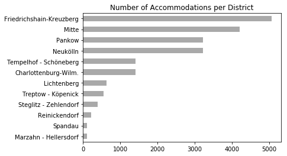
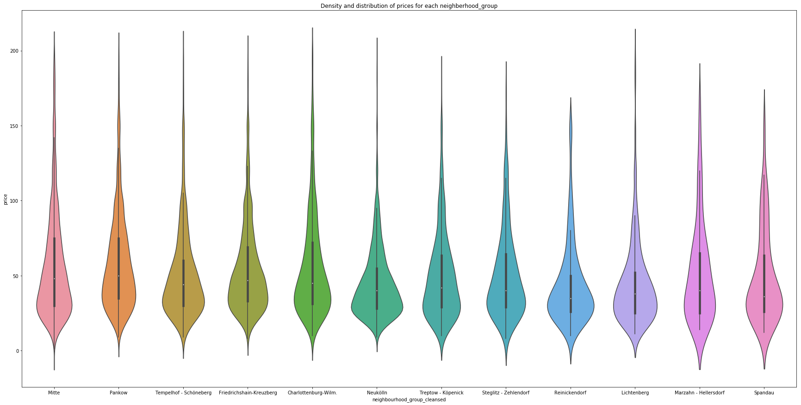
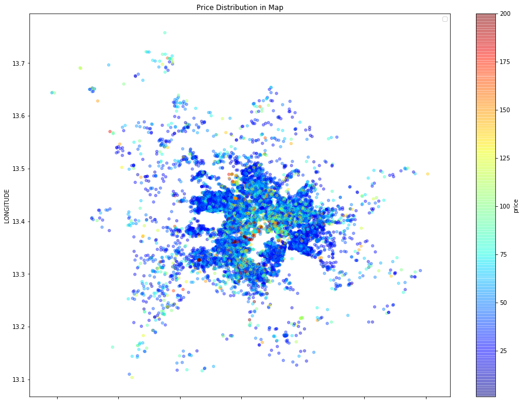
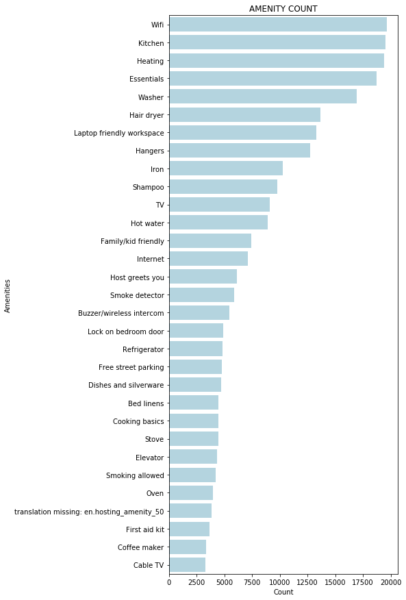
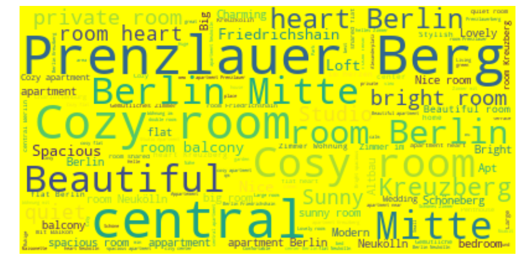
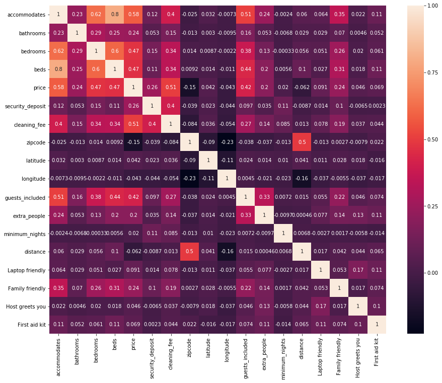
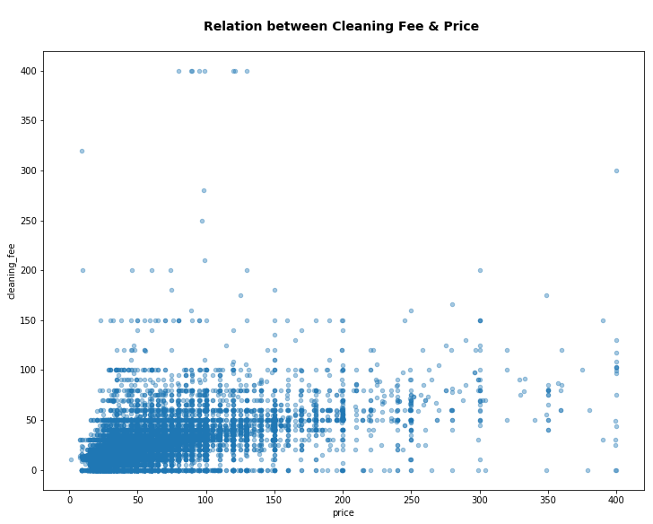
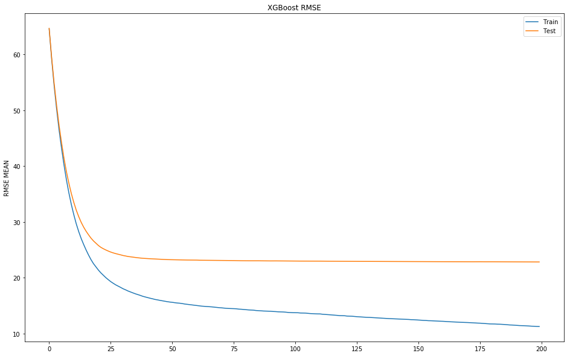
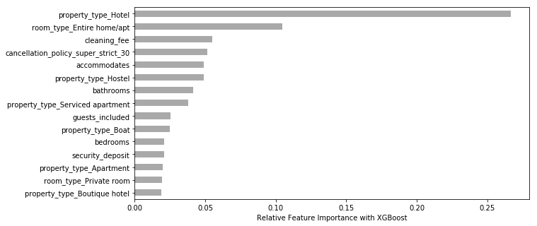

# Airbnb Berlin Dataset
Airbnb data of Germany's capital Berlin. The dataset has over 22,552 listings and was scraped in November 2018.

The question for my model is: Can we estimate a daily price for a new accommodation that fits into its specific market environment and competitors in Berlin? 


# 1. First View on the Data


```python
import numpy as np
import pandas as pd
import matplotlib.pyplot as plt
import seaborn as sns
import warnings
import plotly.offline as py
py.init_notebook_mode(connected=True)
import plotly.graph_objs as go
import plotly.tools as tls
warnings.filterwarnings('ignore')
%matplotlib inline
```


<script type="text/javascript">window.PlotlyConfig = {MathJaxConfig: 'local'};</script><script type="text/javascript">if (window.MathJax) {MathJax.Hub.Config({SVG: {font: "STIX-Web"}});}</script><script>requirejs.config({paths: { 'plotly': ['https://cdn.plot.ly/plotly-latest.min']},});if(!window._Plotly) {require(['plotly'],function(plotly) {window._Plotly=plotly;});}</script>


```python
df_raw = pd.read_csv('listings_summary.csv')
```


```python
df_raw.shape
```


    (22552, 96)


```python
df_raw.info()
```

    <class 'pandas.core.frame.DataFrame'>
    RangeIndex: 22552 entries, 0 to 22551
    Data columns (total 96 columns):
    id                                  22552 non-null int64
    listing_url                         22552 non-null object
    scrape_id                           22552 non-null int64
    last_scraped                        22552 non-null object
    name                                22493 non-null object
    summary                             21589 non-null object
    space                               14020 non-null object
    description                         22349 non-null object
    experiences_offered                 22552 non-null object
    neighborhood_overview               11540 non-null object
    notes                               7215 non-null object
    transit                             13036 non-null object
    access                              10837 non-null object
    interaction                         10406 non-null object
    house_rules                         11449 non-null object
    thumbnail_url                       0 non-null float64
    medium_url                          0 non-null float64
    picture_url                         22552 non-null object
    xl_picture_url                      0 non-null float64
    host_id                             22552 non-null int64
    host_url                            22552 non-null object
    host_name                           22526 non-null object
    host_since                          22526 non-null object
    host_location                       22436 non-null object
    host_about                          11189 non-null object
    host_response_time                  9658 non-null object
    host_response_rate                  9657 non-null object
    host_acceptance_rate                0 non-null float64
    host_is_superhost                   22526 non-null object
    host_thumbnail_url                  22526 non-null object
    host_picture_url                    22526 non-null object
    host_neighbourhood                  17458 non-null object
    host_listings_count                 22526 non-null float64
    host_total_listings_count           22526 non-null float64
    host_verifications                  22552 non-null object
    host_has_profile_pic                22526 non-null object
    host_identity_verified              22526 non-null object
    street                              22552 non-null object
    neighbourhood                       21421 non-null object
    neighbourhood_cleansed              22552 non-null object
    neighbourhood_group_cleansed        22552 non-null object
    city                                22547 non-null object
    state                               22468 non-null object
    zipcode                             21896 non-null object
    market                              22489 non-null object
    smart_location                      22552 non-null object
    country_code                        22552 non-null object
    country                             22552 non-null object
    latitude                            22552 non-null float64
    longitude                           22552 non-null float64
    is_location_exact                   22552 non-null object
    property_type                       22552 non-null object
    room_type                           22552 non-null object
    accommodates                        22552 non-null int64
    bathrooms                           22520 non-null float64
    bedrooms                            22534 non-null float64
    beds                                22512 non-null float64
    bed_type                            22552 non-null object
    amenities                           22552 non-null object
    square_feet                         446 non-null float64
    price                               22552 non-null object
    weekly_price                        3681 non-null object
    monthly_price                       2659 non-null object
    security_deposit                    13191 non-null object
    cleaning_fee                        15406 non-null object
    guests_included                     22552 non-null int64
    extra_people                        22552 non-null object
    minimum_nights                      22552 non-null int64
    maximum_nights                      22552 non-null int64
    calendar_updated                    22552 non-null object
    has_availability                    22552 non-null object
    availability_30                     22552 non-null int64
    availability_60                     22552 non-null int64
    availability_90                     22552 non-null int64
    availability_365                    22552 non-null int64
    calendar_last_scraped               22552 non-null object
    number_of_reviews                   22552 non-null int64
    first_review                        18638 non-null object
    last_review                         18644 non-null object
    review_scores_rating                18163 non-null float64
    review_scores_accuracy              18138 non-null float64
    review_scores_cleanliness           18141 non-null float64
    review_scores_checkin               18120 non-null float64
    review_scores_communication         18134 non-null float64
    review_scores_location              18121 non-null float64
    review_scores_value                 18117 non-null float64
    requires_license                    22552 non-null object
    license                             1638 non-null object
    jurisdiction_names                  0 non-null float64
    instant_bookable                    22552 non-null object
    is_business_travel_ready            22552 non-null object
    cancellation_policy                 22552 non-null object
    require_guest_profile_picture       22552 non-null object
    require_guest_phone_verification    22552 non-null object
    calculated_host_listings_count      22552 non-null int64
    reviews_per_month                   18638 non-null float64
    dtypes: float64(21), int64(13), object(62)
    memory usage: 16.5+ MB


Let's have a look of there are any duplicates:


```python
#Removal of possible duplicates:

df_raw.duplicated().sum()
df_raw.drop_duplicates(inplace=True)
```


```python
df_raw.columns
```


    Index(['id', 'listing_url', 'scrape_id', 'last_scraped', 'name', 'summary',
           'space', 'description', 'experiences_offered', 'neighborhood_overview',
           'notes', 'transit', 'access', 'interaction', 'house_rules',
           'thumbnail_url', 'medium_url', 'picture_url', 'xl_picture_url',
           'host_id', 'host_url', 'host_name', 'host_since', 'host_location',
           'host_about', 'host_response_time', 'host_response_rate',
           'host_acceptance_rate', 'host_is_superhost', 'host_thumbnail_url',
           'host_picture_url', 'host_neighbourhood', 'host_listings_count',
           'host_total_listings_count', 'host_verifications',
           'host_has_profile_pic', 'host_identity_verified', 'street',
           'neighbourhood', 'neighbourhood_cleansed',
           'neighbourhood_group_cleansed', 'city', 'state', 'zipcode', 'market',
           'smart_location', 'country_code', 'country', 'latitude', 'longitude',
           'is_location_exact', 'property_type', 'room_type', 'accommodates',
           'bathrooms', 'bedrooms', 'beds', 'bed_type', 'amenities', 'square_feet',
           'price', 'weekly_price', 'monthly_price', 'security_deposit',
           'cleaning_fee', 'guests_included', 'extra_people', 'minimum_nights',
           'maximum_nights', 'calendar_updated', 'has_availability',
           'availability_30', 'availability_60', 'availability_90',
           'availability_365', 'calendar_last_scraped', 'number_of_reviews',
           'first_review', 'last_review', 'review_scores_rating',
           'review_scores_accuracy', 'review_scores_cleanliness',
           'review_scores_checkin', 'review_scores_communication',
           'review_scores_location', 'review_scores_value', 'requires_license',
           'license', 'jurisdiction_names', 'instant_bookable',
           'is_business_travel_ready', 'cancellation_policy',
           'require_guest_profile_picture', 'require_guest_phone_verification',
           'calculated_host_listings_count', 'reviews_per_month'],
          dtype='object')


# 2. Preprocessing the data
### 2.1 Deciding which features to work with


```python
pd.set_option('display.max_columns', None)
df_raw.head(20)
```


<div>
<style scoped>
    .dataframe tbody tr th:only-of-type {
        vertical-align: middle;
    }

    .dataframe tbody tr th {
        vertical-align: top;
    }

    .dataframe thead th {
        text-align: right;
    }
</style>
<table border="1" class="dataframe">
  <thead>
    <tr style="text-align: right;">
      <th></th>
      <th>id</th>
      <th>listing_url</th>
      <th>scrape_id</th>
      <th>last_scraped</th>
      <th>name</th>
      <th>summary</th>
      <th>space</th>
      <th>description</th>
      <th>experiences_offered</th>
      <th>neighborhood_overview</th>
      <th>notes</th>
      <th>transit</th>
      <th>access</th>
      <th>interaction</th>
      <th>house_rules</th>
      <th>thumbnail_url</th>
      <th>medium_url</th>
      <th>picture_url</th>
      <th>xl_picture_url</th>
      <th>host_id</th>
      <th>host_url</th>
      <th>host_name</th>
      <th>host_since</th>
      <th>host_location</th>
      <th>host_about</th>
      <th>host_response_time</th>
      <th>host_response_rate</th>
      <th>host_acceptance_rate</th>
      <th>host_is_superhost</th>
      <th>host_thumbnail_url</th>
      <th>host_picture_url</th>
      <th>host_neighbourhood</th>
      <th>host_listings_count</th>
      <th>host_total_listings_count</th>
      <th>host_verifications</th>
      <th>host_has_profile_pic</th>
      <th>host_identity_verified</th>
      <th>street</th>
      <th>neighbourhood</th>
      <th>neighbourhood_cleansed</th>
      <th>neighbourhood_group_cleansed</th>
      <th>city</th>
      <th>state</th>
      <th>zipcode</th>
      <th>market</th>
      <th>smart_location</th>
      <th>country_code</th>
      <th>country</th>
      <th>latitude</th>
      <th>longitude</th>
      <th>is_location_exact</th>
      <th>property_type</th>
      <th>room_type</th>
      <th>accommodates</th>
      <th>bathrooms</th>
      <th>bedrooms</th>
      <th>beds</th>
      <th>bed_type</th>
      <th>amenities</th>
      <th>square_feet</th>
      <th>price</th>
      <th>weekly_price</th>
      <th>monthly_price</th>
      <th>security_deposit</th>
      <th>cleaning_fee</th>
      <th>guests_included</th>
      <th>extra_people</th>
      <th>minimum_nights</th>
      <th>maximum_nights</th>
      <th>calendar_updated</th>
      <th>has_availability</th>
      <th>availability_30</th>
      <th>availability_60</th>
      <th>availability_90</th>
      <th>availability_365</th>
      <th>calendar_last_scraped</th>
      <th>number_of_reviews</th>
      <th>first_review</th>
      <th>last_review</th>
      <th>review_scores_rating</th>
      <th>review_scores_accuracy</th>
      <th>review_scores_cleanliness</th>
      <th>review_scores_checkin</th>
      <th>review_scores_communication</th>
      <th>review_scores_location</th>
      <th>review_scores_value</th>
      <th>requires_license</th>
      <th>license</th>
      <th>jurisdiction_names</th>
      <th>instant_bookable</th>
      <th>is_business_travel_ready</th>
      <th>cancellation_policy</th>
      <th>require_guest_profile_picture</th>
      <th>require_guest_phone_verification</th>
      <th>calculated_host_listings_count</th>
      <th>reviews_per_month</th>
    </tr>
  </thead>
  <tbody>
    <tr>
      <th>0</th>
      <td>2015</td>
      <td>https://www.airbnb.com/rooms/2015</td>
      <td>20181107122246</td>
      <td>2018-11-07</td>
      <td>Berlin-Mitte Value! Quiet courtyard/very central</td>
      <td>Great location!  30 of 75 sq meters. This wood...</td>
      <td>A+++ location! This „Einliegerwohnung“ is an e...</td>
      <td>Great location!  30 of 75 sq meters. This wood...</td>
      <td>none</td>
      <td>It is located in the former East Berlin area o...</td>
      <td>This is my home, not a hotel. I rent out occas...</td>
      <td>Close to U-Bahn U8 and U2 (metro), Trams M12, ...</td>
      <td>Simple kitchen/cooking, refrigerator, microwav...</td>
      <td>Always available</td>
      <td>No parties No events No pets No smoking, not e...</td>
      <td>NaN</td>
      <td>NaN</td>
      <td>https://a0.muscache.com/im/pictures/260fd609-7...</td>
      <td>NaN</td>
      <td>2217</td>
      <td>https://www.airbnb.com/users/show/2217</td>
      <td>Ian</td>
      <td>2008-08-18</td>
      <td>Key Biscayne, Florida, United States</td>
      <td>Believe in sharing economy.</td>
      <td>within an hour</td>
      <td>96%</td>
      <td>NaN</td>
      <td>t</td>
      <td>https://a0.muscache.com/im/pictures/21428a22-4...</td>
      <td>https://a0.muscache.com/im/pictures/21428a22-4...</td>
      <td>Mitte</td>
      <td>4.0</td>
      <td>4.0</td>
      <td>['email', 'phone', 'reviews', 'jumio', 'offlin...</td>
      <td>t</td>
      <td>t</td>
      <td>Berlin, Berlin, Germany</td>
      <td>Mitte</td>
      <td>Brunnenstr. Süd</td>
      <td>Mitte</td>
      <td>Berlin</td>
      <td>Berlin</td>
      <td>10119</td>
      <td>Berlin</td>
      <td>Berlin, Germany</td>
      <td>DE</td>
      <td>Germany</td>
      <td>52.534537</td>
      <td>13.402557</td>
      <td>f</td>
      <td>Guesthouse</td>
      <td>Entire home/apt</td>
      <td>3</td>
      <td>1.0</td>
      <td>1.0</td>
      <td>2.0</td>
      <td>Real Bed</td>
      <td>{TV,"Cable TV",Wifi,Kitchen,Gym,Heating,"Famil...</td>
      <td>NaN</td>
      <td>$60.00</td>
      <td>NaN</td>
      <td>NaN</td>
      <td>$200.00</td>
      <td>$30.00</td>
      <td>1</td>
      <td>$28.00</td>
      <td>4</td>
      <td>1125</td>
      <td>3 months ago</td>
      <td>t</td>
      <td>0</td>
      <td>21</td>
      <td>51</td>
      <td>141</td>
      <td>2018-11-07</td>
      <td>118</td>
      <td>2016-04-11</td>
      <td>2018-10-28</td>
      <td>93.0</td>
      <td>10.0</td>
      <td>9.0</td>
      <td>10.0</td>
      <td>10.0</td>
      <td>10.0</td>
      <td>9.0</td>
      <td>t</td>
      <td>NaN</td>
      <td>NaN</td>
      <td>f</td>
      <td>f</td>
      <td>strict_14_with_grace_period</td>
      <td>f</td>
      <td>f</td>
      <td>4</td>
      <td>3.76</td>
    </tr>
    <tr>
      <th>1</th>
      <td>2695</td>
      <td>https://www.airbnb.com/rooms/2695</td>
      <td>20181107122246</td>
      <td>2018-11-07</td>
      <td>Prenzlauer Berg close to Mauerpark</td>
      <td>NaN</td>
      <td>In the summertime we are spending most of our ...</td>
      <td>In the summertime we are spending most of our ...</td>
      <td>none</td>
      <td>NaN</td>
      <td>NaN</td>
      <td>Within walking distance you'll find the S-Bahn...</td>
      <td>Außer deinem Zimmer kannst du noch die Küche u...</td>
      <td>NaN</td>
      <td>NaN</td>
      <td>NaN</td>
      <td>NaN</td>
      <td>https://a0.muscache.com/im/pictures/97d4f6e8-1...</td>
      <td>NaN</td>
      <td>2986</td>
      <td>https://www.airbnb.com/users/show/2986</td>
      <td>Michael</td>
      <td>2008-09-16</td>
      <td>Berlin, Berlin, Germany</td>
      <td>Living with my wife in Berlin.  Like travellin...</td>
      <td>NaN</td>
      <td>NaN</td>
      <td>NaN</td>
      <td>f</td>
      <td>https://a0.muscache.com/im/pictures/50434955-1...</td>
      <td>https://a0.muscache.com/im/pictures/50434955-1...</td>
      <td>Prenzlauer Berg</td>
      <td>1.0</td>
      <td>1.0</td>
      <td>['email', 'phone', 'reviews', 'jumio', 'govern...</td>
      <td>t</td>
      <td>t</td>
      <td>Berlin, Berlin, Germany</td>
      <td>NaN</td>
      <td>Prenzlauer Berg Nordwest</td>
      <td>Pankow</td>
      <td>Berlin</td>
      <td>Berlin</td>
      <td>10437</td>
      <td>Berlin</td>
      <td>Berlin, Germany</td>
      <td>DE</td>
      <td>Germany</td>
      <td>52.548513</td>
      <td>13.404553</td>
      <td>t</td>
      <td>Apartment</td>
      <td>Private room</td>
      <td>2</td>
      <td>1.0</td>
      <td>1.0</td>
      <td>1.0</td>
      <td>Real Bed</td>
      <td>{Wifi,Kitchen,Elevator,Heating,Washer,Essentia...</td>
      <td>NaN</td>
      <td>$17.00</td>
      <td>NaN</td>
      <td>NaN</td>
      <td>$0.00</td>
      <td>$0.00</td>
      <td>1</td>
      <td>$0.00</td>
      <td>2</td>
      <td>40</td>
      <td>7 weeks ago</td>
      <td>t</td>
      <td>0</td>
      <td>0</td>
      <td>0</td>
      <td>0</td>
      <td>2018-11-07</td>
      <td>6</td>
      <td>2018-07-04</td>
      <td>2018-10-01</td>
      <td>100.0</td>
      <td>10.0</td>
      <td>10.0</td>
      <td>10.0</td>
      <td>10.0</td>
      <td>10.0</td>
      <td>10.0</td>
      <td>t</td>
      <td>NaN</td>
      <td>NaN</td>
      <td>f</td>
      <td>f</td>
      <td>flexible</td>
      <td>f</td>
      <td>f</td>
      <td>1</td>
      <td>1.42</td>
    </tr>
    <tr>
      <th>2</th>
      <td>3176</td>
      <td>https://www.airbnb.com/rooms/3176</td>
      <td>20181107122246</td>
      <td>2018-11-07</td>
      <td>Fabulous Flat in great Location</td>
      <td>This beautiful first floor apartment  is situa...</td>
      <td>1st floor (68m2) apartment on Kollwitzplatz/ P...</td>
      <td>This beautiful first floor apartment  is situa...</td>
      <td>none</td>
      <td>The neighbourhood is famous for its variety of...</td>
      <td>We welcome FAMILIES and cater especially for y...</td>
      <td>We are 5 min walk  away from the tram M2, whic...</td>
      <td>The apartment will be entirely yours. We are c...</td>
      <td>Feel free to ask any questions prior to bookin...</td>
      <td>It’s a non smoking flat, which likes to be tre...</td>
      <td>NaN</td>
      <td>NaN</td>
      <td>https://a0.muscache.com/im/pictures/243355/84a...</td>
      <td>NaN</td>
      <td>3718</td>
      <td>https://www.airbnb.com/users/show/3718</td>
      <td>Britta</td>
      <td>2008-10-19</td>
      <td>Coledale, New South Wales, Australia</td>
      <td>We love to travel ourselves a lot and prefer t...</td>
      <td>within a day</td>
      <td>100%</td>
      <td>NaN</td>
      <td>f</td>
      <td>https://a0.muscache.com/im/users/3718/profile_...</td>
      <td>https://a0.muscache.com/im/users/3718/profile_...</td>
      <td>Prenzlauer Berg</td>
      <td>1.0</td>
      <td>1.0</td>
      <td>['email', 'phone', 'facebook', 'reviews', 'man...</td>
      <td>t</td>
      <td>t</td>
      <td>Berlin, Berlin, Germany</td>
      <td>Prenzlauer Berg</td>
      <td>Prenzlauer Berg Südwest</td>
      <td>Pankow</td>
      <td>Berlin</td>
      <td>Berlin</td>
      <td>10405</td>
      <td>Berlin</td>
      <td>Berlin, Germany</td>
      <td>DE</td>
      <td>Germany</td>
      <td>52.534996</td>
      <td>13.417579</td>
      <td>t</td>
      <td>Apartment</td>
      <td>Entire home/apt</td>
      <td>4</td>
      <td>1.0</td>
      <td>1.0</td>
      <td>2.0</td>
      <td>Real Bed</td>
      <td>{Internet,Wifi,Kitchen,"Buzzer/wireless interc...</td>
      <td>720.0</td>
      <td>$90.00</td>
      <td>$520.00</td>
      <td>$1,900.00</td>
      <td>$200.00</td>
      <td>$50.00</td>
      <td>2</td>
      <td>$20.00</td>
      <td>62</td>
      <td>1125</td>
      <td>a week ago</td>
      <td>t</td>
      <td>0</td>
      <td>0</td>
      <td>0</td>
      <td>220</td>
      <td>2018-11-07</td>
      <td>143</td>
      <td>2009-06-20</td>
      <td>2017-03-20</td>
      <td>92.0</td>
      <td>9.0</td>
      <td>9.0</td>
      <td>9.0</td>
      <td>9.0</td>
      <td>10.0</td>
      <td>9.0</td>
      <td>t</td>
      <td>NaN</td>
      <td>NaN</td>
      <td>t</td>
      <td>f</td>
      <td>strict_14_with_grace_period</td>
      <td>f</td>
      <td>f</td>
      <td>1</td>
      <td>1.25</td>
    </tr>
    <tr>
      <th>3</th>
      <td>3309</td>
      <td>https://www.airbnb.com/rooms/3309</td>
      <td>20181107122246</td>
      <td>2018-11-07</td>
      <td>BerlinSpot Schöneberg near KaDeWe</td>
      <td>First of all: I prefer short-notice bookings. ...</td>
      <td>Your room is really big and has 26 sqm, is ver...</td>
      <td>First of all: I prefer short-notice bookings. ...</td>
      <td>none</td>
      <td>My flat is in the middle of West-Berlin, direc...</td>
      <td>The flat is a strictly non-smoking facility! A...</td>
      <td>The public transportation is excellent: Severa...</td>
      <td>I do have a strictly non-smoker-flat.  Keep th...</td>
      <td>I'm working as a freelancing photographer. My ...</td>
      <td>House-Rules and Information ..............(deu...</td>
      <td>NaN</td>
      <td>NaN</td>
      <td>https://a0.muscache.com/im/pictures/29054294/b...</td>
      <td>NaN</td>
      <td>4108</td>
      <td>https://www.airbnb.com/users/show/4108</td>
      <td>Jana</td>
      <td>2008-11-07</td>
      <td>Berlin, Berlin, Germany</td>
      <td>ENJOY EVERY DAY AS IF IT'S YOUR LAST!!! \r\n\r...</td>
      <td>NaN</td>
      <td>NaN</td>
      <td>NaN</td>
      <td>f</td>
      <td>https://a0.muscache.com/im/pictures/user/b5938...</td>
      <td>https://a0.muscache.com/im/pictures/user/b5938...</td>
      <td>Schöneberg</td>
      <td>1.0</td>
      <td>1.0</td>
      <td>['email', 'phone', 'reviews', 'jumio', 'govern...</td>
      <td>t</td>
      <td>t</td>
      <td>Berlin, Berlin, Germany</td>
      <td>Schöneberg</td>
      <td>Schöneberg-Nord</td>
      <td>Tempelhof - Schöneberg</td>
      <td>Berlin</td>
      <td>Berlin</td>
      <td>10777</td>
      <td>Berlin</td>
      <td>Berlin, Germany</td>
      <td>DE</td>
      <td>Germany</td>
      <td>52.498855</td>
      <td>13.349065</td>
      <td>t</td>
      <td>Apartment</td>
      <td>Private room</td>
      <td>2</td>
      <td>1.0</td>
      <td>1.0</td>
      <td>1.0</td>
      <td>Pull-out Sofa</td>
      <td>{Internet,Wifi,"Pets allowed","Pets live on th...</td>
      <td>0.0</td>
      <td>$26.00</td>
      <td>$175.00</td>
      <td>$599.00</td>
      <td>$250.00</td>
      <td>$30.00</td>
      <td>1</td>
      <td>$18.00</td>
      <td>5</td>
      <td>360</td>
      <td>4 weeks ago</td>
      <td>t</td>
      <td>0</td>
      <td>0</td>
      <td>22</td>
      <td>297</td>
      <td>2018-11-07</td>
      <td>25</td>
      <td>2013-08-12</td>
      <td>2018-08-16</td>
      <td>88.0</td>
      <td>9.0</td>
      <td>9.0</td>
      <td>9.0</td>
      <td>10.0</td>
      <td>9.0</td>
      <td>9.0</td>
      <td>t</td>
      <td>NaN</td>
      <td>NaN</td>
      <td>f</td>
      <td>f</td>
      <td>strict_14_with_grace_period</td>
      <td>f</td>
      <td>f</td>
      <td>1</td>
      <td>0.39</td>
    </tr>
    <tr>
      <th>4</th>
      <td>7071</td>
      <td>https://www.airbnb.com/rooms/7071</td>
      <td>20181107122246</td>
      <td>2018-11-07</td>
      <td>BrightRoom with sunny greenview!</td>
      <td>Cozy and large room in the beautiful district ...</td>
      <td>The BrightRoom is an approx. 20 sqm (215ft²), ...</td>
      <td>Cozy and large room in the beautiful district ...</td>
      <td>none</td>
      <td>Great neighborhood with plenty of Cafés, Baker...</td>
      <td>I hope you enjoy your stay to the fullest! Ple...</td>
      <td>Best access to other parts of the city via pub...</td>
      <td>The guests have access to the bathroom, a smal...</td>
      <td>I am glad if I can give you advice or help as ...</td>
      <td>Please take good care of everything during you...</td>
      <td>NaN</td>
      <td>NaN</td>
      <td>https://a0.muscache.com/im/pictures/21278/32a1...</td>
      <td>NaN</td>
      <td>17391</td>
      <td>https://www.airbnb.com/users/show/17391</td>
      <td>Bright</td>
      <td>2009-05-16</td>
      <td>Berlin, Berlin, Germany</td>
      <td>I'm a creative person, adventurer, and travele...</td>
      <td>within an hour</td>
      <td>100%</td>
      <td>NaN</td>
      <td>t</td>
      <td>https://a0.muscache.com/im/pictures/user/48c3d...</td>
      <td>https://a0.muscache.com/im/pictures/user/48c3d...</td>
      <td>Prenzlauer Berg</td>
      <td>1.0</td>
      <td>1.0</td>
      <td>['email', 'phone', 'reviews', 'jumio', 'govern...</td>
      <td>t</td>
      <td>t</td>
      <td>Berlin, Berlin, Germany</td>
      <td>Prenzlauer Berg</td>
      <td>Helmholtzplatz</td>
      <td>Pankow</td>
      <td>Berlin</td>
      <td>Berlin</td>
      <td>10437</td>
      <td>Berlin</td>
      <td>Berlin, Germany</td>
      <td>DE</td>
      <td>Germany</td>
      <td>52.543157</td>
      <td>13.415091</td>
      <td>t</td>
      <td>Apartment</td>
      <td>Private room</td>
      <td>2</td>
      <td>1.0</td>
      <td>1.0</td>
      <td>2.0</td>
      <td>Real Bed</td>
      <td>{Wifi,Heating,"Family/kid friendly",Essentials...</td>
      <td>NaN</td>
      <td>$42.00</td>
      <td>NaN</td>
      <td>NaN</td>
      <td>$0.00</td>
      <td>$0.00</td>
      <td>1</td>
      <td>$24.00</td>
      <td>2</td>
      <td>10</td>
      <td>3 days ago</td>
      <td>t</td>
      <td>15</td>
      <td>26</td>
      <td>26</td>
      <td>26</td>
      <td>2018-11-07</td>
      <td>197</td>
      <td>2009-08-18</td>
      <td>2018-11-04</td>
      <td>96.0</td>
      <td>10.0</td>
      <td>10.0</td>
      <td>10.0</td>
      <td>10.0</td>
      <td>10.0</td>
      <td>9.0</td>
      <td>t</td>
      <td>NaN</td>
      <td>NaN</td>
      <td>f</td>
      <td>f</td>
      <td>moderate</td>
      <td>f</td>
      <td>f</td>
      <td>1</td>
      <td>1.75</td>
    </tr>
    <tr>
      <th>5</th>
      <td>9991</td>
      <td>https://www.airbnb.com/rooms/9991</td>
      <td>20181107122246</td>
      <td>2018-11-07</td>
      <td>Geourgeous flat - outstanding views</td>
      <td>4 bedroom with very large windows and outstand...</td>
      <td>THE APPARTMENT - 4 bedroom (US, Germany: 5 roo...</td>
      <td>4 bedroom with very large windows and outstand...</td>
      <td>none</td>
      <td>Prenzlauer Berg is an amazing neighbourhood wh...</td>
      <td>NaN</td>
      <td>Excellent location regarding public transport ...</td>
      <td>All amenities shared - nothing off limits</td>
      <td>Guests will have the whole apartment to themse...</td>
      <td>NaN</td>
      <td>NaN</td>
      <td>NaN</td>
      <td>https://a0.muscache.com/im/pictures/42799131/5...</td>
      <td>NaN</td>
      <td>33852</td>
      <td>https://www.airbnb.com/users/show/33852</td>
      <td>Philipp</td>
      <td>2009-08-25</td>
      <td>Berlin, Berlin, Germany</td>
      <td>Born in Munich - lives in and loves Berlin. Wo...</td>
      <td>within a few hours</td>
      <td>100%</td>
      <td>NaN</td>
      <td>f</td>
      <td>https://a0.muscache.com/im/users/33852/profile...</td>
      <td>https://a0.muscache.com/im/users/33852/profile...</td>
      <td>Prenzlauer Berg</td>
      <td>1.0</td>
      <td>1.0</td>
      <td>['email', 'phone', 'facebook', 'reviews', 'jum...</td>
      <td>t</td>
      <td>t</td>
      <td>Berlin, Berlin, Germany</td>
      <td>Prenzlauer Berg</td>
      <td>Prenzlauer Berg Südwest</td>
      <td>Pankow</td>
      <td>Berlin</td>
      <td>Berlin</td>
      <td>10405</td>
      <td>Berlin</td>
      <td>Berlin, Germany</td>
      <td>DE</td>
      <td>Germany</td>
      <td>52.533031</td>
      <td>13.416047</td>
      <td>f</td>
      <td>Apartment</td>
      <td>Entire home/apt</td>
      <td>7</td>
      <td>2.5</td>
      <td>4.0</td>
      <td>7.0</td>
      <td>Real Bed</td>
      <td>{TV,"Cable TV",Internet,Wifi,Kitchen,"Paid par...</td>
      <td>NaN</td>
      <td>$180.00</td>
      <td>$650.00</td>
      <td>NaN</td>
      <td>$400.00</td>
      <td>$80.00</td>
      <td>5</td>
      <td>$10.00</td>
      <td>6</td>
      <td>14</td>
      <td>2 weeks ago</td>
      <td>t</td>
      <td>0</td>
      <td>7</td>
      <td>7</td>
      <td>137</td>
      <td>2018-11-07</td>
      <td>6</td>
      <td>2015-08-09</td>
      <td>2018-07-23</td>
      <td>100.0</td>
      <td>10.0</td>
      <td>10.0</td>
      <td>10.0</td>
      <td>10.0</td>
      <td>10.0</td>
      <td>10.0</td>
      <td>t</td>
      <td>03/Z/RA/003410-18</td>
      <td>NaN</td>
      <td>f</td>
      <td>f</td>
      <td>strict_14_with_grace_period</td>
      <td>f</td>
      <td>f</td>
      <td>1</td>
      <td>0.15</td>
    </tr>
    <tr>
      <th>6</th>
      <td>14325</td>
      <td>https://www.airbnb.com/rooms/14325</td>
      <td>20181107122246</td>
      <td>2018-11-07</td>
      <td>Apartment in Prenzlauer Berg</td>
      <td>The apartment is located on the upper second f...</td>
      <td>The apartment is located on the south-facing s...</td>
      <td>The apartment is located on the upper second f...</td>
      <td>none</td>
      <td>NaN</td>
      <td>NaN</td>
      <td>NaN</td>
      <td>NaN</td>
      <td>NaN</td>
      <td>No smoking, loud music or hosting parties at t...</td>
      <td>NaN</td>
      <td>NaN</td>
      <td>https://a0.muscache.com/im/pictures/508703/249...</td>
      <td>NaN</td>
      <td>55531</td>
      <td>https://www.airbnb.com/users/show/55531</td>
      <td>Chris + Oliver</td>
      <td>2009-11-18</td>
      <td>Berlin, Berlin, Germany</td>
      <td>From Berlin, Germany. Working at ‘Welcome Beyo...</td>
      <td>within a day</td>
      <td>100%</td>
      <td>NaN</td>
      <td>f</td>
      <td>https://a0.muscache.com/im/users/55531/profile...</td>
      <td>https://a0.muscache.com/im/users/55531/profile...</td>
      <td>Prenzlauer Berg</td>
      <td>3.0</td>
      <td>3.0</td>
      <td>['email', 'phone', 'reviews', 'jumio', 'offlin...</td>
      <td>t</td>
      <td>f</td>
      <td>Berlin, Berlin, Germany</td>
      <td>Prenzlauer Berg</td>
      <td>Prenzlauer Berg Nordwest</td>
      <td>Pankow</td>
      <td>Berlin</td>
      <td>Berlin</td>
      <td>10437</td>
      <td>Berlin</td>
      <td>Berlin, Germany</td>
      <td>DE</td>
      <td>Germany</td>
      <td>52.547846</td>
      <td>13.405562</td>
      <td>t</td>
      <td>Apartment</td>
      <td>Entire home/apt</td>
      <td>2</td>
      <td>1.0</td>
      <td>0.0</td>
      <td>1.0</td>
      <td>Real Bed</td>
      <td>{TV,Internet,Wifi,Kitchen,"Buzzer/wireless int...</td>
      <td>NaN</td>
      <td>$70.00</td>
      <td>$420.00</td>
      <td>$820.00</td>
      <td>$500.00</td>
      <td>$0.00</td>
      <td>1</td>
      <td>$0.00</td>
      <td>90</td>
      <td>1125</td>
      <td>today</td>
      <td>t</td>
      <td>0</td>
      <td>0</td>
      <td>0</td>
      <td>129</td>
      <td>2018-11-07</td>
      <td>23</td>
      <td>2010-06-29</td>
      <td>2018-11-01</td>
      <td>93.0</td>
      <td>10.0</td>
      <td>10.0</td>
      <td>9.0</td>
      <td>10.0</td>
      <td>9.0</td>
      <td>9.0</td>
      <td>t</td>
      <td>NaN</td>
      <td>NaN</td>
      <td>f</td>
      <td>f</td>
      <td>strict_14_with_grace_period</td>
      <td>f</td>
      <td>f</td>
      <td>3</td>
      <td>0.23</td>
    </tr>
    <tr>
      <th>7</th>
      <td>16401</td>
      <td>https://www.airbnb.com/rooms/16401</td>
      <td>20181107122246</td>
      <td>2018-11-07</td>
      <td>APARTMENT TO RENT</td>
      <td>NaN</td>
      <td>Hello future guests! We want to rent our cute ...</td>
      <td>Hello future guests! We want to rent our cute ...</td>
      <td>none</td>
      <td>NaN</td>
      <td>NaN</td>
      <td>NaN</td>
      <td>NaN</td>
      <td>NaN</td>
      <td>NaN</td>
      <td>NaN</td>
      <td>NaN</td>
      <td>https://a0.muscache.com/im/pictures/4753854/99...</td>
      <td>NaN</td>
      <td>59666</td>
      <td>https://www.airbnb.com/users/show/59666</td>
      <td>Melanie</td>
      <td>2009-12-03</td>
      <td>Berlin, Berlin, Germany</td>
      <td>I'm uncomplicated, funny, curious and I love t...</td>
      <td>NaN</td>
      <td>NaN</td>
      <td>NaN</td>
      <td>f</td>
      <td>https://a0.muscache.com/im/pictures/65266732-d...</td>
      <td>https://a0.muscache.com/im/pictures/65266732-d...</td>
      <td>Friedrichshain</td>
      <td>1.0</td>
      <td>1.0</td>
      <td>['email', 'phone', 'facebook', 'jumio', 'offli...</td>
      <td>t</td>
      <td>t</td>
      <td>Berlin, Berlin, Germany</td>
      <td>Friedrichshain</td>
      <td>Frankfurter Allee Süd FK</td>
      <td>Friedrichshain-Kreuzberg</td>
      <td>Berlin</td>
      <td>Berlin</td>
      <td>10245</td>
      <td>Berlin</td>
      <td>Berlin, Germany</td>
      <td>DE</td>
      <td>Germany</td>
      <td>52.510514</td>
      <td>13.457850</td>
      <td>t</td>
      <td>Apartment</td>
      <td>Private room</td>
      <td>2</td>
      <td>1.0</td>
      <td>1.0</td>
      <td>2.0</td>
      <td>Real Bed</td>
      <td>{TV,"Cable TV",Internet,Wifi,Kitchen,"Smoking ...</td>
      <td>NaN</td>
      <td>$120.00</td>
      <td>NaN</td>
      <td>NaN</td>
      <td>NaN</td>
      <td>NaN</td>
      <td>1</td>
      <td>$13.00</td>
      <td>30</td>
      <td>52</td>
      <td>never</td>
      <td>t</td>
      <td>30</td>
      <td>60</td>
      <td>90</td>
      <td>365</td>
      <td>2018-11-07</td>
      <td>0</td>
      <td>NaN</td>
      <td>NaN</td>
      <td>NaN</td>
      <td>NaN</td>
      <td>NaN</td>
      <td>NaN</td>
      <td>NaN</td>
      <td>NaN</td>
      <td>NaN</td>
      <td>t</td>
      <td>NaN</td>
      <td>NaN</td>
      <td>f</td>
      <td>f</td>
      <td>strict_14_with_grace_period</td>
      <td>f</td>
      <td>f</td>
      <td>1</td>
      <td>NaN</td>
    </tr>
    <tr>
      <th>8</th>
      <td>16644</td>
      <td>https://www.airbnb.com/rooms/16644</td>
      <td>20181107122246</td>
      <td>2018-11-07</td>
      <td>In the Heart of Berlin - Kreuzberg</td>
      <td>Light and sunny 2-Room-turn of the century-fla...</td>
      <td>Rent in the heart of Berlin - Kreuzberg Newly ...</td>
      <td>Light and sunny 2-Room-turn of the century-fla...</td>
      <td>none</td>
      <td>Our Part of Kreuzberg is just the best. Good v...</td>
      <td>NaN</td>
      <td>Ostbahnhof is close so you can get here by tra...</td>
      <td>The guests use the whole apartment alone. Part...</td>
      <td>The guest determines how much interaction they...</td>
      <td>1. No noise after 10 pm PLEASE. 2. Please do n...</td>
      <td>NaN</td>
      <td>NaN</td>
      <td>https://a0.muscache.com/im/pictures/73759174/e...</td>
      <td>NaN</td>
      <td>64696</td>
      <td>https://www.airbnb.com/users/show/64696</td>
      <td>Rene</td>
      <td>2009-12-20</td>
      <td>Santa Cruz, California, United States</td>
      <td>Friendly and social. Likes to travel and enjoy...</td>
      <td>within a few hours</td>
      <td>100%</td>
      <td>NaN</td>
      <td>f</td>
      <td>https://a0.muscache.com/im/users/64696/profile...</td>
      <td>https://a0.muscache.com/im/users/64696/profile...</td>
      <td>Kreuzberg</td>
      <td>4.0</td>
      <td>4.0</td>
      <td>['email', 'phone', 'facebook', 'reviews', 'kba']</td>
      <td>t</td>
      <td>f</td>
      <td>Berlin, Berlin, Germany</td>
      <td>Kreuzberg</td>
      <td>nördliche Luisenstadt</td>
      <td>Friedrichshain-Kreuzberg</td>
      <td>Berlin</td>
      <td>Berlin</td>
      <td>10997</td>
      <td>Berlin</td>
      <td>Berlin, Germany</td>
      <td>DE</td>
      <td>Germany</td>
      <td>52.504792</td>
      <td>13.435102</td>
      <td>t</td>
      <td>Apartment</td>
      <td>Entire home/apt</td>
      <td>5</td>
      <td>1.0</td>
      <td>1.0</td>
      <td>3.0</td>
      <td>Real Bed</td>
      <td>{TV,Wifi,Kitchen,"Buzzer/wireless intercom",He...</td>
      <td>0.0</td>
      <td>$90.00</td>
      <td>$520.00</td>
      <td>$1,440.00</td>
      <td>$500.00</td>
      <td>$50.00</td>
      <td>2</td>
      <td>$20.00</td>
      <td>60</td>
      <td>365</td>
      <td>2 months ago</td>
      <td>t</td>
      <td>0</td>
      <td>0</td>
      <td>0</td>
      <td>159</td>
      <td>2018-11-07</td>
      <td>48</td>
      <td>2010-06-04</td>
      <td>2017-12-14</td>
      <td>94.0</td>
      <td>10.0</td>
      <td>10.0</td>
      <td>10.0</td>
      <td>10.0</td>
      <td>9.0</td>
      <td>9.0</td>
      <td>t</td>
      <td>NaN</td>
      <td>NaN</td>
      <td>f</td>
      <td>f</td>
      <td>strict_14_with_grace_period</td>
      <td>f</td>
      <td>t</td>
      <td>2</td>
      <td>0.47</td>
    </tr>
    <tr>
      <th>9</th>
      <td>17409</td>
      <td>https://www.airbnb.com/rooms/17409</td>
      <td>20181107122246</td>
      <td>2018-11-07</td>
      <td>Downtown Above The Roofs In Berlin</td>
      <td>The 25 sqm room is located in the heart of Ber...</td>
      <td>A 25 sqm room in the heart of Berlin. Many pla...</td>
      <td>The 25 sqm room is located in the heart of Ber...</td>
      <td>none</td>
      <td>You are in the heart of the former East-Berlin...</td>
      <td>NaN</td>
      <td>The subway is just a two minutes walk away, th...</td>
      <td>The roof terrace and the kitchen can be used b...</td>
      <td>I have seen some parts of the world and not on...</td>
      <td>No smoking in the room, but possible outside o...</td>
      <td>NaN</td>
      <td>NaN</td>
      <td>https://a0.muscache.com/im/pictures/9964850/c5...</td>
      <td>NaN</td>
      <td>67590</td>
      <td>https://www.airbnb.com/users/show/67590</td>
      <td>Wolfram</td>
      <td>2010-01-04</td>
      <td>Berlin, Berlin, Germany</td>
      <td>A Political journalist and well acquainted wit...</td>
      <td>within an hour</td>
      <td>100%</td>
      <td>NaN</td>
      <td>t</td>
      <td>https://a0.muscache.com/im/pictures/user/a3d84...</td>
      <td>https://a0.muscache.com/im/pictures/user/a3d84...</td>
      <td>Prenzlauer Berg</td>
      <td>1.0</td>
      <td>1.0</td>
      <td>['email', 'phone', 'facebook', 'reviews', 'kba']</td>
      <td>t</td>
      <td>t</td>
      <td>Berlin, Berlin, Germany</td>
      <td>Prenzlauer Berg</td>
      <td>Prenzlauer Berg Südwest</td>
      <td>Pankow</td>
      <td>Berlin</td>
      <td>Berlin</td>
      <td>10405</td>
      <td>Berlin</td>
      <td>Berlin, Germany</td>
      <td>DE</td>
      <td>Germany</td>
      <td>52.529071</td>
      <td>13.412843</td>
      <td>t</td>
      <td>Condominium</td>
      <td>Private room</td>
      <td>2</td>
      <td>1.0</td>
      <td>1.0</td>
      <td>1.0</td>
      <td>Real Bed</td>
      <td>{TV,Internet,Wifi,Kitchen,"Paid parking off pr...</td>
      <td>NaN</td>
      <td>$45.00</td>
      <td>$281.00</td>
      <td>$955.00</td>
      <td>$0.00</td>
      <td>$18.00</td>
      <td>1</td>
      <td>$26.00</td>
      <td>3</td>
      <td>30</td>
      <td>a week ago</td>
      <td>t</td>
      <td>8</td>
      <td>18</td>
      <td>42</td>
      <td>42</td>
      <td>2018-11-07</td>
      <td>279</td>
      <td>2010-10-07</td>
      <td>2018-10-31</td>
      <td>96.0</td>
      <td>10.0</td>
      <td>10.0</td>
      <td>10.0</td>
      <td>10.0</td>
      <td>10.0</td>
      <td>10.0</td>
      <td>t</td>
      <td>NaN</td>
      <td>NaN</td>
      <td>f</td>
      <td>f</td>
      <td>strict_14_with_grace_period</td>
      <td>f</td>
      <td>f</td>
      <td>1</td>
      <td>2.83</td>
    </tr>
    <tr>
      <th>10</th>
      <td>17904</td>
      <td>https://www.airbnb.com/rooms/17904</td>
      <td>20181107122246</td>
      <td>2018-11-07</td>
      <td>Beautiful Kreuzberg studio/WiFi (reg. pend.)</td>
      <td>NaN</td>
      <td>- beautiful studio apt in downtown Berlin - br...</td>
      <td>- beautiful studio apt in downtown Berlin - br...</td>
      <td>none</td>
      <td>Die Wohnung liegt in Kreuzberg, das für seine ...</td>
      <td>NaN</td>
      <td>Die Wohnung liegt mitten in Berlin und hat ein...</td>
      <td>- Wohnung ist voll eingerichtet, ihr braucht n...</td>
      <td>Die Schlüssel sind bei Friedrich Vieth, dem Ha...</td>
      <td>You would be expected to leave the apartment i...</td>
      <td>NaN</td>
      <td>NaN</td>
      <td>https://a0.muscache.com/im/pictures/d9a6f8be-5...</td>
      <td>NaN</td>
      <td>68997</td>
      <td>https://www.airbnb.com/users/show/68997</td>
      <td>Matthias</td>
      <td>2010-01-08</td>
      <td>Rio de Janeiro, Rio de Janeiro, Brazil</td>
      <td>I used to work as a journalist all around the ...</td>
      <td>NaN</td>
      <td>NaN</td>
      <td>NaN</td>
      <td>f</td>
      <td>https://a0.muscache.com/im/pictures/67b13cea-8...</td>
      <td>https://a0.muscache.com/im/pictures/67b13cea-8...</td>
      <td>Copacabana</td>
      <td>2.0</td>
      <td>2.0</td>
      <td>['email', 'phone', 'reviews', 'jumio', 'offlin...</td>
      <td>t</td>
      <td>f</td>
      <td>Berlin, Germany</td>
      <td>Neukölln</td>
      <td>Reuterstraße</td>
      <td>Neukölln</td>
      <td>Berlin</td>
      <td>NaN</td>
      <td>12047</td>
      <td>Berlin</td>
      <td>Berlin, Germany</td>
      <td>DE</td>
      <td>Germany</td>
      <td>52.495476</td>
      <td>13.421821</td>
      <td>f</td>
      <td>Apartment</td>
      <td>Entire home/apt</td>
      <td>2</td>
      <td>1.0</td>
      <td>NaN</td>
      <td>1.0</td>
      <td>Real Bed</td>
      <td>{TV,Wifi,Kitchen,"Free street parking","Buzzer...</td>
      <td>NaN</td>
      <td>$49.00</td>
      <td>$290.00</td>
      <td>$990.00</td>
      <td>$0.00</td>
      <td>$50.00</td>
      <td>1</td>
      <td>$15.00</td>
      <td>5</td>
      <td>90</td>
      <td>5 days ago</td>
      <td>t</td>
      <td>9</td>
      <td>13</td>
      <td>29</td>
      <td>232</td>
      <td>2018-11-07</td>
      <td>223</td>
      <td>2010-02-18</td>
      <td>2018-10-30</td>
      <td>96.0</td>
      <td>10.0</td>
      <td>9.0</td>
      <td>10.0</td>
      <td>10.0</td>
      <td>10.0</td>
      <td>9.0</td>
      <td>t</td>
      <td>NaN</td>
      <td>NaN</td>
      <td>f</td>
      <td>f</td>
      <td>strict_14_with_grace_period</td>
      <td>f</td>
      <td>f</td>
      <td>1</td>
      <td>2.10</td>
    </tr>
    <tr>
      <th>11</th>
      <td>20858</td>
      <td>https://www.airbnb.com/rooms/20858</td>
      <td>20181107122246</td>
      <td>2018-11-07</td>
      <td>Designer Loft in Berlin Mitte</td>
      <td>Bright and sunny condo with two balconies in a...</td>
      <td>A 100 qm fancy and bright designer loft condo,...</td>
      <td>Bright and sunny condo with two balconies in a...</td>
      <td>none</td>
      <td>Fantastic vibe in the middle of the popular Ka...</td>
      <td>Please note: "The City Tax amounts to five per...</td>
      <td>Public transportation like the Tram M1 is just...</td>
      <td>The whole condo plus two balconies are yours.</td>
      <td>Please contact my property manager Mr. Joerg P...</td>
      <td>Arrival has to be completed until 9:00 pm late...</td>
      <td>NaN</td>
      <td>NaN</td>
      <td>https://a0.muscache.com/im/pictures/108232/205...</td>
      <td>NaN</td>
      <td>71331</td>
      <td>https://www.airbnb.com/users/show/71331</td>
      <td>Marc</td>
      <td>2010-01-18</td>
      <td>Hamburg, Hamburg, Germany</td>
      <td>I am looking forward to your arrival, so I can...</td>
      <td>within an hour</td>
      <td>100%</td>
      <td>NaN</td>
      <td>f</td>
      <td>https://a0.muscache.com/im/users/71331/profile...</td>
      <td>https://a0.muscache.com/im/users/71331/profile...</td>
      <td>Prenzlauer Berg</td>
      <td>1.0</td>
      <td>1.0</td>
      <td>['email', 'phone', 'reviews', 'jumio', 'offlin...</td>
      <td>t</td>
      <td>f</td>
      <td>Berlin, Berlin, Germany</td>
      <td>Prenzlauer Berg</td>
      <td>Prenzlauer Berg Südwest</td>
      <td>Pankow</td>
      <td>Berlin</td>
      <td>Berlin</td>
      <td>10435</td>
      <td>Berlin</td>
      <td>Berlin, Germany</td>
      <td>DE</td>
      <td>Germany</td>
      <td>52.536952</td>
      <td>13.407615</td>
      <td>t</td>
      <td>Loft</td>
      <td>Entire home/apt</td>
      <td>4</td>
      <td>1.0</td>
      <td>2.0</td>
      <td>2.0</td>
      <td>Real Bed</td>
      <td>{TV,Wifi,Kitchen,Elevator,"Indoor fireplace",H...</td>
      <td>NaN</td>
      <td>$129.00</td>
      <td>$920.00</td>
      <td>$3,200.00</td>
      <td>$500.00</td>
      <td>$49.00</td>
      <td>2</td>
      <td>$24.00</td>
      <td>3</td>
      <td>30</td>
      <td>2 days ago</td>
      <td>t</td>
      <td>16</td>
      <td>46</td>
      <td>76</td>
      <td>166</td>
      <td>2018-11-07</td>
      <td>56</td>
      <td>2012-10-03</td>
      <td>2018-10-20</td>
      <td>87.0</td>
      <td>9.0</td>
      <td>9.0</td>
      <td>9.0</td>
      <td>8.0</td>
      <td>10.0</td>
      <td>9.0</td>
      <td>t</td>
      <td>Genehmigung BA Pankow 03/Z/ZA/002715-17 Genehi...</td>
      <td>NaN</td>
      <td>f</td>
      <td>f</td>
      <td>strict_14_with_grace_period</td>
      <td>f</td>
      <td>f</td>
      <td>1</td>
      <td>0.75</td>
    </tr>
    <tr>
      <th>12</th>
      <td>21869</td>
      <td>https://www.airbnb.com/rooms/21869</td>
      <td>20181107122246</td>
      <td>2018-11-07</td>
      <td>Studio in the Heart of Kreuzberg</td>
      <td>Light and sunny 1-Room-turn of the century-fla...</td>
      <td>The apartment has two very comfortable high en...</td>
      <td>Light and sunny 1-Room-turn of the century-fla...</td>
      <td>none</td>
      <td>Our Part of Kreuzberg is just the best. Good v...</td>
      <td>NaN</td>
      <td>Ostbahnhof is close so you can get here by tra...</td>
      <td>The guests use the whole apartment alone.</td>
      <td>The guest determines how much interaction they...</td>
      <td>1. No noise after 10 pm PLEASE. 2. Please do n...</td>
      <td>NaN</td>
      <td>NaN</td>
      <td>https://a0.muscache.com/im/pictures/435605/4e8...</td>
      <td>NaN</td>
      <td>64696</td>
      <td>https://www.airbnb.com/users/show/64696</td>
      <td>Rene</td>
      <td>2009-12-20</td>
      <td>Santa Cruz, California, United States</td>
      <td>Friendly and social. Likes to travel and enjoy...</td>
      <td>within a few hours</td>
      <td>100%</td>
      <td>NaN</td>
      <td>f</td>
      <td>https://a0.muscache.com/im/users/64696/profile...</td>
      <td>https://a0.muscache.com/im/users/64696/profile...</td>
      <td>Kreuzberg</td>
      <td>4.0</td>
      <td>4.0</td>
      <td>['email', 'phone', 'facebook', 'reviews', 'kba']</td>
      <td>t</td>
      <td>f</td>
      <td>Berlin, Berlin, Germany</td>
      <td>Kreuzberg</td>
      <td>nördliche Luisenstadt</td>
      <td>Friedrichshain-Kreuzberg</td>
      <td>Berlin</td>
      <td>Berlin</td>
      <td>10997</td>
      <td>Berlin</td>
      <td>Berlin, Germany</td>
      <td>DE</td>
      <td>Germany</td>
      <td>52.502733</td>
      <td>13.434620</td>
      <td>t</td>
      <td>Apartment</td>
      <td>Entire home/apt</td>
      <td>4</td>
      <td>1.0</td>
      <td>1.0</td>
      <td>2.0</td>
      <td>Real Bed</td>
      <td>{TV,Internet,Wifi,Kitchen,"Buzzer/wireless int...</td>
      <td>NaN</td>
      <td>$70.00</td>
      <td>$420.00</td>
      <td>$1,250.00</td>
      <td>$500.00</td>
      <td>$40.00</td>
      <td>2</td>
      <td>$18.00</td>
      <td>60</td>
      <td>365</td>
      <td>7 months ago</td>
      <td>t</td>
      <td>0</td>
      <td>0</td>
      <td>0</td>
      <td>129</td>
      <td>2018-11-07</td>
      <td>60</td>
      <td>2010-09-23</td>
      <td>2016-06-05</td>
      <td>95.0</td>
      <td>9.0</td>
      <td>10.0</td>
      <td>10.0</td>
      <td>9.0</td>
      <td>9.0</td>
      <td>9.0</td>
      <td>t</td>
      <td>NaN</td>
      <td>NaN</td>
      <td>f</td>
      <td>f</td>
      <td>strict_14_with_grace_period</td>
      <td>f</td>
      <td>t</td>
      <td>2</td>
      <td>0.61</td>
    </tr>
    <tr>
      <th>13</th>
      <td>22415</td>
      <td>https://www.airbnb.com/rooms/22415</td>
      <td>20181107122246</td>
      <td>2018-11-07</td>
      <td>Stylishly furnished 3 room flat</td>
      <td>Artsy, light, spacious and cozy appartment in ...</td>
      <td>Very nice furnished 2 bedroom apartment for su...</td>
      <td>Very nice furnished 2 bedroom apartment for su...</td>
      <td>none</td>
      <td>NaN</td>
      <td>please be aware theat when you check in later ...</td>
      <td>NaN</td>
      <td>all of the flat is yours only during your stay</td>
      <td>Always available for questions on (Hidden by A...</td>
      <td>No loud music ect. after 10 pm</td>
      <td>NaN</td>
      <td>NaN</td>
      <td>https://a0.muscache.com/im/pictures/2797fe8d-6...</td>
      <td>NaN</td>
      <td>86068</td>
      <td>https://www.airbnb.com/users/show/86068</td>
      <td>Kiki</td>
      <td>2010-02-27</td>
      <td>Berlin, Berlin, Germany</td>
      <td>i am kiki 32 from berlin, germany. adventureou...</td>
      <td>within a few hours</td>
      <td>75%</td>
      <td>NaN</td>
      <td>t</td>
      <td>https://a0.muscache.com/im/pictures/4fe2f311-8...</td>
      <td>https://a0.muscache.com/im/pictures/4fe2f311-8...</td>
      <td>Kreuzberg</td>
      <td>2.0</td>
      <td>2.0</td>
      <td>['email', 'phone', 'reviews', 'jumio', 'offlin...</td>
      <td>t</td>
      <td>t</td>
      <td>Berlin, Berlin, Germany</td>
      <td>Kreuzberg</td>
      <td>südliche Luisenstadt</td>
      <td>Friedrichshain-Kreuzberg</td>
      <td>Berlin</td>
      <td>Berlin</td>
      <td>10999</td>
      <td>Berlin</td>
      <td>Berlin, Germany</td>
      <td>DE</td>
      <td>Germany</td>
      <td>52.494851</td>
      <td>13.428501</td>
      <td>t</td>
      <td>Apartment</td>
      <td>Entire home/apt</td>
      <td>4</td>
      <td>1.0</td>
      <td>2.0</td>
      <td>2.0</td>
      <td>Real Bed</td>
      <td>{"Cable TV",Internet,Wifi,Kitchen,"Pets allowe...</td>
      <td>0.0</td>
      <td>$98.00</td>
      <td>$900.00</td>
      <td>$3,000.00</td>
      <td>$300.00</td>
      <td>$50.00</td>
      <td>2</td>
      <td>$25.00</td>
      <td>3</td>
      <td>30</td>
      <td>2 months ago</td>
      <td>t</td>
      <td>0</td>
      <td>6</td>
      <td>6</td>
      <td>257</td>
      <td>2018-11-07</td>
      <td>61</td>
      <td>2010-05-15</td>
      <td>2018-10-01</td>
      <td>94.0</td>
      <td>10.0</td>
      <td>9.0</td>
      <td>10.0</td>
      <td>10.0</td>
      <td>10.0</td>
      <td>9.0</td>
      <td>t</td>
      <td>NaN</td>
      <td>NaN</td>
      <td>f</td>
      <td>f</td>
      <td>strict_14_with_grace_period</td>
      <td>f</td>
      <td>f</td>
      <td>2</td>
      <td>0.59</td>
    </tr>
    <tr>
      <th>14</th>
      <td>22677</td>
      <td>https://www.airbnb.com/rooms/22677</td>
      <td>20181107122246</td>
      <td>2018-11-07</td>
      <td>Prenzel garden with leafy terrace</td>
      <td>Comfortable, cozy and quiet 70m2 apartment plu...</td>
      <td>Relax in the leafy 40m2 garden terrace and enj...</td>
      <td>Comfortable, cozy and quiet 70m2 apartment plu...</td>
      <td>none</td>
      <td>I like especially the diversity of the area. Y...</td>
      <td>CITY TAX:  as of january 2014 every tourist ha...</td>
      <td>You can reach a lot of interesting places by f...</td>
      <td>You will have the apartment for yourself. The ...</td>
      <td>We live near the apartment. You can always rea...</td>
      <td>IMPORTANT INFORMATION and HOUSE RULES: CHECK I...</td>
      <td>NaN</td>
      <td>NaN</td>
      <td>https://a0.muscache.com/im/pictures/10867210/7...</td>
      <td>NaN</td>
      <td>87357</td>
      <td>https://www.airbnb.com/users/show/87357</td>
      <td>Ramfis</td>
      <td>2010-03-02</td>
      <td>Berlin, Berlin, Germany</td>
      <td>I am an architect from Venezuela, I am married...</td>
      <td>within an hour</td>
      <td>100%</td>
      <td>NaN</td>
      <td>t</td>
      <td>https://a0.muscache.com/im/pictures/820b5905-8...</td>
      <td>https://a0.muscache.com/im/pictures/820b5905-8...</td>
      <td>Mitte</td>
      <td>1.0</td>
      <td>1.0</td>
      <td>['email', 'phone', 'reviews', 'jumio', 'offlin...</td>
      <td>t</td>
      <td>f</td>
      <td>Berlin, Berlin, Germany</td>
      <td>Mitte</td>
      <td>Brunnenstr. Süd</td>
      <td>Mitte</td>
      <td>Berlin</td>
      <td>Berlin</td>
      <td>10119</td>
      <td>Berlin</td>
      <td>Berlin, Germany</td>
      <td>DE</td>
      <td>Germany</td>
      <td>52.534348</td>
      <td>13.405577</td>
      <td>t</td>
      <td>Apartment</td>
      <td>Entire home/apt</td>
      <td>5</td>
      <td>1.0</td>
      <td>1.0</td>
      <td>4.0</td>
      <td>Real Bed</td>
      <td>{TV,Internet,Wifi,"Wheelchair accessible",Kitc...</td>
      <td>753.0</td>
      <td>$160.00</td>
      <td>NaN</td>
      <td>NaN</td>
      <td>$150.00</td>
      <td>$40.00</td>
      <td>4</td>
      <td>$35.00</td>
      <td>3</td>
      <td>24</td>
      <td>2 days ago</td>
      <td>t</td>
      <td>9</td>
      <td>18</td>
      <td>48</td>
      <td>228</td>
      <td>2018-11-07</td>
      <td>223</td>
      <td>2010-10-10</td>
      <td>2018-11-05</td>
      <td>94.0</td>
      <td>9.0</td>
      <td>9.0</td>
      <td>10.0</td>
      <td>10.0</td>
      <td>10.0</td>
      <td>9.0</td>
      <td>t</td>
      <td>01/Z/NA/004976-16</td>
      <td>NaN</td>
      <td>f</td>
      <td>f</td>
      <td>strict_14_with_grace_period</td>
      <td>f</td>
      <td>f</td>
      <td>1</td>
      <td>2.27</td>
    </tr>
    <tr>
      <th>15</th>
      <td>23834</td>
      <td>https://www.airbnb.com/rooms/23834</td>
      <td>20181107122246</td>
      <td>2018-11-07</td>
      <td>Apartment in the heart of Berlin</td>
      <td>Beautiful and calm apartment in close vicinity...</td>
      <td>News: Minimum stay: 60 nights The apartment ha...</td>
      <td>Beautiful and calm apartment in close vicinity...</td>
      <td>none</td>
      <td>Description: A stone's throw away you'll find ...</td>
      <td>NaN</td>
      <td>The next metro station is Yorckstrasse. Next l...</td>
      <td>Guests have access to all rooms as it is an en...</td>
      <td>In case of any problem or questions guests can...</td>
      <td>It is not allowed to smoke in the apartment. W...</td>
      <td>NaN</td>
      <td>NaN</td>
      <td>https://a0.muscache.com/im/pictures/425641/8f8...</td>
      <td>NaN</td>
      <td>94918</td>
      <td>https://www.airbnb.com/users/show/94918</td>
      <td>Tanja</td>
      <td>2010-03-17</td>
      <td>Berlin, Berlin, Germany</td>
      <td>Hi,\r\nI was born and raised in Berlin in this...</td>
      <td>within a day</td>
      <td>80%</td>
      <td>NaN</td>
      <td>f</td>
      <td>https://a0.muscache.com/im/users/94918/profile...</td>
      <td>https://a0.muscache.com/im/users/94918/profile...</td>
      <td>Kreuzberg</td>
      <td>1.0</td>
      <td>1.0</td>
      <td>['email', 'phone', 'reviews']</td>
      <td>t</td>
      <td>f</td>
      <td>Berlin, Berlin, Germany</td>
      <td>Kreuzberg</td>
      <td>Tempelhofer Vorstadt</td>
      <td>Friedrichshain-Kreuzberg</td>
      <td>Berlin</td>
      <td>Berlin</td>
      <td>10965</td>
      <td>Berlin</td>
      <td>Berlin, Germany</td>
      <td>DE</td>
      <td>Germany</td>
      <td>52.489714</td>
      <td>13.379748</td>
      <td>t</td>
      <td>Condominium</td>
      <td>Entire home/apt</td>
      <td>4</td>
      <td>1.0</td>
      <td>1.0</td>
      <td>4.0</td>
      <td>Real Bed</td>
      <td>{TV,Wifi,Kitchen,"Free street parking",Heating...</td>
      <td>NaN</td>
      <td>$65.00</td>
      <td>NaN</td>
      <td>NaN</td>
      <td>$500.00</td>
      <td>$50.00</td>
      <td>1</td>
      <td>$0.00</td>
      <td>60</td>
      <td>180</td>
      <td>2 days ago</td>
      <td>t</td>
      <td>0</td>
      <td>0</td>
      <td>0</td>
      <td>275</td>
      <td>2018-11-07</td>
      <td>96</td>
      <td>2010-06-07</td>
      <td>2018-06-30</td>
      <td>87.0</td>
      <td>9.0</td>
      <td>9.0</td>
      <td>9.0</td>
      <td>9.0</td>
      <td>9.0</td>
      <td>9.0</td>
      <td>t</td>
      <td>NaN</td>
      <td>NaN</td>
      <td>f</td>
      <td>f</td>
      <td>strict_14_with_grace_period</td>
      <td>f</td>
      <td>f</td>
      <td>1</td>
      <td>0.94</td>
    </tr>
    <tr>
      <th>16</th>
      <td>24569</td>
      <td>https://www.airbnb.com/rooms/24569</td>
      <td>20181107122246</td>
      <td>2018-11-07</td>
      <td>Sunny &amp; Wheelchair accessible</td>
      <td>NaN</td>
      <td>The apartment has 150 sqm and is on the 4th fl...</td>
      <td>The apartment has 150 sqm and is on the 4th fl...</td>
      <td>none</td>
      <td>NaN</td>
      <td>NaN</td>
      <td>NaN</td>
      <td>NaN</td>
      <td>NaN</td>
      <td>NaN</td>
      <td>NaN</td>
      <td>NaN</td>
      <td>https://a0.muscache.com/im/pictures/2019183/03...</td>
      <td>NaN</td>
      <td>99662</td>
      <td>https://www.airbnb.com/users/show/99662</td>
      <td>Dominik</td>
      <td>2010-03-27</td>
      <td>Berlin, Berlin, Germany</td>
      <td>Ich freue mich sehr darauf, Dich bald als mein...</td>
      <td>within a day</td>
      <td>100%</td>
      <td>NaN</td>
      <td>f</td>
      <td>https://a0.muscache.com/im/pictures/user/cac4f...</td>
      <td>https://a0.muscache.com/im/pictures/user/cac4f...</td>
      <td>Prenzlauer Berg</td>
      <td>2.0</td>
      <td>2.0</td>
      <td>['email', 'phone', 'facebook', 'reviews']</td>
      <td>t</td>
      <td>f</td>
      <td>Berlin, Berlin, Germany</td>
      <td>Prenzlauer Berg</td>
      <td>Prenzlauer Berg Südwest</td>
      <td>Pankow</td>
      <td>Berlin</td>
      <td>Berlin</td>
      <td>10405</td>
      <td>Berlin</td>
      <td>Berlin, Germany</td>
      <td>DE</td>
      <td>Germany</td>
      <td>52.530791</td>
      <td>13.418084</td>
      <td>t</td>
      <td>Apartment</td>
      <td>Entire home/apt</td>
      <td>4</td>
      <td>2.5</td>
      <td>2.0</td>
      <td>2.0</td>
      <td>Real Bed</td>
      <td>{TV,"Cable TV",Internet,Wifi,"Wheelchair acces...</td>
      <td>NaN</td>
      <td>$90.00</td>
      <td>$600.00</td>
      <td>NaN</td>
      <td>$200.00</td>
      <td>$35.00</td>
      <td>2</td>
      <td>$5.00</td>
      <td>3</td>
      <td>21</td>
      <td>4 days ago</td>
      <td>t</td>
      <td>3</td>
      <td>3</td>
      <td>3</td>
      <td>3</td>
      <td>2018-11-07</td>
      <td>18</td>
      <td>2010-09-22</td>
      <td>2018-08-25</td>
      <td>94.0</td>
      <td>10.0</td>
      <td>10.0</td>
      <td>10.0</td>
      <td>9.0</td>
      <td>10.0</td>
      <td>10.0</td>
      <td>t</td>
      <td>NaN</td>
      <td>NaN</td>
      <td>f</td>
      <td>f</td>
      <td>strict_14_with_grace_period</td>
      <td>f</td>
      <td>f</td>
      <td>2</td>
      <td>0.18</td>
    </tr>
    <tr>
      <th>17</th>
      <td>25653</td>
      <td>https://www.airbnb.com/rooms/25653</td>
      <td>20181107122246</td>
      <td>2018-11-07</td>
      <td>Sunny &amp; stylish 150 sqm apartment</td>
      <td>NaN</td>
      <td>The apartment has 150 sqm and is on the 4th fl...</td>
      <td>The apartment has 150 sqm and is on the 4th fl...</td>
      <td>none</td>
      <td>NaN</td>
      <td>NaN</td>
      <td>NaN</td>
      <td>NaN</td>
      <td>NaN</td>
      <td>NaN</td>
      <td>NaN</td>
      <td>NaN</td>
      <td>https://a0.muscache.com/im/pictures/144962/a45...</td>
      <td>NaN</td>
      <td>99662</td>
      <td>https://www.airbnb.com/users/show/99662</td>
      <td>Dominik</td>
      <td>2010-03-27</td>
      <td>Berlin, Berlin, Germany</td>
      <td>Ich freue mich sehr darauf, Dich bald als mein...</td>
      <td>within a day</td>
      <td>100%</td>
      <td>NaN</td>
      <td>f</td>
      <td>https://a0.muscache.com/im/pictures/user/cac4f...</td>
      <td>https://a0.muscache.com/im/pictures/user/cac4f...</td>
      <td>Prenzlauer Berg</td>
      <td>2.0</td>
      <td>2.0</td>
      <td>['email', 'phone', 'facebook', 'reviews']</td>
      <td>t</td>
      <td>f</td>
      <td>Berlin, Berlin, Germany</td>
      <td>NaN</td>
      <td>Prenzlauer Berg Süd</td>
      <td>Pankow</td>
      <td>Berlin</td>
      <td>Berlin</td>
      <td>10405</td>
      <td>Berlin</td>
      <td>Berlin, Germany</td>
      <td>DE</td>
      <td>Germany</td>
      <td>52.530259</td>
      <td>13.419467</td>
      <td>t</td>
      <td>Apartment</td>
      <td>Entire home/apt</td>
      <td>4</td>
      <td>2.5</td>
      <td>2.0</td>
      <td>2.0</td>
      <td>Real Bed</td>
      <td>{TV,"Cable TV",Internet,Wifi,"Wheelchair acces...</td>
      <td>NaN</td>
      <td>$90.00</td>
      <td>$600.00</td>
      <td>NaN</td>
      <td>$200.00</td>
      <td>$55.00</td>
      <td>2</td>
      <td>$5.00</td>
      <td>4</td>
      <td>21</td>
      <td>4 weeks ago</td>
      <td>t</td>
      <td>0</td>
      <td>0</td>
      <td>0</td>
      <td>15</td>
      <td>2018-11-07</td>
      <td>5</td>
      <td>2010-09-07</td>
      <td>2016-08-14</td>
      <td>100.0</td>
      <td>10.0</td>
      <td>10.0</td>
      <td>10.0</td>
      <td>10.0</td>
      <td>10.0</td>
      <td>10.0</td>
      <td>t</td>
      <td>NaN</td>
      <td>NaN</td>
      <td>f</td>
      <td>f</td>
      <td>strict_14_with_grace_period</td>
      <td>f</td>
      <td>f</td>
      <td>2</td>
      <td>0.05</td>
    </tr>
    <tr>
      <th>18</th>
      <td>26543</td>
      <td>https://www.airbnb.com/rooms/26543</td>
      <td>20181107122246</td>
      <td>2018-11-07</td>
      <td>Helmholtzplatz Bright&amp;Spacious Apt.</td>
      <td>This flat has permission to rent under Licence...</td>
      <td>Newly renovated apartment with 2 bathrooms and...</td>
      <td>This flat has permission to rent under Licence...</td>
      <td>none</td>
      <td>Vibes and full of lovely cafes and bistros and...</td>
      <td>Should you be checking in quite late in the ev...</td>
      <td>Public transport is fantastic in Berlin and Po...</td>
      <td>Full free WIFI. Towels and Linen included in t...</td>
      <td>Ms Elva is taking care of the apartment while ...</td>
      <td>Strictly NO SMOKING within the apartment block...</td>
      <td>NaN</td>
      <td>NaN</td>
      <td>https://a0.muscache.com/im/pictures/100083015/...</td>
      <td>NaN</td>
      <td>112675</td>
      <td>https://www.airbnb.com/users/show/112675</td>
      <td>Terri</td>
      <td>2010-04-23</td>
      <td>Namibia</td>
      <td>I live and work in Windhoek, Namibia. I am a p...</td>
      <td>NaN</td>
      <td>NaN</td>
      <td>NaN</td>
      <td>f</td>
      <td>https://a0.muscache.com/im/pictures/user/db2cb...</td>
      <td>https://a0.muscache.com/im/pictures/user/db2cb...</td>
      <td>Prenzlauer Berg</td>
      <td>2.0</td>
      <td>2.0</td>
      <td>['email', 'phone', 'reviews', 'jumio', 'offlin...</td>
      <td>t</td>
      <td>f</td>
      <td>Berlin, Berlin, Germany</td>
      <td>Prenzlauer Berg</td>
      <td>Helmholtzplatz</td>
      <td>Pankow</td>
      <td>Berlin</td>
      <td>Berlin</td>
      <td>10437</td>
      <td>Berlin</td>
      <td>Berlin, Germany</td>
      <td>DE</td>
      <td>Germany</td>
      <td>52.544062</td>
      <td>13.421377</td>
      <td>t</td>
      <td>Apartment</td>
      <td>Entire home/apt</td>
      <td>8</td>
      <td>2.0</td>
      <td>2.0</td>
      <td>8.0</td>
      <td>Real Bed</td>
      <td>{TV,Internet,Wifi,Kitchen,"Free street parking...</td>
      <td>1012.0</td>
      <td>$197.00</td>
      <td>NaN</td>
      <td>$2,800.00</td>
      <td>$250.00</td>
      <td>$50.00</td>
      <td>4</td>
      <td>$40.00</td>
      <td>3</td>
      <td>1125</td>
      <td>3 weeks ago</td>
      <td>t</td>
      <td>14</td>
      <td>31</td>
      <td>61</td>
      <td>336</td>
      <td>2018-11-07</td>
      <td>163</td>
      <td>2010-08-17</td>
      <td>2018-11-05</td>
      <td>91.0</td>
      <td>9.0</td>
      <td>9.0</td>
      <td>9.0</td>
      <td>9.0</td>
      <td>10.0</td>
      <td>9.0</td>
      <td>t</td>
      <td>BD Wohn C 6 - 03/z/za/002795 - 17</td>
      <td>NaN</td>
      <td>t</td>
      <td>f</td>
      <td>strict_14_with_grace_period</td>
      <td>f</td>
      <td>f</td>
      <td>1</td>
      <td>1.63</td>
    </tr>
    <tr>
      <th>19</th>
      <td>28156</td>
      <td>https://www.airbnb.com/rooms/28156</td>
      <td>20181107122246</td>
      <td>2018-11-07</td>
      <td>Beautiful apartment in Prenzlauer Berg</td>
      <td>The apartment is located on the upper ground f...</td>
      <td>The apartment is located on the south-facing u...</td>
      <td>The apartment is located on the upper ground f...</td>
      <td>none</td>
      <td>NaN</td>
      <td>NaN</td>
      <td>NaN</td>
      <td>NaN</td>
      <td>NaN</td>
      <td>No smoking, loud music or hosting parties at t...</td>
      <td>NaN</td>
      <td>NaN</td>
      <td>https://a0.muscache.com/im/pictures/508550/1f0...</td>
      <td>NaN</td>
      <td>55531</td>
      <td>https://www.airbnb.com/users/show/55531</td>
      <td>Chris + Oliver</td>
      <td>2009-11-18</td>
      <td>Berlin, Berlin, Germany</td>
      <td>From Berlin, Germany. Working at ‘Welcome Beyo...</td>
      <td>within a day</td>
      <td>100%</td>
      <td>NaN</td>
      <td>f</td>
      <td>https://a0.muscache.com/im/users/55531/profile...</td>
      <td>https://a0.muscache.com/im/users/55531/profile...</td>
      <td>Prenzlauer Berg</td>
      <td>3.0</td>
      <td>3.0</td>
      <td>['email', 'phone', 'reviews', 'jumio', 'offlin...</td>
      <td>t</td>
      <td>f</td>
      <td>Berlin, Berlin, Germany</td>
      <td>Prenzlauer Berg</td>
      <td>Prenzlauer Berg Nordwest</td>
      <td>Pankow</td>
      <td>Berlin</td>
      <td>Berlin</td>
      <td>10437</td>
      <td>Berlin</td>
      <td>Berlin, Germany</td>
      <td>DE</td>
      <td>Germany</td>
      <td>52.546719</td>
      <td>13.405117</td>
      <td>t</td>
      <td>Apartment</td>
      <td>Entire home/apt</td>
      <td>2</td>
      <td>1.0</td>
      <td>0.0</td>
      <td>1.0</td>
      <td>Real Bed</td>
      <td>{TV,Internet,Wifi,Kitchen,"Buzzer/wireless int...</td>
      <td>NaN</td>
      <td>$70.00</td>
      <td>$420.00</td>
      <td>$850.00</td>
      <td>$1,660.00</td>
      <td>NaN</td>
      <td>1</td>
      <td>$0.00</td>
      <td>90</td>
      <td>1125</td>
      <td>today</td>
      <td>t</td>
      <td>0</td>
      <td>0</td>
      <td>0</td>
      <td>191</td>
      <td>2018-11-07</td>
      <td>28</td>
      <td>2010-11-23</td>
      <td>2017-04-29</td>
      <td>92.0</td>
      <td>9.0</td>
      <td>10.0</td>
      <td>10.0</td>
      <td>10.0</td>
      <td>9.0</td>
      <td>9.0</td>
      <td>t</td>
      <td>NaN</td>
      <td>NaN</td>
      <td>f</td>
      <td>f</td>
      <td>strict_14_with_grace_period</td>
      <td>f</td>
      <td>f</td>
      <td>3</td>
      <td>0.29</td>
    </tr>
  </tbody>
</table>
</div>


A lot of columns provide information that are not given if someone would advertise a new apartment. Such information could be: "host_url", "host_response_time" or "calendar_updated".

Other features share the same information, e.g: "country", "country_code" or "smart_location":


```python
df_raw['country'].head(1)
```


    0    Germany
    Name: country, dtype: object


```python
df_raw['smart_location'].head(1)
```


    0    Berlin, Germany
    Name: smart_location, dtype: object


Let's get rid of those features:


```python
save_col = ['id', 'name', 'summary', 'description', 'neighbourhood', 'neighbourhood_cleansed', 'neighbourhood_group_cleansed', 'zipcode',
           'latitude', 'longitude', 'property_type', 'room_type', 'accommodates', 'bathrooms', 'bedrooms', 'beds', 'bed_type', 'amenities', 'price',
           'security_deposit', 'cleaning_fee', 'guests_included', 'extra_people', 'minimum_nights', 'is_business_travel_ready', 'reviews_per_month', 'cancellation_policy']

df = df_raw[save_col].set_index('id')
```


```python
#Look on the new dataset

#pd.set_option('display.max_columns', None)
#df.head(20)
```

### 2.2 Deleting, filling NaNs & turning numerical strings to floats


```python
df.isnull().sum()

```


    name                              59
    summary                          963
    description                      203
    neighbourhood                   1131
    neighbourhood_cleansed             0
    neighbourhood_group_cleansed       0
    zipcode                          656
    latitude                           0
    longitude                          0
    property_type                      0
    room_type                          0
    accommodates                       0
    bathrooms                         32
    bedrooms                          18
    beds                              40
    bed_type                           0
    amenities                          0
    price                              0
    security_deposit                9361
    cleaning_fee                    7146
    guests_included                    0
    extra_people                       0
    minimum_nights                     0
    is_business_travel_ready           0
    reviews_per_month               3914
    cancellation_policy                0
    dtype: int64


```python
df.dropna(subset=['name'], inplace=True)
```


```python
df.dtypes
```


    name                             object
    summary                          object
    description                      object
    neighbourhood                    object
    neighbourhood_cleansed           object
    neighbourhood_group_cleansed     object
    zipcode                          object
    latitude                        float64
    longitude                       float64
    property_type                    object
    room_type                        object
    accommodates                      int64
    bathrooms                       float64
    bedrooms                        float64
    beds                            float64
    bed_type                         object
    amenities                        object
    price                            object
    security_deposit                 object
    cleaning_fee                     object
    guests_included                   int64
    extra_people                     object
    minimum_nights                    int64
    is_business_travel_ready         object
    reviews_per_month               float64
    cancellation_policy              object
    dtype: object


Some features, e.g the "price" column, provide numerical information but are objects. Let's convert these:


```python
#Turning strings to numerical values

df['price'] = df['price'].str.replace('$','').str.replace(',','').astype(float)
df['cleaning_fee'] = df['cleaning_fee'].str.replace('$','').str.replace(',','').astype(float)
df['security_deposit'] = df['security_deposit'].str.replace('$','').str.replace(',','').astype(float)
df['extra_people'] = df['extra_people'].str.replace('$','').str.replace(',','').astype(float)

```


```python

```


```python
#Cleaning Zipcode -> Deleting NaNs & turning strings into numerical values
df.dropna(subset=['zipcode'], inplace=True)

df['zipcode']=df['zipcode'].astype(str).apply(lambda x: x.split()[0])

df.drop(df.index[df['zipcode']=='2455'], inplace = True)
df.drop(df.index[df['zipcode']=='3138'], inplace = True)
df.drop(df.index[df['zipcode']=='2439'], inplace = True)
df.drop(df.index[df['zipcode']=='6256'], inplace = True)
df.drop(df.index[df['zipcode']=='9248'], inplace = True)
df.drop(df.index[df['zipcode']=='5785'], inplace = True)
df.drop(df.index[df['zipcode']=='9244'], inplace = True)
df.drop(df.index[df['zipcode']=='z.'], inplace = True)

df['zipcode'] = df['zipcode'].astype(str).apply(lambda x: x.split(',')[0])

df['zipcode'] = df['zipcode'].astype('int64')

```

A few entries in the "price", "beds" and "bedrooms" are missing. The entries are filled by the feature's mean. 


```python
df[df['bathrooms'].isnull()]['price'].min()
df[df['bathrooms'].isnull()]['price'].max()
df[df['bathrooms'].isnull()]['price'].mean()
df['bathrooms'].value_counts()
df[df['price'].between(19,150)]['bathrooms'].mean()

df['bathrooms']=df['bathrooms'].fillna(1)
```


```python
df['bedrooms']=df['bedrooms'].fillna(1)
```


```python
df[df['beds'].isnull()]['accommodates'].mean()
df['beds'] = df['beds'].fillna(2)
```


```python
df.drop(df.index[df['summary'].isnull()], inplace = True)
```


```python
#Dropping columns which we don't need
df.drop('reviews_per_month',axis=1,inplace=True)
df.drop('neighbourhood',axis=1,inplace=True)

```


```python
df.dtypes
```


    name                             object
    summary                          object
    description                      object
    neighbourhood_cleansed           object
    neighbourhood_group_cleansed     object
    zipcode                           int64
    latitude                        float64
    longitude                       float64
    property_type                    object
    room_type                        object
    accommodates                      int64
    bathrooms                       float64
    bedrooms                        float64
    beds                            float64
    bed_type                         object
    amenities                        object
    price                           float64
    security_deposit                float64
    cleaning_fee                    float64
    guests_included                   int64
    extra_people                    float64
    minimum_nights                    int64
    is_business_travel_ready         object
    cancellation_policy              object
    dtype: object


```python
#Turning float values to integers if possible to optimize the performance
df['beds'].unique()
df['extra_people'].unique()
df['bedrooms'].unique()

df['beds'] = df['beds'].astype(int)
df['extra_people'] = df['extra_people'].astype(int)
df['bedrooms'] = df['bedrooms'].astype(int)
```


```python
df.isnull().sum()
```


    name                               0
    summary                            0
    description                        0
    neighbourhood_cleansed             0
    neighbourhood_group_cleansed       0
    zipcode                            0
    latitude                           0
    longitude                          0
    property_type                      0
    room_type                          0
    accommodates                       0
    bathrooms                          0
    bedrooms                           0
    beds                               0
    bed_type                           0
    amenities                          0
    price                              0
    security_deposit                8575
    cleaning_fee                    6526
    guests_included                    0
    extra_people                       0
    minimum_nights                     0
    is_business_travel_ready           0
    cancellation_policy                0
    dtype: int64


```python
df.columns
```


    Index(['name', 'summary', 'description', 'neighbourhood_cleansed',
           'neighbourhood_group_cleansed', 'zipcode', 'latitude', 'longitude',
           'property_type', 'room_type', 'accommodates', 'bathrooms', 'bedrooms',
           'beds', 'bed_type', 'amenities', 'price', 'security_deposit',
           'cleaning_fee', 'guests_included', 'extra_people', 'minimum_nights',
           'is_business_travel_ready', 'cancellation_policy'],
          dtype='object')


There are still a lot of entries missing in the "security_deposit" and the "cleaning_fee" columns. I'll fill those missing values with Linear Regression. But first, let's check the distribution of the price column:


```python
df['price'].describe()
```


    count    20902.000000
    mean        61.338867
    std        129.494641
    min          0.000000
    25%         30.000000
    50%         45.000000
    75%         70.000000
    max       9000.000000
    Name: price, dtype: float64


...and delete all entries equal to 0....


```python
df.drop(df.index[df['price']==0], inplace=True)
```

Finally, let's exclude all "price" outliers from further analysis. 75% of the apartments charge up to 70€ - but the maximum value is 9000€. 79 entries will be excluded. 


```python
df = df[((df.price - df.price.mean()) / df.price.std()).abs() < 3]
```

## Filling missing values by Linear Regression
Quite a lot of data is missing for the features "security_deposit" and "cleaning_fee". As Linear Regression is sensitive to outliers, we are excluding about 233 entries from the further analysis. The exclusion will have a noticeable impact on the final model's predictions and will reduce the RMSE around 3$.

An additional idea to improve the final model would be to instantiate another algorithm who predicts such outliers. But that's beyond the scope of this project. 


```python

q_clean = df[df['security_deposit'].notnull()]
q_null = df[df['security_deposit'].isnull()]

q_clean = q_clean[((q_clean.security_deposit - q_clean.security_deposit.mean()) / q_clean.security_deposit.std()).abs() < 3]

df = pd.concat([q_clean,q_null], axis=0)
```


```python
c_clean = df[df['cleaning_fee'].notnull()]
c_null = df[df['cleaning_fee'].isnull()]

c_clean = c_clean[((c_clean.cleaning_fee - c_clean.cleaning_fee.mean()) / c_clean.cleaning_fee.std()).abs() < 3]

df = pd.concat([q_clean,q_null], axis=0)
```


```python
df.info()
```

    <class 'pandas.core.frame.DataFrame'>
    Int64Index: 20592 entries, 2015 to 29867352
    Data columns (total 24 columns):
    name                            20592 non-null object
    summary                         20592 non-null object
    description                     20592 non-null object
    neighbourhood_cleansed          20592 non-null object
    neighbourhood_group_cleansed    20592 non-null object
    zipcode                         20592 non-null int64
    latitude                        20592 non-null float64
    longitude                       20592 non-null float64
    property_type                   20592 non-null object
    room_type                       20592 non-null object
    accommodates                    20592 non-null int64
    bathrooms                       20592 non-null float64
    bedrooms                        20592 non-null int64
    beds                            20592 non-null int64
    bed_type                        20592 non-null object
    amenities                       20592 non-null object
    price                           20592 non-null float64
    security_deposit                12045 non-null float64
    cleaning_fee                    14106 non-null float64
    guests_included                 20592 non-null int64
    extra_people                    20592 non-null int64
    minimum_nights                  20592 non-null int64
    is_business_travel_ready        20592 non-null object
    cancellation_policy             20592 non-null object
    dtypes: float64(6), int64(7), object(11)
    memory usage: 3.9+ MB


```python
#Filling null values in the column 'cleaning_fee' by Linear Regression. Therefore setting up a sub_df to work with:

sub_df = df[['accommodates', 'bathrooms', 'bedrooms',
       'beds',  'price', 'cleaning_fee']]
```


```python
train_data = sub_df[sub_df['cleaning_fee'].notnull()]

test_data  = sub_df[sub_df['cleaning_fee'].isnull()]


# define X
X_train = train_data.drop('cleaning_fee', axis=1)
X_test  = test_data.drop('cleaning_fee', axis=1)

# define y
y_train = train_data['cleaning_fee']
```


```python
# import Linear Regression
from sklearn.linear_model import LinearRegression

# instantiate
linreg = LinearRegression()

# fit model to training data
linreg.fit(X_train, y_train)
```


    LinearRegression(copy_X=True, fit_intercept=True, n_jobs=1, normalize=False)


```python
#Predictions
y_test = linreg.predict(X_test)
```


```python
y_test = pd.DataFrame(y_test)
y_test.columns = ['cleaning_fee']
print(y_test.shape)
y_test.head()
```

    (6486, 1)


<div>
<style scoped>
    .dataframe tbody tr th:only-of-type {
        vertical-align: middle;
    }

    .dataframe tbody tr th {
        vertical-align: top;
    }

    .dataframe thead th {
        text-align: right;
    }
</style>
<table border="1" class="dataframe">
  <thead>
    <tr style="text-align: right;">
      <th></th>
      <th>cleaning_fee</th>
    </tr>
  </thead>
  <tbody>
    <tr>
      <th>0</th>
      <td>27.368001</td>
    </tr>
    <tr>
      <th>1</th>
      <td>29.333144</td>
    </tr>
    <tr>
      <th>2</th>
      <td>52.587304</td>
    </tr>
    <tr>
      <th>3</th>
      <td>18.656644</td>
    </tr>
    <tr>
      <th>4</th>
      <td>21.230454</td>
    </tr>
  </tbody>
</table>
</div>


```python
prelim_index = pd.DataFrame(X_test.index)
prelim_index.columns = ['prelim']

# ... and concat this dataframe with y_test
y_test = pd.concat([y_test, prelim_index], axis=1)
y_test.set_index(['prelim'], inplace=True)
y_test.head()
```


<div>
<style scoped>
    .dataframe tbody tr th:only-of-type {
        vertical-align: middle;
    }

    .dataframe tbody tr th {
        vertical-align: top;
    }

    .dataframe thead th {
        text-align: right;
    }
</style>
<table border="1" class="dataframe">
  <thead>
    <tr style="text-align: right;">
      <th></th>
      <th>cleaning_fee</th>
    </tr>
    <tr>
      <th>prelim</th>
      <th></th>
    </tr>
  </thead>
  <tbody>
    <tr>
      <th>38074</th>
      <td>27.368001</td>
    </tr>
    <tr>
      <th>68448</th>
      <td>29.333144</td>
    </tr>
    <tr>
      <th>159454</th>
      <td>52.587304</td>
    </tr>
    <tr>
      <th>358746</th>
      <td>18.656644</td>
    </tr>
    <tr>
      <th>387607</th>
      <td>21.230454</td>
    </tr>
  </tbody>
</table>
</div>


```python
new_test_data = pd.concat([X_test, y_test], axis=1)
```


```python
sub_df_new = pd.concat([new_test_data, train_data], axis=0)

print(sub_df_new.shape)
sub_df_new.head()
```

    (20592, 6)


<div>
<style scoped>
    .dataframe tbody tr th:only-of-type {
        vertical-align: middle;
    }

    .dataframe tbody tr th {
        vertical-align: top;
    }

    .dataframe thead th {
        text-align: right;
    }
</style>
<table border="1" class="dataframe">
  <thead>
    <tr style="text-align: right;">
      <th></th>
      <th>accommodates</th>
      <th>bathrooms</th>
      <th>bedrooms</th>
      <th>beds</th>
      <th>price</th>
      <th>cleaning_fee</th>
    </tr>
  </thead>
  <tbody>
    <tr>
      <th>38074</th>
      <td>2</td>
      <td>1.0</td>
      <td>1</td>
      <td>1</td>
      <td>80.0</td>
      <td>27.368001</td>
    </tr>
    <tr>
      <th>68448</th>
      <td>4</td>
      <td>1.0</td>
      <td>0</td>
      <td>2</td>
      <td>84.0</td>
      <td>29.333144</td>
    </tr>
    <tr>
      <th>159454</th>
      <td>6</td>
      <td>1.0</td>
      <td>2</td>
      <td>4</td>
      <td>161.0</td>
      <td>52.587304</td>
    </tr>
    <tr>
      <th>358746</th>
      <td>2</td>
      <td>1.0</td>
      <td>1</td>
      <td>1</td>
      <td>36.0</td>
      <td>18.656644</td>
    </tr>
    <tr>
      <th>387607</th>
      <td>2</td>
      <td>1.0</td>
      <td>1</td>
      <td>1</td>
      <td>49.0</td>
      <td>21.230454</td>
    </tr>
  </tbody>
</table>
</div>


```python
df.drop(['accommodates', 'bathrooms', 'bedrooms',
       'beds',  'price', 'cleaning_fee'], 
            axis=1, inplace=True)

df = pd.concat([sub_df_new, df], axis=1)

print(df.shape)
df.head(2)
```

    (20592, 24)


<div>
<style scoped>
    .dataframe tbody tr th:only-of-type {
        vertical-align: middle;
    }

    .dataframe tbody tr th {
        vertical-align: top;
    }

    .dataframe thead th {
        text-align: right;
    }
</style>
<table border="1" class="dataframe">
  <thead>
    <tr style="text-align: right;">
      <th></th>
      <th>accommodates</th>
      <th>bathrooms</th>
      <th>bedrooms</th>
      <th>beds</th>
      <th>price</th>
      <th>cleaning_fee</th>
      <th>name</th>
      <th>summary</th>
      <th>description</th>
      <th>neighbourhood_cleansed</th>
      <th>neighbourhood_group_cleansed</th>
      <th>zipcode</th>
      <th>latitude</th>
      <th>longitude</th>
      <th>property_type</th>
      <th>room_type</th>
      <th>bed_type</th>
      <th>amenities</th>
      <th>security_deposit</th>
      <th>guests_included</th>
      <th>extra_people</th>
      <th>minimum_nights</th>
      <th>is_business_travel_ready</th>
      <th>cancellation_policy</th>
    </tr>
  </thead>
  <tbody>
    <tr>
      <th>2015</th>
      <td>3</td>
      <td>1.0</td>
      <td>1</td>
      <td>2</td>
      <td>60.0</td>
      <td>30.0</td>
      <td>Berlin-Mitte Value! Quiet courtyard/very central</td>
      <td>Great location!  30 of 75 sq meters. This wood...</td>
      <td>Great location!  30 of 75 sq meters. This wood...</td>
      <td>Brunnenstr. Süd</td>
      <td>Mitte</td>
      <td>10119</td>
      <td>52.534537</td>
      <td>13.402557</td>
      <td>Guesthouse</td>
      <td>Entire home/apt</td>
      <td>Real Bed</td>
      <td>{TV,"Cable TV",Wifi,Kitchen,Gym,Heating,"Famil...</td>
      <td>200.0</td>
      <td>1</td>
      <td>28</td>
      <td>4</td>
      <td>f</td>
      <td>strict_14_with_grace_period</td>
    </tr>
    <tr>
      <th>3176</th>
      <td>4</td>
      <td>1.0</td>
      <td>1</td>
      <td>2</td>
      <td>90.0</td>
      <td>50.0</td>
      <td>Fabulous Flat in great Location</td>
      <td>This beautiful first floor apartment  is situa...</td>
      <td>This beautiful first floor apartment  is situa...</td>
      <td>Prenzlauer Berg Südwest</td>
      <td>Pankow</td>
      <td>10405</td>
      <td>52.534996</td>
      <td>13.417579</td>
      <td>Apartment</td>
      <td>Entire home/apt</td>
      <td>Real Bed</td>
      <td>{Internet,Wifi,Kitchen,"Buzzer/wireless interc...</td>
      <td>200.0</td>
      <td>2</td>
      <td>20</td>
      <td>62</td>
      <td>f</td>
      <td>strict_14_with_grace_period</td>
    </tr>
  </tbody>
</table>
</div>


```python
df.info()
```

    <class 'pandas.core.frame.DataFrame'>
    Int64Index: 20592 entries, 2015 to 29867352
    Data columns (total 24 columns):
    accommodates                    20592 non-null int64
    bathrooms                       20592 non-null float64
    bedrooms                        20592 non-null int64
    beds                            20592 non-null int64
    price                           20592 non-null float64
    cleaning_fee                    20592 non-null float64
    name                            20592 non-null object
    summary                         20592 non-null object
    description                     20592 non-null object
    neighbourhood_cleansed          20592 non-null object
    neighbourhood_group_cleansed    20592 non-null object
    zipcode                         20592 non-null int64
    latitude                        20592 non-null float64
    longitude                       20592 non-null float64
    property_type                   20592 non-null object
    room_type                       20592 non-null object
    bed_type                        20592 non-null object
    amenities                       20592 non-null object
    security_deposit                12045 non-null float64
    guests_included                 20592 non-null int64
    extra_people                    20592 non-null int64
    minimum_nights                  20592 non-null int64
    is_business_travel_ready        20592 non-null object
    cancellation_policy             20592 non-null object
    dtypes: float64(6), int64(7), object(11)
    memory usage: 3.9+ MB


Filling null values in the column 'security_deposit' by Linear Regression. Similar to "cleaning_fee:


```python
sub_df = df[['accommodates', 'bathrooms', 'bedrooms',
               'beds',  'price', 'security_deposit']]

train_data = sub_df[sub_df['security_deposit'].notnull()]
test_data  = sub_df[sub_df['security_deposit'].isnull()]

# define X
X_train = train_data.drop('security_deposit', axis=1)
X_test  = test_data.drop('security_deposit', axis=1)

# define y
y_train = train_data['security_deposit']

from sklearn.linear_model import LinearRegression

# instantiate
linreg = LinearRegression()
# fit model to training data
linreg.fit(X_train, y_train)


y_test = linreg.predict(X_test)

y_test = pd.DataFrame(y_test)
y_test.columns = ['security_deposit']
print(y_test.shape)
y_test.head()


prelim_index = pd.DataFrame(X_test.index)
prelim_index.columns = ['prelim']

# ... and concat this dataframe with y_test
y_test = pd.concat([y_test, prelim_index], axis=1)
y_test.set_index(['prelim'], inplace=True)
y_test.head()


new_test_data = pd.concat([X_test, y_test], axis=1)


sub_df_new = pd.concat([new_test_data, train_data], axis=0)

print(sub_df_new.shape)
sub_df_new.head()


df.drop(['accommodates', 'bathrooms', 'bedrooms',
                   'beds',  'price', 'security_deposit'], 
                        axis=1, inplace=True)

df = pd.concat([sub_df_new, df], axis=1)

print(df.shape)
df.head(2)  
```

    (8547, 1)
    (20592, 6)
    (20592, 24)


<div>
<style scoped>
    .dataframe tbody tr th:only-of-type {
        vertical-align: middle;
    }

    .dataframe tbody tr th {
        vertical-align: top;
    }

    .dataframe thead th {
        text-align: right;
    }
</style>
<table border="1" class="dataframe">
  <thead>
    <tr style="text-align: right;">
      <th></th>
      <th>accommodates</th>
      <th>bathrooms</th>
      <th>bedrooms</th>
      <th>beds</th>
      <th>price</th>
      <th>security_deposit</th>
      <th>cleaning_fee</th>
      <th>name</th>
      <th>summary</th>
      <th>description</th>
      <th>neighbourhood_cleansed</th>
      <th>neighbourhood_group_cleansed</th>
      <th>zipcode</th>
      <th>latitude</th>
      <th>longitude</th>
      <th>property_type</th>
      <th>room_type</th>
      <th>bed_type</th>
      <th>amenities</th>
      <th>guests_included</th>
      <th>extra_people</th>
      <th>minimum_nights</th>
      <th>is_business_travel_ready</th>
      <th>cancellation_policy</th>
    </tr>
  </thead>
  <tbody>
    <tr>
      <th>2015</th>
      <td>3</td>
      <td>1.0</td>
      <td>1</td>
      <td>2</td>
      <td>60.0</td>
      <td>200.0</td>
      <td>30.0</td>
      <td>Berlin-Mitte Value! Quiet courtyard/very central</td>
      <td>Great location!  30 of 75 sq meters. This wood...</td>
      <td>Great location!  30 of 75 sq meters. This wood...</td>
      <td>Brunnenstr. Süd</td>
      <td>Mitte</td>
      <td>10119</td>
      <td>52.534537</td>
      <td>13.402557</td>
      <td>Guesthouse</td>
      <td>Entire home/apt</td>
      <td>Real Bed</td>
      <td>{TV,"Cable TV",Wifi,Kitchen,Gym,Heating,"Famil...</td>
      <td>1</td>
      <td>28</td>
      <td>4</td>
      <td>f</td>
      <td>strict_14_with_grace_period</td>
    </tr>
    <tr>
      <th>3176</th>
      <td>4</td>
      <td>1.0</td>
      <td>1</td>
      <td>2</td>
      <td>90.0</td>
      <td>200.0</td>
      <td>50.0</td>
      <td>Fabulous Flat in great Location</td>
      <td>This beautiful first floor apartment  is situa...</td>
      <td>This beautiful first floor apartment  is situa...</td>
      <td>Prenzlauer Berg Südwest</td>
      <td>Pankow</td>
      <td>10405</td>
      <td>52.534996</td>
      <td>13.417579</td>
      <td>Apartment</td>
      <td>Entire home/apt</td>
      <td>Real Bed</td>
      <td>{Internet,Wifi,Kitchen,"Buzzer/wireless interc...</td>
      <td>2</td>
      <td>20</td>
      <td>62</td>
      <td>f</td>
      <td>strict_14_with_grace_period</td>
    </tr>
  </tbody>
</table>
</div>


# 3. Further Feature Engineering:

### Getting the distance from Berlin's centroid


```python
from geopy.distance import great_circle
```


```python
def distance(lat, lon):
    centre = (52.5027778, 13.404166666666667)
    accommodation = (lat, lon)
    return great_circle(centre, accommodation).km
```


```python
df['distance'] = df.apply(lambda x: distance(x.latitude, x.longitude), axis=1)
```

# 4. Exploratory Data Analysis


## 4.1. Distribution of the price based on neighbourhood


```python
df['neighbourhood_group_cleansed'].value_counts().sort_values().plot(kind='barh', color='darkgrey')
plt.title('Number of Accommodations per District');
```





```python
#let's find out more about our neiberhoods presented 'Mitte', 'Pankow', 'Tempelhof - Schöneberg', 'Friedrichshain-Kreuzberg', 'Charlottenburg-Wilm.', 'Neukölln','Treptow - Köpenick', 'Steglitz - Zehlendorf', 'Reinickendorf','Lichtenberg', 'Marzahn - Hellersdorf' and 'Spandau'

#Mitte
sub_1=df.loc[df['neighbourhood_group_cleansed'] == 'Mitte']
price_sub1=sub_1[['price']]
#Pankow
sub_2=df.loc[df['neighbourhood_group_cleansed'] == 'Pankow']
price_sub2=sub_2[['price']]
#Tempelhof - Schöneberg
sub_3=df.loc[df['neighbourhood_group_cleansed'] == 'Tempelhof - Schöneberg']
price_sub3=sub_3[['price']]
#Friedrichshain-Kreuzberg
sub_4=df.loc[df['neighbourhood_group_cleansed'] == 'Friedrichshain-Kreuzberg']
price_sub4=sub_4[['price']]
#Charlottenburg-Wilm.
sub_5=df.loc[df['neighbourhood_group_cleansed'] == 'Charlottenburg-Wilm.']
price_sub5=sub_5[['price']]
#Neukölln
sub_6=df.loc[df['neighbourhood_group_cleansed'] == 'Neukölln']
price_sub6=sub_6[['price']]
#Treptow - Köpenick
sub_7=df.loc[df['neighbourhood_group_cleansed'] == 'Treptow - Köpenick']
price_sub7=sub_7[['price']]
#Steglitz - Zehlendorf
sub_8=df.loc[df['neighbourhood_group_cleansed'] == 'Steglitz - Zehlendorf']
price_sub8=sub_8[['price']]
#Reinickendorf
sub_9=df.loc[df['neighbourhood_group_cleansed'] == 'Reinickendorf']
price_sub9=sub_9[['price']]
#Lichtenberg
sub_10=df.loc[df['neighbourhood_group_cleansed'] == 'Lichtenberg']
price_sub10=sub_10[['price']]
#Marzahn - Hellersdorf
sub_11=df.loc[df['neighbourhood_group_cleansed'] == 'Marzahn - Hellersdorf']
price_sub11=sub_11[['price']]
#Spandau
sub_12=df.loc[df['neighbourhood_group_cleansed'] == 'Spandau']
price_sub12=sub_12[['price']]


#putting all the prices' dfs in the list
price_list_by_n=[price_sub1, price_sub2, price_sub3, price_sub4, price_sub5, price_sub6, price_sub7, price_sub8, price_sub9, price_sub10, price_sub11, price_sub12]
```


```python
#creating an empty list that we will append later with price distributions for each neighbourhood_group
p_l_b_n_2=[]

#creating list with known values in neighbourhood_group column
nei_list=['Mitte', 'Pankow', 'Tempelhof - Schöneberg', 'Friedrichshain-Kreuzberg', 'Charlottenburg-Wilm.', 'Neukölln','Treptow - Köpenick', 'Steglitz - Zehlendorf', 'Reinickendorf','Lichtenberg', 'Marzahn - Hellersdorf','Spandau']

#creating a for loop to get statistics for price ranges and append it to our empty list
for x in price_list_by_n:
    i=x.describe(percentiles=[.25, .50, .75])
    i=i.iloc[3:]
    i.reset_index(inplace=True)
    i.rename(columns={'index':'Stats'}, inplace=True)
    p_l_b_n_2.append(i)
#changing names of the price column to the area name for easier reading of the table    
p_l_b_n_2[0].rename(columns={'price':nei_list[0]}, inplace=True)
p_l_b_n_2[1].rename(columns={'price':nei_list[1]}, inplace=True)
p_l_b_n_2[2].rename(columns={'price':nei_list[2]}, inplace=True)
p_l_b_n_2[3].rename(columns={'price':nei_list[3]}, inplace=True)
p_l_b_n_2[4].rename(columns={'price':nei_list[4]}, inplace=True)
p_l_b_n_2[5].rename(columns={'price':nei_list[5]}, inplace=True)
p_l_b_n_2[6].rename(columns={'price':nei_list[6]}, inplace=True)
p_l_b_n_2[7].rename(columns={'price':nei_list[7]}, inplace=True)
p_l_b_n_2[8].rename(columns={'price':nei_list[8]}, inplace=True)
p_l_b_n_2[9].rename(columns={'price':nei_list[9]}, inplace=True)
p_l_b_n_2[10].rename(columns={'price':nei_list[10]}, inplace=True)
p_l_b_n_2[11].rename(columns={'price':nei_list[11]}, inplace=True)

#finilizing our dataframe for final view    
stat_df=p_l_b_n_2
stat_df=[df.set_index('Stats') for df in stat_df]
stat_df=stat_df[0].join(stat_df[1:])
stat_df
```


<div>
<style scoped>
    .dataframe tbody tr th:only-of-type {
        vertical-align: middle;
    }

    .dataframe tbody tr th {
        vertical-align: top;
    }

    .dataframe thead th {
        text-align: right;
    }
</style>
<table border="1" class="dataframe">
  <thead>
    <tr style="text-align: right;">
      <th></th>
      <th>Mitte</th>
      <th>Pankow</th>
      <th>Tempelhof - Schöneberg</th>
      <th>Friedrichshain-Kreuzberg</th>
      <th>Charlottenburg-Wilm.</th>
      <th>Neukölln</th>
      <th>Treptow - Köpenick</th>
      <th>Steglitz - Zehlendorf</th>
      <th>Reinickendorf</th>
      <th>Lichtenberg</th>
      <th>Marzahn - Hellersdorf</th>
      <th>Spandau</th>
    </tr>
    <tr>
      <th>Stats</th>
      <th></th>
      <th></th>
      <th></th>
      <th></th>
      <th></th>
      <th></th>
      <th></th>
      <th></th>
      <th></th>
      <th></th>
      <th></th>
      <th></th>
    </tr>
  </thead>
  <tbody>
    <tr>
      <th>min</th>
      <td>1.0</td>
      <td>9.0</td>
      <td>9.0</td>
      <td>8.0</td>
      <td>10.00</td>
      <td>9.0</td>
      <td>10.0</td>
      <td>8.00</td>
      <td>10.0</td>
      <td>11.0</td>
      <td>14.0</td>
      <td>12.0</td>
    </tr>
    <tr>
      <th>25%</th>
      <td>30.0</td>
      <td>35.0</td>
      <td>30.0</td>
      <td>33.0</td>
      <td>31.25</td>
      <td>29.0</td>
      <td>29.0</td>
      <td>29.25</td>
      <td>26.0</td>
      <td>25.0</td>
      <td>25.0</td>
      <td>27.0</td>
    </tr>
    <tr>
      <th>50%</th>
      <td>49.0</td>
      <td>50.0</td>
      <td>45.0</td>
      <td>48.0</td>
      <td>48.00</td>
      <td>40.0</td>
      <td>43.5</td>
      <td>41.00</td>
      <td>35.0</td>
      <td>38.0</td>
      <td>40.0</td>
      <td>38.0</td>
    </tr>
    <tr>
      <th>75%</th>
      <td>76.5</td>
      <td>78.0</td>
      <td>65.0</td>
      <td>70.0</td>
      <td>75.00</td>
      <td>55.0</td>
      <td>65.0</td>
      <td>65.00</td>
      <td>52.0</td>
      <td>55.0</td>
      <td>69.0</td>
      <td>69.5</td>
    </tr>
    <tr>
      <th>max</th>
      <td>439.0</td>
      <td>400.0</td>
      <td>400.0</td>
      <td>444.0</td>
      <td>400.00</td>
      <td>400.0</td>
      <td>390.0</td>
      <td>400.00</td>
      <td>225.0</td>
      <td>418.0</td>
      <td>220.0</td>
      <td>290.0</td>
    </tr>
  </tbody>
</table>
</div>


Most of the price seem to circle around the same area. Just Reinickendorf, Lichtenberg and Spandau are a lot cheaper compared to the average


```python

#creating a sub-dataframe with no extreme values / less than 200
plt.figure(figsize=[30,15])

sub_13=df[df.price < 200]
#using violinplot to showcase density and distribtuion of prices 
viz_2=sns.violinplot(data=sub_13, x='neighbourhood_group_cleansed', y='price')
viz_2.set_title('Density and distribution of prices for each neighberhood_group')
```


    Text(0.5,1,'Density and distribution of prices for each neighberhood_group')





```python

lo_pri = df[df['price']<=200]

viz_4 = lo_pri.plot(kind='scatter', x='latitude', y='longitude', c='price',
                  cmap=plt.get_cmap('jet'), colorbar=True, alpha=0.4, figsize=(16,12), 
                    fontsize=10, title='Price Distribution in Map')
plt.xlabel('LATITUDE')
plt.ylabel('LONGITUDE')

viz_4.legend()
```

    No handles with labels found to put in legend.


    <matplotlib.legend.Legend at 0x1a4294efd0>





```python
import folium
from folium.plugins import MarkerCluster
from folium import plugins
print('Berlin Price Map')
Long = 13.404954
Lat = 52.520008


def color_producer(crea):
    if crea < 45:
        return 'green'
    elif 45 <= crea< 70:
        return 'orange'
    else:
        return 'red'


mapdf1=folium.Map([Lat,Long],zoom_start=10,)

mapdf1_rooms_map=plugins.MarkerCluster().add_to(mapdf1)

for lat,lon,pri,room in zip(df.latitude,df.longitude, df.price, df.room_type):
    folium.Marker(location=[lat,lon],icon=folium.Icon(color=color_producer(pri)), popup=(str(room)+ ':\n'+ str(pri)+'$')).add_to(mapdf1_rooms_map)
mapdf1.add_child(mapdf1_rooms_map)

mapdf1.save('Berlin Price Map.html')
```

    Berlin Price Map


Interactive Berlin Price Map can be viewed here: 

## 4.2 Distribution of the Roomtypes


```python
df_room = pd.DataFrame(df.groupby(['room_type'])['price'].agg(np.mean))


f,ax=plt.subplots(1,2,figsize=(18,8))
df['room_type'].value_counts().plot(kind='pie', ax=ax[1], autopct='%1.1f%%', shadow=True,)
ax[1].set_title('Relative Room Share')
ax[1].set_ylabel('')


sns.barplot(x=df_room.index, y='price',ax=ax[0], data=df_room)
ax[0].set_title('Mean Price Based on Roomtype')
```


    Text(0.5,1,'Mean Price Based on Roomtype')


## 4.3 Amenity Availability


```python
from collections import Counter

amen = Counter()

df['amenities'].str.strip('{}').str.replace('"','').str.lstrip('/').str.rstrip('/').str.split(',').apply(amen.update)

df_amen = pd.DataFrame(data=amen.most_common(31), columns=['Amenities', 'Count'])


f, ax = plt.subplots(figsize=(6, 15))

sns.barplot(x='Count', y='Amenities', data=df_amen, color='lightblue').set_title('AMENITY COUNT')
```


    Text(0.5,1,'AMENITY COUNT')





Let's add columns with amenities that are somewhat unique and not offered by all hosts:
- a laptop-friendly workspace
- a First aid kit
- family friendly accommodation
- being greeted by the host.

After doing this, let's drop the original column:


```python
df['Laptop friendly'] = df['amenities'].str.contains('Laptop friendly workspace').astype(int)
df['Family friendly'] = df['amenities'].str.contains('Family/kid friendly').astype(int)
df['Host greets you'] = df['amenities'].str.contains('Host greets you').astype(int)
df['First aid kit'] = df['amenities'].str.contains('First aid kit').astype(int)

df.drop('amenities', axis=1, inplace=True)
```

## 4.4 Popular wordings in the name


```python
from wordcloud import WordCloud, ImageColorGenerator
text = " ".join(str(each) for each in df.name)
# Create and generate a word cloud image:
wordcloud = WordCloud(max_words=200, background_color="yellow").generate(text)
plt.figure(figsize=(10,6))
plt.figure(figsize=(15,10))
# Display the generated image:
plt.imshow(wordcloud, interpolation='bilinear')
plt.axis("off")
plt.show()
```


    <Figure size 720x432 with 0 Axes>





## 4.5 Correlation map 


```python
plt.figure(figsize=[15,12])
sns.heatmap(df.corr('pearson'), annot=True, )
```


    <matplotlib.axes._subplots.AxesSubplot at 0x1a449e2e48>





The price and the cleaning_fee features seem to have a moderate correlation. Let's have a closer look with a scatterplot:


```python
df[df['price']<=400].plot.scatter(x="price", y="cleaning_fee", figsize=(12,9), alpha=0.4)
plt.title('\nRelation between Cleaning Fee & Price \n', fontsize=14, fontweight='bold')

```


    Text(0.5,1,'\nRelation between Cleaning Fee & Price \n')





# 5. Modelling the data

## 5.1 Preparing the features and the target variable


```python
df.info()
```

    <class 'pandas.core.frame.DataFrame'>
    Int64Index: 20592 entries, 2015 to 29867352
    Data columns (total 28 columns):
    accommodates                    20592 non-null int64
    bathrooms                       20592 non-null float64
    bedrooms                        20592 non-null int64
    beds                            20592 non-null int64
    price                           20592 non-null float64
    security_deposit                20592 non-null float64
    cleaning_fee                    20592 non-null float64
    name                            20592 non-null object
    summary                         20592 non-null object
    description                     20592 non-null object
    neighbourhood_cleansed          20592 non-null object
    neighbourhood_group_cleansed    20592 non-null object
    zipcode                         20592 non-null int64
    latitude                        20592 non-null float64
    longitude                       20592 non-null float64
    property_type                   20592 non-null object
    room_type                       20592 non-null object
    bed_type                        20592 non-null object
    guests_included                 20592 non-null int64
    extra_people                    20592 non-null int64
    minimum_nights                  20592 non-null int64
    is_business_travel_ready        20592 non-null object
    cancellation_policy             20592 non-null object
    distance                        20592 non-null float64
    Laptop friendly                 20592 non-null int64
    Family friendly                 20592 non-null int64
    Host greets you                 20592 non-null int64
    First aid kit                   20592 non-null int64
    dtypes: float64(7), int64(11), object(10)
    memory usage: 4.6+ MB


Before we train the final model we should get rid of some last features. E.g the information of "latitude" and "longitude" is covered by "zipcode". 

Other columns provide qualitative information I decided to exclude:


```python

cols_to_drop = ['latitude', 'longitude', 'name', 'summary', 'description',
                'neighbourhood_cleansed', 'neighbourhood_group_cleansed']


df = df.drop(columns=cols_to_drop)
```

Let's get the dummies of the kept qulitative information.

First, let's convert all string columns into categorical ones:


```python

for col in ['cancellation_policy', 'property_type', 'bed_type', 'room_type']:
    df[col] = df[col].astype('category')
```


```python
# Target vaiable
target = df[["price"]]

# Features
features = df.drop(["price"], axis=1)
```

Let's transform all categorical data to numerical


```python
#Getting dummies

df_num = features.select_dtypes(include=['float64','int64']).copy()

df_cat = features.select_dtypes(include=['category']).copy()


df_cat = pd.get_dummies(df_cat)

final_feat = pd.concat([df_num, df_cat], axis=1)

final_feat
```


<div>
<style scoped>
    .dataframe tbody tr th:only-of-type {
        vertical-align: middle;
    }

    .dataframe tbody tr th {
        vertical-align: top;
    }

    .dataframe thead th {
        text-align: right;
    }
</style>
<table border="1" class="dataframe">
  <thead>
    <tr style="text-align: right;">
      <th></th>
      <th>accommodates</th>
      <th>bathrooms</th>
      <th>bedrooms</th>
      <th>beds</th>
      <th>security_deposit</th>
      <th>cleaning_fee</th>
      <th>zipcode</th>
      <th>guests_included</th>
      <th>extra_people</th>
      <th>minimum_nights</th>
      <th>distance</th>
      <th>Laptop friendly</th>
      <th>Family friendly</th>
      <th>Host greets you</th>
      <th>First aid kit</th>
      <th>property_type_Aparthotel</th>
      <th>property_type_Apartment</th>
      <th>property_type_Barn</th>
      <th>property_type_Bed and breakfast</th>
      <th>property_type_Boat</th>
      <th>property_type_Boutique hotel</th>
      <th>property_type_Bungalow</th>
      <th>property_type_Cabin</th>
      <th>property_type_Camper/RV</th>
      <th>property_type_Casa particular (Cuba)</th>
      <th>property_type_Castle</th>
      <th>property_type_Cave</th>
      <th>property_type_Chalet</th>
      <th>property_type_Condominium</th>
      <th>property_type_Cottage</th>
      <th>property_type_Guest suite</th>
      <th>property_type_Guesthouse</th>
      <th>property_type_Hostel</th>
      <th>property_type_Hotel</th>
      <th>property_type_House</th>
      <th>property_type_Houseboat</th>
      <th>property_type_In-law</th>
      <th>property_type_Island</th>
      <th>property_type_Loft</th>
      <th>property_type_Other</th>
      <th>property_type_Resort</th>
      <th>property_type_Serviced apartment</th>
      <th>property_type_Tiny house</th>
      <th>property_type_Tipi</th>
      <th>property_type_Townhouse</th>
      <th>property_type_Train</th>
      <th>property_type_Villa</th>
      <th>room_type_Entire home/apt</th>
      <th>room_type_Private room</th>
      <th>room_type_Shared room</th>
      <th>bed_type_Airbed</th>
      <th>bed_type_Couch</th>
      <th>bed_type_Futon</th>
      <th>bed_type_Pull-out Sofa</th>
      <th>bed_type_Real Bed</th>
      <th>cancellation_policy_flexible</th>
      <th>cancellation_policy_moderate</th>
      <th>cancellation_policy_strict_14_with_grace_period</th>
      <th>cancellation_policy_super_strict_30</th>
      <th>cancellation_policy_super_strict_60</th>
    </tr>
  </thead>
  <tbody>
    <tr>
      <th>2015</th>
      <td>3</td>
      <td>1.0</td>
      <td>1</td>
      <td>2</td>
      <td>200.000000</td>
      <td>30.000000</td>
      <td>10119</td>
      <td>1</td>
      <td>28</td>
      <td>4</td>
      <td>3.533182</td>
      <td>1</td>
      <td>1</td>
      <td>0</td>
      <td>0</td>
      <td>0</td>
      <td>0</td>
      <td>0</td>
      <td>0</td>
      <td>0</td>
      <td>0</td>
      <td>0</td>
      <td>0</td>
      <td>0</td>
      <td>0</td>
      <td>0</td>
      <td>0</td>
      <td>0</td>
      <td>0</td>
      <td>0</td>
      <td>0</td>
      <td>1</td>
      <td>0</td>
      <td>0</td>
      <td>0</td>
      <td>0</td>
      <td>0</td>
      <td>0</td>
      <td>0</td>
      <td>0</td>
      <td>0</td>
      <td>0</td>
      <td>0</td>
      <td>0</td>
      <td>0</td>
      <td>0</td>
      <td>0</td>
      <td>1</td>
      <td>0</td>
      <td>0</td>
      <td>0</td>
      <td>0</td>
      <td>0</td>
      <td>0</td>
      <td>1</td>
      <td>0</td>
      <td>0</td>
      <td>1</td>
      <td>0</td>
      <td>0</td>
    </tr>
    <tr>
      <th>3176</th>
      <td>4</td>
      <td>1.0</td>
      <td>1</td>
      <td>2</td>
      <td>200.000000</td>
      <td>50.000000</td>
      <td>10405</td>
      <td>2</td>
      <td>20</td>
      <td>62</td>
      <td>3.695677</td>
      <td>1</td>
      <td>1</td>
      <td>0</td>
      <td>1</td>
      <td>0</td>
      <td>1</td>
      <td>0</td>
      <td>0</td>
      <td>0</td>
      <td>0</td>
      <td>0</td>
      <td>0</td>
      <td>0</td>
      <td>0</td>
      <td>0</td>
      <td>0</td>
      <td>0</td>
      <td>0</td>
      <td>0</td>
      <td>0</td>
      <td>0</td>
      <td>0</td>
      <td>0</td>
      <td>0</td>
      <td>0</td>
      <td>0</td>
      <td>0</td>
      <td>0</td>
      <td>0</td>
      <td>0</td>
      <td>0</td>
      <td>0</td>
      <td>0</td>
      <td>0</td>
      <td>0</td>
      <td>0</td>
      <td>1</td>
      <td>0</td>
      <td>0</td>
      <td>0</td>
      <td>0</td>
      <td>0</td>
      <td>0</td>
      <td>1</td>
      <td>0</td>
      <td>0</td>
      <td>1</td>
      <td>0</td>
      <td>0</td>
    </tr>
    <tr>
      <th>3309</th>
      <td>2</td>
      <td>1.0</td>
      <td>1</td>
      <td>1</td>
      <td>250.000000</td>
      <td>30.000000</td>
      <td>10777</td>
      <td>1</td>
      <td>18</td>
      <td>5</td>
      <td>3.755285</td>
      <td>1</td>
      <td>0</td>
      <td>1</td>
      <td>0</td>
      <td>0</td>
      <td>1</td>
      <td>0</td>
      <td>0</td>
      <td>0</td>
      <td>0</td>
      <td>0</td>
      <td>0</td>
      <td>0</td>
      <td>0</td>
      <td>0</td>
      <td>0</td>
      <td>0</td>
      <td>0</td>
      <td>0</td>
      <td>0</td>
      <td>0</td>
      <td>0</td>
      <td>0</td>
      <td>0</td>
      <td>0</td>
      <td>0</td>
      <td>0</td>
      <td>0</td>
      <td>0</td>
      <td>0</td>
      <td>0</td>
      <td>0</td>
      <td>0</td>
      <td>0</td>
      <td>0</td>
      <td>0</td>
      <td>0</td>
      <td>1</td>
      <td>0</td>
      <td>0</td>
      <td>0</td>
      <td>0</td>
      <td>1</td>
      <td>0</td>
      <td>0</td>
      <td>0</td>
      <td>1</td>
      <td>0</td>
      <td>0</td>
    </tr>
    <tr>
      <th>7071</th>
      <td>2</td>
      <td>1.0</td>
      <td>1</td>
      <td>2</td>
      <td>0.000000</td>
      <td>0.000000</td>
      <td>10437</td>
      <td>1</td>
      <td>24</td>
      <td>2</td>
      <td>4.550423</td>
      <td>1</td>
      <td>1</td>
      <td>0</td>
      <td>0</td>
      <td>0</td>
      <td>1</td>
      <td>0</td>
      <td>0</td>
      <td>0</td>
      <td>0</td>
      <td>0</td>
      <td>0</td>
      <td>0</td>
      <td>0</td>
      <td>0</td>
      <td>0</td>
      <td>0</td>
      <td>0</td>
      <td>0</td>
      <td>0</td>
      <td>0</td>
      <td>0</td>
      <td>0</td>
      <td>0</td>
      <td>0</td>
      <td>0</td>
      <td>0</td>
      <td>0</td>
      <td>0</td>
      <td>0</td>
      <td>0</td>
      <td>0</td>
      <td>0</td>
      <td>0</td>
      <td>0</td>
      <td>0</td>
      <td>0</td>
      <td>1</td>
      <td>0</td>
      <td>0</td>
      <td>0</td>
      <td>0</td>
      <td>0</td>
      <td>1</td>
      <td>0</td>
      <td>1</td>
      <td>0</td>
      <td>0</td>
      <td>0</td>
    </tr>
    <tr>
      <th>9991</th>
      <td>7</td>
      <td>2.5</td>
      <td>4</td>
      <td>7</td>
      <td>400.000000</td>
      <td>80.000000</td>
      <td>10405</td>
      <td>5</td>
      <td>10</td>
      <td>6</td>
      <td>3.458693</td>
      <td>0</td>
      <td>1</td>
      <td>0</td>
      <td>0</td>
      <td>0</td>
      <td>1</td>
      <td>0</td>
      <td>0</td>
      <td>0</td>
      <td>0</td>
      <td>0</td>
      <td>0</td>
      <td>0</td>
      <td>0</td>
      <td>0</td>
      <td>0</td>
      <td>0</td>
      <td>0</td>
      <td>0</td>
      <td>0</td>
      <td>0</td>
      <td>0</td>
      <td>0</td>
      <td>0</td>
      <td>0</td>
      <td>0</td>
      <td>0</td>
      <td>0</td>
      <td>0</td>
      <td>0</td>
      <td>0</td>
      <td>0</td>
      <td>0</td>
      <td>0</td>
      <td>0</td>
      <td>0</td>
      <td>1</td>
      <td>0</td>
      <td>0</td>
      <td>0</td>
      <td>0</td>
      <td>0</td>
      <td>0</td>
      <td>1</td>
      <td>0</td>
      <td>0</td>
      <td>1</td>
      <td>0</td>
      <td>0</td>
    </tr>
    <tr>
      <th>14325</th>
      <td>2</td>
      <td>1.0</td>
      <td>0</td>
      <td>1</td>
      <td>500.000000</td>
      <td>0.000000</td>
      <td>10437</td>
      <td>1</td>
      <td>0</td>
      <td>90</td>
      <td>5.012297</td>
      <td>0</td>
      <td>0</td>
      <td>1</td>
      <td>0</td>
      <td>0</td>
      <td>1</td>
      <td>0</td>
      <td>0</td>
      <td>0</td>
      <td>0</td>
      <td>0</td>
      <td>0</td>
      <td>0</td>
      <td>0</td>
      <td>0</td>
      <td>0</td>
      <td>0</td>
      <td>0</td>
      <td>0</td>
      <td>0</td>
      <td>0</td>
      <td>0</td>
      <td>0</td>
      <td>0</td>
      <td>0</td>
      <td>0</td>
      <td>0</td>
      <td>0</td>
      <td>0</td>
      <td>0</td>
      <td>0</td>
      <td>0</td>
      <td>0</td>
      <td>0</td>
      <td>0</td>
      <td>0</td>
      <td>1</td>
      <td>0</td>
      <td>0</td>
      <td>0</td>
      <td>0</td>
      <td>0</td>
      <td>0</td>
      <td>1</td>
      <td>0</td>
      <td>0</td>
      <td>1</td>
      <td>0</td>
      <td>0</td>
    </tr>
    <tr>
      <th>16644</th>
      <td>5</td>
      <td>1.0</td>
      <td>1</td>
      <td>3</td>
      <td>500.000000</td>
      <td>50.000000</td>
      <td>10997</td>
      <td>2</td>
      <td>20</td>
      <td>60</td>
      <td>2.105810</td>
      <td>1</td>
      <td>1</td>
      <td>0</td>
      <td>1</td>
      <td>0</td>
      <td>1</td>
      <td>0</td>
      <td>0</td>
      <td>0</td>
      <td>0</td>
      <td>0</td>
      <td>0</td>
      <td>0</td>
      <td>0</td>
      <td>0</td>
      <td>0</td>
      <td>0</td>
      <td>0</td>
      <td>0</td>
      <td>0</td>
      <td>0</td>
      <td>0</td>
      <td>0</td>
      <td>0</td>
      <td>0</td>
      <td>0</td>
      <td>0</td>
      <td>0</td>
      <td>0</td>
      <td>0</td>
      <td>0</td>
      <td>0</td>
      <td>0</td>
      <td>0</td>
      <td>0</td>
      <td>0</td>
      <td>1</td>
      <td>0</td>
      <td>0</td>
      <td>0</td>
      <td>0</td>
      <td>0</td>
      <td>0</td>
      <td>1</td>
      <td>0</td>
      <td>0</td>
      <td>1</td>
      <td>0</td>
      <td>0</td>
    </tr>
    <tr>
      <th>17409</th>
      <td>2</td>
      <td>1.0</td>
      <td>1</td>
      <td>1</td>
      <td>0.000000</td>
      <td>18.000000</td>
      <td>10405</td>
      <td>1</td>
      <td>26</td>
      <td>3</td>
      <td>2.982036</td>
      <td>1</td>
      <td>0</td>
      <td>1</td>
      <td>0</td>
      <td>0</td>
      <td>0</td>
      <td>0</td>
      <td>0</td>
      <td>0</td>
      <td>0</td>
      <td>0</td>
      <td>0</td>
      <td>0</td>
      <td>0</td>
      <td>0</td>
      <td>0</td>
      <td>0</td>
      <td>1</td>
      <td>0</td>
      <td>0</td>
      <td>0</td>
      <td>0</td>
      <td>0</td>
      <td>0</td>
      <td>0</td>
      <td>0</td>
      <td>0</td>
      <td>0</td>
      <td>0</td>
      <td>0</td>
      <td>0</td>
      <td>0</td>
      <td>0</td>
      <td>0</td>
      <td>0</td>
      <td>0</td>
      <td>0</td>
      <td>1</td>
      <td>0</td>
      <td>0</td>
      <td>0</td>
      <td>0</td>
      <td>0</td>
      <td>1</td>
      <td>0</td>
      <td>0</td>
      <td>1</td>
      <td>0</td>
      <td>0</td>
    </tr>
    <tr>
      <th>20858</th>
      <td>4</td>
      <td>1.0</td>
      <td>2</td>
      <td>2</td>
      <td>500.000000</td>
      <td>49.000000</td>
      <td>10435</td>
      <td>2</td>
      <td>24</td>
      <td>3</td>
      <td>3.807207</td>
      <td>0</td>
      <td>1</td>
      <td>0</td>
      <td>0</td>
      <td>0</td>
      <td>0</td>
      <td>0</td>
      <td>0</td>
      <td>0</td>
      <td>0</td>
      <td>0</td>
      <td>0</td>
      <td>0</td>
      <td>0</td>
      <td>0</td>
      <td>0</td>
      <td>0</td>
      <td>0</td>
      <td>0</td>
      <td>0</td>
      <td>0</td>
      <td>0</td>
      <td>0</td>
      <td>0</td>
      <td>0</td>
      <td>0</td>
      <td>0</td>
      <td>1</td>
      <td>0</td>
      <td>0</td>
      <td>0</td>
      <td>0</td>
      <td>0</td>
      <td>0</td>
      <td>0</td>
      <td>0</td>
      <td>1</td>
      <td>0</td>
      <td>0</td>
      <td>0</td>
      <td>0</td>
      <td>0</td>
      <td>0</td>
      <td>1</td>
      <td>0</td>
      <td>0</td>
      <td>1</td>
      <td>0</td>
      <td>0</td>
    </tr>
    <tr>
      <th>21869</th>
      <td>4</td>
      <td>1.0</td>
      <td>1</td>
      <td>2</td>
      <td>500.000000</td>
      <td>40.000000</td>
      <td>10997</td>
      <td>2</td>
      <td>18</td>
      <td>60</td>
      <td>2.061292</td>
      <td>1</td>
      <td>1</td>
      <td>0</td>
      <td>0</td>
      <td>0</td>
      <td>1</td>
      <td>0</td>
      <td>0</td>
      <td>0</td>
      <td>0</td>
      <td>0</td>
      <td>0</td>
      <td>0</td>
      <td>0</td>
      <td>0</td>
      <td>0</td>
      <td>0</td>
      <td>0</td>
      <td>0</td>
      <td>0</td>
      <td>0</td>
      <td>0</td>
      <td>0</td>
      <td>0</td>
      <td>0</td>
      <td>0</td>
      <td>0</td>
      <td>0</td>
      <td>0</td>
      <td>0</td>
      <td>0</td>
      <td>0</td>
      <td>0</td>
      <td>0</td>
      <td>0</td>
      <td>0</td>
      <td>1</td>
      <td>0</td>
      <td>0</td>
      <td>0</td>
      <td>0</td>
      <td>0</td>
      <td>0</td>
      <td>1</td>
      <td>0</td>
      <td>0</td>
      <td>1</td>
      <td>0</td>
      <td>0</td>
    </tr>
    <tr>
      <th>22415</th>
      <td>4</td>
      <td>1.0</td>
      <td>2</td>
      <td>2</td>
      <td>300.000000</td>
      <td>50.000000</td>
      <td>10999</td>
      <td>2</td>
      <td>25</td>
      <td>3</td>
      <td>1.868255</td>
      <td>1</td>
      <td>1</td>
      <td>1</td>
      <td>0</td>
      <td>0</td>
      <td>1</td>
      <td>0</td>
      <td>0</td>
      <td>0</td>
      <td>0</td>
      <td>0</td>
      <td>0</td>
      <td>0</td>
      <td>0</td>
      <td>0</td>
      <td>0</td>
      <td>0</td>
      <td>0</td>
      <td>0</td>
      <td>0</td>
      <td>0</td>
      <td>0</td>
      <td>0</td>
      <td>0</td>
      <td>0</td>
      <td>0</td>
      <td>0</td>
      <td>0</td>
      <td>0</td>
      <td>0</td>
      <td>0</td>
      <td>0</td>
      <td>0</td>
      <td>0</td>
      <td>0</td>
      <td>0</td>
      <td>1</td>
      <td>0</td>
      <td>0</td>
      <td>0</td>
      <td>0</td>
      <td>0</td>
      <td>0</td>
      <td>1</td>
      <td>0</td>
      <td>0</td>
      <td>1</td>
      <td>0</td>
      <td>0</td>
    </tr>
    <tr>
      <th>22677</th>
      <td>5</td>
      <td>1.0</td>
      <td>1</td>
      <td>4</td>
      <td>150.000000</td>
      <td>40.000000</td>
      <td>10119</td>
      <td>4</td>
      <td>35</td>
      <td>3</td>
      <td>3.511787</td>
      <td>1</td>
      <td>1</td>
      <td>0</td>
      <td>1</td>
      <td>0</td>
      <td>1</td>
      <td>0</td>
      <td>0</td>
      <td>0</td>
      <td>0</td>
      <td>0</td>
      <td>0</td>
      <td>0</td>
      <td>0</td>
      <td>0</td>
      <td>0</td>
      <td>0</td>
      <td>0</td>
      <td>0</td>
      <td>0</td>
      <td>0</td>
      <td>0</td>
      <td>0</td>
      <td>0</td>
      <td>0</td>
      <td>0</td>
      <td>0</td>
      <td>0</td>
      <td>0</td>
      <td>0</td>
      <td>0</td>
      <td>0</td>
      <td>0</td>
      <td>0</td>
      <td>0</td>
      <td>0</td>
      <td>1</td>
      <td>0</td>
      <td>0</td>
      <td>0</td>
      <td>0</td>
      <td>0</td>
      <td>0</td>
      <td>1</td>
      <td>0</td>
      <td>0</td>
      <td>1</td>
      <td>0</td>
      <td>0</td>
    </tr>
    <tr>
      <th>23834</th>
      <td>4</td>
      <td>1.0</td>
      <td>1</td>
      <td>4</td>
      <td>500.000000</td>
      <td>50.000000</td>
      <td>10965</td>
      <td>1</td>
      <td>0</td>
      <td>60</td>
      <td>2.200622</td>
      <td>1</td>
      <td>1</td>
      <td>1</td>
      <td>0</td>
      <td>0</td>
      <td>0</td>
      <td>0</td>
      <td>0</td>
      <td>0</td>
      <td>0</td>
      <td>0</td>
      <td>0</td>
      <td>0</td>
      <td>0</td>
      <td>0</td>
      <td>0</td>
      <td>0</td>
      <td>1</td>
      <td>0</td>
      <td>0</td>
      <td>0</td>
      <td>0</td>
      <td>0</td>
      <td>0</td>
      <td>0</td>
      <td>0</td>
      <td>0</td>
      <td>0</td>
      <td>0</td>
      <td>0</td>
      <td>0</td>
      <td>0</td>
      <td>0</td>
      <td>0</td>
      <td>0</td>
      <td>0</td>
      <td>1</td>
      <td>0</td>
      <td>0</td>
      <td>0</td>
      <td>0</td>
      <td>0</td>
      <td>0</td>
      <td>1</td>
      <td>0</td>
      <td>0</td>
      <td>1</td>
      <td>0</td>
      <td>0</td>
    </tr>
    <tr>
      <th>26543</th>
      <td>8</td>
      <td>2.0</td>
      <td>2</td>
      <td>8</td>
      <td>250.000000</td>
      <td>50.000000</td>
      <td>10437</td>
      <td>4</td>
      <td>40</td>
      <td>3</td>
      <td>4.735999</td>
      <td>1</td>
      <td>1</td>
      <td>1</td>
      <td>0</td>
      <td>0</td>
      <td>1</td>
      <td>0</td>
      <td>0</td>
      <td>0</td>
      <td>0</td>
      <td>0</td>
      <td>0</td>
      <td>0</td>
      <td>0</td>
      <td>0</td>
      <td>0</td>
      <td>0</td>
      <td>0</td>
      <td>0</td>
      <td>0</td>
      <td>0</td>
      <td>0</td>
      <td>0</td>
      <td>0</td>
      <td>0</td>
      <td>0</td>
      <td>0</td>
      <td>0</td>
      <td>0</td>
      <td>0</td>
      <td>0</td>
      <td>0</td>
      <td>0</td>
      <td>0</td>
      <td>0</td>
      <td>0</td>
      <td>1</td>
      <td>0</td>
      <td>0</td>
      <td>0</td>
      <td>0</td>
      <td>0</td>
      <td>0</td>
      <td>1</td>
      <td>0</td>
      <td>0</td>
      <td>1</td>
      <td>0</td>
      <td>0</td>
    </tr>
    <tr>
      <th>28268</th>
      <td>6</td>
      <td>1.0</td>
      <td>2</td>
      <td>4</td>
      <td>200.000000</td>
      <td>50.000000</td>
      <td>10247</td>
      <td>4</td>
      <td>20</td>
      <td>5</td>
      <td>4.605567</td>
      <td>0</td>
      <td>1</td>
      <td>0</td>
      <td>0</td>
      <td>0</td>
      <td>1</td>
      <td>0</td>
      <td>0</td>
      <td>0</td>
      <td>0</td>
      <td>0</td>
      <td>0</td>
      <td>0</td>
      <td>0</td>
      <td>0</td>
      <td>0</td>
      <td>0</td>
      <td>0</td>
      <td>0</td>
      <td>0</td>
      <td>0</td>
      <td>0</td>
      <td>0</td>
      <td>0</td>
      <td>0</td>
      <td>0</td>
      <td>0</td>
      <td>0</td>
      <td>0</td>
      <td>0</td>
      <td>0</td>
      <td>0</td>
      <td>0</td>
      <td>0</td>
      <td>0</td>
      <td>0</td>
      <td>1</td>
      <td>0</td>
      <td>0</td>
      <td>0</td>
      <td>0</td>
      <td>0</td>
      <td>0</td>
      <td>1</td>
      <td>0</td>
      <td>0</td>
      <td>1</td>
      <td>0</td>
      <td>0</td>
    </tr>
    <tr>
      <th>30295</th>
      <td>8</td>
      <td>1.0</td>
      <td>2</td>
      <td>4</td>
      <td>165.441830</td>
      <td>40.000000</td>
      <td>10437</td>
      <td>4</td>
      <td>20</td>
      <td>4</td>
      <td>4.957658</td>
      <td>1</td>
      <td>1</td>
      <td>0</td>
      <td>0</td>
      <td>0</td>
      <td>1</td>
      <td>0</td>
      <td>0</td>
      <td>0</td>
      <td>0</td>
      <td>0</td>
      <td>0</td>
      <td>0</td>
      <td>0</td>
      <td>0</td>
      <td>0</td>
      <td>0</td>
      <td>0</td>
      <td>0</td>
      <td>0</td>
      <td>0</td>
      <td>0</td>
      <td>0</td>
      <td>0</td>
      <td>0</td>
      <td>0</td>
      <td>0</td>
      <td>0</td>
      <td>0</td>
      <td>0</td>
      <td>0</td>
      <td>0</td>
      <td>0</td>
      <td>0</td>
      <td>0</td>
      <td>0</td>
      <td>1</td>
      <td>0</td>
      <td>0</td>
      <td>0</td>
      <td>0</td>
      <td>0</td>
      <td>0</td>
      <td>1</td>
      <td>0</td>
      <td>0</td>
      <td>1</td>
      <td>0</td>
      <td>0</td>
    </tr>
    <tr>
      <th>31440</th>
      <td>1</td>
      <td>1.0</td>
      <td>1</td>
      <td>1</td>
      <td>100.000000</td>
      <td>15.000000</td>
      <td>10437</td>
      <td>1</td>
      <td>15</td>
      <td>1</td>
      <td>4.650043</td>
      <td>0</td>
      <td>0</td>
      <td>0</td>
      <td>0</td>
      <td>0</td>
      <td>1</td>
      <td>0</td>
      <td>0</td>
      <td>0</td>
      <td>0</td>
      <td>0</td>
      <td>0</td>
      <td>0</td>
      <td>0</td>
      <td>0</td>
      <td>0</td>
      <td>0</td>
      <td>0</td>
      <td>0</td>
      <td>0</td>
      <td>0</td>
      <td>0</td>
      <td>0</td>
      <td>0</td>
      <td>0</td>
      <td>0</td>
      <td>0</td>
      <td>0</td>
      <td>0</td>
      <td>0</td>
      <td>0</td>
      <td>0</td>
      <td>0</td>
      <td>0</td>
      <td>0</td>
      <td>0</td>
      <td>0</td>
      <td>1</td>
      <td>0</td>
      <td>0</td>
      <td>0</td>
      <td>0</td>
      <td>0</td>
      <td>1</td>
      <td>0</td>
      <td>1</td>
      <td>0</td>
      <td>0</td>
      <td>0</td>
    </tr>
    <tr>
      <th>33043</th>
      <td>4</td>
      <td>1.0</td>
      <td>1</td>
      <td>2</td>
      <td>0.000000</td>
      <td>20.000000</td>
      <td>10557</td>
      <td>2</td>
      <td>8</td>
      <td>3</td>
      <td>3.801148</td>
      <td>1</td>
      <td>1</td>
      <td>0</td>
      <td>0</td>
      <td>0</td>
      <td>1</td>
      <td>0</td>
      <td>0</td>
      <td>0</td>
      <td>0</td>
      <td>0</td>
      <td>0</td>
      <td>0</td>
      <td>0</td>
      <td>0</td>
      <td>0</td>
      <td>0</td>
      <td>0</td>
      <td>0</td>
      <td>0</td>
      <td>0</td>
      <td>0</td>
      <td>0</td>
      <td>0</td>
      <td>0</td>
      <td>0</td>
      <td>0</td>
      <td>0</td>
      <td>0</td>
      <td>0</td>
      <td>0</td>
      <td>0</td>
      <td>0</td>
      <td>0</td>
      <td>0</td>
      <td>0</td>
      <td>1</td>
      <td>0</td>
      <td>0</td>
      <td>0</td>
      <td>0</td>
      <td>0</td>
      <td>0</td>
      <td>1</td>
      <td>0</td>
      <td>0</td>
      <td>1</td>
      <td>0</td>
      <td>0</td>
    </tr>
    <tr>
      <th>35642</th>
      <td>2</td>
      <td>1.0</td>
      <td>1</td>
      <td>1</td>
      <td>1000.000000</td>
      <td>50.000000</td>
      <td>10437</td>
      <td>1</td>
      <td>10</td>
      <td>60</td>
      <td>5.266471</td>
      <td>0</td>
      <td>0</td>
      <td>0</td>
      <td>0</td>
      <td>0</td>
      <td>1</td>
      <td>0</td>
      <td>0</td>
      <td>0</td>
      <td>0</td>
      <td>0</td>
      <td>0</td>
      <td>0</td>
      <td>0</td>
      <td>0</td>
      <td>0</td>
      <td>0</td>
      <td>0</td>
      <td>0</td>
      <td>0</td>
      <td>0</td>
      <td>0</td>
      <td>0</td>
      <td>0</td>
      <td>0</td>
      <td>0</td>
      <td>0</td>
      <td>0</td>
      <td>0</td>
      <td>0</td>
      <td>0</td>
      <td>0</td>
      <td>0</td>
      <td>0</td>
      <td>0</td>
      <td>0</td>
      <td>1</td>
      <td>0</td>
      <td>0</td>
      <td>0</td>
      <td>0</td>
      <td>0</td>
      <td>0</td>
      <td>1</td>
      <td>0</td>
      <td>0</td>
      <td>1</td>
      <td>0</td>
      <td>0</td>
    </tr>
    <tr>
      <th>36480</th>
      <td>1</td>
      <td>0.0</td>
      <td>1</td>
      <td>1</td>
      <td>500.000000</td>
      <td>5.000000</td>
      <td>10587</td>
      <td>1</td>
      <td>20</td>
      <td>1</td>
      <td>7.159022</td>
      <td>1</td>
      <td>0</td>
      <td>1</td>
      <td>0</td>
      <td>0</td>
      <td>1</td>
      <td>0</td>
      <td>0</td>
      <td>0</td>
      <td>0</td>
      <td>0</td>
      <td>0</td>
      <td>0</td>
      <td>0</td>
      <td>0</td>
      <td>0</td>
      <td>0</td>
      <td>0</td>
      <td>0</td>
      <td>0</td>
      <td>0</td>
      <td>0</td>
      <td>0</td>
      <td>0</td>
      <td>0</td>
      <td>0</td>
      <td>0</td>
      <td>0</td>
      <td>0</td>
      <td>0</td>
      <td>0</td>
      <td>0</td>
      <td>0</td>
      <td>0</td>
      <td>0</td>
      <td>0</td>
      <td>0</td>
      <td>1</td>
      <td>0</td>
      <td>0</td>
      <td>0</td>
      <td>0</td>
      <td>0</td>
      <td>1</td>
      <td>1</td>
      <td>0</td>
      <td>0</td>
      <td>0</td>
      <td>0</td>
    </tr>
    <tr>
      <th>37004</th>
      <td>1</td>
      <td>1.0</td>
      <td>1</td>
      <td>1</td>
      <td>0.000000</td>
      <td>0.000000</td>
      <td>10783</td>
      <td>1</td>
      <td>15</td>
      <td>5</td>
      <td>2.861256</td>
      <td>1</td>
      <td>1</td>
      <td>1</td>
      <td>0</td>
      <td>0</td>
      <td>1</td>
      <td>0</td>
      <td>0</td>
      <td>0</td>
      <td>0</td>
      <td>0</td>
      <td>0</td>
      <td>0</td>
      <td>0</td>
      <td>0</td>
      <td>0</td>
      <td>0</td>
      <td>0</td>
      <td>0</td>
      <td>0</td>
      <td>0</td>
      <td>0</td>
      <td>0</td>
      <td>0</td>
      <td>0</td>
      <td>0</td>
      <td>0</td>
      <td>0</td>
      <td>0</td>
      <td>0</td>
      <td>0</td>
      <td>0</td>
      <td>0</td>
      <td>0</td>
      <td>0</td>
      <td>0</td>
      <td>0</td>
      <td>1</td>
      <td>0</td>
      <td>0</td>
      <td>0</td>
      <td>0</td>
      <td>0</td>
      <td>1</td>
      <td>0</td>
      <td>0</td>
      <td>1</td>
      <td>0</td>
      <td>0</td>
    </tr>
    <tr>
      <th>37052</th>
      <td>2</td>
      <td>1.0</td>
      <td>1</td>
      <td>2</td>
      <td>100.000000</td>
      <td>30.000000</td>
      <td>10435</td>
      <td>1</td>
      <td>12</td>
      <td>2</td>
      <td>3.941158</td>
      <td>1</td>
      <td>1</td>
      <td>0</td>
      <td>0</td>
      <td>0</td>
      <td>1</td>
      <td>0</td>
      <td>0</td>
      <td>0</td>
      <td>0</td>
      <td>0</td>
      <td>0</td>
      <td>0</td>
      <td>0</td>
      <td>0</td>
      <td>0</td>
      <td>0</td>
      <td>0</td>
      <td>0</td>
      <td>0</td>
      <td>0</td>
      <td>0</td>
      <td>0</td>
      <td>0</td>
      <td>0</td>
      <td>0</td>
      <td>0</td>
      <td>0</td>
      <td>0</td>
      <td>0</td>
      <td>0</td>
      <td>0</td>
      <td>0</td>
      <td>0</td>
      <td>0</td>
      <td>0</td>
      <td>1</td>
      <td>0</td>
      <td>0</td>
      <td>0</td>
      <td>0</td>
      <td>0</td>
      <td>0</td>
      <td>1</td>
      <td>0</td>
      <td>0</td>
      <td>1</td>
      <td>0</td>
      <td>0</td>
    </tr>
    <tr>
      <th>38074</th>
      <td>2</td>
      <td>1.0</td>
      <td>1</td>
      <td>1</td>
      <td>500.000000</td>
      <td>27.368001</td>
      <td>10405</td>
      <td>2</td>
      <td>0</td>
      <td>84</td>
      <td>4.048425</td>
      <td>1</td>
      <td>0</td>
      <td>1</td>
      <td>0</td>
      <td>0</td>
      <td>1</td>
      <td>0</td>
      <td>0</td>
      <td>0</td>
      <td>0</td>
      <td>0</td>
      <td>0</td>
      <td>0</td>
      <td>0</td>
      <td>0</td>
      <td>0</td>
      <td>0</td>
      <td>0</td>
      <td>0</td>
      <td>0</td>
      <td>0</td>
      <td>0</td>
      <td>0</td>
      <td>0</td>
      <td>0</td>
      <td>0</td>
      <td>0</td>
      <td>0</td>
      <td>0</td>
      <td>0</td>
      <td>0</td>
      <td>0</td>
      <td>0</td>
      <td>0</td>
      <td>0</td>
      <td>0</td>
      <td>1</td>
      <td>0</td>
      <td>0</td>
      <td>0</td>
      <td>0</td>
      <td>0</td>
      <td>0</td>
      <td>1</td>
      <td>0</td>
      <td>0</td>
      <td>1</td>
      <td>0</td>
      <td>0</td>
    </tr>
    <tr>
      <th>38296</th>
      <td>2</td>
      <td>1.0</td>
      <td>1</td>
      <td>2</td>
      <td>500.000000</td>
      <td>35.000000</td>
      <td>12049</td>
      <td>2</td>
      <td>0</td>
      <td>10</td>
      <td>2.296091</td>
      <td>0</td>
      <td>1</td>
      <td>0</td>
      <td>0</td>
      <td>0</td>
      <td>1</td>
      <td>0</td>
      <td>0</td>
      <td>0</td>
      <td>0</td>
      <td>0</td>
      <td>0</td>
      <td>0</td>
      <td>0</td>
      <td>0</td>
      <td>0</td>
      <td>0</td>
      <td>0</td>
      <td>0</td>
      <td>0</td>
      <td>0</td>
      <td>0</td>
      <td>0</td>
      <td>0</td>
      <td>0</td>
      <td>0</td>
      <td>0</td>
      <td>0</td>
      <td>0</td>
      <td>0</td>
      <td>0</td>
      <td>0</td>
      <td>0</td>
      <td>0</td>
      <td>0</td>
      <td>0</td>
      <td>1</td>
      <td>0</td>
      <td>0</td>
      <td>0</td>
      <td>0</td>
      <td>0</td>
      <td>0</td>
      <td>1</td>
      <td>1</td>
      <td>0</td>
      <td>0</td>
      <td>0</td>
      <td>0</td>
    </tr>
    <tr>
      <th>41217</th>
      <td>2</td>
      <td>1.0</td>
      <td>1</td>
      <td>1</td>
      <td>144.586961</td>
      <td>20.042542</td>
      <td>10435</td>
      <td>1</td>
      <td>13</td>
      <td>2</td>
      <td>3.779877</td>
      <td>0</td>
      <td>0</td>
      <td>1</td>
      <td>0</td>
      <td>0</td>
      <td>1</td>
      <td>0</td>
      <td>0</td>
      <td>0</td>
      <td>0</td>
      <td>0</td>
      <td>0</td>
      <td>0</td>
      <td>0</td>
      <td>0</td>
      <td>0</td>
      <td>0</td>
      <td>0</td>
      <td>0</td>
      <td>0</td>
      <td>0</td>
      <td>0</td>
      <td>0</td>
      <td>0</td>
      <td>0</td>
      <td>0</td>
      <td>0</td>
      <td>0</td>
      <td>0</td>
      <td>0</td>
      <td>0</td>
      <td>0</td>
      <td>0</td>
      <td>0</td>
      <td>0</td>
      <td>0</td>
      <td>0</td>
      <td>1</td>
      <td>0</td>
      <td>0</td>
      <td>0</td>
      <td>0</td>
      <td>0</td>
      <td>1</td>
      <td>0</td>
      <td>1</td>
      <td>0</td>
      <td>0</td>
      <td>0</td>
    </tr>
    <tr>
      <th>41306</th>
      <td>2</td>
      <td>1.0</td>
      <td>1</td>
      <td>1</td>
      <td>141.205654</td>
      <td>19.448586</td>
      <td>10405</td>
      <td>1</td>
      <td>0</td>
      <td>1</td>
      <td>3.325620</td>
      <td>0</td>
      <td>0</td>
      <td>0</td>
      <td>0</td>
      <td>0</td>
      <td>1</td>
      <td>0</td>
      <td>0</td>
      <td>0</td>
      <td>0</td>
      <td>0</td>
      <td>0</td>
      <td>0</td>
      <td>0</td>
      <td>0</td>
      <td>0</td>
      <td>0</td>
      <td>0</td>
      <td>0</td>
      <td>0</td>
      <td>0</td>
      <td>0</td>
      <td>0</td>
      <td>0</td>
      <td>0</td>
      <td>0</td>
      <td>0</td>
      <td>0</td>
      <td>0</td>
      <td>0</td>
      <td>0</td>
      <td>0</td>
      <td>0</td>
      <td>0</td>
      <td>0</td>
      <td>0</td>
      <td>0</td>
      <td>1</td>
      <td>0</td>
      <td>0</td>
      <td>0</td>
      <td>0</td>
      <td>0</td>
      <td>1</td>
      <td>1</td>
      <td>0</td>
      <td>0</td>
      <td>0</td>
      <td>0</td>
    </tr>
    <tr>
      <th>42809</th>
      <td>4</td>
      <td>1.0</td>
      <td>2</td>
      <td>3</td>
      <td>231.319911</td>
      <td>45.000000</td>
      <td>10245</td>
      <td>2</td>
      <td>10</td>
      <td>4</td>
      <td>3.605957</td>
      <td>1</td>
      <td>1</td>
      <td>1</td>
      <td>0</td>
      <td>0</td>
      <td>1</td>
      <td>0</td>
      <td>0</td>
      <td>0</td>
      <td>0</td>
      <td>0</td>
      <td>0</td>
      <td>0</td>
      <td>0</td>
      <td>0</td>
      <td>0</td>
      <td>0</td>
      <td>0</td>
      <td>0</td>
      <td>0</td>
      <td>0</td>
      <td>0</td>
      <td>0</td>
      <td>0</td>
      <td>0</td>
      <td>0</td>
      <td>0</td>
      <td>0</td>
      <td>0</td>
      <td>0</td>
      <td>0</td>
      <td>0</td>
      <td>0</td>
      <td>0</td>
      <td>0</td>
      <td>0</td>
      <td>1</td>
      <td>0</td>
      <td>0</td>
      <td>0</td>
      <td>0</td>
      <td>0</td>
      <td>0</td>
      <td>1</td>
      <td>0</td>
      <td>0</td>
      <td>1</td>
      <td>0</td>
      <td>0</td>
    </tr>
    <tr>
      <th>43123</th>
      <td>4</td>
      <td>1.0</td>
      <td>1</td>
      <td>1</td>
      <td>300.000000</td>
      <td>50.000000</td>
      <td>10435</td>
      <td>2</td>
      <td>20</td>
      <td>5</td>
      <td>4.091367</td>
      <td>1</td>
      <td>1</td>
      <td>0</td>
      <td>0</td>
      <td>0</td>
      <td>1</td>
      <td>0</td>
      <td>0</td>
      <td>0</td>
      <td>0</td>
      <td>0</td>
      <td>0</td>
      <td>0</td>
      <td>0</td>
      <td>0</td>
      <td>0</td>
      <td>0</td>
      <td>0</td>
      <td>0</td>
      <td>0</td>
      <td>0</td>
      <td>0</td>
      <td>0</td>
      <td>0</td>
      <td>0</td>
      <td>0</td>
      <td>0</td>
      <td>0</td>
      <td>0</td>
      <td>0</td>
      <td>0</td>
      <td>0</td>
      <td>0</td>
      <td>0</td>
      <td>0</td>
      <td>0</td>
      <td>1</td>
      <td>0</td>
      <td>0</td>
      <td>0</td>
      <td>0</td>
      <td>0</td>
      <td>0</td>
      <td>1</td>
      <td>0</td>
      <td>0</td>
      <td>1</td>
      <td>0</td>
      <td>0</td>
    </tr>
    <tr>
      <th>44083</th>
      <td>2</td>
      <td>1.0</td>
      <td>1</td>
      <td>1</td>
      <td>1000.000000</td>
      <td>20.000000</td>
      <td>12435</td>
      <td>2</td>
      <td>10</td>
      <td>3</td>
      <td>2.838961</td>
      <td>1</td>
      <td>1</td>
      <td>1</td>
      <td>1</td>
      <td>0</td>
      <td>1</td>
      <td>0</td>
      <td>0</td>
      <td>0</td>
      <td>0</td>
      <td>0</td>
      <td>0</td>
      <td>0</td>
      <td>0</td>
      <td>0</td>
      <td>0</td>
      <td>0</td>
      <td>0</td>
      <td>0</td>
      <td>0</td>
      <td>0</td>
      <td>0</td>
      <td>0</td>
      <td>0</td>
      <td>0</td>
      <td>0</td>
      <td>0</td>
      <td>0</td>
      <td>0</td>
      <td>0</td>
      <td>0</td>
      <td>0</td>
      <td>0</td>
      <td>0</td>
      <td>0</td>
      <td>0</td>
      <td>0</td>
      <td>1</td>
      <td>0</td>
      <td>0</td>
      <td>0</td>
      <td>0</td>
      <td>1</td>
      <td>0</td>
      <td>0</td>
      <td>1</td>
      <td>0</td>
      <td>0</td>
      <td>0</td>
    </tr>
    <tr>
      <th>44423</th>
      <td>2</td>
      <td>1.0</td>
      <td>1</td>
      <td>1</td>
      <td>300.000000</td>
      <td>25.000000</td>
      <td>10245</td>
      <td>1</td>
      <td>10</td>
      <td>2</td>
      <td>3.597300</td>
      <td>0</td>
      <td>0</td>
      <td>0</td>
      <td>0</td>
      <td>0</td>
      <td>1</td>
      <td>0</td>
      <td>0</td>
      <td>0</td>
      <td>0</td>
      <td>0</td>
      <td>0</td>
      <td>0</td>
      <td>0</td>
      <td>0</td>
      <td>0</td>
      <td>0</td>
      <td>0</td>
      <td>0</td>
      <td>0</td>
      <td>0</td>
      <td>0</td>
      <td>0</td>
      <td>0</td>
      <td>0</td>
      <td>0</td>
      <td>0</td>
      <td>0</td>
      <td>0</td>
      <td>0</td>
      <td>0</td>
      <td>0</td>
      <td>0</td>
      <td>0</td>
      <td>0</td>
      <td>0</td>
      <td>0</td>
      <td>1</td>
      <td>0</td>
      <td>0</td>
      <td>0</td>
      <td>0</td>
      <td>0</td>
      <td>1</td>
      <td>0</td>
      <td>1</td>
      <td>0</td>
      <td>0</td>
      <td>0</td>
    </tr>
    <tr>
      <th>...</th>
      <td>...</td>
      <td>...</td>
      <td>...</td>
      <td>...</td>
      <td>...</td>
      <td>...</td>
      <td>...</td>
      <td>...</td>
      <td>...</td>
      <td>...</td>
      <td>...</td>
      <td>...</td>
      <td>...</td>
      <td>...</td>
      <td>...</td>
      <td>...</td>
      <td>...</td>
      <td>...</td>
      <td>...</td>
      <td>...</td>
      <td>...</td>
      <td>...</td>
      <td>...</td>
      <td>...</td>
      <td>...</td>
      <td>...</td>
      <td>...</td>
      <td>...</td>
      <td>...</td>
      <td>...</td>
      <td>...</td>
      <td>...</td>
      <td>...</td>
      <td>...</td>
      <td>...</td>
      <td>...</td>
      <td>...</td>
      <td>...</td>
      <td>...</td>
      <td>...</td>
      <td>...</td>
      <td>...</td>
      <td>...</td>
      <td>...</td>
      <td>...</td>
      <td>...</td>
      <td>...</td>
      <td>...</td>
      <td>...</td>
      <td>...</td>
      <td>...</td>
      <td>...</td>
      <td>...</td>
      <td>...</td>
      <td>...</td>
      <td>...</td>
      <td>...</td>
      <td>...</td>
      <td>...</td>
      <td>...</td>
    </tr>
    <tr>
      <th>29825372</th>
      <td>4</td>
      <td>1.0</td>
      <td>1</td>
      <td>2</td>
      <td>0.000000</td>
      <td>5.000000</td>
      <td>12103</td>
      <td>2</td>
      <td>10</td>
      <td>3</td>
      <td>5.039311</td>
      <td>1</td>
      <td>0</td>
      <td>1</td>
      <td>0</td>
      <td>0</td>
      <td>1</td>
      <td>0</td>
      <td>0</td>
      <td>0</td>
      <td>0</td>
      <td>0</td>
      <td>0</td>
      <td>0</td>
      <td>0</td>
      <td>0</td>
      <td>0</td>
      <td>0</td>
      <td>0</td>
      <td>0</td>
      <td>0</td>
      <td>0</td>
      <td>0</td>
      <td>0</td>
      <td>0</td>
      <td>0</td>
      <td>0</td>
      <td>0</td>
      <td>0</td>
      <td>0</td>
      <td>0</td>
      <td>0</td>
      <td>0</td>
      <td>0</td>
      <td>0</td>
      <td>0</td>
      <td>0</td>
      <td>1</td>
      <td>0</td>
      <td>0</td>
      <td>0</td>
      <td>0</td>
      <td>0</td>
      <td>0</td>
      <td>1</td>
      <td>0</td>
      <td>1</td>
      <td>0</td>
      <td>0</td>
      <td>0</td>
    </tr>
    <tr>
      <th>29826161</th>
      <td>4</td>
      <td>1.0</td>
      <td>2</td>
      <td>2</td>
      <td>184.353505</td>
      <td>32.620950</td>
      <td>14059</td>
      <td>1</td>
      <td>0</td>
      <td>10</td>
      <td>7.517631</td>
      <td>1</td>
      <td>0</td>
      <td>0</td>
      <td>0</td>
      <td>0</td>
      <td>1</td>
      <td>0</td>
      <td>0</td>
      <td>0</td>
      <td>0</td>
      <td>0</td>
      <td>0</td>
      <td>0</td>
      <td>0</td>
      <td>0</td>
      <td>0</td>
      <td>0</td>
      <td>0</td>
      <td>0</td>
      <td>0</td>
      <td>0</td>
      <td>0</td>
      <td>0</td>
      <td>0</td>
      <td>0</td>
      <td>0</td>
      <td>0</td>
      <td>0</td>
      <td>0</td>
      <td>0</td>
      <td>0</td>
      <td>0</td>
      <td>0</td>
      <td>0</td>
      <td>0</td>
      <td>0</td>
      <td>1</td>
      <td>0</td>
      <td>0</td>
      <td>0</td>
      <td>0</td>
      <td>0</td>
      <td>0</td>
      <td>1</td>
      <td>1</td>
      <td>0</td>
      <td>0</td>
      <td>0</td>
      <td>0</td>
    </tr>
    <tr>
      <th>29827481</th>
      <td>2</td>
      <td>1.0</td>
      <td>1</td>
      <td>1</td>
      <td>129.934630</td>
      <td>17.468732</td>
      <td>10245</td>
      <td>1</td>
      <td>0</td>
      <td>1</td>
      <td>4.368093</td>
      <td>0</td>
      <td>0</td>
      <td>0</td>
      <td>0</td>
      <td>0</td>
      <td>1</td>
      <td>0</td>
      <td>0</td>
      <td>0</td>
      <td>0</td>
      <td>0</td>
      <td>0</td>
      <td>0</td>
      <td>0</td>
      <td>0</td>
      <td>0</td>
      <td>0</td>
      <td>0</td>
      <td>0</td>
      <td>0</td>
      <td>0</td>
      <td>0</td>
      <td>0</td>
      <td>0</td>
      <td>0</td>
      <td>0</td>
      <td>0</td>
      <td>0</td>
      <td>0</td>
      <td>0</td>
      <td>0</td>
      <td>0</td>
      <td>0</td>
      <td>0</td>
      <td>0</td>
      <td>0</td>
      <td>0</td>
      <td>1</td>
      <td>0</td>
      <td>0</td>
      <td>0</td>
      <td>0</td>
      <td>0</td>
      <td>1</td>
      <td>1</td>
      <td>0</td>
      <td>0</td>
      <td>0</td>
      <td>0</td>
    </tr>
    <tr>
      <th>29828388</th>
      <td>2</td>
      <td>1.0</td>
      <td>1</td>
      <td>1</td>
      <td>120.917811</td>
      <td>15.884849</td>
      <td>12163</td>
      <td>1</td>
      <td>0</td>
      <td>1</td>
      <td>7.186113</td>
      <td>0</td>
      <td>0</td>
      <td>0</td>
      <td>0</td>
      <td>0</td>
      <td>1</td>
      <td>0</td>
      <td>0</td>
      <td>0</td>
      <td>0</td>
      <td>0</td>
      <td>0</td>
      <td>0</td>
      <td>0</td>
      <td>0</td>
      <td>0</td>
      <td>0</td>
      <td>0</td>
      <td>0</td>
      <td>0</td>
      <td>0</td>
      <td>0</td>
      <td>0</td>
      <td>0</td>
      <td>0</td>
      <td>0</td>
      <td>0</td>
      <td>0</td>
      <td>0</td>
      <td>0</td>
      <td>0</td>
      <td>0</td>
      <td>0</td>
      <td>0</td>
      <td>0</td>
      <td>0</td>
      <td>0</td>
      <td>1</td>
      <td>0</td>
      <td>0</td>
      <td>0</td>
      <td>0</td>
      <td>0</td>
      <td>1</td>
      <td>1</td>
      <td>0</td>
      <td>0</td>
      <td>0</td>
      <td>0</td>
    </tr>
    <tr>
      <th>29829280</th>
      <td>2</td>
      <td>1.0</td>
      <td>1</td>
      <td>1</td>
      <td>146.841166</td>
      <td>20.438512</td>
      <td>10115</td>
      <td>1</td>
      <td>0</td>
      <td>2</td>
      <td>3.809701</td>
      <td>1</td>
      <td>0</td>
      <td>0</td>
      <td>0</td>
      <td>0</td>
      <td>1</td>
      <td>0</td>
      <td>0</td>
      <td>0</td>
      <td>0</td>
      <td>0</td>
      <td>0</td>
      <td>0</td>
      <td>0</td>
      <td>0</td>
      <td>0</td>
      <td>0</td>
      <td>0</td>
      <td>0</td>
      <td>0</td>
      <td>0</td>
      <td>0</td>
      <td>0</td>
      <td>0</td>
      <td>0</td>
      <td>0</td>
      <td>0</td>
      <td>0</td>
      <td>0</td>
      <td>0</td>
      <td>0</td>
      <td>0</td>
      <td>0</td>
      <td>0</td>
      <td>0</td>
      <td>0</td>
      <td>0</td>
      <td>1</td>
      <td>0</td>
      <td>0</td>
      <td>0</td>
      <td>0</td>
      <td>0</td>
      <td>1</td>
      <td>1</td>
      <td>0</td>
      <td>0</td>
      <td>0</td>
      <td>0</td>
    </tr>
    <tr>
      <th>29830140</th>
      <td>2</td>
      <td>1.0</td>
      <td>1</td>
      <td>1</td>
      <td>0.000000</td>
      <td>30.000000</td>
      <td>10717</td>
      <td>1</td>
      <td>36</td>
      <td>2</td>
      <td>5.124360</td>
      <td>0</td>
      <td>0</td>
      <td>0</td>
      <td>0</td>
      <td>0</td>
      <td>1</td>
      <td>0</td>
      <td>0</td>
      <td>0</td>
      <td>0</td>
      <td>0</td>
      <td>0</td>
      <td>0</td>
      <td>0</td>
      <td>0</td>
      <td>0</td>
      <td>0</td>
      <td>0</td>
      <td>0</td>
      <td>0</td>
      <td>0</td>
      <td>0</td>
      <td>0</td>
      <td>0</td>
      <td>0</td>
      <td>0</td>
      <td>0</td>
      <td>0</td>
      <td>0</td>
      <td>0</td>
      <td>0</td>
      <td>0</td>
      <td>0</td>
      <td>0</td>
      <td>0</td>
      <td>0</td>
      <td>0</td>
      <td>1</td>
      <td>0</td>
      <td>0</td>
      <td>0</td>
      <td>0</td>
      <td>0</td>
      <td>1</td>
      <td>0</td>
      <td>1</td>
      <td>0</td>
      <td>0</td>
      <td>0</td>
    </tr>
    <tr>
      <th>29830204</th>
      <td>2</td>
      <td>1.0</td>
      <td>0</td>
      <td>1</td>
      <td>150.000000</td>
      <td>30.000000</td>
      <td>10585</td>
      <td>2</td>
      <td>0</td>
      <td>7</td>
      <td>5.926380</td>
      <td>1</td>
      <td>0</td>
      <td>0</td>
      <td>1</td>
      <td>0</td>
      <td>1</td>
      <td>0</td>
      <td>0</td>
      <td>0</td>
      <td>0</td>
      <td>0</td>
      <td>0</td>
      <td>0</td>
      <td>0</td>
      <td>0</td>
      <td>0</td>
      <td>0</td>
      <td>0</td>
      <td>0</td>
      <td>0</td>
      <td>0</td>
      <td>0</td>
      <td>0</td>
      <td>0</td>
      <td>0</td>
      <td>0</td>
      <td>0</td>
      <td>0</td>
      <td>0</td>
      <td>0</td>
      <td>0</td>
      <td>0</td>
      <td>0</td>
      <td>0</td>
      <td>0</td>
      <td>0</td>
      <td>1</td>
      <td>0</td>
      <td>0</td>
      <td>0</td>
      <td>0</td>
      <td>0</td>
      <td>0</td>
      <td>1</td>
      <td>0</td>
      <td>0</td>
      <td>1</td>
      <td>0</td>
      <td>0</td>
    </tr>
    <tr>
      <th>29830381</th>
      <td>2</td>
      <td>0.5</td>
      <td>1</td>
      <td>1</td>
      <td>200.000000</td>
      <td>25.000000</td>
      <td>10997</td>
      <td>1</td>
      <td>10</td>
      <td>7</td>
      <td>1.140742</td>
      <td>0</td>
      <td>1</td>
      <td>0</td>
      <td>0</td>
      <td>0</td>
      <td>1</td>
      <td>0</td>
      <td>0</td>
      <td>0</td>
      <td>0</td>
      <td>0</td>
      <td>0</td>
      <td>0</td>
      <td>0</td>
      <td>0</td>
      <td>0</td>
      <td>0</td>
      <td>0</td>
      <td>0</td>
      <td>0</td>
      <td>0</td>
      <td>0</td>
      <td>0</td>
      <td>0</td>
      <td>0</td>
      <td>0</td>
      <td>0</td>
      <td>0</td>
      <td>0</td>
      <td>0</td>
      <td>0</td>
      <td>0</td>
      <td>0</td>
      <td>0</td>
      <td>0</td>
      <td>0</td>
      <td>0</td>
      <td>1</td>
      <td>0</td>
      <td>0</td>
      <td>0</td>
      <td>0</td>
      <td>0</td>
      <td>1</td>
      <td>0</td>
      <td>0</td>
      <td>1</td>
      <td>0</td>
      <td>0</td>
    </tr>
    <tr>
      <th>29838765</th>
      <td>2</td>
      <td>1.0</td>
      <td>1</td>
      <td>1</td>
      <td>129.934630</td>
      <td>17.468732</td>
      <td>12247</td>
      <td>1</td>
      <td>0</td>
      <td>1</td>
      <td>7.727114</td>
      <td>0</td>
      <td>0</td>
      <td>0</td>
      <td>0</td>
      <td>0</td>
      <td>1</td>
      <td>0</td>
      <td>0</td>
      <td>0</td>
      <td>0</td>
      <td>0</td>
      <td>0</td>
      <td>0</td>
      <td>0</td>
      <td>0</td>
      <td>0</td>
      <td>0</td>
      <td>0</td>
      <td>0</td>
      <td>0</td>
      <td>0</td>
      <td>0</td>
      <td>0</td>
      <td>0</td>
      <td>0</td>
      <td>0</td>
      <td>0</td>
      <td>0</td>
      <td>0</td>
      <td>0</td>
      <td>0</td>
      <td>0</td>
      <td>0</td>
      <td>0</td>
      <td>0</td>
      <td>0</td>
      <td>1</td>
      <td>0</td>
      <td>0</td>
      <td>0</td>
      <td>0</td>
      <td>0</td>
      <td>0</td>
      <td>1</td>
      <td>1</td>
      <td>0</td>
      <td>0</td>
      <td>0</td>
      <td>0</td>
    </tr>
    <tr>
      <th>29841234</th>
      <td>5</td>
      <td>1.0</td>
      <td>1</td>
      <td>1</td>
      <td>0.000000</td>
      <td>49.000000</td>
      <td>10777</td>
      <td>2</td>
      <td>0</td>
      <td>1</td>
      <td>4.133730</td>
      <td>1</td>
      <td>0</td>
      <td>0</td>
      <td>1</td>
      <td>0</td>
      <td>1</td>
      <td>0</td>
      <td>0</td>
      <td>0</td>
      <td>0</td>
      <td>0</td>
      <td>0</td>
      <td>0</td>
      <td>0</td>
      <td>0</td>
      <td>0</td>
      <td>0</td>
      <td>0</td>
      <td>0</td>
      <td>0</td>
      <td>0</td>
      <td>0</td>
      <td>0</td>
      <td>0</td>
      <td>0</td>
      <td>0</td>
      <td>0</td>
      <td>0</td>
      <td>0</td>
      <td>0</td>
      <td>0</td>
      <td>0</td>
      <td>0</td>
      <td>0</td>
      <td>0</td>
      <td>0</td>
      <td>0</td>
      <td>1</td>
      <td>0</td>
      <td>0</td>
      <td>0</td>
      <td>0</td>
      <td>0</td>
      <td>1</td>
      <td>0</td>
      <td>0</td>
      <td>1</td>
      <td>0</td>
      <td>0</td>
    </tr>
    <tr>
      <th>29842909</th>
      <td>2</td>
      <td>1.0</td>
      <td>0</td>
      <td>1</td>
      <td>190.041181</td>
      <td>29.287834</td>
      <td>12047</td>
      <td>1</td>
      <td>0</td>
      <td>1</td>
      <td>1.988263</td>
      <td>1</td>
      <td>0</td>
      <td>0</td>
      <td>0</td>
      <td>0</td>
      <td>0</td>
      <td>0</td>
      <td>0</td>
      <td>0</td>
      <td>0</td>
      <td>0</td>
      <td>0</td>
      <td>0</td>
      <td>0</td>
      <td>0</td>
      <td>0</td>
      <td>0</td>
      <td>0</td>
      <td>0</td>
      <td>0</td>
      <td>0</td>
      <td>0</td>
      <td>0</td>
      <td>0</td>
      <td>0</td>
      <td>0</td>
      <td>0</td>
      <td>1</td>
      <td>0</td>
      <td>0</td>
      <td>0</td>
      <td>0</td>
      <td>0</td>
      <td>0</td>
      <td>0</td>
      <td>0</td>
      <td>1</td>
      <td>0</td>
      <td>0</td>
      <td>0</td>
      <td>0</td>
      <td>0</td>
      <td>0</td>
      <td>1</td>
      <td>1</td>
      <td>0</td>
      <td>0</td>
      <td>0</td>
      <td>0</td>
    </tr>
    <tr>
      <th>29844866</th>
      <td>2</td>
      <td>1.0</td>
      <td>1</td>
      <td>1</td>
      <td>135.570142</td>
      <td>18.458659</td>
      <td>10827</td>
      <td>1</td>
      <td>0</td>
      <td>1</td>
      <td>3.763600</td>
      <td>1</td>
      <td>0</td>
      <td>0</td>
      <td>0</td>
      <td>0</td>
      <td>1</td>
      <td>0</td>
      <td>0</td>
      <td>0</td>
      <td>0</td>
      <td>0</td>
      <td>0</td>
      <td>0</td>
      <td>0</td>
      <td>0</td>
      <td>0</td>
      <td>0</td>
      <td>0</td>
      <td>0</td>
      <td>0</td>
      <td>0</td>
      <td>0</td>
      <td>0</td>
      <td>0</td>
      <td>0</td>
      <td>0</td>
      <td>0</td>
      <td>0</td>
      <td>0</td>
      <td>0</td>
      <td>0</td>
      <td>0</td>
      <td>0</td>
      <td>0</td>
      <td>0</td>
      <td>0</td>
      <td>0</td>
      <td>1</td>
      <td>0</td>
      <td>0</td>
      <td>0</td>
      <td>0</td>
      <td>0</td>
      <td>1</td>
      <td>1</td>
      <td>0</td>
      <td>0</td>
      <td>0</td>
      <td>0</td>
    </tr>
    <tr>
      <th>29846605</th>
      <td>4</td>
      <td>3.0</td>
      <td>2</td>
      <td>2</td>
      <td>0.000000</td>
      <td>60.000000</td>
      <td>12045</td>
      <td>1</td>
      <td>15</td>
      <td>1</td>
      <td>3.025901</td>
      <td>1</td>
      <td>0</td>
      <td>0</td>
      <td>0</td>
      <td>0</td>
      <td>1</td>
      <td>0</td>
      <td>0</td>
      <td>0</td>
      <td>0</td>
      <td>0</td>
      <td>0</td>
      <td>0</td>
      <td>0</td>
      <td>0</td>
      <td>0</td>
      <td>0</td>
      <td>0</td>
      <td>0</td>
      <td>0</td>
      <td>0</td>
      <td>0</td>
      <td>0</td>
      <td>0</td>
      <td>0</td>
      <td>0</td>
      <td>0</td>
      <td>0</td>
      <td>0</td>
      <td>0</td>
      <td>0</td>
      <td>0</td>
      <td>0</td>
      <td>0</td>
      <td>0</td>
      <td>0</td>
      <td>1</td>
      <td>0</td>
      <td>0</td>
      <td>0</td>
      <td>0</td>
      <td>0</td>
      <td>0</td>
      <td>1</td>
      <td>1</td>
      <td>0</td>
      <td>0</td>
      <td>0</td>
      <td>0</td>
    </tr>
    <tr>
      <th>29848269</th>
      <td>2</td>
      <td>1.0</td>
      <td>1</td>
      <td>1</td>
      <td>203.196286</td>
      <td>30.337781</td>
      <td>10178</td>
      <td>1</td>
      <td>0</td>
      <td>5</td>
      <td>2.343168</td>
      <td>0</td>
      <td>0</td>
      <td>0</td>
      <td>0</td>
      <td>0</td>
      <td>1</td>
      <td>0</td>
      <td>0</td>
      <td>0</td>
      <td>0</td>
      <td>0</td>
      <td>0</td>
      <td>0</td>
      <td>0</td>
      <td>0</td>
      <td>0</td>
      <td>0</td>
      <td>0</td>
      <td>0</td>
      <td>0</td>
      <td>0</td>
      <td>0</td>
      <td>0</td>
      <td>0</td>
      <td>0</td>
      <td>0</td>
      <td>0</td>
      <td>0</td>
      <td>0</td>
      <td>0</td>
      <td>0</td>
      <td>0</td>
      <td>0</td>
      <td>0</td>
      <td>0</td>
      <td>0</td>
      <td>1</td>
      <td>0</td>
      <td>0</td>
      <td>0</td>
      <td>0</td>
      <td>0</td>
      <td>0</td>
      <td>1</td>
      <td>0</td>
      <td>0</td>
      <td>1</td>
      <td>0</td>
      <td>0</td>
    </tr>
    <tr>
      <th>29848903</th>
      <td>4</td>
      <td>1.0</td>
      <td>2</td>
      <td>4</td>
      <td>134.017209</td>
      <td>24.154607</td>
      <td>10407</td>
      <td>1</td>
      <td>0</td>
      <td>21</td>
      <td>4.255126</td>
      <td>0</td>
      <td>0</td>
      <td>0</td>
      <td>0</td>
      <td>0</td>
      <td>1</td>
      <td>0</td>
      <td>0</td>
      <td>0</td>
      <td>0</td>
      <td>0</td>
      <td>0</td>
      <td>0</td>
      <td>0</td>
      <td>0</td>
      <td>0</td>
      <td>0</td>
      <td>0</td>
      <td>0</td>
      <td>0</td>
      <td>0</td>
      <td>0</td>
      <td>0</td>
      <td>0</td>
      <td>0</td>
      <td>0</td>
      <td>0</td>
      <td>0</td>
      <td>0</td>
      <td>0</td>
      <td>0</td>
      <td>0</td>
      <td>0</td>
      <td>0</td>
      <td>0</td>
      <td>0</td>
      <td>1</td>
      <td>0</td>
      <td>0</td>
      <td>0</td>
      <td>0</td>
      <td>0</td>
      <td>0</td>
      <td>1</td>
      <td>1</td>
      <td>0</td>
      <td>0</td>
      <td>0</td>
      <td>0</td>
    </tr>
    <tr>
      <th>29848907</th>
      <td>2</td>
      <td>1.0</td>
      <td>1</td>
      <td>1</td>
      <td>125.426220</td>
      <td>16.676790</td>
      <td>13189</td>
      <td>1</td>
      <td>0</td>
      <td>60</td>
      <td>7.522113</td>
      <td>1</td>
      <td>0</td>
      <td>0</td>
      <td>0</td>
      <td>0</td>
      <td>1</td>
      <td>0</td>
      <td>0</td>
      <td>0</td>
      <td>0</td>
      <td>0</td>
      <td>0</td>
      <td>0</td>
      <td>0</td>
      <td>0</td>
      <td>0</td>
      <td>0</td>
      <td>0</td>
      <td>0</td>
      <td>0</td>
      <td>0</td>
      <td>0</td>
      <td>0</td>
      <td>0</td>
      <td>0</td>
      <td>0</td>
      <td>0</td>
      <td>0</td>
      <td>0</td>
      <td>0</td>
      <td>0</td>
      <td>0</td>
      <td>0</td>
      <td>0</td>
      <td>0</td>
      <td>0</td>
      <td>0</td>
      <td>1</td>
      <td>0</td>
      <td>0</td>
      <td>0</td>
      <td>0</td>
      <td>0</td>
      <td>1</td>
      <td>0</td>
      <td>0</td>
      <td>1</td>
      <td>0</td>
      <td>0</td>
    </tr>
    <tr>
      <th>29849186</th>
      <td>1</td>
      <td>1.0</td>
      <td>1</td>
      <td>1</td>
      <td>131.658845</td>
      <td>14.438557</td>
      <td>13189</td>
      <td>1</td>
      <td>0</td>
      <td>60</td>
      <td>7.523551</td>
      <td>1</td>
      <td>0</td>
      <td>0</td>
      <td>0</td>
      <td>0</td>
      <td>1</td>
      <td>0</td>
      <td>0</td>
      <td>0</td>
      <td>0</td>
      <td>0</td>
      <td>0</td>
      <td>0</td>
      <td>0</td>
      <td>0</td>
      <td>0</td>
      <td>0</td>
      <td>0</td>
      <td>0</td>
      <td>0</td>
      <td>0</td>
      <td>0</td>
      <td>0</td>
      <td>0</td>
      <td>0</td>
      <td>0</td>
      <td>0</td>
      <td>0</td>
      <td>0</td>
      <td>0</td>
      <td>0</td>
      <td>0</td>
      <td>0</td>
      <td>0</td>
      <td>0</td>
      <td>0</td>
      <td>0</td>
      <td>1</td>
      <td>0</td>
      <td>0</td>
      <td>0</td>
      <td>0</td>
      <td>0</td>
      <td>1</td>
      <td>0</td>
      <td>0</td>
      <td>1</td>
      <td>0</td>
      <td>0</td>
    </tr>
    <tr>
      <th>29849565</th>
      <td>4</td>
      <td>1.0</td>
      <td>2</td>
      <td>2</td>
      <td>263.250673</td>
      <td>46.479926</td>
      <td>10435</td>
      <td>1</td>
      <td>0</td>
      <td>10</td>
      <td>3.799491</td>
      <td>1</td>
      <td>0</td>
      <td>0</td>
      <td>0</td>
      <td>0</td>
      <td>1</td>
      <td>0</td>
      <td>0</td>
      <td>0</td>
      <td>0</td>
      <td>0</td>
      <td>0</td>
      <td>0</td>
      <td>0</td>
      <td>0</td>
      <td>0</td>
      <td>0</td>
      <td>0</td>
      <td>0</td>
      <td>0</td>
      <td>0</td>
      <td>0</td>
      <td>0</td>
      <td>0</td>
      <td>0</td>
      <td>0</td>
      <td>0</td>
      <td>0</td>
      <td>0</td>
      <td>0</td>
      <td>0</td>
      <td>0</td>
      <td>0</td>
      <td>0</td>
      <td>0</td>
      <td>0</td>
      <td>1</td>
      <td>0</td>
      <td>0</td>
      <td>0</td>
      <td>0</td>
      <td>0</td>
      <td>0</td>
      <td>1</td>
      <td>1</td>
      <td>0</td>
      <td>0</td>
      <td>0</td>
      <td>0</td>
    </tr>
    <tr>
      <th>29849958</th>
      <td>1</td>
      <td>1.0</td>
      <td>1</td>
      <td>1</td>
      <td>133.913050</td>
      <td>14.834528</td>
      <td>13189</td>
      <td>1</td>
      <td>0</td>
      <td>60</td>
      <td>7.493571</td>
      <td>1</td>
      <td>0</td>
      <td>0</td>
      <td>0</td>
      <td>0</td>
      <td>1</td>
      <td>0</td>
      <td>0</td>
      <td>0</td>
      <td>0</td>
      <td>0</td>
      <td>0</td>
      <td>0</td>
      <td>0</td>
      <td>0</td>
      <td>0</td>
      <td>0</td>
      <td>0</td>
      <td>0</td>
      <td>0</td>
      <td>0</td>
      <td>0</td>
      <td>0</td>
      <td>0</td>
      <td>0</td>
      <td>0</td>
      <td>0</td>
      <td>0</td>
      <td>0</td>
      <td>0</td>
      <td>0</td>
      <td>0</td>
      <td>0</td>
      <td>0</td>
      <td>0</td>
      <td>0</td>
      <td>0</td>
      <td>1</td>
      <td>0</td>
      <td>0</td>
      <td>0</td>
      <td>0</td>
      <td>0</td>
      <td>1</td>
      <td>0</td>
      <td>0</td>
      <td>1</td>
      <td>0</td>
      <td>0</td>
    </tr>
    <tr>
      <th>29850404</th>
      <td>2</td>
      <td>1.0</td>
      <td>0</td>
      <td>1</td>
      <td>144.957085</td>
      <td>21.368419</td>
      <td>10967</td>
      <td>1</td>
      <td>0</td>
      <td>1</td>
      <td>1.307927</td>
      <td>1</td>
      <td>0</td>
      <td>0</td>
      <td>1</td>
      <td>0</td>
      <td>1</td>
      <td>0</td>
      <td>0</td>
      <td>0</td>
      <td>0</td>
      <td>0</td>
      <td>0</td>
      <td>0</td>
      <td>0</td>
      <td>0</td>
      <td>0</td>
      <td>0</td>
      <td>0</td>
      <td>0</td>
      <td>0</td>
      <td>0</td>
      <td>0</td>
      <td>0</td>
      <td>0</td>
      <td>0</td>
      <td>0</td>
      <td>0</td>
      <td>0</td>
      <td>0</td>
      <td>0</td>
      <td>0</td>
      <td>0</td>
      <td>0</td>
      <td>0</td>
      <td>0</td>
      <td>0</td>
      <td>0</td>
      <td>1</td>
      <td>0</td>
      <td>0</td>
      <td>0</td>
      <td>0</td>
      <td>0</td>
      <td>1</td>
      <td>1</td>
      <td>0</td>
      <td>0</td>
      <td>0</td>
      <td>0</td>
    </tr>
    <tr>
      <th>29850727</th>
      <td>2</td>
      <td>1.0</td>
      <td>1</td>
      <td>1</td>
      <td>129.934630</td>
      <td>17.468732</td>
      <td>10245</td>
      <td>1</td>
      <td>0</td>
      <td>1</td>
      <td>4.110236</td>
      <td>0</td>
      <td>0</td>
      <td>0</td>
      <td>0</td>
      <td>0</td>
      <td>1</td>
      <td>0</td>
      <td>0</td>
      <td>0</td>
      <td>0</td>
      <td>0</td>
      <td>0</td>
      <td>0</td>
      <td>0</td>
      <td>0</td>
      <td>0</td>
      <td>0</td>
      <td>0</td>
      <td>0</td>
      <td>0</td>
      <td>0</td>
      <td>0</td>
      <td>0</td>
      <td>0</td>
      <td>0</td>
      <td>0</td>
      <td>0</td>
      <td>0</td>
      <td>0</td>
      <td>0</td>
      <td>0</td>
      <td>0</td>
      <td>0</td>
      <td>0</td>
      <td>0</td>
      <td>0</td>
      <td>1</td>
      <td>0</td>
      <td>0</td>
      <td>0</td>
      <td>0</td>
      <td>0</td>
      <td>0</td>
      <td>1</td>
      <td>1</td>
      <td>0</td>
      <td>0</td>
      <td>0</td>
      <td>0</td>
    </tr>
    <tr>
      <th>29851223</th>
      <td>2</td>
      <td>1.0</td>
      <td>1</td>
      <td>1</td>
      <td>0.000000</td>
      <td>0.000000</td>
      <td>12059</td>
      <td>1</td>
      <td>10</td>
      <td>2</td>
      <td>4.086769</td>
      <td>1</td>
      <td>0</td>
      <td>0</td>
      <td>0</td>
      <td>0</td>
      <td>1</td>
      <td>0</td>
      <td>0</td>
      <td>0</td>
      <td>0</td>
      <td>0</td>
      <td>0</td>
      <td>0</td>
      <td>0</td>
      <td>0</td>
      <td>0</td>
      <td>0</td>
      <td>0</td>
      <td>0</td>
      <td>0</td>
      <td>0</td>
      <td>0</td>
      <td>0</td>
      <td>0</td>
      <td>0</td>
      <td>0</td>
      <td>0</td>
      <td>0</td>
      <td>0</td>
      <td>0</td>
      <td>0</td>
      <td>0</td>
      <td>0</td>
      <td>0</td>
      <td>0</td>
      <td>0</td>
      <td>0</td>
      <td>1</td>
      <td>0</td>
      <td>0</td>
      <td>0</td>
      <td>0</td>
      <td>0</td>
      <td>1</td>
      <td>1</td>
      <td>0</td>
      <td>0</td>
      <td>0</td>
      <td>0</td>
    </tr>
    <tr>
      <th>29853463</th>
      <td>1</td>
      <td>1.0</td>
      <td>1</td>
      <td>1</td>
      <td>140.675665</td>
      <td>16.022440</td>
      <td>12055</td>
      <td>1</td>
      <td>0</td>
      <td>2</td>
      <td>4.519921</td>
      <td>1</td>
      <td>0</td>
      <td>0</td>
      <td>0</td>
      <td>0</td>
      <td>1</td>
      <td>0</td>
      <td>0</td>
      <td>0</td>
      <td>0</td>
      <td>0</td>
      <td>0</td>
      <td>0</td>
      <td>0</td>
      <td>0</td>
      <td>0</td>
      <td>0</td>
      <td>0</td>
      <td>0</td>
      <td>0</td>
      <td>0</td>
      <td>0</td>
      <td>0</td>
      <td>0</td>
      <td>0</td>
      <td>0</td>
      <td>0</td>
      <td>0</td>
      <td>0</td>
      <td>0</td>
      <td>0</td>
      <td>0</td>
      <td>0</td>
      <td>0</td>
      <td>0</td>
      <td>0</td>
      <td>0</td>
      <td>0</td>
      <td>1</td>
      <td>0</td>
      <td>0</td>
      <td>0</td>
      <td>0</td>
      <td>1</td>
      <td>1</td>
      <td>0</td>
      <td>0</td>
      <td>0</td>
      <td>0</td>
    </tr>
    <tr>
      <th>29856029</th>
      <td>4</td>
      <td>1.0</td>
      <td>2</td>
      <td>2</td>
      <td>100.000000</td>
      <td>20.000000</td>
      <td>10247</td>
      <td>1</td>
      <td>0</td>
      <td>2</td>
      <td>3.847479</td>
      <td>1</td>
      <td>0</td>
      <td>0</td>
      <td>1</td>
      <td>0</td>
      <td>1</td>
      <td>0</td>
      <td>0</td>
      <td>0</td>
      <td>0</td>
      <td>0</td>
      <td>0</td>
      <td>0</td>
      <td>0</td>
      <td>0</td>
      <td>0</td>
      <td>0</td>
      <td>0</td>
      <td>0</td>
      <td>0</td>
      <td>0</td>
      <td>0</td>
      <td>0</td>
      <td>0</td>
      <td>0</td>
      <td>0</td>
      <td>0</td>
      <td>0</td>
      <td>0</td>
      <td>0</td>
      <td>0</td>
      <td>0</td>
      <td>0</td>
      <td>0</td>
      <td>0</td>
      <td>0</td>
      <td>1</td>
      <td>0</td>
      <td>0</td>
      <td>0</td>
      <td>0</td>
      <td>0</td>
      <td>0</td>
      <td>1</td>
      <td>1</td>
      <td>0</td>
      <td>0</td>
      <td>0</td>
      <td>0</td>
    </tr>
    <tr>
      <th>29856359</th>
      <td>4</td>
      <td>1.0</td>
      <td>1</td>
      <td>2</td>
      <td>0.000000</td>
      <td>10.000000</td>
      <td>10243</td>
      <td>1</td>
      <td>10</td>
      <td>1</td>
      <td>2.874725</td>
      <td>1</td>
      <td>0</td>
      <td>0</td>
      <td>0</td>
      <td>0</td>
      <td>1</td>
      <td>0</td>
      <td>0</td>
      <td>0</td>
      <td>0</td>
      <td>0</td>
      <td>0</td>
      <td>0</td>
      <td>0</td>
      <td>0</td>
      <td>0</td>
      <td>0</td>
      <td>0</td>
      <td>0</td>
      <td>0</td>
      <td>0</td>
      <td>0</td>
      <td>0</td>
      <td>0</td>
      <td>0</td>
      <td>0</td>
      <td>0</td>
      <td>0</td>
      <td>0</td>
      <td>0</td>
      <td>0</td>
      <td>0</td>
      <td>0</td>
      <td>0</td>
      <td>0</td>
      <td>0</td>
      <td>0</td>
      <td>1</td>
      <td>0</td>
      <td>0</td>
      <td>0</td>
      <td>0</td>
      <td>0</td>
      <td>1</td>
      <td>0</td>
      <td>1</td>
      <td>0</td>
      <td>0</td>
      <td>0</td>
    </tr>
    <tr>
      <th>29856708</th>
      <td>2</td>
      <td>1.0</td>
      <td>1</td>
      <td>1</td>
      <td>163.747702</td>
      <td>23.408293</td>
      <td>10119</td>
      <td>1</td>
      <td>0</td>
      <td>2</td>
      <td>3.464543</td>
      <td>1</td>
      <td>0</td>
      <td>0</td>
      <td>0</td>
      <td>0</td>
      <td>1</td>
      <td>0</td>
      <td>0</td>
      <td>0</td>
      <td>0</td>
      <td>0</td>
      <td>0</td>
      <td>0</td>
      <td>0</td>
      <td>0</td>
      <td>0</td>
      <td>0</td>
      <td>0</td>
      <td>0</td>
      <td>0</td>
      <td>0</td>
      <td>0</td>
      <td>0</td>
      <td>0</td>
      <td>0</td>
      <td>0</td>
      <td>0</td>
      <td>0</td>
      <td>0</td>
      <td>0</td>
      <td>0</td>
      <td>0</td>
      <td>0</td>
      <td>0</td>
      <td>0</td>
      <td>0</td>
      <td>1</td>
      <td>0</td>
      <td>0</td>
      <td>0</td>
      <td>0</td>
      <td>0</td>
      <td>0</td>
      <td>1</td>
      <td>1</td>
      <td>0</td>
      <td>0</td>
      <td>0</td>
      <td>0</td>
    </tr>
    <tr>
      <th>29857108</th>
      <td>6</td>
      <td>1.0</td>
      <td>1</td>
      <td>4</td>
      <td>0.000000</td>
      <td>0.000000</td>
      <td>10777</td>
      <td>1</td>
      <td>10</td>
      <td>1</td>
      <td>4.288544</td>
      <td>1</td>
      <td>0</td>
      <td>0</td>
      <td>0</td>
      <td>0</td>
      <td>1</td>
      <td>0</td>
      <td>0</td>
      <td>0</td>
      <td>0</td>
      <td>0</td>
      <td>0</td>
      <td>0</td>
      <td>0</td>
      <td>0</td>
      <td>0</td>
      <td>0</td>
      <td>0</td>
      <td>0</td>
      <td>0</td>
      <td>0</td>
      <td>0</td>
      <td>0</td>
      <td>0</td>
      <td>0</td>
      <td>0</td>
      <td>0</td>
      <td>0</td>
      <td>0</td>
      <td>0</td>
      <td>0</td>
      <td>0</td>
      <td>0</td>
      <td>0</td>
      <td>0</td>
      <td>0</td>
      <td>0</td>
      <td>0</td>
      <td>1</td>
      <td>0</td>
      <td>0</td>
      <td>0</td>
      <td>0</td>
      <td>1</td>
      <td>1</td>
      <td>0</td>
      <td>0</td>
      <td>0</td>
      <td>0</td>
    </tr>
    <tr>
      <th>29864272</th>
      <td>2</td>
      <td>1.0</td>
      <td>0</td>
      <td>1</td>
      <td>173.134645</td>
      <td>26.318054</td>
      <td>10119</td>
      <td>1</td>
      <td>0</td>
      <td>3</td>
      <td>3.270333</td>
      <td>0</td>
      <td>0</td>
      <td>0</td>
      <td>0</td>
      <td>0</td>
      <td>0</td>
      <td>0</td>
      <td>0</td>
      <td>0</td>
      <td>0</td>
      <td>0</td>
      <td>0</td>
      <td>0</td>
      <td>0</td>
      <td>0</td>
      <td>0</td>
      <td>0</td>
      <td>0</td>
      <td>0</td>
      <td>0</td>
      <td>0</td>
      <td>0</td>
      <td>0</td>
      <td>0</td>
      <td>0</td>
      <td>0</td>
      <td>0</td>
      <td>1</td>
      <td>0</td>
      <td>0</td>
      <td>0</td>
      <td>0</td>
      <td>0</td>
      <td>0</td>
      <td>0</td>
      <td>0</td>
      <td>1</td>
      <td>0</td>
      <td>0</td>
      <td>0</td>
      <td>0</td>
      <td>0</td>
      <td>0</td>
      <td>1</td>
      <td>1</td>
      <td>0</td>
      <td>0</td>
      <td>0</td>
      <td>0</td>
    </tr>
    <tr>
      <th>29866805</th>
      <td>2</td>
      <td>1.0</td>
      <td>1</td>
      <td>1</td>
      <td>207.704696</td>
      <td>31.129723</td>
      <td>10117</td>
      <td>1</td>
      <td>0</td>
      <td>1</td>
      <td>2.643811</td>
      <td>1</td>
      <td>1</td>
      <td>0</td>
      <td>0</td>
      <td>0</td>
      <td>0</td>
      <td>0</td>
      <td>0</td>
      <td>0</td>
      <td>1</td>
      <td>0</td>
      <td>0</td>
      <td>0</td>
      <td>0</td>
      <td>0</td>
      <td>0</td>
      <td>0</td>
      <td>0</td>
      <td>0</td>
      <td>0</td>
      <td>0</td>
      <td>0</td>
      <td>0</td>
      <td>0</td>
      <td>0</td>
      <td>0</td>
      <td>0</td>
      <td>0</td>
      <td>0</td>
      <td>0</td>
      <td>0</td>
      <td>0</td>
      <td>0</td>
      <td>0</td>
      <td>0</td>
      <td>0</td>
      <td>0</td>
      <td>1</td>
      <td>0</td>
      <td>0</td>
      <td>0</td>
      <td>0</td>
      <td>0</td>
      <td>1</td>
      <td>1</td>
      <td>0</td>
      <td>0</td>
      <td>0</td>
      <td>0</td>
    </tr>
    <tr>
      <th>29867352</th>
      <td>2</td>
      <td>1.0</td>
      <td>1</td>
      <td>1</td>
      <td>146.841166</td>
      <td>20.438512</td>
      <td>12049</td>
      <td>1</td>
      <td>0</td>
      <td>5</td>
      <td>3.506518</td>
      <td>1</td>
      <td>0</td>
      <td>0</td>
      <td>0</td>
      <td>0</td>
      <td>1</td>
      <td>0</td>
      <td>0</td>
      <td>0</td>
      <td>0</td>
      <td>0</td>
      <td>0</td>
      <td>0</td>
      <td>0</td>
      <td>0</td>
      <td>0</td>
      <td>0</td>
      <td>0</td>
      <td>0</td>
      <td>0</td>
      <td>0</td>
      <td>0</td>
      <td>0</td>
      <td>0</td>
      <td>0</td>
      <td>0</td>
      <td>0</td>
      <td>0</td>
      <td>0</td>
      <td>0</td>
      <td>0</td>
      <td>0</td>
      <td>0</td>
      <td>0</td>
      <td>0</td>
      <td>0</td>
      <td>0</td>
      <td>1</td>
      <td>0</td>
      <td>0</td>
      <td>0</td>
      <td>0</td>
      <td>0</td>
      <td>1</td>
      <td>1</td>
      <td>0</td>
      <td>0</td>
      <td>0</td>
      <td>0</td>
    </tr>
  </tbody>
</table>
<p>20592 rows × 60 columns</p>
</div>


## 5.2 Splitting & scaling the data


```python
# import train_test_split function
from sklearn.model_selection import train_test_split
# import metrics
from sklearn.metrics import mean_squared_error, r2_score, mean_absolute_error

# split our data
X_train, X_test, y_train, y_test = train_test_split(final_feat, target, test_size=0.2)
```

The different features have different scales. This can be problematic when building a model/finding proper coefficients.

In order to tackle this problem, we standardize or normalize the features.


```python
# scale data
from sklearn.preprocessing import StandardScaler
sc = StandardScaler()
X_train = sc.fit_transform(X_train)
X_test  = sc.transform(X_test)
```

## 5.3 Training XGBoostRegressor


```python
import xgboost as xgb

booster = xgb.XGBRegressor()
```


```python
from sklearn.model_selection import RandomizedSearchCV

# create Grid
param_grid = {'n_estimators': [100, 200, 500],
              'learning_rate': [0.01, 0.05, 0.1], 
              'max_depth': [4, 5, 6, 7, 8],
              'colsample_bytree': [0.6, 0.7, 1],
              'gamma': [0.0, 0.1, 0.2],
              'objective' : ['reg:squarederror']}

# instantiate the tuned random forest
booster_grid_search = RandomizedSearchCV(booster, param_grid, cv=3, n_jobs=-1)

# train the tuned random forest
booster_grid_search.fit(X_train, y_train)

# print best estimator parameters found during the grid search
print(booster_grid_search.best_params_)
```

    {'objective': 'reg:squarederror', 'n_estimators': 100, 'max_depth': 7, 'learning_rate': 0.05, 'gamma': 0.1, 'colsample_bytree': 0.7}


```python
# instantiate xgboost with best parameters
booster = xgb.XGBRegressor(colsample_bytree=0.7, gamma=0.0, learning_rate=0.1, 
                           max_depth=7, n_estimators=500, random_state=4)

# train
booster.fit(X_train, y_train)

# predict
y_pred_train = booster.predict(X_train)
y_pred_test = booster.predict(X_test)
```

    [22:21:32] WARNING: src/objective/regression_obj.cu:152: reg:linear is now deprecated in favor of reg:squarederror.


```python
RMSE = np.sqrt(mean_squared_error(y_test, y_pred_test))
print(f"RMSE: {round(RMSE, 4)}")
```

    RMSE: 22.1309


```python
r2 = r2_score(y_test, y_pred_test)
r2
print(f"r2: {round(r2, 4)}")
```

    r2: 0.7275


## 5.4 Cross Validation

To build a more robust model, we'll conduct a k-fold cross validation:


```python
xg_train = xgb.DMatrix(data=X_train, label=y_train)
```


```python
params = {'n_estimators':500,'colsample_bytree':0.6, 'gamma':0.0, 'learning_rate':0.1, 'max_depth':7}

cv_results = xgb.cv(dtrain=xg_train, params=params, nfold=3,
                    num_boost_round=200, early_stopping_rounds=10, 
                    metrics="rmse", as_pandas=True)
```


```python
cv_results.head()
```


<div>
<style scoped>
    .dataframe tbody tr th:only-of-type {
        vertical-align: middle;
    }

    .dataframe tbody tr th {
        vertical-align: top;
    }

    .dataframe thead th {
        text-align: right;
    }
</style>
<table border="1" class="dataframe">
  <thead>
    <tr style="text-align: right;">
      <th></th>
      <th>train-rmse-mean</th>
      <th>train-rmse-std</th>
      <th>test-rmse-mean</th>
      <th>test-rmse-std</th>
    </tr>
  </thead>
  <tbody>
    <tr>
      <th>0</th>
      <td>64.554024</td>
      <td>0.398839</td>
      <td>64.641230</td>
      <td>0.906995</td>
    </tr>
    <tr>
      <th>1</th>
      <td>59.223326</td>
      <td>0.306957</td>
      <td>59.467508</td>
      <td>0.969106</td>
    </tr>
    <tr>
      <th>2</th>
      <td>54.453028</td>
      <td>0.249506</td>
      <td>54.895704</td>
      <td>0.954405</td>
    </tr>
    <tr>
      <th>3</th>
      <td>50.306836</td>
      <td>0.211277</td>
      <td>50.921091</td>
      <td>0.993460</td>
    </tr>
    <tr>
      <th>4</th>
      <td>46.541627</td>
      <td>0.126361</td>
      <td>47.354388</td>
      <td>1.037453</td>
    </tr>
  </tbody>
</table>
</div>


```python
cv_results.tail()
```


<div>
<style scoped>
    .dataframe tbody tr th:only-of-type {
        vertical-align: middle;
    }

    .dataframe tbody tr th {
        vertical-align: top;
    }

    .dataframe thead th {
        text-align: right;
    }
</style>
<table border="1" class="dataframe">
  <thead>
    <tr style="text-align: right;">
      <th></th>
      <th>train-rmse-mean</th>
      <th>train-rmse-std</th>
      <th>test-rmse-mean</th>
      <th>test-rmse-std</th>
    </tr>
  </thead>
  <tbody>
    <tr>
      <th>195</th>
      <td>11.371297</td>
      <td>0.138811</td>
      <td>22.839734</td>
      <td>0.188531</td>
    </tr>
    <tr>
      <th>196</th>
      <td>11.339349</td>
      <td>0.140197</td>
      <td>22.841099</td>
      <td>0.189591</td>
    </tr>
    <tr>
      <th>197</th>
      <td>11.327148</td>
      <td>0.136076</td>
      <td>22.840410</td>
      <td>0.191547</td>
    </tr>
    <tr>
      <th>198</th>
      <td>11.299249</td>
      <td>0.125504</td>
      <td>22.837124</td>
      <td>0.199282</td>
    </tr>
    <tr>
      <th>199</th>
      <td>11.288908</td>
      <td>0.117651</td>
      <td>22.836361</td>
      <td>0.199213</td>
    </tr>
  </tbody>
</table>
</div>


The final model seems to overfit as the Mean-Test-RMSE is nearly twice as big as the Mean-Train-RMSE. Let's have a look:


```python
epochs = len(cv_results['train-rmse-mean'])
x_axis = range(0, epochs)


fig, ax = plt.subplots(figsize=[16,10])
ax.plot(x_axis, cv_results['train-rmse-mean'], label='Train')
ax.plot(x_axis, cv_results['test-rmse-mean'], label='Test')
ax.legend()
plt.ylabel('RMSE MEAN')
plt.title('XGBoost RMSE')
plt.show()


```





Let's also have a look at the different feature importances:


```python
# plot the important features
feat_importances = pd.Series(booster.feature_importances_, index=final_feat.columns)
feat_importances.nlargest(15).sort_values().plot(kind='barh', color='darkgrey', figsize=(10,5))
plt.xlabel('Relative Feature Importance with XGBoost');
```





# 6. Interpretation

## 6.1 Status Quo


We can see that our average training error (train-RMSE) differs from the average test error (test-RMSE). This means that our current model is overfitting. 

Furthermore, the fact that after cleaning up the price column, 50% of our lodgings cost only up to 45€ and 75% of our lodgings up to 70€ - even the improved standard deviation of 11€ is quite a massive inaccuracy that doesn't help much in recommending a price.

It turns out that the price is dependent not only on geography, size, and features. It stands to reason that

the quality of presentation (e.g. pictures),
availability,
the number and content of reviews,
communication (e.g. acceptance rate, host response time) or
status ((whether or not the host is a super host))
might have a substantial influence too. But the purpose of this analysis was to recommend a price to a "rookie" without any reviews or status. With this in mind, we might say that we can't recommend an exact price, but rather a range..


## 6.2 Further ideas

In order to optimize the performance of the current model it could be useful to try the following ideas:

- Including more features such as the ones mentioned above (e.g availability/number and content of reviews)
- Implementing an "Outlier Finder. The range of prices for different apartments had a range from 0 to 9000 dollar. For our model we excluded all objects which followed a non normal distribution for the price column. That improves the average training error by around 42 dollar. But excluding data always means excluding knowledge. So it could be useful to implement a classifier that tags the outliers and separates them from the rest of the data.
- The fact that the model is overfitting leads to the idea of further hyperparamter tuning. Especially tuning regularization (e.g Gamma) could lead to a more robust model


```python

```
